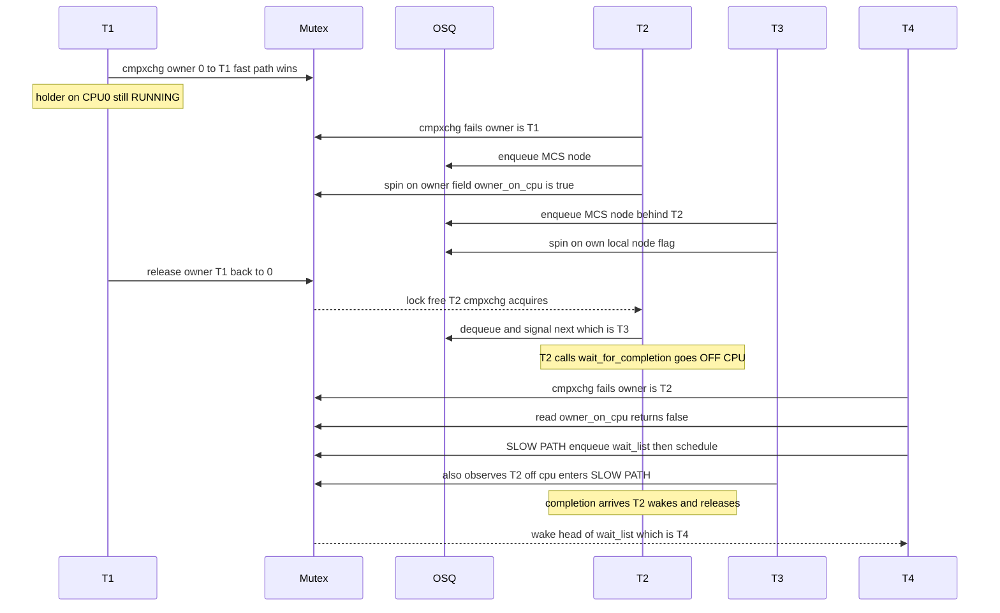

# 02 — Mutex Across Multiple Threads & CPUs

> Coverage: what actually happens on the wire when many threads on many CPUs
> contend for one `struct mutex`. Cache-line traffic, NUMA effects, optimistic
> spinning vs sleeping decisions, fairness, and the contention regimes you'll
> see in real GPU/network/storage drivers.

> Prerequisite: [01 — Internals](01_Mutex_Internals_FastSlow_Path.md).

---

## 1. The Three Contention Regimes

| Regime | Hold time | Best path | Why |
|--------|-----------|-----------|-----|
| **Uncontended** | Any | Fast path | Single `cmpxchg`, ~10 ns. |
| **Short hold, owner runs** | < few µs | Optimistic spin (OSQ) | Sleep cost (~µs) > spin cost. |
| **Long hold or owner sleeps** | > few µs, or holder blocks on I/O | Slow path (sleep) | Spinning wastes CPU; let scheduler do work. |

The mutex implementation **transitions** between regimes dynamically per
acquire — there is no static "spinning mutex" vs "sleeping mutex" config.

---

## 2. Baseline Scenario — 4 Threads on 4 CPUs

### Setup

| Actor | CPU | Role |
|-------|-----|------|
| T1 | CPU 0 | Current owner of `M`; in short critical section. |
| T2 | CPU 1 | Calls `mutex_lock(M)` first contender. |
| T3 | CPU 2 | Calls `mutex_lock(M)` second contender. |
| T4 | CPU 3 | Calls `mutex_lock(M)` later, after T1 has already gone to sleep on I/O. |

### Timeline (CPU view)

```
time →  t0       t1            t2            t3              t4               t5            t6
CPU0 :  T1_lock  T1_crit       T1_crit       T1_unlock       (idle)           T2_runs_crit  T2_unlock
CPU1 :  idle     T2_fast_fail  T2_OSQ_spin·  T2_OSQ_spin·    T2_acquires      runs          idle
CPU2 :  idle     idle          T3_OSQ_enq    T3_MCS_spin·    T3_MCS_spin·     T3_OSQ_spin·  T3_acquires
CPU3 :  idle     idle          idle          idle            T4_arrives       T4_fast_fail  T4_slow_sleep
                                                                              (T1 gone)     (schedule out)
```

Legend: `·` = busy-wait, `OSQ_spin` = head of OSQ spinning on owner field,
`MCS_spin` = non-head spinning on its own per-CPU node.

### What you should notice

1. **T2 and T3 stay on the optimistic spin path** as long as T1 keeps
   running on CPU 0. They never enter the slow path, never sleep.
2. **T4 arrives after the regime changes** — T1 has unlocked, T2 acquired,
   and T2 went to sleep on something else inside its critical section. T4
   observes the owner (T2) is **not on a CPU**, so OSQ bails immediately
   and T4 takes the slow path.
3. **Cache-line traffic is bounded** by OSQ — at most one CPU at a time
   writes the `owner` line.

---

## 3. Cache-Line Traffic (MESI View)

Without OSQ (naïve spin on `owner`):

```
N spinners + 1 owner write per unlock ⇒
   1 invalidation × N readers × every owner store ⇒ O(N) bus traffic per release
```

With OSQ (MCS chain):

```
Only the head spinner reads `owner`.
Each non-head spins on its own `node.locked` (private cache line).
Owner's release writes `owner` ONCE → invalidates ONE remote line (the head's).
Head's "release to next" writes ONE remote line (the next node's).
⇒ O(1) cache-line traffic per acquire/release, regardless of N.
```

This is why mutex throughput on 64-CPU systems is dominated by **OSQ
quality**, not by atomic-op cost.

---

## 4. NUMA Considerations

`struct mutex` itself is **NUMA-naïve** — it does not preferentially hand
the lock to a local-NUMA-node waiter. Implications:

- A lock physically allocated on Node 0 incurs remote-NUMA latency for every
  acquirer on Node 1+.
- OSQ ordering is *arrival order*, not *locality order*. A handoff may
  bounce across sockets.
- Mitigation in driver design:
  - **Sharding** — one mutex per CPU group or per object instance.
  - **Per-CPU data + outer mutex** — coarse mutex only for slow-path config.
  - For lock-heavy NUMA workloads, consider `rwsem` with RCU for readers,
    or fully lock-free designs (RCU, seqlock).

> NVIDIA-relevant: per-GPU contexts often have their own mutex; cross-GPU
> resources (e.g. fence timelines, SLI peer mappings) need explicit sharding
> to avoid socket-crossing serialization.

---

## 5. Fairness: FIFO With a Bounded Steal Window

The kernel mutex is **mostly FIFO**, with a controlled deviation:

- `wait_list` waiters (slow path) are strict FIFO.
- Optimistic spinners can grab the lock ahead of a sleeping waiter
  (incoming-thread advantage).
- This is bounded by `MUTEX_FLAG_HANDOFF`: once a head waiter has been
  starved long enough, it sets HANDOFF and the next unlock must give it the
  lock; OSQ spinners back off.

This trade-off is intentional: pure FIFO would force every contender
through the slow path (sleep + wake), destroying throughput.

---

## 6. Worked Scenario — Owner Sleeps Mid-Critical-Section

A pattern relevant to driver code: holder calls something that sleeps
(e.g. waits on a `dma_fence`, does `wait_for_completion`, performs I/O).

### Setup

| Actor | CPU | Action |
|-------|-----|--------|
| T1 | CPU 0 | Holds `M`, calls `wait_for_completion(&done)` → sleeps. |
| T2 | CPU 1 | Calls `mutex_lock(M)` at t=t1. |
| T3 | CPU 2 | Calls `mutex_lock(M)` at t=t2. |
| ISR-X | CPU 3 | Eventually `complete(&done)` at t=t5, waking T1. |

### Timeline

```
time → t0        t1               t2               t3             t4         t5             t6
CPU0 : T1_lock   T1_wait_for_compl  (T1 OFF cpu)   …              …          (T1 wake)      T1_unlock(M)
CPU1 : idle      T2_fast_fail     T2_OSQ_head     observes owner T2 enters    T2 wakes      T2 acquires
                                  (owner T1 NOT   not_on_cpu →  slow path,    on M unlock   from slow path
                                   on cpu)        OSQ aborts     sleeps
CPU2 : idle      idle             T3_OSQ_enq      T3 also bails  T3 sleeps    T3 wakes      T3 next
                                                  to slow path                (after T2)
CPU3 : idle      idle             idle            idle           idle         ISR: complete
```

Key insight: as soon as the contender's spin loop observes
`!owner_on_cpu(T1)`, it **immediately abandons optimistic spinning** and
enters the slow path. This is the whole point of the design — never burn
CPU spinning for a sleeping owner.

### Wake ordering

When T1 finally `mutex_unlock(M)`, the slow-path unlocker wakes **T2**
(head of `wait_list`). T3 stays asleep until T2 unlocks. Strict FIFO holds
in this case because both contenders went through the slow path.

---

## 7. Mermaid — Concurrent Acquire Across 4 CPUs

T1 on CPU0 is the initial owner. T2 (CPU1) and T3 (CPU2) optimistic-spin on
the OSQ. T1 releases and T2 acquires. T2 then sleeps inside its critical
section — the regime changes from optimistic-spin to slow-path. T4 (CPU3)
arrives at that point and goes straight to the slow path; T3 also bails to
the slow path.



---

## 8. Hold-Time Heuristic Table (Design Guide)

Pick the right primitive based on **realistic** hold time and contender count:

| Expected hold time | Few contenders | Many contenders | Right primitive |
|--------------------|----------------|-----------------|-----------------|
| < 1 µs (a few register writes) | spinlock | spinlock | `spinlock_t` |
| 1 – 10 µs (struct manipulation) | mutex (OSQ wins) | mutex (OSQ wins) | `struct mutex` |
| 10 µs – 1 ms (memcpy, small alloc) | mutex (slow path will be hit) | mutex; consider sharding | `struct mutex` |
| > 1 ms or sleeping work (I/O, fence wait) | mutex | rwsem if reader-heavy; sharded mutex | `struct mutex` / `rw_semaphore` |
| Multiple buffers acquired together (GPU) | — | — | `ww_mutex` |

---

## 9. Mixed Workload Pitfall — "Cold Path Kills Hot Path"

Pattern: 99 % of acquirers run a 200-ns critical section; 1 % run a
100-µs critical section (e.g. config update). Symptom: tail latency
explodes for the 99 %.

Why:

- The 100-µs cold-path acquirer puts every contender into the slow path
  (their OSQ spin observes the holder still on-cpu, but for so long that
  `need_resched()` eventually fires).
- After this event, the `wait_list` has many sleepers; throughput recovers
  but at the cost of context switches.

Mitigation:

- Split the lock: separate `cfg_mutex` for cold path, fast `data_mutex`
  for hot path.
- Or use `mutex_trylock` on the cold path and defer to a worker if it
  fails, so the cold path never blocks the hot path.

---

## 10. Comparison: Mutex vs Spinlock Under Contention

| Metric | Spinlock | Mutex (uncontended) | Mutex (OSQ) | Mutex (slow path) |
|--------|----------|---------------------|-------------|-------------------|
| Acquire cost | ~20 ns | ~10 ns | ~100 ns – µs | ~µs + context switch |
| Wastes CPU? | Yes, all contenders | No | Yes, but bounded by OSQ + need_resched | No, contenders sleep |
| Holder can sleep? | **No** | Yes | Yes | Yes |
| IRQ-safe? | Yes (`_irqsave`) | **No** | **No** | **No** |
| Fairness | Queued (qspinlock = MCS) | n/a | OSQ FIFO + steal | FIFO via wait_list (+ HANDOFF) |
| NUMA-aware? | Partly (qspinlock) | No | No | No |

---

## 11. Interview Q&A (Multi-CPU)

**Q1. Why does mutex outperform spinlock on long critical sections even though spinlock is cheaper to acquire?**
A. Spinlock contenders **burn 100 % CPU** while waiting. For an N-µs critical
section with K contenders, spinlock wastes ~K·N CPU-µs. Mutex contenders go
to sleep after a bounded spin, freeing those CPUs for useful work; total CPU
wasted is ~K · few-hundred-ns.

**Q2. When does the optimistic-spin path actively hurt performance?**
A. When the typical holder sleeps quickly after acquiring (e.g. always calls
`wait_event` inside the critical section). Every contender pays the OSQ
overhead before realizing it has to sleep too. Workloads like this often
disable OSQ via `CONFIG_MUTEX_SPIN_ON_OWNER=n` on dedicated kernels, or
restructure to avoid sleeping under the lock.

**Q3. Can two CPUs ever both think they own the mutex?**
A. No. Acquisition is a single `cmpxchg` on `owner`; the loser retries.
Release uses `_release` ordering, ensuring the acquirer sees prior writes.

**Q4. How does HANDOFF prevent starvation precisely?**
A. After a waiter has been on `wait_list` for "too long" (one missed wake-up
cycle), it sets `MUTEX_FLAG_HANDOFF`. On the next unlock, the outgoing
owner installs that waiter as the new owner (with `PICKUP` flag) and
optimistic spinners observe `PICKUP` and refuse to take the lock. The
designated waiter then completes the handoff with its own `cmpxchg`.

**Q5. What's the realistic worst-case latency for a `mutex_lock` on a 64-core machine with heavy contention?**
A. Dominated by (a) length of the front waiter's critical section,
(b) wake-up + scheduler latency (~5–20 µs typically), and (c) NUMA effects
on `owner`/`wait_lock` lines. Order of tens to hundreds of µs is common
under stress. With HANDOFF, you avoid unbounded starvation; with sharding
you avoid the queue forming at all.

**Q6. How would you debug a mutex hotspot in an NVIDIA DRM driver?**
A. `perf lock contention` (or `perf lock report`) to identify the lock;
`bpftrace` on `mutex_lock`/`mutex_unlock` tracepoints for hold-time
histograms; `lockdep` for unexpected ordering; `lockstat`
(`CONFIG_LOCK_STAT`) for wait-time/hold-time stats. Then redesign: shard
per-context, move work outside critical section, switch to `rwsem` if
read-mostly, or evaluate RCU.

---

## Navigation

⬅ [01 — Internals](01_Mutex_Internals_FastSlow_Path.md) · ➡ [03 — Variants & RT](03_Mutex_Variants_RTMutex_WWMutex.md) · 🏠 [README](README.md)
