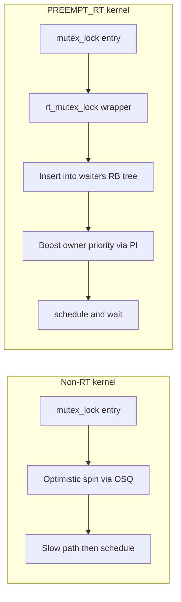

# 03 — Mutex Variants, `rt_mutex`, `ww_mutex`, and PREEMPT_RT

> Coverage: the full API surface (`_interruptible`, `_killable`, `_trylock`,
> `_io`, `_nested`), the **`ww_mutex` (wait/wound)** lock class used by
> DRM/GPU subsystems for multi-buffer reservation, and the **`rt_mutex`**
> with **priority inheritance** — including the PREEMPT_RT auto-conversion
> of every `struct mutex` to a sleeping rt-mutex.

> Prerequisite: [01 — Internals](01_Mutex_Internals_FastSlow_Path.md),
> [02 — Multi-CPU](02_Mutex_MultiThread_MultiCPU_Scenarios.md).

---

## 1. The Standard Mutex API Surface

| API | Returns | Wait state | Signal-aware? | When to use |
|-----|---------|------------|---------------|-------------|
| `mutex_lock(M)` | void | `TASK_UNINTERRUPTIBLE` | No | Default; short waits; uninterruptible. |
| `mutex_lock_interruptible(M)` | `int` (`-EINTR` on signal) | `TASK_INTERRUPTIBLE` | Yes | Long waits in syscall paths so userspace can `Ctrl-C`. |
| `mutex_lock_killable(M)` | `int` (`-EINTR` only on fatal signal) | `TASK_KILLABLE` | Fatal only | Long waits where only `SIGKILL` should abort. Preferred for kernel work. |
| `mutex_trylock(M)` | `int` (1 = got, 0 = no) | none | n/a | Lock-or-defer; never sleeps; safe pattern for `cancel_work_sync` style cleanup. |
| `mutex_lock_io(M)` | void | `TASK_UNINTERRUPTIBLE \| TASK_IO` | No | Marks the wait as I/O wait for `iowait` accounting. |
| `mutex_lock_nested(M, subclass)` | void | `TASK_UNINTERRUPTIBLE` | No | Annotates same-class nesting to `lockdep` (see doc 04). |
| `mutex_unlock(M)` | void | — | — | Caller must be the owner; debug builds `WARN` otherwise. |
| `mutex_is_locked(M)` | bool | — | — | Advisory check; do not gate logic on this alone (race). |
| `atomic_dec_and_mutex_lock(cnt, M)` | bool | conditional | — | Common refcount pattern: take M only if last reference. |

### `_killable` vs `_interruptible`

- `_interruptible` returns `-EINTR` on **any** pending signal — easy to
  starve a process if it ignores common signals.
- `_killable` returns `-EINTR` only for fatal signals (the ones that will
  actually terminate the task). Modern best practice for kernel code that
  doesn't otherwise care about signals.

### `_trylock` correctness pitfall

`mutex_trylock` skips the OSQ entirely and **must not be called inside
optimistic-spin loops** of other mutexes — it bypasses the fairness
mechanism. It is fine in normal driver code.

---

## 2. `ww_mutex` — Wait/Wound Mutex (DRM/GPU Buffer Reservation)

> **The most important advanced lock for an NVIDIA interview.** Used by
> `dma-resv` (GEM, TTM, V3D, AMDGPU, nouveau, nvidia-drm) to atomically
> reserve **N buffers** for a single command submission.

### The problem `ww_mutex` solves

A GPU command submission may need to lock buffers `{B1, B2, B3, ...}` —
the **set is computed at runtime** from the userspace IOCTL payload. Two
concurrent submissions might both want `{B1, B2}` and `{B2, B1}` in
opposite global order → classic ABBA deadlock with normal mutexes.

Naïve solutions are all bad:

- **Global lock**: serializes the entire GPU. Throughput collapses.
- **Sorted acquisition**: requires comparing pointers; works only if both
  submissions know the *complete* set upfront. They don't (e.g., implicit
  dependencies discovered during validation).
- **Trylock with retry**: livelock under contention.

### The `ww_mutex` solution

Define a total order on **acquire contexts**, not on locks. Every
contending thread has a `ww_acquire_ctx` with a monotonic stamp. When two
threads conflict:

- The **newer** stamp (younger transaction) is **wounded** — its
  outstanding locks are released, and it must restart with the same (now
  older) stamp.
- The **older** stamp **waits** as normal.

Because stamps are total, eventually the oldest transaction always
completes. **No deadlock, no livelock, bounded retries.**

### API

```
struct ww_class my_class = { ... };          // shared by all ww_mutexes in the group
struct ww_mutex M1, M2, M3;
struct ww_acquire_ctx ctx;

ww_acquire_init(&ctx, &my_class);

retry:
    ret = ww_mutex_lock(&M1, &ctx);          // takes M1 (or returns -EDEADLK)
    if (ret == -EDEADLK)
        goto handle_deadlock;

    ret = ww_mutex_lock(&M2, &ctx);
    if (ret == -EDEADLK)
        goto handle_deadlock;
    /* … */

handle_deadlock:
    ww_mutex_unlock(/* any locks we took */);
    ww_mutex_lock_slow(&M_conflicting, &ctx); // blocks until we can retake; immune to wound
    goto retry;

ww_acquire_done(&ctx);
/* critical section across M1..MN */
ww_mutex_unlock(&M1); ww_mutex_unlock(&M2); /* … */
ww_acquire_fini(&ctx);
```

### Stamp-based wait/wound state machine

```
Two contenders for M:
    T_old (stamp 100)   T_new (stamp 200)

  T_new holds M.
  T_old arrives, wants M:
       stamp(T_old) < stamp(T_new)  → "wound" T_new
       T_new's next ww_mutex_lock or check returns -EDEADLK
       T_new must release all ww_mutexes in ctx and restart
  T_new's restart uses SAME ctx with SAME stamp (still 200)
  Eventually T_old finishes, T_new retries and succeeds.
```

Two important guarantees:

1. **No new contender can have a smaller stamp than an existing in-progress
   transaction's stamp**, because stamps are issued in `ww_acquire_init`.
   So a wounded transaction is always wounded by an *older* one.
2. **Forward progress**: the oldest live transaction is never wounded → it
   always finishes → it stops being the oldest → next oldest finishes → ...

### NVIDIA-relevant usage

- `dma_resv_lock(obj, ctx)` is a thin wrapper around `ww_mutex_lock`.
- `drm_exec` (kernel ≥ 6.4) is the modern multi-buffer locking helper that
  internally drives `ww_mutex` with a clean iterator API.
- GPU command submission: validate the buffer list, `ww_mutex`-lock each,
  install fences atomically, unlock. A correct implementation **must**
  handle `-EDEADLK` rollback.

### Common bugs

- **Forgetting `ww_acquire_fini`** → leaked context, lockdep complains.
- **Mixing acquire contexts** within the same transaction → invariant
  violation, lockdep splat.
- **Holding a non-`ww_mutex` mutex across `ww_mutex_lock`** that may
  rollback → must re-acquire the outer mutex too, or restructure.
- **Calling `ww_mutex_lock` from atomic context** → same atomic-context
  rule as `mutex`; never allowed.

---

## 3. `rt_mutex` — Priority Inheritance Mutex

### Why it exists

Classic priority inversion:

```
High prio task H  ──── wants M
Medium prio task M_med   running CPU-bound (no lock involvement)
Low prio task L  ──── holds M, preempted by M_med
                       → H is blocked by L
                       → L can't run because M_med is higher prio
                       → H is effectively blocked by M_med
                       → UNBOUNDED latency for H
```

`rt_mutex` solves it by **boosting** the owner's priority to that of the
highest-priority waiter as long as it holds the lock.

### Data structure

```
struct rt_mutex {
    raw_spinlock_t      wait_lock;
    struct rb_root      waiters;   // RB-tree keyed by waiter priority
    struct task_struct *owner;     // current holder
};
```

Waiters are stored in an **RB-tree ordered by effective priority**, so the
highest-prio waiter is always at the root → priority propagation is O(log N).

### Priority inheritance chain walk

When task `W` blocks on `rt_mutex M` whose owner is `O`:

1. Insert `W` into `M->waiters` keyed by `W->prio`.
2. If `W->prio > O->prio`, **boost** `O` to `W->prio`.
3. If `O` is itself blocked on some `M' ` owned by `O'`, **re-evaluate**
   `M'`'s top waiter and possibly boost `O'`.
4. Walk this chain until it terminates (no further blocking) or a cycle is
   detected (deadlock → `BUG`).

When the owner unlocks, priority is **deboosted** to the next-highest
remaining waiter, or to the owner's base priority if no waiters.

### Where `rt_mutex` is used directly

- The **PI-futex** infrastructure (`FUTEX_LOCK_PI`) — user-space PI mutexes.
- `i2c_lock_bus`, certain RT-critical kernel paths.
- Internally inside PREEMPT_RT (see next section).

### Limitations

- Higher acquire cost than plain mutex (RB-tree work, chain walk).
- Cannot be used from atomic context (same as `mutex`).
- Chain walk is bounded but can be long under pathological nesting.

---

## 4. PREEMPT_RT — Automatic Mutex Conversion

This is **the single most important RT topic** for NVIDIA automotive
(Drive / Tegra) work.

### What PREEMPT_RT does to `struct mutex`

Nothing source-visible. Drivers keep writing `mutex_lock`. Under the hood:

| Primitive | Non-RT kernel | PREEMPT_RT kernel |
|-----------|---------------|-------------------|
| `struct mutex` | Sleeping, no PI | **Wraps `rt_mutex`** → sleeping with PI |
| `spinlock_t` | Busy-wait, no PI | **Wraps `rt_mutex`** → sleeping with PI |
| `raw_spinlock_t` | Busy-wait | **Busy-wait, unchanged** |
| `rwlock_t` | Busy-wait | Sleeping rt-rwlock with PI |
| `rwsem` | Sleeping | Sleeping with limited PI (single writer boosted) |

Net effect on RT:

- Almost everything that was "atomic" on non-RT becomes preemptible.
- All sleeping locks gain priority inheritance.
- Hard-IRQ handlers run as **threaded IRQs** by default; only the small
  primary handler is in true IRQ context.
- `raw_spinlock_t` becomes the *only* lock you can take in genuinely
  atomic context (true IRQ handlers, NMI, scheduler internals).

### Implications for driver authors

1. **`spinlock_t` may sleep on RT** — never assume otherwise. Old code that
   did `spin_lock(&lock); kmalloc(GFP_KERNEL); spin_unlock(&lock);` is
   actually *legal* on RT (because the spinlock is really a mutex), but
   *illegal* on non-RT. Write code for the stricter (non-RT) rule and it
   works everywhere.
2. **Use `raw_spinlock_t` for truly-atomic regions** (interrupting hardware
   state, scheduler hooks). These do not convert.
3. **`local_irq_disable` does not become preemptible** — but combining it
   with `spinlock_t` does. Use `local_irq_save` + `raw_spinlock_t` for
   genuine IRQ-off critical sections.
4. **Hold-time matters more.** Long mutex hold times now block more
   tasks (because spinlocks-as-mutexes also wait on them via PI).

### Mermaid — non-RT vs RT acquisition



Note: PREEMPT_RT's `rt_mutex` **does not optimistic-spin by default**
(spinning under RT priority semantics is dangerous). It goes straight to
the priority-boosted sleep path. Some workloads enable an adaptive
spin variant; default is sleep.

---

## 5. Decision Matrix — Which Mutex Variant?

| Need | Pick |
|------|------|
| Default in-kernel shared state, process context | `struct mutex` + `mutex_lock` |
| Syscall path that should abort on Ctrl-C | `mutex_lock_interruptible` |
| Long-running kernel work, only `SIGKILL` aborts | `mutex_lock_killable` |
| Tried in cleanup paths; "defer if busy" | `mutex_trylock` |
| Lock proportional `iowait` accounting | `mutex_lock_io` |
| Same-class nesting under documented order | `mutex_lock_nested` |
| Multi-buffer atomic acquire (GPU/DRM) | `ww_mutex` + `ww_acquire_ctx` |
| Strict RT priority-inversion avoidance | `rt_mutex` (or run on PREEMPT_RT) |
| Read-mostly shared data | `struct rw_semaphore` (or RCU) |
| Counting / signalling, multi-release | `struct semaphore` / `struct completion` |

---

## 6. Interview Q&A (Variants & RT)

**Q1. Why prefer `mutex_lock_killable` over `mutex_lock_interruptible` in modern kernel code?**
A. Killable only responds to fatal signals (SIGKILL / SIGSEGV-style). It
gives clean abort on real kills without spurious EINTR for ordinary
signals (SIGALRM, SIGCHLD), which usually have nothing to do with the
lock acquisition and would force every caller to write redundant retry
loops.

**Q2. Explain the wait/wound algorithm in one paragraph.**
A. Each transaction allocates a `ww_acquire_ctx` with a monotonic stamp.
When two contenders fight over a `ww_mutex`, the younger (higher-stamp)
one is "wounded" — its in-progress acquires return `-EDEADLK`. It must
release all `ww_mutex`-held locks, restart with the **same** stamp (now
relatively older), and use `ww_mutex_lock_slow` on the conflicting lock
to wait without being woundable. The oldest live transaction is never
wounded, so the system always makes progress. This solves runtime-defined
multi-lock acquisition (GPU buffer reservation) without deadlock or
livelock.

**Q3. What is the time complexity of an `rt_mutex` priority boost?**
A. Insertion into the waiters RB-tree is O(log N) for N waiters. The
priority propagation chain walk is O(D · log N) where D is chain depth.
Cycle detection during chain walk is built in — a cycle means deadlock
and is `BUG`-flagged.

**Q4. On PREEMPT_RT, my `spin_lock` may sleep. Does that change my driver code?**
A. Functionally, no — your code already obeyed the stricter non-RT rule
("no sleeping while holding a spinlock"). What changes: hold time matters
more (because waiters block via PI), and you must use `raw_spinlock_t`
for any region that truly cannot tolerate scheduling (real IRQ paths,
scheduler hooks, NMI).

**Q5. Why doesn't `rt_mutex` use the OSQ optimistic spin path?**
A. Optimistic spinning ignores priority — a low-priority spinner could
hold a CPU that a high-priority task needs to run on. RT semantics require
priority-respecting wait, so `rt_mutex` goes straight to the PI sleep
path. (There are debated "adaptive locks" variants, but mainline default
is sleep-only.)

**Q6. NVIDIA DRM lock ordering: I need to lock 50 GEM buffers for a submit. How?**
A. Use `drm_exec` (or directly `ww_mutex_lock` with a shared
`ww_acquire_ctx`). Iterate the buffer list; on `-EDEADLK`, unlock
everything in the ctx, take the conflicting lock with
`ww_mutex_lock_slow`, restart the loop with the same ctx. After all locks
held, `ww_acquire_done`. Install fences, submit, then unlock all and
`ww_acquire_fini`. Lockdep will validate that you didn't take a non-ww
lock in a way that breaks the global order.

**Q7. What's the difference between `mutex_trylock` returning 0 and `mutex_lock_killable` returning `-EINTR`?**
A. `mutex_trylock` returning 0 means "the lock was held by someone (or you
hit a transient cmpxchg race); you don't have it; no waiting occurred."
`-EINTR` from killable means "you waited, but a fatal signal arrived
before you got the lock; abort." Caller responses differ — trylock usually
means "do something else now"; EINTR means "propagate failure to
userspace."

---

## Navigation

⬅ [02 — Multi-CPU](02_Mutex_MultiThread_MultiCPU_Scenarios.md) · ➡ [04 — Deadlocks & lockdep](04_Mutex_Deadlocks_Lockdep_Debugging.md) · 🏠 [README](README.md)
