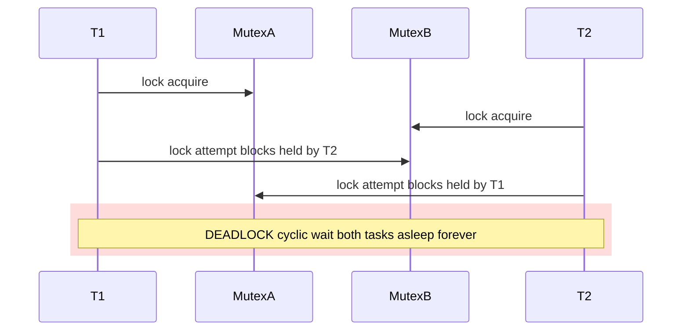

# 04 — Mutex Deadlocks, `lockdep`, and Debugging

> Coverage: every realistic way a mutex-based design can deadlock, the
> kernel's automatic detector (`lockdep`), instrumentation knobs
> (`CONFIG_DEBUG_MUTEXES`, `CONFIG_LOCK_STAT`), and a triage workflow you
> can apply on day one of an NVIDIA engagement.

> Prerequisites: docs [01](01_Mutex_Internals_FastSlow_Path.md) – [03](03_Mutex_Variants_RTMutex_WWMutex.md).

---

## 1. Deadlock Taxonomy (Mutex-Centric)

| Class | Cause | Detector |
|-------|-------|----------|
| **AA (recursive)** | Same task calls `mutex_lock(M)` while already holding `M`. | `CONFIG_DEBUG_MUTEXES` + `lockdep` |
| **ABBA (classic)** | T1: lock A then B. T2: lock B then A. | `lockdep` |
| **ABBA-CD (chain)** | T1: A→B, T2: B→C, T3: C→A → 3-cycle. | `lockdep` |
| **IRQ-context inversion** | Lock taken in process context held while ISR (using a different lock) eventually waits on the first. | `lockdep` (IRQ-state machine) |
| **Sleep-in-atomic** | `mutex_lock` called while holding a spinlock / in ISR / `preempt_disable`. | `CONFIG_DEBUG_ATOMIC_SLEEP` |
| **Owner death** | Task holding mutex killed/dies in `oops` path; mutex never released. | Runtime hang; lockdep helps locate. |
| **Forgotten unlock on error path** | Early return without `mutex_unlock`. | `lockdep` (held-locks at task exit) |
| **Wrong-owner unlock** | T1 locks, T2 unlocks. | `CONFIG_DEBUG_MUTEXES` (`WARN`) |
| **`ww_mutex` misuse** | Forgetting `-EDEADLK` rollback, mixing contexts. | `lockdep` ww-mutex annotations |
| **PI-chain cycle (rt_mutex)** | A boosts B boosts A. | `rt_mutex` chain walk detects, `BUG`s. |

---

## 2. AA Deadlock (Recursive Self-Lock)

```
mutex_lock(M);
  ...
  mutex_lock(M);     // ← deadlock: schedules out forever
```

`struct mutex` is **non-recursive** by design. Linux deliberately rejects
recursive mutexes because:

- They mask layering bugs (function unaware whether caller already holds
  the lock).
- They make lockdep validation harder.

Correct alternatives:

- Restructure to lock once at the outer entry, call internal helpers that
  **assume** the lock is held (document with `lockdep_assert_held(&M)`).
- If truly needed, design an explicit owner-tracking refcount, not a
  recursive mutex.

`CONFIG_DEBUG_MUTEXES` catches AA immediately via owner check.

---

## 3. ABBA Deadlock (Classic Two-Mutex Cycle)

### Pattern

```
T1: mutex_lock(A); mutex_lock(B); /* work */ mutex_unlock(B); mutex_unlock(A);
T2: mutex_lock(B); mutex_lock(A); /* work */ mutex_unlock(A); mutex_unlock(B);
```

If T1 has A and waits for B *while* T2 has B and waits for A — deadlock,
forever.

### Mermaid

T1 holds A and waits for B. T2 holds B and waits for A. Neither can
release until the other does — cyclic wait.



### Fix patterns

1. **Global lock ordering**: pick a canonical order (e.g. by address:
   `if (&A < &B) lock A first`). Document it. Lockdep enforces.
2. **Lock combining**: introduce an outer lock that serializes both
   acquisitions.
3. **`ww_mutex`** if the lock set is dynamic (cannot be ordered statically).
4. **Lock splitting**: refactor so the two locks are never held
   simultaneously.

### How `lockdep` catches it

Lockdep records, **per lock class**, every other class held when this one
was acquired, building a *lock dependency graph*. On every acquire it
checks: "does adding this edge create a cycle?" If yes, it prints a
detailed `WARN` with backtrace of both acquire sites — usually on the very
first run, long before a production hang.

Sample output:

```
======================================================
WARNING: possible circular locking dependency detected
------------------------------------------------------
[A->B at  thread1+0x...]
[B->A at  thread2+0x...]
Possible unsafe locking scenario:
  CPU0                    CPU1
  ----                    ----
  lock(A);
                          lock(B);
                          lock(A);
  lock(B);
```

---

## 4. IRQ-Context Inversion (Lockdep IRQ State Machine)

Subtle deadlock: a lock taken in process context is also taken in an ISR
*indirectly* via another lock.

```
Process: mutex_lock(M)  ← cannot be in IRQ ctx, but rules below still apply
ISR    : spin_lock(S)
Both M and S protect overlapping state, and code paths sometimes nest them.
```

Lockdep tracks each lock class's **IRQ usage** (`IRQ-safe`, `IRQ-unsafe`,
`softirq-safe`, etc.). If process context takes an `IRQ-unsafe` lock
*after* an `IRQ-safe` lock — and an ISR could fire and take the
IRQ-safe one and wait on the IRQ-unsafe one — lockdep flags it.

The general rule lockdep checks:

> *Never take an IRQ-unsafe lock while holding an IRQ-safe lock if the
> IRQ-unsafe lock is also taken by an IRQ handler.*

Violations show as `[HARDIRQ-ON-W]` / `[HARDIRQ-IN-W]` mismatch reports.

---

## 5. Sleep-in-Atomic (The Most Common Real Bug)

```
spin_lock(&S);
mutex_lock(&M);       // BUG: mutex_lock may sleep
```

Or transitively: `spin_lock` → call a helper → helper calls `kmalloc(GFP_KERNEL)`
→ which sleeps. See the [SpinLock_Scenarios](../SpinLock_Scenarios/02_Scenario_Spinlock_with_GFP_KERNEL_Deadlock.md)
folder for the full treatment of the atomic-context rule. For mutex:

- `mutex_lock` calls `might_sleep()` → `CONFIG_DEBUG_ATOMIC_SLEEP` prints:
  ```
  BUG: sleeping function called from invalid context at kernel/locking/mutex.c:NNN
  in_atomic(): 1, irqs_disabled(): 0, pid: ...
  ```

Always enable `CONFIG_DEBUG_ATOMIC_SLEEP` in CI/development kernels.

---

## 6. Owner Death

If the task holding a mutex dies (oops, BUG, SIGKILL during kernel work
that doesn't release on cleanup), the mutex stays locked forever. Symptoms:

- Other tasks pile up in `D` state (`uninterruptible`) blocked on the mutex.
- `hung_task_detector` (default 120 s) prints stack traces.

Diagnosis:

```
echo t > /proc/sysrq-trigger         # dump all task stacks
cat /proc/<hung_pid>/wchan           # shows mutex_lock waiting
grep -l <mutex_addr> /proc/lockdep_chains
```

Prevention:

- Always pair `mutex_lock` with `mutex_unlock` via early-return `goto out_unlock`.
- Use `__cleanup` (auto-cleanup) annotations on modern kernels where
  available, or use the `guard(mutex)(&M)` macro in C99/scope-based
  acquisition (kernel ≥ 6.4).
- For long-running threads, consider `mutex_lock_killable` so kill can
  unwind cleanly.

---

## 7. `ww_mutex` Misuse Patterns

| Bug | Symptom | Fix |
|-----|---------|-----|
| No rollback on `-EDEADLK` | Random hangs under contention | Implement standard retry loop with `ww_mutex_lock_slow` |
| Reusing `ww_acquire_ctx` after `fini` | Lockdep splat | One ctx per transaction; init before use |
| Mixing ww-mutexes from different classes in one ctx | Lockdep `BUG` | Use one `ww_class` per logical group |
| Holding a regular mutex across `ww_mutex_lock` that may rollback | Held-lock leak on retry | Acquire outer lock inside the retry loop, or restructure |
| Forgetting `ww_acquire_done` | Lock taken without ctx commitment | Add `ww_acquire_done` after last `ww_mutex_lock` |

---

## 8. `lockdep` — How It Actually Works

### Core idea

Every lock instance is mapped to a **lock class** (typically one per
`DEFINE_MUTEX`, or per `mutex_init` site). Lockdep maintains:

- Per-class **state**: IRQ-safe / IRQ-unsafe / softirq-safe usage seen so far.
- A global **dependency graph**: edge `A → B` if any task ever held A
  while acquiring B.

### On each acquire

1. Update IRQ usage state for this class based on current `irqs_disabled`,
   `in_irq`, `in_softirq` context.
2. For each currently-held lock `H`, add edge `H → this`.
3. Check: does adding `H → this` create a cycle? If yes, **deadlock
   possible** — print `WARN`.
4. Check IRQ-state compatibility: would taking `this` here in this IRQ
   state, combined with prior recorded states, create an inversion?

### Cost

About 5–15 % runtime overhead with `CONFIG_PROVE_LOCKING=y`. Always-on in
distro debug kernels; always-on in any kernel you do development against.

### Lock classes and nesting

If you have legitimately nested locks of the same type (e.g. a tree of
objects each with its own mutex, traversed top-down), every acquisition
is the same lock class — lockdep would flag self-cycles. Annotations:

- `mutex_lock_nested(M, subclass)` — tells lockdep "this is subclass N";
  cycles only flagged within the same subclass.
- `mutex_lock_nest_lock(M, parent)` — "I hold `parent`, so taking M is OK".
- `lockdep_set_class(M, &custom_class)` — assign explicit class.
- `lockdep_assert_held(M)` — runtime assert; compiles out when lockdep off.

### Useful procfs

```
/proc/lockdep            # all known classes
/proc/lockdep_chains     # observed acquire chains
/proc/lockdep_stats      # graph stats
/proc/lock_stat          # with CONFIG_LOCK_STAT — per-lock wait/hold histograms
```

---

## 9. `CONFIG_DEBUG_MUTEXES`

Adds:

- Magic-number canary in `struct mutex` to catch corruption.
- Owner check on `mutex_unlock` (`WARN` if not current).
- Tracks `holder` and `file:line` of last lock.
- Disables OSQ (forces slow path → easier to instrument).

Use in development; never in production.

---

## 10. `CONFIG_LOCK_STAT` — Quantitative Diagnosis

When enabled, `/proc/lock_stat` shows per-lock-class:

```
class name              con-bounces  contentions   waittime-min   waittime-max   waittime-total
&drm->struct_mutex      4892         5021          0.32           1450.20        9821432.77
&gem_obj->resv_lock     12           14            0.12           4.20           42.11
```

Workflow:

1. `echo 0 > /proc/lock_stat` to reset.
2. Run workload.
3. `cat /proc/lock_stat | sort -k 6` → find lock with max wait time.
4. Cross-reference with `perf lock contention` for caller hotspots.
5. Decide: shard, reorder, switch to rwsem, switch to RCU.

---

## 11. `bpftrace` / `ftrace` Recipes

### Hold-time histogram

```
bpftrace -e '
  kprobe:mutex_lock      { @start[tid, arg0] = nsecs; }
  kprobe:mutex_unlock    /@start[tid, arg0]/ {
    @hold_us = hist((nsecs - @start[tid, arg0]) / 1000);
    delete(@start[tid, arg0]);
  }'
```

### Find who holds the mutex longest

```
bpftrace -e '
  kprobe:mutex_lock   /arg0 == ADDR/ { @t[tid] = nsecs; }
  kprobe:mutex_unlock /arg0 == ADDR && @t[tid]/ {
    @max[comm] = max(nsecs - @t[tid]);
    delete(@t[tid]);
  }'
```

### `ftrace` for raw events

```
echo 1 > /sys/kernel/debug/tracing/events/lock/enable
cat /sys/kernel/debug/tracing/trace_pipe | grep <addr>
```

---

## 12. Triage Workflow for a "Random Hang"

```
1. dmesg | grep -E "BUG|WARN|hung_task|lockdep|circular|inversion"
       → 90 % of mutex bugs surface here if debug kernels are used.

2. sysrq-trigger: echo w > /proc/sysrq-trigger
       → dumps all D-state tasks. Their wchan + stack reveals which mutex.

3. /proc/<pid>/wchan, /proc/<pid>/stack
       → confirm waiter list.

4. crash / drgn on a live or dumped kernel:
       struct mutex *m = (...);
       p ((struct task_struct *)(m->owner.counter & ~7UL))->comm
       → who owns it?

5. That owner's stack tells you where it's stuck (often a different lock
   or an I/O wait).

6. Walk the chain until you find the root: a sleeping I/O, a missing
   completion, a deadlocked spinlock, an ABBA cycle.

7. Reproduce with CONFIG_PROVE_LOCKING=y + CONFIG_DEBUG_ATOMIC_SLEEP=y
   + CONFIG_DEBUG_MUTEXES=y. Lockdep will name the exact dependency edge.
```

---

## 13. Best-Practice Checklist

✅ **Do**

- Initialize mutexes statically (`DEFINE_MUTEX(m)`) or dynamically
  (`mutex_init(&m)`) — never just zero-fill (lockdep needs class info).
- Document lock order in a comment at the head of the file.
- Use `lockdep_assert_held(&m)` in helpers that require the lock.
- Pair every `mutex_lock` with `mutex_unlock` via `goto out_unlock`.
- Use `ww_mutex` for dynamic multi-lock acquisition.
- Use `mutex_lock_killable` for syscall paths with long waits.
- Enable `lockdep` + `DEBUG_MUTEXES` + `DEBUG_ATOMIC_SLEEP` in CI.

🚫 **Don't**

- Don't recursively lock a mutex (use `lockdep_assert_held` + helpers).
- Don't `mutex_lock` from atomic context — ever.
- Don't unlock a mutex from a task that didn't lock it.
- Don't take many mutexes in undocumented order.
- Don't ignore lockdep splats — they are *future production hangs*.
- Don't add `mutex_trylock` retry loops without an upper bound (livelock).

---

## 14. Interview Q&A (Deadlocks & Debugging)

**Q1. How does lockdep find an ABBA deadlock that hasn't actually happened yet?**
A. It records, per lock class, every other class held at the time of
acquisition. The set of all such observations forms a directed dependency
graph. On every acquire, lockdep checks if the new edge creates a cycle.
A cycle means the ordering can deadlock under the right interleaving —
flagged immediately, even if no actual deadlock has occurred.

**Q2. A task is stuck in D state on a mutex. How do you find the owner?**
A. From the wait, find the mutex address (via `/proc/<pid>/stack` or
crash). Read `mutex.owner`: it encodes the owner `task_struct *` in bits
≥ 3. Print `((struct task_struct *)(owner & ~7UL))->comm` and inspect
that task's stack — that tells you why the lock isn't being released.

**Q3. Why is `mutex_lock_nested` needed when traversing a tree of objects with per-object mutexes?**
A. Every per-object mutex is the same lockdep class (created at the same
init site), so taking two in any order would look like a self-cycle.
`_nested(subclass)` tells lockdep "treat this acquisition as a different
subclass" so cycles are only flagged within the same level.

**Q4. What does `CONFIG_DEBUG_MUTEXES` add over `CONFIG_PROVE_LOCKING`?**
A. Mutex-specific runtime invariants: owner-check on unlock (wrong-task
unlock = WARN), magic-number canary for memory corruption, file:line
tracking of last acquire. Lockdep is about *ordering*; DEBUG_MUTEXES is
about *per-mutex sanity*. Use both.

**Q5. You ship a driver. Customer reports random 30-second hangs every few hours, no oops. Your first 3 actions?**
A. (1) Get a `sysrq-w` dump from the hung system to identify D-state
tasks and their mutexes. (2) Walk the owner chain via crash/drgn to find
the root waiter and what it's blocked on. (3) Reproduce internally with
a `CONFIG_PROVE_LOCKING` + `CONFIG_DEBUG_ATOMIC_SLEEP` +
`CONFIG_LOCK_STAT` kernel; lockdep usually identifies the exact unsafe
acquisition order. Long-term: add `lockdep_assert_held` annotations in
the affected subsystem.

**Q6. Can `ww_mutex` itself deadlock?**
A. Not if used correctly. The wait/wound algorithm guarantees the oldest
live transaction always wins, so progress is mandatory. But misuse —
forgetting `-EDEADLK` rollback, mixing `ww_acquire_ctx`s, holding regular
mutexes that aren't released on rollback — can produce deadlocks that
lockdep will flag as cyclic dependencies between `ww_mutex` and the
outer mutex.

**Q7. Why doesn't Linux just provide recursive mutexes?**
A. Recursive mutexes mask layering errors and complicate ownership /
debugging / lockdep. They almost always indicate a structural design bug:
a function that doesn't know whether its caller holds the lock. The
kernel's stance is: redesign with explicit "must-hold" preconditions
(`lockdep_assert_held`) and internal helpers, or use a refcount, or split
the lock. The discipline is worth the constraint.

---

## End of Series

You have now read:

1. [README — anatomy & rules](README.md)
2. [01 — Internals](01_Mutex_Internals_FastSlow_Path.md)
3. [02 — Multi-CPU](02_Mutex_MultiThread_MultiCPU_Scenarios.md)
4. [03 — Variants & RT](03_Mutex_Variants_RTMutex_WWMutex.md)
5. **04 — Deadlocks & lockdep** (this file)

For the sister set covering `spinlock_t`, see
[../SpinLock_Scenarios/README.md](../SpinLock_Scenarios/README.md).

## Navigation

⬅ [03 — Variants & RT](03_Mutex_Variants_RTMutex_WWMutex.md) · 🏠 [README](README.md)
