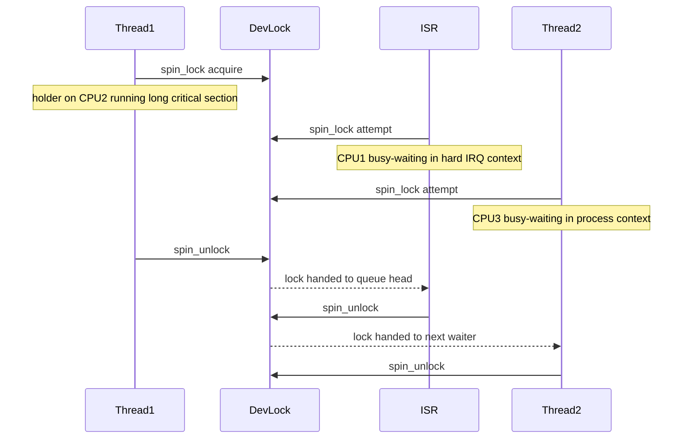
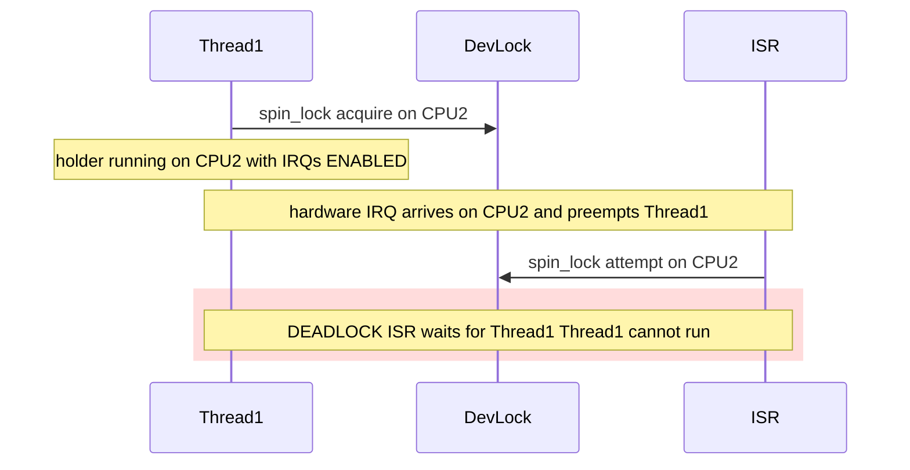
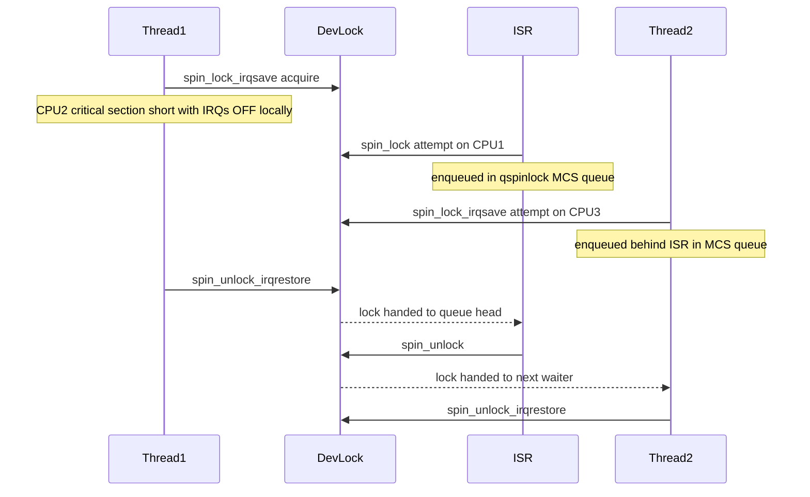

# Scenario 1 — ISR + Thread Contention on Three CPUs

> **Goal:** Understand baseline spinlock behavior when an ISR, the current holder,
> and another contending thread all want the **same** spinlock on **different
> CPUs**.

---

## 1. Setup

A character device driver protects its shared register-shadow structure with a
single `spinlock_t dev_lock`. Three execution streams race for it.

### Actors

| Actor | CPU | Context | Intent |
|-------|-----|---------|--------|
| **ISR-A** | CPU 1 | Hardware-IRQ (atomic) | Take `dev_lock` to update RX counters when the device raises an interrupt. |
| **Thread-1** | CPU 2 | Process (kernel thread) | **Currently holds** `dev_lock`; mid-way through a register write sequence. |
| **Thread-2** | CPU 3 | Process (kernel thread) | Wants to take `dev_lock` to read device statistics. |

> **Note on the phrase "thread having mutex to access spin lock":** the holder
> (Thread-1) is in process context and is the spinlock holder. There is no
> separate mutex involved — Thread-1 simply *holds* `dev_lock`. We model it as
> "Thread-1 is the **current owner** of `dev_lock`".

### Shared resource

```
+----------------------------+
|  struct dev_state {        |
|     u32 rx_count;          |
|     u32 tx_count;          |
|     void __iomem *regs;    |
|     spinlock_t dev_lock;   |  <-- the contested lock
|  } *dev;                   |
+----------------------------+
```

---

## 2. Buggy Variant — Thread-1 Uses Plain `spin_lock()`

### What Thread-1 does (pseudo-pattern)

```
Thread-1 on CPU2:
    spin_lock(&dev->dev_lock);   // ❌ does NOT disable local IRQs
    /* long-ish register update */
    spin_unlock(&dev->dev_lock);
```

### Two sub-cases

#### 2a. ISR fires on a **different** CPU (CPU 1) — what user described

- No deadlock, but **CPU 1 spins** in `spin_lock()` inside the ISR until
  Thread-1 on CPU 2 releases.
- The ISR is in **hard-IRQ context** → it cannot be preempted and cannot sleep
  → CPU 1 is **completely unavailable** for the entire duration.
- CPU 3 (Thread-2) also spins waiting for the same lock.
- **Effect:** wasted CPU cycles on CPU 1 and CPU 3; system *survives* but
  interrupt latency on CPU 1 balloons.

#### 2b. ISR fires on the **same** CPU as the holder (CPU 2)

- Thread-1 was using `spin_lock` (no `_irqsave`) → local IRQs on CPU 2 are
  **still enabled**.
- Hardware interrupt arrives on CPU 2 → kernel runs ISR-A on CPU 2.
- ISR-A calls `spin_lock(&dev->dev_lock)` → it spins, waiting for the holder…
  …but **the holder is the very same CPU that the ISR pre-empted!**
- Thread-1 will **never** get to run `spin_unlock` because the ISR will never
  return.
- **Result: hard deadlock on CPU 2.** Eventually `softlockup_panic` /
  `hardlockup_detector` fires.

### Mermaid — buggy case (2a, ISR on CPU1)

Thread-1 (CPU2) is the holder. ISR-A fires on CPU1 and Thread-2 spins on CPU3.
No deadlock here — just two CPUs burning cycles until Thread-1 releases.



### Mermaid — buggy case (2b, ISR fires on the SAME CPU as the holder)

Thread-1 on CPU2 holds the lock with plain `spin_lock` (IRQs still enabled).
The device IRQ is routed to CPU2. ISR-A pre-empts Thread-1 and tries the
same lock. The holder cannot run → hard deadlock on CPU2.



### ASCII CPU timeline — buggy case (2b, ISR on same CPU = deadlock)

```
time →   t0      t1      t2          t3...∞
CPU1 :   idle    idle    idle        idle
CPU2 :   T1_run  T1_lock T1_crit─────[IRQ pre-empts T1]
                                     ISR_A: spin_lock() ──── SPIN FOREVER
                                     (holder T1 cannot run → DEADLOCK)
CPU3 :   T2_run  T2_run  T2_lock ──── SPIN forever
```

---

## 3. Corrected Variant — Thread-1 Uses `spin_lock_irqsave()`

### Pattern

```
Thread-1 on CPU2:
    unsigned long flags;
    spin_lock_irqsave(&dev->dev_lock, flags);   // ✅ disables local IRQs too
    /* short register update */
    spin_unlock_irqrestore(&dev->dev_lock, flags);

ISR-A on CPU1:
    spin_lock(&dev->dev_lock);                  // ISR-only path: _irqsave not
                                                // strictly needed but harmless
    /* update rx_count */
    spin_unlock(&dev->dev_lock);

Thread-2 on CPU3:
    spin_lock_irqsave(&dev->dev_lock, flags);
    /* read stats */
    spin_unlock_irqrestore(&dev->dev_lock, flags);
```

> **Rule:** *Any* path that shares a spinlock with an ISR must use the
> `_irqsave` variant in process context. The ISR itself does not need
> `_irqsave` because it already runs with IRQs disabled.

### What now happens

1. Thread-1 holds the lock and has IRQs disabled on CPU 2 → no ISR can preempt
   it on CPU 2.
2. ISR-A fires on CPU 1 → calls `spin_lock` → finds it taken → **spins on CPU 1**
   (brief, because the critical section is short).
3. Thread-2 on CPU 3 also spins.
4. Thread-1 releases → on modern kernels with **ticket / queued spinlocks**
   (`qspinlock`), the **first waiter** (whichever arrived first on the MCS
   queue) is handed the lock — order is *fair* but not strictly the order shown
   above.
5. ISR-A runs its tiny update and releases → Thread-2 acquires → releases.
6. System makes forward progress; no deadlock.

### Mermaid — corrected flow

Thread-1 (CPU2) holds the lock with `spin_lock_irqsave` so local IRQs on CPU2
are disabled. ISR-A on CPU1 and Thread-2 on CPU3 both spin briefly. No
deadlock possible because the IRQ can never fire on CPU2 while Thread-1
holds the lock.



### ASCII CPU timeline — corrected

```
time → t0       t1          t2           t3            t4         t5
CPU1 : idle     idle        ISR_spin ··· ISR_crit      ISR_done   idle
CPU2 : T1_lock  T1_crit ··· T1_unlock    (sched)       …          …
CPU3 : T2_run   T2_spin ··· T2_spin      T2_spin       T2_crit    T2_done
```

Legend: `···` = busy-wait spin, `crit` = inside critical section.

---

## 4. Key Takeaways

1. **Spinlocks are CPU-local IRQ-blind by default.** Plain `spin_lock` only
   protects against other CPUs, **not** against an ISR on the same CPU.
2. Sharing a spinlock with an ISR ⇒ **always use `spin_lock_irqsave` in process
   context.**
3. The ISR itself does not need `_irqsave` — hard IRQs are already disabled
   when an ISR runs.
4. On **different CPUs**, the worst plain-`spin_lock` does is **waste CPU**.
   On the **same CPU** with an ISR taking the same lock, it is a **hard
   deadlock**.
5. Modern Linux uses **queued spinlocks (`qspinlock`)** → contenders form an
   MCS queue → fair handoff, low cache-line bouncing.
6. Critical sections must be **short** — every other CPU contender is *burning
   CPU* while waiting.

---

## 5. Interview Q&A

**Q1. If Thread-1 is on CPU 2 holding a plain `spin_lock`, can a thread on CPU 3 deadlock against it?**
A. No — CPU 3 will just spin until Thread-1 releases. It wastes cycles, not
correctness. Deadlock only arises if **the same CPU** that holds the lock takes
an interrupt whose handler also wants the lock.

**Q2. Why does the ISR not need `spin_lock_irqsave`?**
A. Hard IRQs are already disabled on the local CPU while the ISR runs. Saving
and restoring flags is redundant; plain `spin_lock` is sufficient inside an ISR.

**Q3. What guarantees fair ordering between the three contenders?**
A. The kernel's **queued spinlock (`qspinlock`)** implementation chains waiters
into an MCS queue, granting the lock in FIFO order of arrival — independent of
which CPU they run on.

**Q4. What happens to interrupt latency on CPU 1 while ISR-A is spinning?**
A. ISR-A holds CPU 1 in hard-IRQ context with IRQs disabled (by the IRQ entry
path) → **all other interrupts on CPU 1 are delayed** until Thread-1 releases
on CPU 2. Long holder ⇒ poor interrupt latency.

**Q5. Can preemption move Thread-1 off CPU 2 while it holds the spinlock?**
A. No. Acquiring any spinlock calls `preempt_disable()`. Thread-1 remains
pinned on CPU 2 (it is not migrated, not preempted) until `spin_unlock`.

---

## Navigation

⬅ [README (index)](README.md) · ➡ [Scenario 2 — GFP_KERNEL Deadlock](02_Scenario_Spinlock_with_GFP_KERNEL_Deadlock.md)
