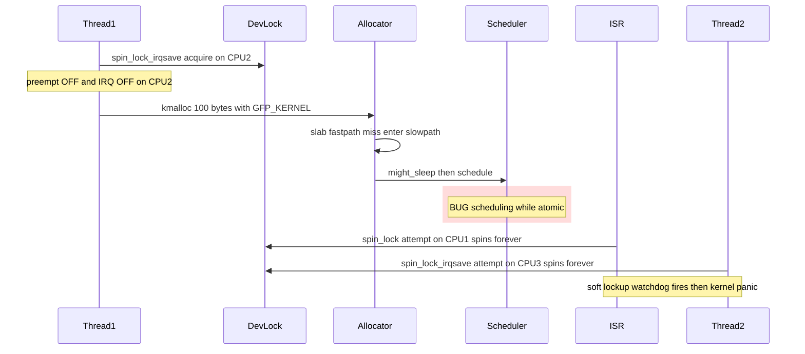

# Scenario 2 — Spinlock Holder Calls `kmalloc(GFP_KERNEL)` → Deadlock

> **Goal:** Show why calling a *sleep-capable* allocator inside a spinlock-held
> critical section is illegal, and what cascading failures it creates for the
> ISR on CPU 1 and Thread-2 on CPU 3.

> **Prerequisite:** Read [Scenario 1](01_Scenario_ISR_Thread_Contention.md)
> first. The actors, lock, and shared resource are identical.

---

## 1. Setup

Same three actors as Scenario 1. The change is **inside Thread-1's critical
section**:

```
Thread-1 on CPU2:
    spin_lock_irqsave(&dev->dev_lock, flags);
    /* …some register writes… */
    buf = kmalloc(100, GFP_KERNEL);          // ❌ MAY SLEEP
    /* …continue with buf… */
    spin_unlock_irqrestore(&dev->dev_lock, flags);
```

Even though `100 bytes` is "tiny", **the size is irrelevant**. The danger is
the `GFP_KERNEL` flag, which gives the allocator permission to:

- Walk the slab/page allocator slow path.
- Invoke **direct reclaim**: scan LRUs, run shrinkers, write dirty pages back.
- Wait on I/O completion (`__GFP_IO`, `__GFP_FS` are set in `GFP_KERNEL`).
- Call `schedule()` — i.e. **block / sleep**.

---

## 2. The Atomic-Context Rule (Why This Is Illegal)

When you hold a spinlock:

| State | Reason |
|-------|--------|
| `preempt_count > 0` | `spin_lock()` calls `preempt_disable()`. |
| Local hard-IRQs disabled (with `_irqsave`) | `spin_lock_irqsave` saved & cleared `IF` / `DAIF`. |
| Local softirqs disabled (with `_bh`) | Similar. |

The kernel calls this combined state **atomic context**. The rule is absolute:

> **You must not sleep in atomic context.**

If `schedule()` is called while `preempt_count != 0`, the scheduler's sanity
check (`__schedule_bug`) fires:

```
BUG: scheduling while atomic: <task>/<pid>/0x00000002
```

This is caught by `might_sleep()` annotations sprinkled through the kernel —
including inside `__alloc_pages_slowpath()` invoked by `kmalloc(GFP_KERNEL)`.

---

## 3. What Actually Happens — Step-by-Step Failure

### Step 0. Initial state

| CPU | Running | State |
|-----|---------|-------|
| CPU 1 | (idle) | Will receive an IRQ shortly |
| CPU 2 | Thread-1 | About to enter critical section |
| CPU 3 | Thread-2 | About to contend for `dev_lock` |

### Step 1. Thread-1 acquires `dev_lock` (CPU 2)

- `preempt_disable()` → preemption off on CPU 2.
- Local IRQs disabled on CPU 2 (because of `_irqsave`).

### Step 2. Thread-1 calls `kmalloc(100, GFP_KERNEL)` (CPU 2)

- Slab cache miss → falls into `__alloc_pages_slowpath`.
- Allocator calls `might_sleep_if(gfp_mask & __GFP_DIRECT_RECLAIM)`.
- With `CONFIG_DEBUG_ATOMIC_SLEEP=y`, kernel logs:
  ```
  BUG: sleeping function called from invalid context at mm/page_alloc.c:NNNN
  in_atomic(): 1, irqs_disabled(): 1, pid: <pid>, name: <thread1>
  Call Trace:
    __might_sleep+0x...
    __alloc_pages_slowpath+0x...
    __kmalloc+0x...
    thread1_work+0x...
  ```
- Without debug config, the kernel may **silently call `schedule()`**.

### Step 3. The cascade

If `schedule()` is reached:

- The scheduler picks a new task on CPU 2.
- The new task **may try to take `dev_lock`** as well → instant self-spin.
- Even if not, the **`_irqsave` state is now corrupted**: the new task inherits
  a wrong IRQ-disabled state.
- Meanwhile on CPU 1: ISR-A spins on `dev_lock` forever — holder is "sleeping".
- Meanwhile on CPU 3: Thread-2 spins on `dev_lock` forever.

### Step 4. Watchdog explosions

After ~22 s (default `kernel.watchdog_thresh = 10` → soft-lockup at 2× = 20 s):

```
watchdog: BUG: soft lockup - CPU#1 stuck for 22s! [swapper/1:0]
watchdog: BUG: soft lockup - CPU#3 stuck for 22s! [thread2:NNN]
rcu: INFO: rcu_sched detected stalls on CPUs/tasks: ...
```

If `hardlockup_panic=1`, kernel panics. Otherwise the system limps with
permanently lost CPUs.

---

## 4. Mermaid — The Deadlock Cascade

Thread-1 holds `dev_lock` on CPU2 and then calls `kmalloc(GFP_KERNEL)`,
which enters the slow path and tries to sleep. The system collapses on all
three CPUs.



---

## 5. ASCII CPU Timeline — The Cascade

```
time →   t0       t1            t2              t3 .. t20s          t22s
CPU1 :   idle     ISR_spin ···  ISR_spin ···    ISR_spin ········    SOFT-LOCKUP
CPU2 :   T1_lock  T1_crit       kmalloc_slow    schedule()??         BUG: atomic
                                ↓
                                might_sleep → BUG / silent sleep
CPU3 :   T2_run   T2_spin ····  T2_spin ······· T2_spin ··········   SOFT-LOCKUP
```

Legend: `···` = busy-wait (cannot do *anything* else).

---

## 6. Debug Tooling That Catches This

| Tool | What it does |
|------|--------------|
| `CONFIG_DEBUG_ATOMIC_SLEEP` | Enables `__might_sleep` checks at every potential sleep point (allocators, mutex, copy_*_user, msleep, …). Prints a stack trace immediately. |
| `CONFIG_PREEMPT_COUNT` | Required for the above; tracks `preempt_count` reliably. |
| `lockdep` (`CONFIG_PROVE_LOCKING`) | Detects illegal lock ordering, sleeping-while-holding-spinlock chains, IRQ-safe vs IRQ-unsafe inversions. |
| `kernel.softlockup_panic`, `kernel.hardlockup_panic` | Convert detected lockups into panics for early failure. |
| `ftrace` / `function_graph` | Trace path from `kmalloc` into `__schedule` to confirm. |

The single most useful debug knob during development is:

```
CONFIG_DEBUG_ATOMIC_SLEEP=y
CONFIG_PROVE_LOCKING=y
```

With these on, the kernel screams the moment Thread-1 enters `kmalloc` while
holding the spinlock — long before any deadlock occurs in production.

---

## 7. Why "Only 100 Bytes" Doesn't Save You

A common misconception: *"100 bytes will always come from the slab fast path,
so it won't sleep."*

This is **wrong**:

- Even fast-path slab allocation may need to **refill** the per-CPU magazine →
  page allocator → potential reclaim.
- Memory pressure is unpredictable — the same call that worked yesterday may
  sleep today.
- The **kernel checks the flag, not the size**. `GFP_KERNEL` is *permission to
  sleep*. The allocator is allowed to take it, and at the worst possible
  moment it will.

The rule is about **what the call is *allowed* to do**, not what it *usually*
does.

---

## 8. Key Takeaways

1. **`GFP_KERNEL` ⇒ may sleep. Atomic context ⇒ must not sleep. They are
   mutually exclusive — always.**
2. Holding *any* spinlock puts you in atomic context. So do hard-IRQ, softirq,
   tasklet, and `preempt_disable()` regions.
3. The damage isn't local: the holder's mistake **freezes every other CPU**
   that contends for the same lock.
4. The danger is the *flag*, not the *size*.
5. Turn on `CONFIG_DEBUG_ATOMIC_SLEEP` + `CONFIG_PROVE_LOCKING` during
   development — they catch the bug before customers do.

---

## 9. Interview Q&A

**Q1. Why is `kmalloc(GFP_KERNEL)` inside a spinlock critical section a bug, even for 8 bytes?**
A. `GFP_KERNEL` grants the allocator permission to enter direct reclaim, do
I/O, and `schedule()`. Holding a spinlock disables preemption (and usually
IRQs). Calling `schedule()` in that state corrupts scheduler accounting, can
re-enter the same lock, and triggers `BUG: scheduling while atomic`.

**Q2. What configs would catch this in CI?**
A. `CONFIG_DEBUG_ATOMIC_SLEEP=y`, `CONFIG_PROVE_LOCKING=y`,
`CONFIG_PREEMPT_COUNT=y`, and optionally `kernel.softlockup_panic=1`.

**Q3. The kmalloc actually returns successfully in my test — is there really a bug?**
A. Yes. Correctness depends on the allocator's *permitted* behavior, not the
behavior observed under low load. Under memory pressure, the same call will
sleep and crash the system. The check `might_sleep()` flags it regardless of
runtime outcome.

**Q4. Could `cond_resched()` help?**
A. No — `cond_resched()` also requires non-atomic context. Inside a spinlock
it is just as illegal as `kmalloc(GFP_KERNEL)`.

**Q5. What if I use a raw spinlock (`raw_spinlock_t`)?**
A. Even stricter — raw spinlocks are not converted to mutexes under PREEMPT_RT
and absolutely forbid sleeping. The bug becomes worse on RT kernels, not
better.

---

## Navigation

⬅ [Scenario 1 — ISR + Thread Contention](01_Scenario_ISR_Thread_Contention.md) · ➡ [Scenario 3 — Correct Synchronization](03_Scenario_Correct_Synchronization.md) · 🏠 [README](README.md)
