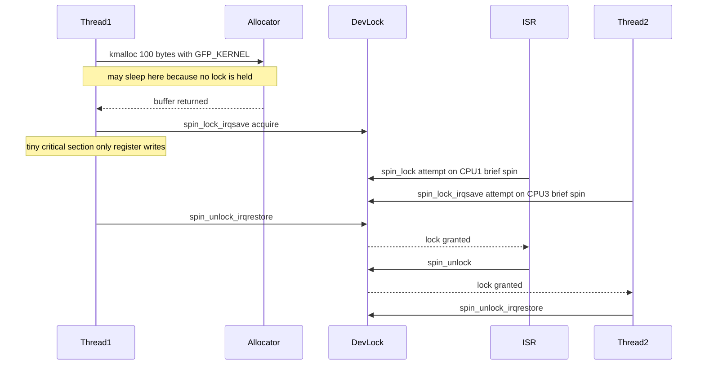

# Scenario 3 — Correct Synchronization Patterns

> **Goal:** Fix the deadlock from [Scenario 2](02_Scenario_Spinlock_with_GFP_KERNEL_Deadlock.md).
> Present four corrective patterns, when to use each, and the canonical "safe"
> design for a driver where an ISR, a holder thread, and a contender thread
> share one lock.

> **Prerequisite:** Read [Scenario 1](01_Scenario_ISR_Thread_Contention.md) and
> [Scenario 2](02_Scenario_Spinlock_with_GFP_KERNEL_Deadlock.md).

---

## 1. Recap of the Problem

```
spin_lock_irqsave(&dev_lock, flags);   // atomic context starts
buf = kmalloc(100, GFP_KERNEL);        // ❌ may sleep
…
spin_unlock_irqrestore(&dev_lock, flags);
```

The mistake is **doing sleep-capable work inside the lock**. Four ways to
remove that mistake are below, in order of preference.

---

## 2. Option A — Pre-Allocate Outside the Lock (Preferred)

> **The 90 % answer.** Almost every real driver should use this.

### Pattern

```
/* OUTSIDE the lock — sleep is fine here */
buf = kmalloc(100, GFP_KERNEL);
if (!buf)
    return -ENOMEM;

/* Prepare data into buf without touching shared state */
prepare_data(buf, …);

/* SHORT critical section — just publish */
spin_lock_irqsave(&dev->dev_lock, flags);
list_add(&buf->node, &dev->pending);
dev->rx_count++;
spin_unlock_irqrestore(&dev->dev_lock, flags);
```

### Why it works

- Sleep happens **before** the lock is taken → atomic-context rule respected.
- The lock is held for only a handful of instructions → minimal contention on
  CPU 1 (ISR) and CPU 3 (Thread-2).
- Memory-allocation failure is handled cleanly, *before* you commit anything.

### Trade-off

- One extra allocation in the error path if you decide later not to publish.
- Slightly more code (separate "prepare" vs "commit" phases).

---

## 3. Option B — Use `GFP_ATOMIC` Inside the Lock

> Use only when there is **no way** to allocate beforehand (e.g. data is
> derived from registers you can only read while holding the lock).

### Pattern

```
spin_lock_irqsave(&dev->dev_lock, flags);
buf = kmalloc(100, GFP_ATOMIC);        // ✅ non-sleeping
if (!buf) {
    spin_unlock_irqrestore(&dev->dev_lock, flags);
    return -ENOMEM;
}
…
spin_unlock_irqrestore(&dev->dev_lock, flags);
```

### Why `GFP_ATOMIC` is allowed

| Flag | Sleep allowed? | Behavior on failure |
|------|----------------|---------------------|
| `GFP_KERNEL` | Yes — direct reclaim + I/O | Almost never fails for small sizes |
| `GFP_ATOMIC` | **No** | Returns `NULL` quickly if no free memory in atomic reserves |

`GFP_ATOMIC` tells the allocator: *"Take from the emergency atomic reserves
only. Do not reclaim, do not sleep."*

### Trade-offs

- Atomic reserves are **small** → higher failure rate, especially under memory
  pressure.
- Failure must be handled at every call site.
- You are using a *scarce shared resource* → don't abuse it for large or
  frequent allocations.
- Don't ask for big buffers with `GFP_ATOMIC` — page-order failures rise
  sharply above order-3.

---

## 4. Option C — Replace Spinlock with Mutex (Only If No ISR Path)

> Applicable only when the lock is **never** taken by an ISR, softirq, tasklet,
> or any other atomic context. In our scenario the ISR participates, so this
> option is **rejected** for `dev_lock` — but it is the right answer for
> *other* locks in the same driver that only process context touches.

### Pattern

```
mutex_lock(&cfg_mutex);
buf = kmalloc(4096, GFP_KERNEL);       // ✅ mutex holder may sleep
…
mutex_unlock(&cfg_mutex);
```

### Why it works

- Mutex puts the contender to **sleep** (not spin) → no atomic-context
  restriction.
- Holder can do anything a normal kernel thread can — sleep, I/O, big
  allocations.

### Why it does NOT apply to our scenario

- ISR-A cannot call `mutex_lock` — it would try to sleep in hard-IRQ context
  → immediate panic.
- Therefore `dev_lock` (shared with ISR-A) **must** stay a spinlock.

---

## 5. Option D — Canonical Pattern: `spin_lock_irqsave` + `GFP_ATOMIC`

> The textbook pattern when allocation *must* happen inside the critical
> section because of the ISR-shared lock.

```
unsigned long flags;
struct entry *e;

spin_lock_irqsave(&dev->dev_lock, flags);
e = kmalloc(sizeof(*e), GFP_ATOMIC);
if (!e) {
    spin_unlock_irqrestore(&dev->dev_lock, flags);
    return -ENOMEM;
}
e->val = readl(dev->regs + REG_X);     // value only meaningful under lock
list_add(&e->node, &dev->log);
spin_unlock_irqrestore(&dev->dev_lock, flags);
```

This is effectively *Option A's lock half + Option B's allocator*. It is the
**correct, complete** template for sharing data with an ISR when allocation
cannot be hoisted.

---

## 6. Decision Matrix — Which Option to Pick

| Question | If YES → | If NO → continue |
|----------|----------|------------------|
| Can the allocation be done *before* taking the lock? | **Option A** | next |
| Is the lock *never* touched by ISR / softirq / tasklet? | **Option C** (mutex) | next |
| Is the allocation small (≤ 1 page) and infrequent? | **Option D** (`irqsave + GFP_ATOMIC`) | next |
| Large or frequent allocations needed under the lock? | **Refactor** — split data so the big buffer lives outside the critical section. Use Option A on the cold path; Option D on the hot path. |

---

## 7. Corrected Three-CPU Flow (Using Option A)

### Mermaid

Thread-1 (CPU2) allocates with `GFP_KERNEL` BEFORE taking the lock, so the
sleeping allocation happens outside the critical section. The lock itself
then protects only the brief publish step.



### ASCII timeline — before vs after

**Before (Scenario 2 — broken)**
```
CPU1 : ISR_spin ················· ∞ (lockup)
CPU2 : T1_lock → kmalloc → schedule → BUG
CPU3 : T2_spin ················· ∞ (lockup)
```

**After (Option A — fixed)**
```
CPU1 : idle ···· ISR_spin·  ISR_crit  idle
CPU2 : kmalloc  T1_lock     T1_unlock idle
CPU3 : T2_run   T2_spin·    T2_crit   T2_done
```

Lock-held time is reduced from "until allocator returns" (potentially
milliseconds with reclaim) to "a few register accesses" (microseconds). The
spinning windows on CPU 1 and CPU 3 shrink correspondingly.

---

## 8. Best-Practice Checklist for Spinlock Critical Sections

✅ **Allowed inside a spinlock**
- Plain memory accesses to lock-protected data.
- `readl` / `writel` to device registers.
- `list_add` / `list_del`, atomic ops, bitops.
- `kmalloc(..., GFP_ATOMIC)` — sparingly.
- Waking another task (`wake_up`) — non-blocking.

🚫 **Forbidden inside a spinlock**
- `mutex_lock`, `down`, `wait_event`, `schedule`, `cond_resched`.
- `msleep`, `usleep_range`, `ssleep`.
- `kmalloc(..., GFP_KERNEL)`, `vmalloc`, `kmalloc(..., GFP_NOIO)` with reclaim
  paths that could still sleep.
- `copy_from_user`, `copy_to_user` (may page-fault → sleep).
- Filesystem / VFS calls, network calls, RCU synchronization (`synchronize_rcu`).
- Calling any function annotated `might_sleep()`.

📏 **Hygiene rules**
- Keep critical sections to **a few microseconds**.
- Acquire locks in a **consistent global order** (avoids ABBA deadlocks).
- Match every `spin_lock_irqsave` with `spin_unlock_irqrestore` on the **same
  `flags`** variable in the same function.
- Prefer narrowing the scope of the lock over widening it.
- Enable `lockdep` and `CONFIG_DEBUG_ATOMIC_SLEEP` in development builds.

---

## 9. Summary of the Three-Scenario Journey

| Scenario | What it taught |
|----------|----------------|
| **1** | Basic spinlock behavior across CPUs. Use `_irqsave` when sharing with ISR. |
| **2** | Calling `GFP_KERNEL` allocator inside the lock = atomic-context violation → cascading lockup. |
| **3** | Hoist sleep-capable work out of the critical section (Option A), or fall back to `GFP_ATOMIC` (Option D) when you cannot. |

> **Mantra:** *Allocate then lock; never lock then sleep.*

---

## 10. Interview Q&A

**Q1. Why is "allocate outside the lock" almost always preferable to `GFP_ATOMIC`?**
A. `GFP_KERNEL` outside the lock is more reliable (won't fail under pressure)
and keeps the critical section short, reducing contention on every other CPU
that wants the lock. `GFP_ATOMIC` consumes a scarce reserve and can fail.

**Q2. The ISR runs on CPU 1; can I just use a mutex on CPU 2 and CPU 3?**
A. No. ISR-A cannot take a mutex (would sleep in hard-IRQ context). Any lock
shared with an ISR must be a spinlock variant.

**Q3. What if the allocation size depends on data that is only valid while the lock is held?**
A. Two patterns: (a) read the size under the lock, drop the lock, allocate
with `GFP_KERNEL`, re-take the lock, verify the size hasn't changed, then
commit; or (b) `GFP_ATOMIC` inside the lock if the size is small and the data
won't change.

**Q4. How short is "short" for a spinlock critical section?**
A. Rule of thumb: a handful of microseconds, dozens of instructions. Anything
that approaches or exceeds the cost of a context switch (~µs range) is a
candidate for redesign.

**Q5. Does PREEMPT_RT change any of this advice?**
A. The pattern stays the same. On PREEMPT_RT, `spinlock_t` becomes a
sleeping rt-mutex, *but* `raw_spinlock_t` and hard-IRQ context still forbid
sleeping. Threaded IRQs change *where* the ISR work runs, but the
"allocate-then-lock" discipline remains correct universally.

---

## Navigation

⬅ [Scenario 2 — GFP_KERNEL Deadlock](02_Scenario_Spinlock_with_GFP_KERNEL_Deadlock.md) · 🏠 [README](README.md)
