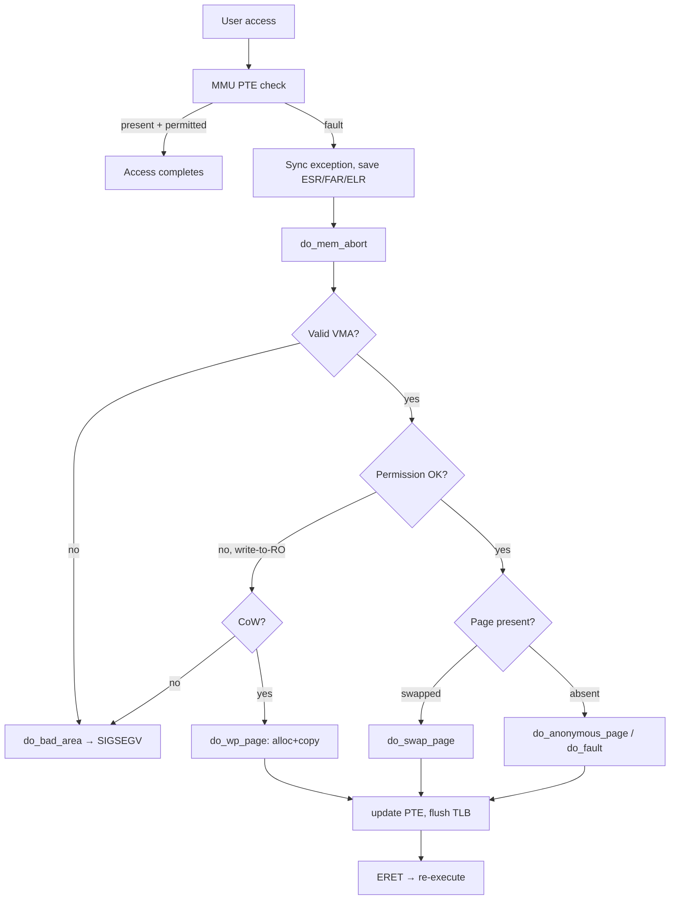

# ARM / ARM64 Memory Management — Consolidated Reference

> A deep, single-document technical reference covering ARM (AArch32) and ARM64
> (AArch8/ARMv8+) memory management as implemented by the Linux kernel.
> Synthesized from six source documents (see §21). Targets kernel developers,
> driver engineers and platform/BSP engineers working on Qualcomm-class SoCs.

---

## 1. Overview & Scope

Memory management in the Linux kernel is the layered cooperation between the
ARM/ARM64 MMU hardware (page tables, TLB, caches, IOMMU/SMMU), the
architecture-specific glue code in `arch/arm{,64}/mm/`, and the architecture
independent core in `mm/`. A driver writer must understand all three layers to
correctly allocate buffers, expose them to userspace, hand them to a DMA
engine, and reason about why a fault or data corruption happens.

This document consolidates the following topic areas:

- Virtual address space layout for AArch32 (3G/1G split) and AArch64 (48-bit
  and 52-bit) and the role of `TTBR0_EL1` / `TTBR1_EL1`.
- The MMU page-table walk, granule sizes (4 KB / 16 KB / 64 KB), and the
  control registers `TCR_EL1`, `MAIR_EL1`, `SCTLR_EL1`.
- Memory types (Normal, Device, Non-Cacheable, Write-Combining) and their
  MAIR encoding.
- TLB structure and maintenance (`TLBI`, ASID, VMID, shareability domains).
- Cache architecture (L1/L2/L3, PIPT/VIPT, instruction vs data caches,
  `DSB`/`DMB`/`ISB` barriers, `DC`/`IC` ops).
- The Linux kernel virtual address layout (linear map, `vmalloc`, `vmemmap`,
  `fixmap`, modules, KASLR).
- Physical memory management: `memblock`, the buddy allocator, zones, and
  GFP flag semantics.
- Slab/SLUB allocator internals and `kmem_cache` API.
- Process address space: `mm_struct`, `vm_area_struct`, `mmap_lock`.
- The page-fault handler on ARM64 (`ESR_EL1`, `FAR_EL1`,
  `arch/arm64/mm/fault.c`).
- `mmap()` and a complete driver `mmap` implementation using
  `remap_pfn_range()` and a `vm_ops->fault` handler.
- `ioremap` variants and DMA mappings (coherent vs streaming, SMMU).
- Huge pages and Transparent Huge Pages (THP).
- The Contiguous Memory Allocator (CMA).
- KSM, compaction, reclaim, and the OOM killer.
- Common pitfalls and the debugging interfaces in `/proc` and `/sys`.

Throughout, kernel functions are cited by their source paths
(`arch/arm64/mm/fault.c`, `mm/memory.c`, `mm/mmap.c`, `mm/page_alloc.c`,
`mm/slub.c`, `mm/cma.c`, `kernel/dma/mapping.c`).

---

## 2. ARM vs ARM64 Memory Architecture

### 2.1 Why the split matters

AArch32 and AArch64 share the same conceptual MMU model (multi-level page
tables, TLB, caches, exception-driven faults) but differ dramatically in
address space size, the number of page-table levels, register naming,
attribute encoding, and the existence of legacy concepts such as **domains**
(AArch32 only) and **ZONE_HIGHMEM** (32-bit only).

### 2.2 AArch32 — Classic 3G/1G Layout

On a 32-bit ARM system the CPU addresses 4 GB of virtual space
(`2^32`). Linux splits it 3 GB user / 1 GB kernel:

```text
Virtual Address Space (32-bit ARM, 3G/1G split)

┌─────────────────────────────────────────┐ 0xFFFFFFFF
│  FIXMAP   (~4 MB)                       │  kmap_atomic() slots
├─────────────────────────────────────────┤ 0xFFC00000
│  PKMAP    (~8 MB)                       │  kmap() persistent slots
├─────────────────────────────────────────┤ 0xFF800000
│  vmalloc area  (~112 MB)                │  vmalloc(), ioremap()
├─────────────────────────────────────────┤ ~0xF8000000 (VMALLOC_START)
│  Kernel Direct Map / Lowmem  (~896 MB)  │  ZONE_DMA + ZONE_NORMAL
│  virtual = physical + PAGE_OFFSET       │  Always mapped
└─────────────────────────────────────────┘ 0xC0000000  ← PAGE_OFFSET
- - - - - - - - - - - KERNEL / USER BOUNDARY - - - - - - - - - - -
┌─────────────────────────────────────────┐ 0xBFFFFFFF
│  Stack / mmap / heap / BSS / Text       │  USER SPACE (3 GB)
└─────────────────────────────────────────┘ 0x00000000
```

| Region        | Virtual Range            | Size     | Purpose                                |
| ------------- | ------------------------ | -------- | -------------------------------------- |
| Direct Map    | `0xC0000000–0xF7FFFFFF`  | ~896 MB  | Kernel code, data, slab, page tables   |
| vmalloc       | `~0xF8000000–0xFF7FFFFF` | ~112 MB  | `vmalloc()`, `ioremap()`, modules      |
| PKMAP         | `0xFF800000–0xFFBFFFFF`  | ~8 MB    | `kmap()` — persistent highmem mappings |
| FIXMAP        | `0xFFC00000–0xFFFFFFFF`  | ~4 MB    | `kmap_atomic()` / compile-time slots   |

### 2.3 AArch64 — 48-bit (and 52-bit) Layout

With 48-bit VAs each "side" of the address space is 256 TB. The two halves
are managed by **two separate page-table base registers**:

- `TTBR0_EL1` — user space (low addresses starting at `0x0`).
- `TTBR1_EL1` — kernel space (high addresses with all-1s top bits).

Addresses in the **canonical gap** between user and kernel are invalid and
trap with a translation fault on access.

```text
ARM64 Virtual Address Space (48-bit VA, 4 KB pages)

┌────────────────────────────────────────┐ 0xFFFFFFFFFFFFFFFF
│  Kernel virtual space (128 TB)         │
├────────────────────────────────────────┤ 0xFFFFFF8000000000  MODULES_VADDR
│  Kernel modules / BPF JIT (128 MB)     │
├────────────────────────────────────────┤ 0xFFFF000000000000  PAGE_OFFSET
│  Linear map / vmalloc / fixmap         │
└────────────────────────────────────────┘
       ~~~~~~~ CANONICAL GAP ~~~~~~~
┌────────────────────────────────────────┐ 0x0000FFFFFFFFFFFF
│  User space (128 TB)  — TTBR0_EL1      │
└────────────────────────────────────────┘ 0x0000000000000000
```

| Constant         | Value (48-bit VA)         | Description                                  |
| ---------------- | ------------------------- | -------------------------------------------- |
| `PAGE_OFFSET`    | `0xFFFF000000000000`      | Start of kernel linear map                   |
| `KIMAGE_VADDR`   | `~0xFFFF800010000000`     | Kernel text/data (KASLR randomized)          |
| `MODULES_VADDR`  | `0xFFFFFF8000000000`      | Kernel modules and BPF JIT (128 MB)          |
| `VMALLOC_START`  | `~0xFFFF000800000000`     | Start of `vmalloc`/`ioremap` region          |
| `TTBR0_EL1`      | per-process               | User page-table root (EL0 accesses)          |
| `TTBR1_EL1`      | set once, ASID-switched   | Kernel page-table root (EL1 accesses)        |

### 2.4 Why kernel space is mapped into every process

A common confusion: if the kernel is "private," why is it visible in every
process's address space?

1. **Syscall performance.** On a syscall, EL0 → EL1 transition is just a
   privilege-level change. If the kernel lived in a separate address space,
   every syscall would need to swap `TTBR0_EL1`/`TTBR1_EL1` and flush the
   TLB — catastrophically expensive.
2. **Interrupts.** The exception vector at `VBAR_EL1` must be reachable
   without reconfiguration.
3. **Driver MMIO mappings.** `ioremap()` mappings are per-kernel, not
   per-process; sharing them avoids per-process setup.

User code cannot actually *read* kernel pages because the PTE access
permission (AP) and `UXN`/`PXN` bits forbid EL0 access — any attempt
generates a permission fault and `SIGSEGV`.

After Meltdown (2018), **KPTI** (Kernel Page Table Isolation) further
restricts the EL0-visible kernel mapping to a minimal trampoline; the full
mapping is only installed when switching to EL1.

### 2.5 AArch32 vs AArch64 — at a glance

| Aspect                  | AArch64 (ARMv8+)                            | AArch32 (ARMv7)                                  |
| ----------------------- | ------------------------------------------- | ------------------------------------------------ |
| Virtual address size    | 48-bit (256 TB/side), opt. 52-bit           | 32-bit (4 GB total)                              |
| Page-table levels       | 4 (L0/PGD, L1/PUD, L2/PMD, L3/PTE)          | 2 (L1/PGD, L2/PTE)                               |
| PGD size                | 4 KB (512 × 8 bytes)                        | 16 KB (4096 × 4 bytes)                           |
| Huge pages              | 2 MB (L2 block), 1 GB (L1 block)            | 1 MB sections, 64 KB large pages                 |
| TTBR registers          | `TTBR0_EL1` + `TTBR1_EL1` (always split)    | `TTBR0` + `TTBR1` (split when `TTBCR.N>0`)       |
| ASID size               | 16-bit (65 536)                             | 8-bit (256, via `CONTEXTIDR`)                    |
| Domains (DACR)          | **Removed**                                 | 16 domains, 2 bits each                          |
| Memory type encoding    | `AttrIndx` → `MAIR_EL1` (8 slots)           | `TEX+C+B` bits in PTE                            |
| ZONE_HIGHMEM            | **Does not exist** (linear map covers all)  | Used for RAM above ~896 MB                       |
| `PAGE_OFFSET`           | `0xFFFF800000000000`                        | `0xC0000000`                                     |
| Fault registers         | `ESR_EL1`, `FAR_EL1`, `ELR_EL1`             | `DFSR`/`DFAR`, `IFSR`/`IFAR`                     |
| Cache/TLB maintenance   | `DC`/`IC`/`TLBI` system insns               | CP15 coprocessor (`MCR p15, ...`)                |

---

## 3. MMU Fundamentals (TTBR_ELx, TCR_ELx, MAIR_ELx, SCTLR_ELx)

Four AArch64 system registers configure the MMU. Linux programs them in
`arch/arm64/mm/proc.S` and updates `TTBR0_EL1` per context switch in
`arch/arm64/mm/context.c`.

### 3.1 `TTBR0_EL1` / `TTBR1_EL1` — Translation Table Base Registers

| Bits      | Field      | Meaning                                              |
| --------- | ---------- | ---------------------------------------------------- |
| `[63:48]` | ASID       | 16-bit Address Space Identifier (TTBR0 only)         |
| `[47:1]`  | BADDR      | Physical address of the top-level page table (PGD)   |
| `[0]`     | CnP        | Common-not-private (multi-PE optimization)           |

```c
/* Linux context switch (simplified, arch/arm64/mm/context.c) */
void cpu_switch_mm(pgd_t *pgd, struct mm_struct *mm)
{
    unsigned long asid  = ASID(mm);
    unsigned long ttbr0 = phys_to_ttbr(virt_to_phys(pgd));
    write_sysreg(ttbr0 | (asid << 48), ttbr0_el1);
    isb();
}
```

### 3.2 `TCR_EL1` — Translation Control Register

Controls translation regime sizing, granule, and walk-attributes.

| Field      | Purpose                                                                      |
| ---------- | ---------------------------------------------------------------------------- |
| `T0SZ`     | VA size for `TTBR0` region = `64 - input_address_bits` (16 for 48-bit VA)    |
| `T1SZ`     | Same, for `TTBR1` region                                                     |
| `TG0`/`TG1`| Translation granule: 4 KB / 16 KB / 64 KB                                    |
| `IPS`      | Intermediate Physical Address Size (40/42/44/48/52-bit)                      |
| `SH0`/`SH1`| Shareability of page-table walks (None / Outer / Inner)                      |
| `IRGN/ORGN`| Inner/outer cacheability of page-table walks                                 |
| `AS`       | ASID size: 0 = 8-bit, 1 = 16-bit (FEAT_ASID16)                               |
| `EPD0/EPD1`| Disable walks for `TTBR0`/`TTBR1` (used for KPTI)                            |

### 3.3 `MAIR_EL1` — Memory Attribute Indirection Register

Eight 8-bit slots; the PTE field `AttrIndx[2:0]` picks one slot.
Linux ARM64 typical layout (`arch/arm64/include/asm/memory.h`):

| Index | Symbol               | Encoding | Meaning                                      |
| ----- | -------------------- | -------- | -------------------------------------------- |
| 0     | `MT_DEVICE_nGnRnE`   | `0x00`   | Strongly ordered MMIO (default `ioremap`)    |
| 1     | `MT_DEVICE_nGnRE`    | `0x04`   | Device memory, PCIe MMIO                     |
| 2     | `MT_DEVICE_GRE`      | `0x0C`   | Write-combining (framebuffers, GPU VRAM)     |
| 3     | `MT_NORMAL_NC`       | `0x44`   | Non-cacheable normal memory (non-coh. DMA)   |
| 4     | `MT_NORMAL`          | `0xFF`   | Write-back, write-allocate (regular RAM)     |
| 5     | `MT_NORMAL_WT`       | `0xBB`   | Write-through normal memory                  |
| 6     | `MT_NORMAL_TAGGED`   | `0xF0`   | Tagged normal (MTE)                          |

Each byte encodes outer (bits 7:4) and inner (bits 3:0) attributes; e.g.
`0xFF = 0b11111111` = WB/WA inner and outer.

### 3.4 `SCTLR_EL1` — System Control Register

| Bit | Name | Meaning                                                       |
| --- | ---- | ------------------------------------------------------------- |
| 0   | `M`  | MMU enable                                                    |
| 2   | `C`  | Data cache enable                                             |
| 12  | `I`  | Instruction cache enable                                      |
| 3   | `SA` | Stack alignment check                                         |
| 19  | `WXN`| Writable implies execute-never                                |
| 23  | `SPAN`| Set Privileged Access Never on exception (PAN)               |
| 25  | `EE` | Endianness at EL1 (0 = little)                                |

Setting `SCTLR_EL1.M = 1` is the moment the MMU becomes active; the very
next instruction is fetched via a translated VA, which is why early boot
code creates an **identity map** (see §2 of the boot discussion below).

---

## 4. Page Table Walk (4-level, 4KB granule)

With 4 KB pages and 48-bit VAs, each 9-bit index selects one of 512 entries
in a 4 KB table:

```text
+----------+---------+---------+---------+------------+
| [47:39]  | [38:30] | [29:21] | [20:12] |  [11:0]    |
| L0 (PGD) | L1 (PUD)| L2 (PMD)| L3 (PTE)|   offset   |
|  9 bits  |  9 bits |  9 bits |  9 bits |  12 bits   |
+----------+---------+---------+---------+------------+
bits[63:48] = 0   -> TTBR0_EL1 (user)
bits[63:48] = 1   -> TTBR1_EL1 (kernel)
otherwise         -> Translation fault (non-canonical)
```

| Level | ARM64 name | Linux | Each entry covers | Entry maps                |
| ----- | ---------- | ----- | ----------------- | ------------------------- |
| 0     | L0         | PGD   | 256 TB            | Pointer to L1 table       |
| 1     | L1         | PUD   | 512 GB            | L2 table **or** 1 GB block|
| 2     | L2         | PMD   | 1 GB              | L3 table **or** 2 MB block|
| 3     | L3         | PTE   | 2 MB              | 4 KB page                 |

### 4.1 PTE bit field reference (ARM64, 4 KB granule)

| Bits     | Name        | Meaning                                                                  |
| -------- | ----------- | ------------------------------------------------------------------------ |
| `[1:0]`  | Type        | `11`=Page, `01`=Block, `00`=Invalid                                      |
| `[4:2]`  | `AttrIndx`  | Index into `MAIR_EL1` (selects memory type)                              |
| `[5]`    | `NS`        | Non-Secure                                                               |
| `[7:6]`  | `AP[2:1]`   | Access permissions (see matrix below)                                    |
| `[9:8]`  | `SH`        | Shareability: `00`=non, `10`=outer, `11`=inner shareable                 |
| `[10]`   | `AF`        | Access Flag (set on first access; HW may update with FEAT_HAFDBS)        |
| `[11]`   | `nG`        | not-Global (ASID-tagged user pages = `1`, kernel = `0`)                  |
| `[47:12]`| OA          | Output address (physical page base)                                      |
| `[51]`   | `DBM`       | Dirty Bit Modifier (HW-managed dirty, FEAT_HAFDBS)                       |
| `[53]`   | `PXN`       | Privileged Execute Never (EL1 cannot fetch)                              |
| `[54]`   | `UXN`       | Unprivileged Execute Never (EL0 cannot fetch)                            |

#### AP/XN matrix

| AP[2] | AP[1] | EL0 (user) | EL1 (kernel) | Typical use            |
| ----- | ----- | ---------- | ------------ | ---------------------- |
| 0     | 0     | No access  | RW           | Kernel-only data       |
| 0     | 1     | RO         | RW           | Shared user/kernel RO  |
| 1     | 0     | No access  | RO           | Kernel `.rodata`/CoW   |
| 1     | 1     | RO         | RO           | Shared all-RO          |

W^X conventions:

- Kernel data: `UXN=1, PXN=1` — neither EL can execute.
- Kernel code: `UXN=1, PXN=0` — EL1 only.
- User code:   `UXN=0, PXN=1` — EL0 only.
- User data:   `UXN=1, PXN=1`.

### 4.2 Worked example — translate `0xFFFF800012345678`

```text
VA = 0xFFFF800012345678
TTBR1_EL1 = 0x80000000 (physical base of kernel PGD)

VA[47:39] = 0b100000000 = 256   <- L0 index
VA[38:30] = 0b000000000 = 0     <- L1 index
VA[29:21] = 0b000010010 = 18    <- L2 index
VA[20:12] = 0b001101000 = 104   <- L3 index
VA[11:0]  = 0x678               <- page offset

L0 (PGD) lookup
  Entry @ 0x80000000 + 256*8  = 0x80000800
  Entry value 0x...8010_0003 → table, L1 @ 0x80100000

L1 (PUD) lookup
  Entry @ 0x80100000 + 0      = 0x80100000
  Entry value 0x...8020_0003 → table, L2 @ 0x80200000

L2 (PMD) lookup
  Entry @ 0x80200000 + 18*8   = 0x80200090
  Entry value 0x...8030_0003 → table, L3 @ 0x80300000

L3 (PTE) lookup
  Entry @ 0x80300000 + 104*8  = 0x80300340
  Entry value 0x0060_0000_9000_0713
    bits[1:0]=11 (page), [47:12]=0x90000, AF=1, SH=Inner,
    AP=EL1 RW/EL0 RO, AttrIndx=4 -> MT_NORMAL

PA = 0x90000000 + 0x678 = 0x90000678
```

### 4.3 Walk flow diagram

```mermaid
flowchart TD
    A[Load/Store/Fetch VA] --> B{VA[63:48]?}
    B -- all 0 --> C[TTBR0_EL1 (user)]
    B -- all 1 --> D[TTBR1_EL1 (kernel)]
    B -- other --> X[Translation fault]
    C --> E[TLB lookup]
    D --> E
    E -- hit --> Z[PA + cache line attrs]
    E -- miss --> F[L0 walk]
    F --> G[L1 walk]
    G --> H{block@L1?}
    H -- yes --> Y[1 GB block → PA]
    H -- no --> I[L2 walk]
    I --> J{block@L2?}
    J -- yes --> Y2[2 MB block → PA]
    J -- no --> K[L3 walk → PTE]
    K --> Z
    K -. invalid .-> X2[Translation fault → ESR_EL1]
```

### 4.4 Kernel PTE manipulation API (`arch/arm64/include/asm/pgtable.h`)

```c
pte_present(pte)   /* is the page mapped? (valid bit) */
pte_write(pte)     /* writable? (AP bits) */
pte_dirty(pte)     /* written? (DBM / SW bit) */
pte_young(pte)     /* accessed? (AF) */
pte_mkwrite(pte)   /* set writable */
pte_mkdirty(pte)
pte_mkyoung(pte)
pte_pfn(pte)       /* extract page frame number */
```

---

## 5. Translation Granules & Levels (4 KB / 16 KB / 64 KB)

ARM64 supports three granule sizes, selectable per translation regime via
`TCR_EL1.TG0`/`TG1`. Linux on Qualcomm and most ARM64 distros uses 4 KB by
default.

| Granule | Index bits/level | Levels for 48-bit | "Block" sizes        | Typical use            |
| ------- | ---------------- | ----------------- | -------------------- | ---------------------- |
| 4 KB    | 9                | 4 (L0…L3)         | 1 GB (L1), 2 MB (L2) | Default, smallest pages|
| 16 KB   | 11               | 4 (L0…L3)         | 32 MB (L2)           | Some Android/Apple     |
| 64 KB   | 13               | 3 (L1…L3)         | 512 MB (L2)          | Servers, low TLB miss  |

Larger granules mean fewer levels (faster walks, larger TLB reach) but
coarser allocation. The kernel is built for one granule at a time
(`CONFIG_ARM64_4K_PAGES` / `_16K_` / `_64K_`).

### 5.1 Huge pages

Block descriptors short-circuit the walk:

```text
Normal 4 KB walk:   L0 -> L1 -> L2 -> L3 -> PA   (4 levels)
2 MB huge page:     L0 -> L1 -> L2[block] -> PA  (walk stops at L2)
1 GB huge page:     L0 -> L1[block] -> PA        (walk stops at L1)
```

A single 2 MB TLB entry covers 512× more VA than a 4 KB entry — invaluable
for the kernel linear map and Transparent Huge Pages (§16).

---

## 6. Memory Types & Attributes (Normal vs Device, MAIR encoding)

ARM64 distinguishes **Normal** memory (reorderable, cacheable, speculatable)
from **Device** memory (strict ordering, non-cacheable, non-speculative).

| Memory type            | Cache       | Ordering    | Typical use                                  |
| ---------------------- | ----------- | ----------- | -------------------------------------------- |
| `MT_NORMAL`            | WB/WA       | Relaxed     | RAM, kmalloc, vmalloc                        |
| `MT_NORMAL_NC`         | None        | Normal      | Coherent DMA buffers (non-HW-coherent SoC)   |
| `MT_NORMAL_WT`         | Write-thru  | Normal      | Rare; special cache behaviour                |
| `MT_DEVICE_nGnRnE`     | None        | Strict      | MMIO registers (default `ioremap`)           |
| `MT_DEVICE_nGnRE`      | None        | Device      | PCIe MMIO                                    |
| `MT_DEVICE_GRE`        | None        | Relaxed     | Write-combining (framebuffers, GPU VRAM)     |
| `MT_NORMAL_TAGGED`     | WB/WA       | Normal      | Memory Tagging Extension (MTE/KASAN)         |

The PTE only stores a 3-bit `AttrIndx`, which selects the actual encoding
from `MAIR_EL1`. This indirection lets the kernel reconfigure attribute
semantics for the whole system without rewriting every PTE.

### 6.1 `ioremap` variants

| Function           | MAIR slot           | Use                                          |
| ------------------ | ------------------- | -------------------------------------------- |
| `ioremap()`        | `MT_DEVICE_nGnRE`   | General MMIO, hardware registers             |
| `ioremap_np()`     | `MT_DEVICE_nGnRnE`  | Strictly ordered (no gather, no reorder)     |
| `ioremap_wc()`     | `MT_DEVICE_GRE`     | Framebuffers, GPU VRAM                       |
| `ioremap_cache()`  | `MT_NORMAL`         | Cached peripheral access (rare)              |
| `ioremap_uc()`     | `MT_NORMAL_NC`      | Non-cached without device semantics          |

Use `readl()/writel()` only on `ioremap()`/`ioremap_np()` regions. For WC
regions use `memcpy_toio()`/`memcpy_fromio()`.

---

## 7. TLB Management (TLBI, ASID, VMID, shareability)

The Translation Lookaside Buffer caches recent VA → PA translations. Without
it, every load would cost a full 4-level walk.

```text
TLB entry (conceptual):
+--------+--------------------------+------------------------+
|  ASID  |  Virtual Page Number     |  Physical Page Number  |
| (16b)  |  (VA bits[63:12])        |  (PA bits[47:12]) + AP |
+--------+--------------------------+------------------------+
```

### 7.1 ASID tagging

ASID (Address Space Identifier) lets multiple processes share the TLB
without flushing on every context switch. Kernel pages have `nG=0` ("global")
and are visible to every ASID; user pages have `nG=1` and are tagged.
ARM64 supports 16-bit ASIDs (65 536 values) via FEAT_ASID16; ARM32 only
8-bit.

When ASIDs are exhausted, `arch/arm64/mm/context.c` performs a generation
rollover with a global TLB flush.

### 7.2 VMID (hypervisor)

In virtualization (EL2/Stage-2 translation), each VM gets a VMID, which
tags TLB and cache lines so guests do not see each other's translations.

### 7.3 Shareability domains

| Domain      | Coverage                                                    |
| ----------- | ----------------------------------------------------------- |
| Non-Shr     | This PE only                                                |
| Inner-Shr   | All PEs in the inner shareable domain (typically one cluster|
| Outer-Shr   | All PEs in the outer shareable domain (system)              |

Most kernel mappings are Inner Shareable; TLB and barrier instructions
default to `ish`.

### 7.4 TLB invalidation instructions

```text
TLBI VAAE1IS, Xn   - by VA, all ASIDs, Inner Shareable
TLBI VAE1IS , Xn   - by VA, specific ASID (Xn = ASID<<48 | VA>>12)
TLBI VMALLE1IS     - all EL1 entries, Inner Shareable (full flush)
TLBI ASIDE1IS, Xn  - all entries for one ASID

Always followed by:
   DSB ISH        ; wait for TLBI to complete
   ISB            ; flush pipeline
```

Linux API in `arch/arm64/include/asm/tlbflush.h`:

```c
flush_tlb_page(vma, addr);           /* single VA              */
flush_tlb_range(vma, start, end);    /* VA range               */
flush_tlb_mm(mm);                    /* entire user mm         */
flush_tlb_kernel_range(start, end);  /* kernel mapping range   */
```

### 7.5 When to flush

- PTE changed (permissions altered, PA changed).
- Page unmapped (PTE cleared).
- Process exit (entire user mapping gone).
- ASID rollover.
- `ioremap`/`iounmap`.
- `mprotect()` syscall.

---

## 8. Cache Architecture (I/D, PIPT/VIPT, DSB/DMB/ISB)

A typical Qualcomm SoC has three cache levels:

```text
Core0                  Core1
[ L1-I 64K ]           [ L1-I 64K ]
[ L1-D 64K ]           [ L1-D 64K ]
[ L2    512K ]         [ L2    512K ]
        \                  /
         \                /
          [  L3 (shared 8 MB) ]
                  |
              [System Cache / LLC]
                  |
                [ DRAM ]
```

| Level | Size           | Latency      | Scope     | Notes                       |
| ----- | -------------- | ------------ | --------- | --------------------------- |
| L1-D  | 32–64 KB       | ~4 cy        | Per core  | WB/WA, **PIPT** on ARMv8    |
| L1-I  | 32–64 KB       | ~4 cy        | Per core  | Instruction only            |
| L2    | 256 KB – 1 MB  | ~12 cy       | Per core  | Unified, PIPT               |
| L3    | 4–16 MB        | ~30 cy       | Cluster   | Shared, DSU                 |
| DRAM  | ≥ GB           | ~100+ cy     | System    | DMA target                  |

ARMv8 mandates **PIPT** (Physically Indexed, Physically Tagged) for data
caches, eliminating the aliasing problems that plagued VIVT/VIPT caches on
ARMv5/6.

### 8.1 Cache line size

Almost always **64 bytes** on ARM64 (check `CTR_EL0.DminLine`). DMA buffers
**must** be cache-line aligned to avoid sharing a line with adjacent data —
otherwise an "invalidate" for DMA_FROM_DEVICE will discard CPU writes.

```c
unsigned int cls = cache_line_size();   /* typically 64 */
size_t aligned = ALIGN(size, dma_get_cache_alignment());
```

### 8.2 Cache maintenance instructions

| Instruction    | Meaning                                                       |
| -------------- | ------------------------------------------------------------- |
| `DC CVAC, Xn`  | Clean to PoC (write dirty line to DRAM). Used for `TO_DEVICE` |
| `DC IVAC, Xn`  | Invalidate to PoC (discard line). Used for `FROM_DEVICE`.     |
| `DC CIVAC, Xn` | Clean **and** invalidate (most complete)                      |
| `DC CVAU, Xn`  | Clean to PoU (used with `IC IVAU` for I/D coherence)          |
| `DC ZVA, Xn`   | Zero an aligned block without read                            |
| `IC IVAU, Xn`  | Invalidate I-cache line to PoU                                |

PoU = Point of Unification (I/D coherent, typically L2).
PoC = Point of Coherency (all observers including DMA, typically DRAM).

### 8.3 Barriers

| Instruction  | Effect                                                                 |
| ------------ | ---------------------------------------------------------------------- |
| `DSB SY`     | Wait for **all** previous memory accesses to complete.                 |
| `DSB ISH`    | Same, restricted to inner-shareable domain.                            |
| `DSB ISHST`  | Stores only, inner-shareable (used before `TLBI`).                     |
| `DMB SY`     | Order memory accesses (does not wait for completion).                  |
| `ISB`        | Flush pipeline; required after sysreg or I-cache changes.              |

Linux wrappers (`arch/arm64/include/asm/barrier.h`):

```c
dsb(sy);  dsb(ish);  dsb(ishst);
dmb(sy);  dmb(ish);
isb();
```

### 8.4 Range cache clean (driver-rare; DMA API does this for you)

```c
static inline void arm64_sync_cache_range(void *addr, size_t size)
{
    void *end = addr + size;
    u64 cls = cache_line_size();
    do {
        asm volatile("dc civac, %0" :: "r"(addr));
        addr += cls;
    } while (addr < end);
    dsb(sy);
}
```

---

## 9. Linux Kernel Memory Layout on ARM64 (vmalloc, vmemmap, fixmap, KASLR)

The ARM64 kernel half of the address space is partitioned by
`arch/arm64/include/asm/memory.h`:

```text
0xFFFF_FFFF_FFFF_FFFF
  +--------------------------------------+
  | fixmap (compile-time fixed slots)    |
  +--------------------------------------+
  | PCI I/O                              |
  +--------------------------------------+
  | vmemmap (struct page array, sparse)  |   -> covers all of phys
  +--------------------------------------+
  | modules (128 MB) + BPF JIT           |
  +--------------------------------------+
  | KIMAGE (kernel text/rodata/data)     |   KASLR randomized
  +--------------------------------------+
  | vmalloc / ioremap                    |
  +--------------------------------------+
  | linear (direct) map of all PHYS RAM  |   starts at PAGE_OFFSET
  +--------------------------------------+
0xFFFF_0000_0000_0000   PAGE_OFFSET
```

- **Linear map** uses 2 MB block mappings; every page of RAM is permanently
  available at `__va(pa) = phys + PAGE_OFFSET`.
- **`vmalloc`** provides virtually contiguous but physically scattered
  allocations and is also the home of `ioremap()` mappings.
- **`vmemmap`** is a sparse virtual array of `struct page` such that
  `pfn_to_page(pfn)` is a simple add+shift.
- **`fixmap`** is a compile-time-known range used for early console,
  `kmap_atomic`, EFI, etc.
- **Modules** (and BPF JIT) live in a 128 MB area close to the kernel image
  so that 32-bit branch relocations can reach.
- **KASLR** randomizes `KIMAGE_VADDR` (and module base) per boot.

### 9.1 ARM64 has no `ZONE_HIGHMEM`

Because 128 TB easily covers any installed RAM, every physical page is in
the linear map. `kmap()`/`kmap_atomic()` become no-ops returning the linear
map address. Driver code is therefore simpler than on ARM32.

---

## 10. Physical Memory Management (memblock, buddy, zones)

### 10.1 Early boot — `memblock`

Before the buddy allocator exists, the kernel uses **memblock**
(`mm/memblock.c`) to track:

- `memblock.memory` — all physical RAM reported by DT/EFI/UEFI.
- `memblock.reserved` — regions reserved for kernel image, DTB,
  initramfs, CMA regions, no-map carveouts, etc.

`memblock_alloc()` services the early allocator until `mem_init()` hands
remaining ranges to the buddy.

### 10.2 Zones

| Zone           | Phys range (32-bit)    | Kernel mapping          | DMA?     | ARM64    |
| -------------- | ---------------------- | ----------------------- | -------- | -------- |
| `ZONE_DMA`     | 0 – 16 MB              | Direct                  | ISA DMA  | Optional |
| `ZONE_DMA32`   | 0 – 4 GB               | Direct                  | 32-bit   | Yes      |
| `ZONE_NORMAL`  | 16 MB – ~896 MB        | Direct                  | Usually  | All RAM  |
| `ZONE_HIGHMEM` | > 896 MB               | Temporary (kmap)        | Usually no | **N/A** |
| `ZONE_MOVABLE` | Configurable           | Movable pages only      | No       | Yes      |

### 10.3 Buddy allocator

The buddy allocator (`mm/page_alloc.c`) manages free pages in power-of-2
"orders" (`0..MAX_ORDER`, typically 0..11 → 4 KB to 8 MB).

| Order | Pages | Size  | Typical use                       |
| ----- | ----- | ----- | --------------------------------- |
| 0     | 1     | 4 KB  | Single page, kmalloc small        |
| 2     | 4     | 16 KB | ARM32 PGD                         |
| 4     | 16    | 64 KB | ARM64 page-table pages            |
| 10    | 1024  | 4 MB  | Max kmalloc                       |
| 11    | 2048  | 8 MB  | Largest single alloc              |

```c
/* include/linux/mmzone.h */
struct free_area {
    struct list_head free_list[MIGRATE_TYPES];
    unsigned long    nr_free;
};
struct zone {
    struct free_area free_area[MAX_ORDER + 1];
    /* ... */
};
```

#### XOR buddy address

```c
static inline unsigned long
__find_buddy_pfn(unsigned long pfn, unsigned int order)
{
    return pfn ^ (1UL << order);
}
```

Two blocks are buddies iff they have the same order, are naturally aligned
to `2^order`, and differ in exactly the bit at position `order`. On free,
the allocator recursively merges with the buddy up to `MAX_ORDER`.

#### Migration types

To prevent unmovable kernel allocations from fragmenting movable user
memory, each order has separate free lists per migration type:

- `MIGRATE_UNMOVABLE` — kernel, `kmalloc`, DMA
- `MIGRATE_MOVABLE`   — user pages, page cache
- `MIGRATE_RECLAIMABLE` — file-backed, slab caches
- `MIGRATE_CMA`       — CMA reserved region
- `MIGRATE_ISOLATE`   — temporarily isolated for migration

### 10.4 GFP flags (essentials)

| Flag             | Can sleep | Zone    | Use                                              |
| ---------------- | --------- | ------- | ------------------------------------------------ |
| `GFP_KERNEL`     | Yes       | NORMAL  | Process context — default                        |
| `GFP_ATOMIC`     | No        | NORMAL  | IRQ/softirq, spinlock held                       |
| `GFP_NOWAIT`     | No        | NORMAL  | Best-effort, no stall                            |
| `GFP_NOIO`       | Yes       | NORMAL  | Block I/O path (no recursion into I/O)           |
| `GFP_NOFS`       | Yes       | NORMAL  | Filesystem code (no recursion into FS)           |
| `GFP_DMA`        | Yes       | DMA     | <16 MB DMA                                       |
| `GFP_DMA32`      | Yes       | DMA32   | <4 GB DMA                                        |
| `GFP_HIGHUSER`   | Yes       | HIGHMEM | User pages (32-bit)                              |
| `__GFP_ZERO`     | -         | -       | Zero memory (or use `kzalloc`)                   |
| `__GFP_NOFAIL`   | -         | -       | Retry until success (use sparingly)              |

The **Golden Rule**: never `GFP_KERNEL` while holding a spinlock; use
`GFP_ATOMIC`. The slab/page allocator may sleep on reclaim and deadlock.

---

## 11. Slab/SLUB Allocators

The buddy allocator works at page granularity. The slab/SLUB layer
(`mm/slub.c`) packs many small objects into pages.

### 11.1 `kmem_cache` data structure

```c
struct kmem_cache {
    struct kmem_cache_cpu __percpu *cpu_slab;   /* fast path        */
    unsigned int        size;                   /* with metadata    */
    unsigned int        object_size;            /* actual object    */
    unsigned int        offset;                 /* free-ptr offset  */
    struct kmem_cache_node *node[MAX_NUMNODES]; /* per-NUMA-node    */
    /* ... */
};
```

### 11.2 Three-level architecture

```text
kmem_cache
  |
  +-- cpu_slab (per-CPU)        LEVEL 1: fast path (no lock)
  |     |-- freelist  -> obj -> obj -> ... -> NULL
  |     +-- active slab page
  |
  +-- node[N].partial           LEVEL 2: per-node partial pages
  |
  +-- buddy allocator           LEVEL 3: alloc_pages() for new slab
```

### 11.3 Fast path (zero locking)

```c
/* Pseudocode of kmem_cache_alloc fast path */
object = cpu_slab->freelist;
cpu_slab->freelist = object->next;    /* free ptr stored inside object */
return object;                        /* ~10–20 ns, no lock */
```

The next-free pointer lives **inside** each free object at offset `offset`.
With `CONFIG_SLAB_FREELIST_HARDENED=y`, it is XOR-encoded with a per-cache
secret and the slot address to defeat heap-grooming attacks.

### 11.4 API

```c
void *p = kmalloc(size, GFP_KERNEL);
void *p = kzalloc(size, GFP_KERNEL);     /* prefer over kmalloc+memset */
void *p = kcalloc(n, size, GFP_KERNEL);
void *p = krealloc(old, new_size, GFP_KERNEL);
kfree(p);
kfree_sensitive(p);                       /* zero before free */

/* Dedicated cache (high-frequency fixed-size object) */
struct kmem_cache *c = kmem_cache_create("name", sizeof(obj), 0,
                                         SLAB_HWCACHE_ALIGN, NULL);
obj = kmem_cache_alloc(c, GFP_KERNEL);
kmem_cache_free(c, obj);
kmem_cache_destroy(c);
```

### 11.5 Debug flags

| Flag                       | Effect                                                |
| -------------------------- | ----------------------------------------------------- |
| `SLAB_HWCACHE_ALIGN`       | Cache-line align objects (no false sharing)           |
| `SLAB_POISON`              | Fill free with `0x6b`, alloc with `0x5a`              |
| `SLAB_RED_ZONE`            | Red zone bytes before/after object (overflow detect)  |
| `SLAB_PANIC`               | Panic if cache create fails                           |
| `SLAB_TYPESAFE_BY_RCU`     | Safe for RCU lookups                                  |
| `SLAB_ACCOUNT`             | Account to memcg                                      |
| `SLAB_RECLAIM_ACCOUNT`     | Reclaimable (e.g. inode cache)                        |

### 11.6 SLUB poison values

| Pattern         | Meaning                                                 |
| --------------- | ------------------------------------------------------- |
| `0x6b6b6b6b...` | Use-after-free (read of freed object filled with `0x6b`)|
| `0x5a5a5a5a...` | Uninitialized read (alloc poison `0x5a`)                |
| `0xbbbbbbbb...` | Red-zone overrun (buffer overflow)                      |

```bash
echo 1 > /sys/kernel/slab/<cache>/validate   # validate cache
cat /proc/slabinfo                            # all caches
slabtop                                       # top-like view
```

---

## 12. Virtual Memory in Processes (mm_struct, vm_area_struct, mmap_lock)

Every Linux task carries a pointer to a `struct mm_struct` describing its
address space; threads share one.

### 12.1 `mm_struct` (selected fields)

```c
struct mm_struct {
    pgd_t                  *pgd;          /* L0 page table (PGD)        */
    unsigned long           mmap_base;    /* mmap region start          */
    struct vm_area_struct  *mmap;         /* sorted VMA list (or maple) */
    struct rb_root          mm_rb;        /* VMA red-black tree         */
    atomic64_t              context.id;   /* ASID + generation          */
    struct rw_semaphore     mmap_lock;    /* serializes VMA changes     */
    atomic_t                mm_users;
    atomic_t                mm_count;
    unsigned long           total_vm, locked_vm, pinned_vm;
    unsigned long           start_code, end_code, start_data, end_data;
    unsigned long           start_brk,  brk,      start_stack;
    /* ... */
};
```

### 12.2 `vm_area_struct` — one contiguous mapping

```c
struct vm_area_struct {
    unsigned long      vm_start, vm_end;     /* [vm_start, vm_end) */
    struct mm_struct  *vm_mm;
    pgprot_t           vm_page_prot;         /* PTE protection bits */
    unsigned long      vm_flags;             /* VM_READ|VM_WRITE|... */
    struct file       *vm_file;              /* backing file or NULL */
    unsigned long      vm_pgoff;             /* file offset in pages */
    const struct vm_operations_struct *vm_ops;
    void              *vm_private_data;
};
```

`vm_ops->fault()` is the demand-paging hook (driver `mmap()` plugs into
it; see §14). `vm_flags` carries `VM_READ`, `VM_WRITE`, `VM_EXEC`,
`VM_SHARED`, `VM_IO`, `VM_PFNMAP`, `VM_DONTEXPAND`, `VM_DONTDUMP`, etc.

### 12.3 `mmap_lock`

`mm->mmap_lock` is an `rw_semaphore`:

- **Write** holder: `do_mmap()`, `do_munmap()`, `mprotect()`, fork/exec.
- **Read** holder: page-fault handler walks VMAs; `get_user_pages()`.

Modern kernels also support per-VMA locks (`vma->vm_lock`) and lockless
fault paths for scalability.

---

## 13. Page Fault Handling on ARM64 (ESR_EL1, FAR_EL1, arch/arm64/mm/fault.c)

A page fault is a synchronous exception raised by the MMU when an access
finds an invalid PTE, fails the permission check, or hits an AF=0 entry.

### 13.1 Why faults are essential

| Mechanism            | What page faults enable                                   |
| -------------------- | --------------------------------------------------------- |
| Demand paging        | Allocate physical pages only on first access              |
| Lazy `malloc`        | `brk`/`mmap` reserves VA; physical only on write          |
| Memory-mapped files  | Read from disk on first touch                             |
| Swap                 | Bring pages back from swap                                |
| Copy-on-Write (fork) | Share physical pages until a writer breaks the share      |
| Stack growth         | Extend the stack VMA when SP drops below mapped range     |

### 13.2 ARM64 fault registers

| Register   | Content                                                              |
| ---------- | -------------------------------------------------------------------- |
| `ESR_EL1`  | `EC[31:26]` fault class; `DFSC[5:0]` data-fault status code          |
| `FAR_EL1`  | Faulting virtual address                                             |
| `ELR_EL1`  | PC of the faulting instruction (re-executed on return)               |
| `SPSR_EL1` | Saved PSTATE at exception                                            |

#### `EC` values for aborts

| EC      | Meaning                                  |
| ------- | ---------------------------------------- |
| `0x24`  | Data Abort from EL0                      |
| `0x25`  | Data Abort from EL1                      |
| `0x20`  | Instruction Abort from EL0               |
| `0x21`  | Instruction Abort from EL1               |

#### `DFSC` (Data Fault Status Code) — common values

| DFSC      | Fault                          | Typical handler action                  |
| --------- | ------------------------------ | --------------------------------------- |
| `0b000111`| Translation fault, level 3     | Demand paging / swap-in / CoW alloc     |
| `0b001111`| Permission fault, level 3      | CoW; or `SIGSEGV` if not writable VMA   |
| `0b001011`| Access flag fault, level 3     | Set `AF=1`, update LRU, retry           |
| `0b100001`| Alignment fault                | `SIGBUS`                                |
| (none)    | No VMA found                   | `do_bad_area()` → `SIGSEGV`             |

### 13.3 Linux call chain on ARM64

```text
el0_sync / el1_sync          (entry.S, vector)
   |
   v
do_mem_abort()               (arch/arm64/mm/fault.c)
   | reads ESR_EL1, FAR_EL1
   v
do_translation_fault() / do_page_fault()
   v
handle_mm_fault()            (mm/memory.c)
   v
__handle_mm_fault() -> handle_pte_fault()
       |
       +-- do_anonymous_page()  /* heap, stack */
       +-- do_fault()           /* mmap'd file */
       +-- do_swap_page()       /* swapped out */
       +-- do_wp_page()         /* CoW         */
   v
update PTE  ->  flush TLB  ->  ERET (re-execute faulting instruction)
```

### 13.4 Fault flow diagram



### 13.5 Skeleton fault handler in a driver

A character/block driver normally only sees faults through `vm_ops->fault`
on user-installed VMAs:

```c
static vm_fault_t my_vma_fault(struct vm_fault *vmf)
{
    struct vm_area_struct *vma = vmf->vma;
    struct my_dev *dev = vma->vm_private_data;
    unsigned long off = vmf->pgoff << PAGE_SHIFT;
    struct page *page;

    if (off >= dev->size)
        return VM_FAULT_SIGBUS;

    page = dev->pages[vmf->pgoff];
    get_page(page);          /* refcount for the mapping */
    vmf->page = page;        /* core mm installs PTE for us */
    return 0;
}
```

### 13.6 Fault performance

| Event           | Typical cost                  |
| --------------- | ----------------------------- |
| TLB hit         | ~1 cycle (parallel with L1)   |
| TLB miss        | ~10–100 cycles (walk in cache)|
| Minor fault     | ~1–5 µs                       |
| Major fault     | ~1–10 ms (disk I/O)           |

---

## 14. mmap() and Driver mmap Implementation (remap_pfn_range, vm_insert_page)

The user-space `mmap(2)` syscall (`mm/mmap.c::do_mmap()`) creates a VMA. If
the mapping targets a character device, the kernel calls the device's
`file_operations.mmap` hook. The driver's job is to fill in `vma->vm_ops`,
`vma->vm_page_prot`, and either install all PTEs now (eager) or rely on
demand paging.

### 14.1 Two strategies

| Approach        | API                                              | When to use                   |
| --------------- | ------------------------------------------------ | ----------------------------- |
| Eager           | `remap_pfn_range()` / `io_remap_pfn_range()`     | Small, MMIO, contiguous       |
| Demand-paging   | `vm_ops->fault()` + `vmf->page` / `vm_insert_page` / `vmf_insert_pfn` | Sparse access, large buffers |

### 14.2 Complete `mmap` driver — annotated

The example below exposes a 2 MB kernel buffer as `/dev/custom_mmap`, with
per-page allocation and a `fault` handler.

```c
#include <linux/module.h>
#include <linux/fs.h>
#include <linux/mm.h>
#include <linux/slab.h>
#include <linux/cdev.h>
#include <linux/device.h>

#define DEVICE_NAME "custom_mmap"
#define BUFFER_SIZE (2 * 1024 * 1024)

static int            major_number;
static struct class  *custom_class;
static struct device *custom_device;
static struct page  **pages;
static int            num_pages;

/* ---- vm_operations ----------------------------------------------- */
static vm_fault_t custom_vma_fault(struct vm_fault *vmf)
{
    unsigned long off = vmf->pgoff << PAGE_SHIFT;

    if (off >= BUFFER_SIZE)
        return VM_FAULT_SIGBUS;

    get_page(pages[vmf->pgoff]);
    vmf->page = pages[vmf->pgoff];
    return 0;
}

static void custom_vma_open(struct vm_area_struct *vma)  { /* refcount */ }
static void custom_vma_close(struct vm_area_struct *vma) { /* refcount */ }

static const struct vm_operations_struct custom_vm_ops = {
    .open  = custom_vma_open,
    .close = custom_vma_close,
    .fault = custom_vma_fault,
};

/* ---- file_operations.mmap ---------------------------------------- */
static int device_mmap(struct file *filp, struct vm_area_struct *vma)
{
    unsigned long size = vma->vm_end - vma->vm_start;

    if (size > BUFFER_SIZE)
        return -EINVAL;

    /* Mark VMA: IO, do not expand or core-dump */
    vma->vm_flags |= VM_IO | VM_DONTEXPAND | VM_DONTDUMP;

    /* Cache policy:
     *   pgprot_noncached(...)       -> uncached MMIO
     *   pgprot_writecombine(...)    -> framebuffer-friendly
     *   (leave as-is)               -> cached normal memory
     */
    vma->vm_page_prot = pgprot_noncached(vma->vm_page_prot);

    vma->vm_ops          = &custom_vm_ops;
    vma->vm_private_data = filp->private_data;

    custom_vma_open(vma);
    return 0;
}

static const struct file_operations fops = {
    .owner = THIS_MODULE,
    .mmap  = device_mmap,
};
```

### 14.3 Eager variant with `remap_pfn_range()`

```c
int i;
for (i = 0; i < num_pages && (i * PAGE_SIZE) < size; i++) {
    unsigned long pfn = page_to_pfn(pages[i]);
    if (remap_pfn_range(vma,
                        vma->vm_start + i * PAGE_SIZE,
                        pfn,
                        PAGE_SIZE,
                        vma->vm_page_prot))
        return -EAGAIN;
}
```

`remap_pfn_range()` is best for physically contiguous regions and for MMIO
(use `io_remap_pfn_range()`). For ordinary kernel pages, `vm_insert_page()`
or `vmf_insert_pfn()` are preferred since they keep refcounts accurate.

### 14.4 User-space test program

```c
int fd = open("/dev/custom_mmap", O_RDWR);
void *buf = mmap(NULL, BUFFER_SIZE, PROT_READ | PROT_WRITE,
                 MAP_SHARED, fd, 0);
if (buf == MAP_FAILED) { perror("mmap"); return 1; }

memset(buf, 0xA5, 4096);          /* touches page 0 -> fault */
((char *)buf)[1 << 20] = 'X';     /* touches page at 1 MB    */
munmap(buf, BUFFER_SIZE);
close(fd);
```

### 14.5 Key flags to know

| `vm_flags`                    | Meaning                                              |
| ----------------------------- | ---------------------------------------------------- |
| `VM_IO`                       | I/O memory; not accounted as RAM                     |
| `VM_PFNMAP`                   | PFN-only mapping (no `struct page` accounting)       |
| `VM_DONTEXPAND`               | `mremap` cannot grow the VMA                         |
| `VM_DONTDUMP`                 | Excluded from core dumps                             |
| `VM_MIXEDMAP`                 | Mix of `struct page` and pfn entries                 |
| `VM_LOCKED`                   | `mlock`ed                                            |

---

## 15. ioremap, DMA Mappings (coherent vs streaming)

### 15.1 The cache-coherency problem

```text
CPU writes -> L1/L2 -> (eventually) DRAM
DMA reads DRAM directly                    -> sees stale data!
DMA writes DRAM directly
CPU reads -> hits L1 with stale cached copy -> sees stale data!
```

Two solutions:

| Approach     | Mechanism                                         | Driver impact                          |
| ------------ | ------------------------------------------------- | -------------------------------------- |
| HW coherent  | CCI/CMN interconnect snoops CPU caches            | None; `dma_alloc_coherent` is enough   |
| Non-coherent | SW must clean/invalidate caches around each xfer  | Must use DMA API with correct direction|

Mark a coherent device in DT:

```dts
camera_isp: isp@1a00000 {
    compatible = "qcom,camera-isp";
    reg = <0x1a00000 0x10000>;
    dma-coherent;        /* this DMA master is HW-coherent */
};
```

Detect at runtime:

```c
if (dev_is_dma_coherent(dev)) { /* cached, no SW cache ops */ }
```

### 15.2 Coherent DMA mapping

```c
dma_addr_t dma;
void *cpu = dma_alloc_coherent(dev, size, &dma, GFP_KERNEL);
if (!cpu) return -ENOMEM;

/* program dma into HW; cpu is for kernel reads/writes */

dma_free_coherent(dev, size, cpu, dma);
```

On a non-HW-coherent SoC this maps as `MT_NORMAL_NC` (uncached) — CPU
access is slow but always coherent. On a HW-coherent SoC it maps as
`MT_NORMAL` (cached); coherency is maintained by the interconnect.

Write-combining variant for framebuffers:

```c
void *cpu = dma_alloc_wc(dev, size, &dma, GFP_KERNEL);
```

### 15.3 Streaming DMA mapping

For large data buffers (network packets, video frames) you want the CPU
cache between transfers:

```c
dma_addr_t dma = dma_map_single(dev, ptr, size, DMA_TO_DEVICE);
if (dma_mapping_error(dev, dma)) return -ENOMEM;

writel(lower_32_bits(dma), base + REG_LO);
writel(upper_32_bits(dma), base + REG_HI);
start_dma();
wait_for_completion(&done);

dma_unmap_single(dev, dma, size, DMA_TO_DEVICE);
```

Between `dma_map_single` and `dma_unmap_single`, the buffer **belongs to the
device**; the CPU must not access it.

Sync without unmap (ping-pong / descriptor rings):

```c
dma_sync_single_for_cpu(dev,    dma, size, DMA_FROM_DEVICE);
dma_sync_single_for_device(dev, dma, size, DMA_TO_DEVICE);
```

Scatter-gather:

```c
sg_init_table(sg, n);
for (i = 0; i < n; i++) sg_set_buf(&sg[i], bufs[i], lens[i]);
nents = dma_map_sg(dev, sg, n, DMA_TO_DEVICE);
for_each_sg(sg, s, nents, i) {
    program_desc(sg_dma_address(s), sg_dma_len(s));
}
dma_unmap_sg(dev, sg, n, DMA_TO_DEVICE);
```

Pool for small repeated objects:

```c
struct dma_pool *p = dma_pool_create("desc", dev,
                                     sizeof(struct desc), 32, 0);
struct desc *d = dma_pool_alloc(p, GFP_KERNEL, &dma);
dma_pool_free(p, d, dma);
dma_pool_destroy(p);
```

### 15.4 SMMU / IOMMU

When a system has an SMMU (ARM IOMMU), the `dma_addr_t` returned by the
DMA API is an **IOVA**, not a raw physical address. The SMMU translates it
per stream-ID. Never use `virt_to_phys()` for DMA on SMMU systems.

DT binding:

```dts
camera_isp: isp@1a00000 {
    iommus = <&smmu 0x200>;   /* stream ID 0x200 */
};
```

```mermaid
sequenceDiagram
    participant Drv as Driver
    participant DMA as DMA API
    participant SMMU as SMMU
    participant HW  as Device
    Drv->>DMA: dma_map_single(buf, size, TO_DEVICE)
    DMA->>DMA: clean caches (DC CIVAC + DSB)
    DMA->>SMMU: allocate IOVA, install PTE (IOVA→PA)
    DMA-->>Drv: iova
    Drv->>HW: writel(iova) ; start DMA
    HW->>SMMU: DMA read at iova
    SMMU->>HW: returns PA bytes
    HW-->>Drv: completion interrupt
    Drv->>DMA: dma_unmap_single(iova, size, TO_DEVICE)
    DMA->>SMMU: tear down IOVA mapping
```

### 15.5 Decision tree

```text
Need DMA buffer?
 ├─ HW coherent SoC?  -> dma_alloc_coherent OR dma_map_single
 ├─ Always shared (CPU + DMA simultaneously)? -> dma_alloc_coherent
 ├─ Large data, batches?                      -> dma_map_single / sg
 ├─ Ping-pong without unmap?                  -> dma_sync_single_for_*
 ├─ Small, frequent, fixed-size?              -> dma_pool_alloc
 └─ Non-contiguous pages?                     -> dma_map_sg
```

---

## 16. Huge Pages & THP

Two flavours:

1. **`hugetlbfs`** — explicit huge pages, reserved via boot args or
   `/proc/sys/vm/nr_hugepages`, mounted as a special filesystem and
   requested via `mmap(MAP_HUGETLB)` or `shmget(SHM_HUGETLB)`.
2. **Transparent Huge Pages (THP)** — `khugepaged` opportunistically
   collapses 512 contiguous 4 KB pages into a 2 MB block; controlled by
   `/sys/kernel/mm/transparent_hugepage/enabled`.

```text
Normal 4 KB pages:  [4K][4K]...[4K]   (512 pages = 2 MB, 512 TLB entries)
                 \         /
                  \  THP collapse via compaction
                   v
Huge page:       [   2 MB block   ]   (1 TLB entry)
```

Huge pages reduce TLB miss rate and walk depth (2 MB blocks at L2 mean only
3 levels of walk). They are essential for databases, JVMs, and large
memory workloads. For latency-sensitive workloads use `madvise`:

```c
madvise(ptr, len, MADV_HUGEPAGE);
```

```bash
echo madvise > /sys/kernel/mm/transparent_hugepage/enabled
```

THP relies on **compaction** (§18) to find 512 contiguous free 4 KB pages.

---

## 17. CMA (Contiguous Memory Allocator)

Large drivers (camera ISP, GPU, video codec) need tens of megabytes of
**physically contiguous** memory. After a long uptime, fragmentation makes
this impossible. CMA solves it with reserve-and-evict:

1. Reserve a region at boot via Device Tree (`reserved-memory`).
2. During normal operation the kernel uses it for `MIGRATE_MOVABLE` user
   pages — **no memory is wasted**.
3. When a driver requests contiguous memory, movable pages are migrated
   out and the region is handed to the driver.

```text
[ kernel/user ... ]   [ CMA region: filled with movable user pages ]
                                  ^
                                  | on demand: migrate pages out
                                  v
[ kernel/user ... ]   [ 31.6 MB contiguous DMA buffer for camera ]
```

### 17.1 DT bindings — `reusable` vs `no-map`

```dts
reserved-memory {
    #address-cells = <2>;
    #size-cells = <2>;
    ranges;

    /* Default CMA: reusable -> kernel still uses pages normally */
    linux,cma {
        compatible = "shared-dma-pool";
        reusable;
        size = <0x0 0x10000000>;        /* 256 MB */
        alignment = <0x0 0x400000>;
        linux,cma-default;
    };

    /* Dedicated CMA for camera */
    camera_cma: camera_region {
        compatible = "shared-dma-pool";
        reusable;
        reg = <0x0 0x90000000 0x0 0x20000000>;
    };

    /* Carveout: never used by kernel */
    secure_region: secure@0xA0000000 {
        compatible = "shared-dma-pool";
        no-map;
        reg = <0x0 0xA0000000 0x0 0x4000000>;
    };
};

camera@1234000 { memory-region = <&camera_cma>; };
```

| Property        | Type     | Behaviour                                                |
| --------------- | -------- | -------------------------------------------------------- |
| `reusable`      | CMA      | Kernel may use as movable; evict on demand               |
| `no-map`        | Carveout | Never used by kernel; instant alloc but memory wasted    |
| `memory-region` | Bind     | Bind a device to a region (`of_reserved_mem_device_init`)|

### 17.2 Driver pattern

```c
of_reserved_mem_device_init(&pdev->dev);
buf = dma_alloc_coherent(&pdev->dev, size, &dma, GFP_KERNEL);
/* ... */
dma_free_coherent(&pdev->dev, size, buf, dma);
of_reserved_mem_device_release(&pdev->dev);
```

### 17.3 CMA vs carveout vs compaction

| Aspect            | Compaction        | CMA (reusable)            | Carveout (no-map)         |
| ----------------- | ----------------- | ------------------------- | ------------------------- |
| Boot reservation  | No                | Yes                       | Yes                       |
| Normal kernel use | N/A               | Yes (movable)             | No                        |
| Memory wasted     | None              | None                      | Full reservation          |
| Latency           | High (100s ms)    | Medium (ms)               | Instant                   |
| DT property       | —                 | `reusable`                | `no-map`                  |
| Use case          | General defrag    | Camera, GPU, codec        | Secure / firmware         |

### 17.4 Debug

```bash
cat /proc/meminfo | grep Cma
cat /sys/kernel/debug/cma/<name>/alloc_count
cat /sys/kernel/debug/cma/<name>/fail_count
cat /sys/kernel/debug/cma/<name>/bitmap
```

---

## 18. KSM, Compaction, Reclaim, OOM

### 18.1 Compaction (`mm/compaction.c`)

Two scanners walk a zone toward each other:

```text
Low                                                  High
 |                                                    |
 v                                                    v
[migration scanner]  --->                <---  [free scanner]
 finds MOVABLE pages              finds FREE page frames
```

Movable pages are migrated into free slots, consolidating free space into
larger contiguous blocks. Triggered by failed high-order allocs, the
`kcompactd` daemon, `khugepaged`, or manually:

```bash
echo 1 > /proc/sys/vm/compact_memory
cat /proc/vmstat | grep compact
```

Unmovable pages (kernel allocations) act as anchors and limit how much can
be compacted; this is why **migration types** matter.

### 18.2 Reclaim

Under memory pressure, `kswapd` (one per NUMA node) and direct reclaim
remove pages by:

- Writing dirty page-cache to disk and dropping it (clean cache reuse).
- Swapping anonymous pages to a swap device.
- Shrinking slab caches via registered shrinkers (e.g. dentry/inode cache).

LRU (active/inactive) lists drive eviction order; the AF bit's transition
sets the "young" page state.

### 18.3 KSM — Kernel Same-page Merging

`mm/ksm.c` periodically scans user memory (opt-in via
`madvise(MADV_MERGEABLE)`) and merges pages with identical contents into a
single CoW page. Used by KVM hosts to deduplicate guest memory.

### 18.4 OOM killer

When reclaim cannot satisfy an allocation, `out_of_memory()` selects a
victim by an `oom_score` heuristic (`mm/oom_kill.c`) and sends `SIGKILL`.
Per-task tuning lives in `/proc/<pid>/oom_score_adj`.

---

## 19. Common Pitfalls & Debugging

### 19.1 The classic bugs

| Bug                                                | Symptom / Detector                                  |
| -------------------------------------------------- | --------------------------------------------------- |
| `GFP_KERNEL` while holding spinlock                | `might_sleep()` warning; deadlock                   |
| Not checking allocator return value                | NULL deref Oops                                     |
| `vmalloc()` passed to DMA                          | SMMU fault or random corruption                     |
| Double `kfree`                                     | SLUB corruption, panic                              |
| Use-after-free                                     | `0x6b6b6b6b...` in stack trace                      |
| Buffer overflow                                    | Red zone `0xbb...` corruption                       |
| Large on-stack buffer                              | Stack overflow (kernel stack is 16 KB)              |
| Wrong DMA direction                                | Data corruption                                     |
| DMA buffer sharing cache line with adjacent data   | CPU writes lost on `DMA_FROM_DEVICE` invalidate     |
| Using `virt_to_phys` on `vmalloc` for DMA          | Random PA → corruption / SMMU fault                 |
| Missing `dma_mapping_error()` check                | HW fed bogus address                                |

### 19.2 Kernel debug configs

```text
CONFIG_KASAN=y                  # use-after-free, out-of-bounds
CONFIG_KMEMLEAK=y               # memory leak detection
CONFIG_SLUB_DEBUG=y             # poison, red zone
CONFIG_SLAB_FREELIST_HARDENED=y # XOR-encoded free pointers
CONFIG_DEBUG_PAGEALLOC=y
CONFIG_DEBUG_VM=y
CONFIG_DMA_API_DEBUG=y          # DMA misuse
CONFIG_CMA_DEBUGFS=y
CONFIG_IOMMU_DEBUG=y
CONFIG_KFENCE=y                 # sampling, production-safe
```

### 19.3 Useful runtime files

```bash
# Memory overview
cat /proc/meminfo
cat /proc/buddyinfo            # free pages per order per zone
cat /proc/pagetypeinfo         # per migration type

# Per process
cat /proc/<pid>/maps           # VMAs
cat /proc/<pid>/smaps          # per-VMA detailed stats
cat /proc/<pid>/status         # VmPeak, VmRSS, VmData ...
cat /proc/<pid>/stat           # minflt, majflt

# Slab
cat /proc/slabinfo
slabtop
ls /sys/kernel/slab/<cache>/

# vmalloc
cat /proc/vmallocinfo

# DMA & IOMMU
ls /sys/kernel/iommu_groups/
dmesg | grep -i smmu
cat /sys/kernel/debug/dma-api/dump
cat /sys/kernel/debug/dma-api/stats

# Compaction
cat /proc/vmstat | grep -E "compact|migrate|pgalloc|pgfree"
echo 1 > /proc/sys/vm/compact_memory

# CMA
cat /proc/meminfo | grep Cma
ls /sys/kernel/debug/cma/

# Page owner (CONFIG_PAGE_OWNER=y, kernel param page_owner=on)
cat /sys/kernel/debug/page_owner
```

### 19.4 `/proc/buddyinfo` interpretation

```text
Node 0, zone Normal     7  5  2  1  2  4  2  1  0  0  1
order:                   0  1  2  3  4  5  6  7  8  9 10
size:                    4K 8K 16K 32K 64K 128K 256K 512K 1M 2M 4M
```

Many small blocks + zeros at high orders = fragmented.

### 19.5 SMMU fault triage

```text
arm-smmu 15000000.iommu: Unhandled context fault
  IOVA   = 0x12345678
  FSYNR0 = 0x00000002
  device = camera_isp (SID=0x200)
```

| Likely cause                                    | Fix                                       |
| ----------------------------------------------- | ----------------------------------------- |
| Programmed `0` into HW DMA address              | Check `dma_mapping_error()`               |
| Used `virt_to_phys()` instead of DMA API        | Use DMA API, never raw PA                 |
| Buffer overflow past mapped size                | Verify `size` passed to `dma_map_single`  |
| Forgot to map before DMA                        | Call `dma_map_single` *before* HW start   |

---

## 20. Cross-References

- §2 (layout) + §9 (kernel layout) explain *where* memory lives.
- §3–§8 (MMU + cache + TLB) explain *how* translations and caches work.
- §10–§11 explain *who* manages physical memory and small objects.
- §12–§14 explain *how processes see* memory, including the driver
  `mmap` path.
- §13 ties faults back to §3 (registers) and §12 (`vm_area_struct`).
- §15 (DMA) builds on §6 (memory types), §8 (cache maintenance), and the
  SMMU/IOMMU layer.
- §16 (huge pages) and §17 (CMA) both rely on §18 (compaction/migration).
- §19 collects the common bugs and the introspection paths that touch
  every preceding section.

---

## 21. Further Reading

The six raw sources consolidated into this document:

1. `ARM_ARM64_Memory_Management_Part1.md` — virtual address space layout,
   page faults, low/high memory, memory zones.
2. `ARM_ARM64_Memory_Management_Part2.md` — allocator mechanisms, GFP
   flags, buddy allocator internals.
3. `ARM_ARM64_Memory_Management_Part3.md` — SLUB internals, compaction,
   CMA, Qualcomm camera ISP driver example.
4. `ARM_ARM64_Memory_Management_Part4.md` — DMA coherency, cache
   maintenance, SMMU/IOMMU, MAIR/`ioremap`.
5. `ARM_ARM64_Memory_Management_Part5.md` — ARM64 4-level walks, ARM32
   two-level walks, boot setup, interview Q&A.
6. `Linux_Kernel_Memory_Management_mmap_Driver_Part1.md` — contiguous
   buffer allocation, custom `mmap` character driver, block vs character
   drivers, RAM-disk block driver.

Selected kernel source paths to study alongside this document:

- `arch/arm64/mm/mmu.c`, `arch/arm64/mm/fault.c`, `arch/arm64/mm/context.c`
- `arch/arm64/mm/dma-mapping.c`
- `arch/arm64/include/asm/{pgtable.h,pgtable-hwdef.h,tlbflush.h,memory.h,barrier.h,cacheflush.h}`
- `arch/arm/kernel/head.S`, `arch/arm/mm/mmu.c`
- `mm/page_alloc.c`, `mm/memblock.c`, `mm/memory.c`, `mm/mmap.c`
- `mm/slub.c`, `mm/cma.c`, `mm/compaction.c`, `mm/oom_kill.c`,
  `mm/ksm.c`, `mm/huge_memory.c`
- `kernel/dma/mapping.c`, `kernel/dma/pool.c`, `kernel/dma/direct.c`
- `drivers/iommu/iommu.c`, `drivers/iommu/arm/arm-smmu.c`,
  `drivers/iommu/arm/arm-smmu-v3/`

— End of consolidated reference —
