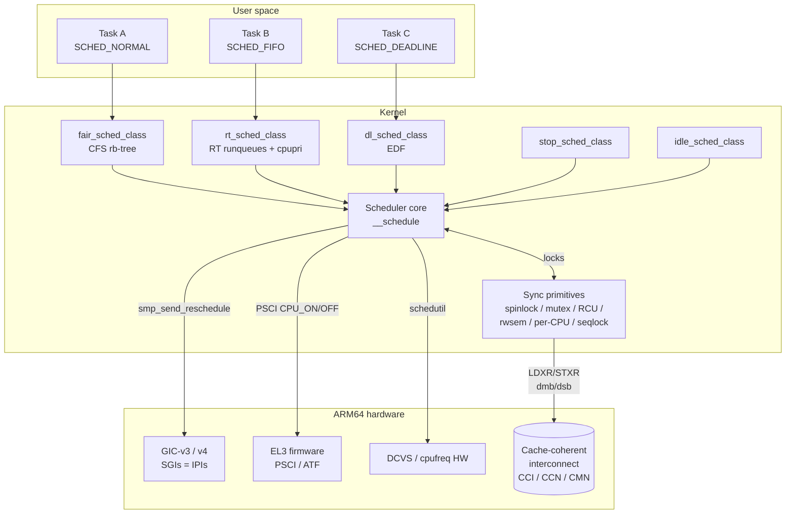
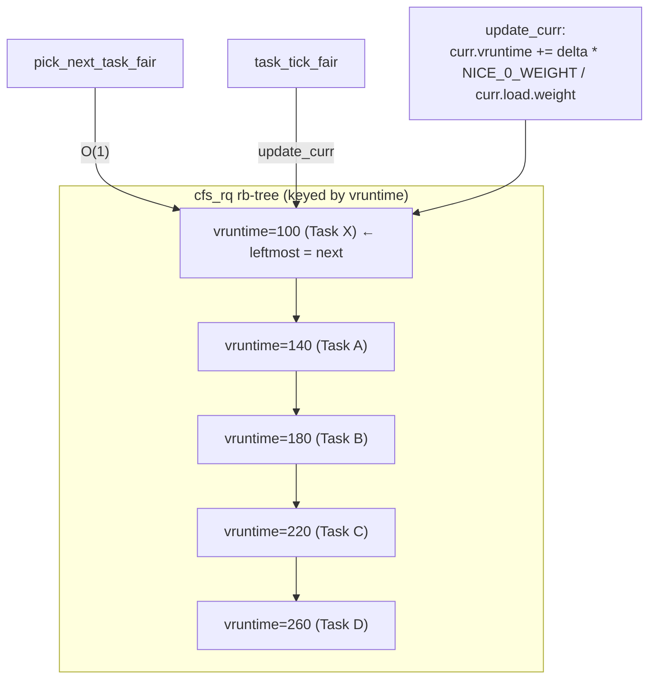
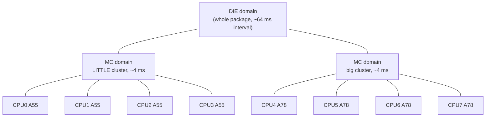
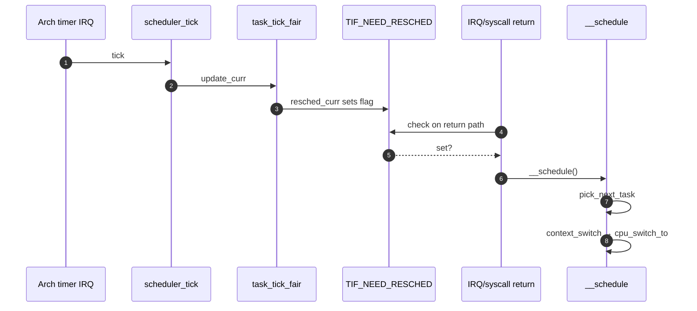
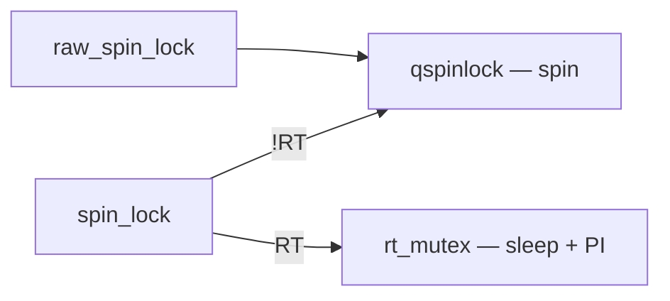
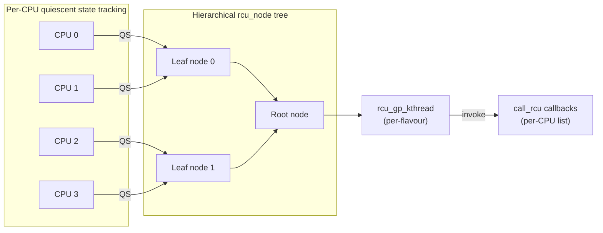
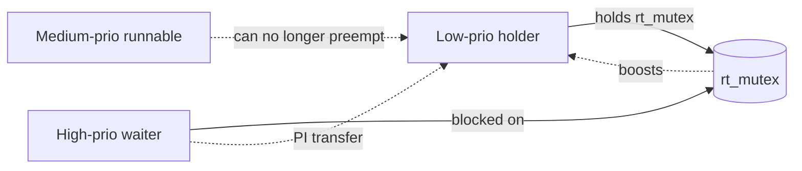

# Linux Scheduling & Synchronization on ARM/ARM64 — Consolidated Reference

> **Scope.** A single reference that fuses the Linux scheduler internals
> (classes, CFS, RT, SMP load balancing, EAS) with the kernel synchronization
> primitives (spinlocks, mutexes, rwsem, RCU, per-CPU, completions, seqlocks)
> as they apply to **ARMv8 / ARM64** SoCs (Qualcomm Snapdragon, i.MX8, etc.).
>
> This is Document 02 of the ARM Linux Kernel Knowledgebase. See §20 for
> cross-references and §21 for the four source files it was synthesized from.

---

## 1. Overview

The Linux kernel runs many concurrent agents on a single ARM SoC:

* CPU-bound and I/O-bound user threads (`SCHED_NORMAL` / CFS)
* Real-time threads (`SCHED_FIFO`, `SCHED_RR`, `SCHED_DEADLINE`)
* Kernel threads (`kworker`, `ksoftirqd`, `migration/N`, `rcu_*`)
* Hardware interrupt handlers and softirqs/tasklets
* The idle task (`swapper/N`) on every CPU

Two halves of the kernel keep this working:

| Half               | Role                                                                       |
| ------------------ | -------------------------------------------------------------------------- |
| **Scheduler**      | Decides *which* task runs *when* on *which* CPU. Picks, preempts, balances |
| **Synchronization**| Decides *how* concurrent agents share data without corruption or deadlock  |

On ARM/ARM64 the two are deeply intertwined:

* The scheduler context switch (`__switch_to` → `cpu_switch_to`) must be paired
  with a full memory barrier (`dmb ish` + `isb`) so the next task observes a
  consistent world.
* Spinlocks use `LDXR`/`STXR` (or LSE atomics like `CASAL`, `SWPAL`) — these
  same primitives form the foundation of `atomic_t`, `refcount_t`, RCU, etc.
* Preemption (`preempt_count`, `TIF_NEED_RESCHED`) interacts directly with
  every lock acquisition; a "scheduling while atomic" bug means a lock-holder
  was scheduled out while preemption was disabled.
* Big.LITTLE / DynamIQ adds *capacity asymmetry*: the same atomic operation
  costs different power on a Cortex-A510 vs a Cortex-X3.

### High-level mental model



---

## 2. Linux Scheduler Architecture

### 2.1 Scheduling classes

Scheduling in Linux is **class-based**. The classes form a singly-linked
priority chain; `pick_next_task()` walks them top-down:

```
stop_sched_class → dl_sched_class → rt_sched_class → fair_sched_class → idle_sched_class → NULL
```

| Class                | Source file        | Purpose                                                 |
| -------------------- | ------------------ | ------------------------------------------------------- |
| `stop_sched_class`   | `kernel/sched/stop_task.c` | Per-CPU `migration/N` — preempts everything, never preempted |
| `dl_sched_class`     | `kernel/sched/deadline.c`  | `SCHED_DEADLINE` (EDF/CBS), highest user-visible priority |
| `rt_sched_class`     | `kernel/sched/rt.c`        | `SCHED_FIFO`, `SCHED_RR`                                |
| `fair_sched_class`   | `kernel/sched/fair.c`      | CFS — `SCHED_NORMAL`, `SCHED_BATCH`, `SCHED_IDLE`       |
| `idle_sched_class`   | `kernel/sched/idle.c`      | Per-CPU `swapper/N` — only runs when nothing else is runnable |

Each class implements a vtable of methods (`enqueue_task`, `dequeue_task`,
`pick_next_task`, `task_tick`, `set_next_task`, `select_task_rq`, …) used by
the scheduler core.

### 2.2 `struct rq` — the per-CPU runqueue

There is exactly **one `struct rq` per CPU**. It embeds a sub-runqueue per
scheduling class:

```c
struct rq {
    raw_spinlock_t       lock;
    unsigned int         nr_running;
    u64                  clock, clock_task;

    struct cfs_rq        cfs;     /* CFS — rb-tree of sched_entity */
    struct rt_rq         rt;      /* RT  — 100 priority arrays */
    struct dl_rq         dl;      /* DL  — rb-tree by deadline */

    struct task_struct  *curr, *idle, *stop;

    int                  cpu;
    struct root_domain  *rd;      /* shared across CPUs in domain */
    struct sched_domain *sd;      /* lowest sched_domain */

    unsigned long        cpu_capacity;     /* big.LITTLE */
    unsigned long        cpu_capacity_orig;
    unsigned long        misfit_task_load; /* for big.LITTLE balance */

    /* PELT signals */
    struct sched_avg     avg_rt;
    struct sched_avg     avg_dl;
    struct sched_avg     avg_irq;
};
```

### 2.3 `task_struct` scheduling fields

```c
struct task_struct {
    /* ... */
    int                       prio, static_prio, normal_prio;
    unsigned int              rt_priority;
    const struct sched_class *sched_class;
    struct sched_entity       se;     /* CFS entity */
    struct sched_rt_entity    rt;
    struct sched_dl_entity    dl;
#ifdef CONFIG_CGROUP_SCHED
    struct task_group        *sched_task_group;
#endif
    cpumask_t                 cpus_mask;
    unsigned int              policy;       /* SCHED_NORMAL / FIFO / RR / ... */
    int                       on_cpu, on_rq;
    /* uclamp */
    struct uclamp_se          uclamp_req[UCLAMP_CNT];
    /* ... */
};
```

`sched_fork()` selects the class when a process is forked:

```c
} else if (rt_prio(p->prio)) {
    p->sched_class = &rt_sched_class;
} else {
    p->sched_class = &fair_sched_class;
}
```

### 2.4 POSIX scheduling policies

| Policy            | Class                | Comment                                           |
| ----------------- | -------------------- | ------------------------------------------------- |
| `SCHED_NORMAL`    | `fair_sched_class`   | Default; CFS-managed                              |
| `SCHED_BATCH`     | `fair_sched_class`   | CPU-bound, latency-insensitive                    |
| `SCHED_IDLE`      | `fair_sched_class`   | Very low priority, below nice 19                  |
| `SCHED_FIFO`      | `rt_sched_class`     | RT, no quantum; runs until it blocks or is preempted by higher-prio |
| `SCHED_RR`        | `rt_sched_class`     | Like FIFO + time slice (default 100 ms)           |
| `SCHED_DEADLINE`  | `dl_sched_class`     | EDF + Constant Bandwidth Server                   |

---

## 3. Completely Fair Scheduler (CFS)

### 3.1 Virtual runtime (`vruntime`)

CFS tracks each runnable task's **virtual runtime** in nanoseconds:
`p->se.vruntime`. The rule is dead simple:

> Always run the task with the **smallest** `vruntime`.

`vruntime` advances at a rate inversely proportional to weight (nice value).
A nice -20 task accumulates `vruntime` ~88× slower than nice +19 → it gets
~88× more CPU.

### 3.2 The red-black tree

All runnable CFS tasks live in a per-`cfs_rq` red-black tree keyed by
`vruntime`. The leftmost node is always the next to run, so
`pick_next_task_fair()` is **O(1)** in the common case (cached leftmost
pointer); enqueue/dequeue are O(log n).



### 3.3 `update_curr` and resched check

```c
static void update_curr(struct cfs_rq *cfs_rq)
{
    struct sched_entity *curr = cfs_rq->curr;
    u64 now = rq_clock_task(rq_of(cfs_rq));
    u64 delta_exec = now - curr->exec_start;

    curr->exec_start  = now;
    curr->sum_exec_runtime += delta_exec;
    curr->vruntime    += calc_delta_fair(delta_exec, curr);
    update_min_vruntime(cfs_rq);

    if (entity_is_task(curr)) {
        struct task_struct *p = task_of(curr);
        cgroup_account_cputime(p, delta_exec);
        account_cfs_rq_runtime(cfs_rq, delta_exec);
    }
}
```

### 3.4 PELT — Per-Entity Load Tracking

PELT records every task's utilization as an **exponentially decaying average**
sampled in 1 ms windows; half-life is ~32 ms.

```
util_avg = Σ ( contribution_i × decay^i ),   0 ≤ util_avg ≤ 1024
```

Per-entity signals:

* `se.avg.util_avg`  — utilization (used by EAS, schedutil)
* `se.avg.load_avg`  — load (weighted by nice)
* `se.avg.runnable_avg` — runnable time

Per-rq sums (`cfs_rq->avg.*`) drive CPU frequency selection (`schedutil`) and
energy-aware placement.

### 3.5 `pick_next_task_fair` (essence)

```c
struct task_struct *pick_next_task_fair(struct rq *rq, ...)
{
    struct cfs_rq *cfs_rq = &rq->cfs;
    struct sched_entity *se;

    if (!cfs_rq->nr_running)
        goto idle;

    do {
        se = pick_next_entity(cfs_rq, NULL);  /* leftmost */
        set_next_entity(cfs_rq, se);
        cfs_rq = group_cfs_rq(se);            /* hierarchical group sched */
    } while (cfs_rq);

    return task_of(se);
idle:
    return NULL;
}
```

---

## 4. Real-Time Scheduling

### 4.1 SCHED_FIFO and SCHED_RR

RT runqueues are **priority arrays** indexed 0..99 (kernel-internal priority).
`pick_next_task_rt()` finds the highest-prio non-empty bucket in O(1) using a
bitmap (`bitmap_find_first_bit`).

* **`SCHED_FIFO`**: no time slice. The task runs until it (a) blocks, (b)
  yields, or (c) is preempted by a higher-priority RT/DL/stop task.
* **`SCHED_RR`**: identical to FIFO but each task gets a quantum
  (`sched_rr_timeslice`, default 100 ms). On expiry it moves to the tail of
  its priority list.

### 4.2 SCHED_DEADLINE (EDF + CBS)

Each DL task declares `(runtime, deadline, period)`:

* Get `runtime` ns of CPU
* Within every `period` ns
* Before the relative `deadline`

The kernel runs **EDF** (Earliest Deadline First) using a per-rq rb-tree keyed
by absolute deadline, plus a **Constant Bandwidth Server (CBS)** to enforce
the declared runtime (preventing a buggy DL task from starving the system).
Admission control verifies total bandwidth ≤ `sched_dl_runtime_us /
sched_dl_period_us` (default 95%).

### 4.3 RT throttling

To stop a runaway RT task from starving the whole system, the kernel caps
total RT bandwidth:

```bash
# Allow at most 950 ms of RT per 1000 ms of wallclock (default 95%)
cat /proc/sys/kernel/sched_rt_period_us   # 1000000
cat /proc/sys/kernel/sched_rt_runtime_us  # 950000

# Disable RT throttling (dangerous):
echo -1 > /proc/sys/kernel/sched_rt_runtime_us
```

When the budget is exhausted, all RT tasks on that root domain are throttled
and CFS gets the remainder.

### 4.4 Priority table summary

| Priority value | Meaning                                                              |
| -------------- | -------------------------------------------------------------------- |
| `MAX_RT_PRIO` − 1 = 99 | Highest RT priority (user `chrt -f 99`)                      |
| `MAX_RT_PRIO` − 100 = 0 | Lowest RT priority                                          |
| 100 (`MAX_RT_PRIO`)    | CFS task with nice −20                                       |
| 120                    | CFS task with nice 0                                         |
| 139                    | CFS task with nice +19                                       |

---

## 5. SMP & Load Balancing

### 5.1 SMP boot on ARM64

Only CPU 0 runs at reset; all others sit in WFI or are powered down. The kernel
brings each secondary online via **PSCI** (`CPU_ON` SMC to EL3 firmware).

```
Boot timeline
=============
CPU 0:
  EL3 firmware (TF-A) → U-Boot/UEFI → head.S → start_kernel()
  → smp_init()
      cpu_up(1) → PSCI_CPU_ON → CPU 1 wakes at secondary_entry
      cpu_up(2) → PSCI_CPU_ON → CPU 2 wakes
      ...
CPU N (secondary):
  secondary_entry → __cpu_setup → secondary_start_kernel()
  → notify_cpu_starting() → set_cpu_online(N, true)
  → cpu_startup_entry(CPUHP_AP_ONLINE_IDLE) → do_idle() loop
```

```c
asmlinkage void secondary_start_kernel(void)
{
    struct rq *rq = this_rq();
    notify_cpu_starting(smp_processor_id());
    set_cpu_online(smp_processor_id(), true);
    cpu_startup_entry(CPUHP_AP_ONLINE_IDLE);  /* do_idle() forever */
}
```

### 5.2 CPU masks and affinity

| Mask                  | Meaning                                  |
| --------------------- | ---------------------------------------- |
| `cpu_possible_mask`   | CPUs that *could* exist (compile-time)   |
| `cpu_present_mask`    | CPUs physically present                  |
| `cpu_online_mask`     | CPUs currently online                    |
| `cpu_active_mask`     | CPUs accepting new tasks (sched is up)   |
| `task->cpus_mask`     | Per-task affinity (`sched_setaffinity`)  |

```bash
taskset -c 0-3 ./app   # restrict to LITTLE cluster
taskset -c 4-7 ./app   # restrict to big cluster
```

### 5.3 Scheduling domains and groups

Domains form a **hierarchy mirroring the topology**:



```c
struct sched_domain {
    struct sched_domain *parent;
    struct sched_domain *child;
    struct sched_group  *groups;       /* circular list */
    unsigned long min_interval, max_interval;
    unsigned int imbalance_pct;
    unsigned long flags;               /* SD_LOAD_BALANCE, SD_BALANCE_WAKE,
                                          SD_SHARE_PKG_RESOURCES,
                                          SD_ASYM_CPUCAPACITY, ... */
    enum sched_domain_level level;
};

struct sched_group {
    struct sched_group *next;
    unsigned int group_weight;
    struct sched_group_capacity *sgc;
    unsigned long cpumask[];
};
```

Inspect at runtime:

```bash
cat /proc/sys/kernel/sched_domain/cpu0/domain0/name        # MC
cat /proc/sys/kernel/sched_domain/cpu0/domain1/name        # DIE
cat /proc/sys/kernel/sched_domain/cpu0/domain0/flags
cat /proc/sys/kernel/sched_domain/cpu0/domain0/min_interval
```

### 5.4 When load balancing fires

| Trigger        | Mechanism                                       | Notes                                       |
| -------------- | ----------------------------------------------- | ------------------------------------------- |
| Periodic       | `scheduler_tick()` → `SCHED_SOFTIRQ` → `run_rebalance_domains()` | 4 ms (MC) up to 64 ms (DIE)               |
| Newly idle     | `newidle_balance()` on the way into `idle`      | Most effective — steal work right away      |
| Fork           | `wake_up_new_task()` → `select_task_rq_fork`    | Place new task on least-loaded CPU          |
| Exec           | `sched_exec()`                                  | After `execve()`, can rebalance             |
| Wake           | `try_to_wake_up()` → `select_task_rq_fair`      | Goes through EAS when enabled               |

### 5.5 `load_balance()` algorithm

1. **Find busiest group** in this domain — classify each group:
   `group_has_spare`, `group_fully_busy`, `group_misfit_task`,
   `group_asym_packing`, `group_imbalanced`, `group_overloaded`. Pick the
   worst.
2. **Find busiest CPU** inside that group.
3. **Migrate tasks** from busiest rq to `this_rq` via `detach_tasks()` →
   `attach_tasks()`, respecting affinity and cache-hotness.

### 5.6 Newidle balance

```c
static int newidle_balance(struct rq *this_rq, struct rq_flags *rf)
{
    int pulled_task = 0;

    if (this_rq->avg_idle < sysctl_sched_migration_cost)
        return 0;             /* too short — don't bother */

    for_each_domain(this_cpu, sd) {
        if (!(sd->flags & SD_LOAD_BALANCE))
            continue;
        pulled_task = load_balance(this_cpu, this_rq, sd,
                                   CPU_NEWLY_IDLE, &continue_balancing);
        if (pulled_task > 0)
            break;
    }
    return pulled_task;
}
```

### 5.7 Cache-hot heuristic

A task whose last execution was less than `sysctl_sched_migration_cost`
(default 500 µs) ago is treated as **cache-hot** and skipped. Within an MC
domain the L2 is shared (`SD_SHARE_PKG_RESOURCES`), so migration is cheap;
across DIE the L2s differ and migration is expensive.

### 5.8 Migration threads

Every CPU has a `migration/N` kernel thread in `stop_sched_class`. It is used
for **active migration of a currently-running task**, **CPU hotplug drain**,
and `stop_machine()`:

```
CPU 2 wants Task A (running on CPU 0):
  1. rq[0]->active_balance = 1
  2. CPU 2 sends IPI_RESCHEDULE to CPU 0
  3. migration/0 (stop class) preempts Task A
  4. migration/0 calls stop_one_cpu():
       dequeue A from rq[0], enqueue A on rq[2]
  5. Task A now runs on CPU 2
```

CPU hotplug:

```bash
echo 0 > /sys/devices/system/cpu/cpu3/online
# → cpu_down(3): drain timers/softirqs, migrate all tasks via migration/3,
#   then PSCI CPU_OFF → firmware powers down core
echo 1 > /sys/devices/system/cpu/cpu3/online
# → PSCI CPU_ON → secondary_start_kernel → rebuild sched domains
```

### 5.9 RT push / pull migration

CFS spreads load for *fairness*; RT migrates for *priority*. The invariant:
**the N highest-priority RT tasks must be running on N different CPUs.**

* **Push** (`enqueue_task_rt` path): the runqueue just got an RT task that
  can't preempt `curr` here — find a CPU running a lower-prio task via
  `cpupri` and push it there.
* **Pull** (`dequeue_task_rt` path): the rq's high-prio RT just left — check
  other CPUs for queued higher-prio RT and pull one over.

`cpupri` is an O(1) data structure indexed by priority level → bitmask of
CPUs running at that level, allowing constant-time selection of the lowest-
priority CPU.

### 5.10 IPIs for rescheduling

```c
/* arch/arm64/kernel/smp.c */
void smp_send_reschedule(int cpu)
{
    smp_cross_call(cpumask_of(cpu), IPI_RESCHEDULE);
}

enum ipi_msg_type {
    IPI_RESCHEDULE,        /* SGI 0 */
    IPI_CALL_FUNC,         /* SGI 1 */
    IPI_CPU_STOP,          /* SGI 2 */
    IPI_CPU_CRASH_STOP,
    IPI_TIMER,
    IPI_IRQ_WORK,
    NR_IPI
};
```

Observe IPIs:

```bash
cat /proc/interrupts | grep IPI
# IPI0: Rescheduling interrupts
# IPI1: Function call interrupts
```

### 5.11 big.LITTLE, capacity & EAS (summary)

Heterogeneous topology adds **CPU capacity** as a first-class scheduler
input. Each CPU has `capacity-dmips-mhz` in DT, normalized so the prime
core = 1024.

```dts
cpu0: cpu@0 {
    compatible = "arm,cortex-a55";
    enable-method = "psci";
    capacity-dmips-mhz = <1024>;        /* relative compute */
    dynamic-power-coefficient = <100>;
};
cpu4: cpu@400 {
    compatible = "arm,cortex-a78";
    enable-method = "psci";
    capacity-dmips-mhz = <3200>;
    dynamic-power-coefficient = <520>;
};

cpu-map {
    cluster0 { core0 { cpu = <&cpu0>; }; core1 { cpu = <&cpu1>; }; };
    cluster1 { core0 { cpu = <&cpu4>; }; core1 { cpu = <&cpu5>; }; };
};

psci { compatible = "arm,psci-1.0"; method = "smc"; };
```

**EAS** (Energy-Aware Scheduling) — called from
`select_task_rq_fair()` → `find_energy_efficient_cpu()` — picks the CPU
that minimizes **total system energy** using the Energy Model:

1. For each performance domain (cluster), find the CPU with most spare
   capacity that fits the task.
2. Compute system energy for each candidate.
3. Pick the lowest; **migrate only if savings > 6 %** (hysteresis).

EAS is active only when **all** are true:

* Energy Model registered for every performance domain.
* Asymmetric CPU capacities detected (`SD_ASYM_CPUCAPACITY` set).
* `schedutil` governor active.
* System is **not** overutilized (no CPU > ~80 %).

```c
static int find_energy_efficient_cpu(struct task_struct *p, int prev_cpu)
{
    struct root_domain *rd = cpu_rq(prev_cpu)->rd;
    unsigned long prev_delta = ULONG_MAX, best_delta = ULONG_MAX;
    int best_energy_cpu = prev_cpu;
    struct perf_domain *pd;

    for_each_pd(pd, rd) {
        unsigned long max_spare = 0;
        int max_spare_cpu = -1;

        for_each_cpu(cpu, perf_domain_span(pd)) {
            if (!cpumask_test_cpu(cpu, p->cpus_ptr))
                continue;
            unsigned long util  = cpu_util_next(cpu, p, cpu);
            unsigned long spare = capacity_of(cpu) - util;
            if (spare > max_spare) {
                max_spare     = spare;
                max_spare_cpu = cpu;
            }
        }
        if (max_spare_cpu < 0)
            continue;

        unsigned long cur_delta = compute_energy(p, max_spare_cpu, pd)
                                - base_energy(pd);
        if (cur_delta < best_delta) {
            best_delta      = cur_delta;
            best_energy_cpu = max_spare_cpu;
        }
        if (max_spare_cpu == prev_cpu)
            prev_delta = cur_delta;
    }

    if (prev_delta != ULONG_MAX &&
        (prev_delta - best_delta) * 100 < prev_delta * 6)
        return prev_cpu;   /* < 6 % gain — don't migrate */

    return best_energy_cpu;
}
```

#### Misfit detection

```c
/* task_tick_fair → check_for_misfit */
if (task_util(p) > capacity_of(cpu))
    rq->misfit_task_load = task_util(p);
else
    rq->misfit_task_load = 0;
```

`load_balance()` then sees `group_misfit_task` and migrates the offender to
a bigger CPU.

#### `uclamp` — utilization clamping

```c
struct sched_attr attr = {
    .size            = sizeof(attr),
    .sched_flags     = SCHED_FLAG_UTIL_CLAMP_MIN | SCHED_FLAG_UTIL_CLAMP_MAX,
    .sched_util_min  = 512,   /* floor — boost */
    .sched_util_max  = 800,   /* ceiling — cap */
};
syscall(SYS_sched_setattr, pid, &attr, 0);
```

```bash
echo 600 > /dev/cpuctl/top-app/cpu.uclamp.min
echo 200 > /dev/cpuctl/background/cpu.uclamp.max
```

#### Thermal pressure

When the thermal governor caps a CPU's max frequency,
`arch_set_thermal_pressure()` lowers the scheduler's view of capacity:

```c
static unsigned long capacity_of(int cpu)
{
    unsigned long cap = arch_scale_cpu_capacity(cpu);
    cap -= arch_scale_thermal_pressure(cpu);
    cap -= cpu_util_rt(cpu_rq(cpu));
    cap -= cpu_util_dl(cpu_rq(cpu));
    cap -= cpu_util_irq(cpu_rq(cpu));
    return cap;
}
```

---

## 6. Preemption Models

### 6.1 The four models

| Config             | Kernel preemptible while running kernel code?           | Latency  | Throughput |
| ------------------ | ------------------------------------------------------- | -------- | ---------- |
| `PREEMPT_NONE`     | No (only at explicit `cond_resched()` or sleep)         | Worst    | Best       |
| `PREEMPT_VOLUNTARY`| Like NONE + explicit `might_sleep()` reschedule points  | Better   | Good       |
| `PREEMPT` (low-lat)| Yes, except inside spin-locks / RCU / `preempt_disable`| Good     | Slightly less |
| `PREEMPT_RT`       | Yes — even most spinlocks become sleepable mutexes      | Best     | Lowest     |

User-space is always preemptible. The differences above concern *kernel*
code.

### 6.2 `preempt_count`

Per-CPU 32-bit counter encoding several fields:

```
[31]      PREEMPT_NEED_RESCHED  (mirror of TIF_NEED_RESCHED)
[30:24]   SOFTIRQ count (whether in softirq, BH-disabled)
[23:20]   HARDIRQ count (in hardirq)
[19:16]   NMI count
[15:0]    Preempt-disable nest count
```

`preempt_disable()` increments it; `preempt_enable()` decrements and, if it
reaches 0 and `TIF_NEED_RESCHED` is set, calls `preempt_schedule()`.

### 6.3 `TIF_NEED_RESCHED`

Bit in `thread_info->flags` (and mirrored into `preempt_count` bit 31 for
fast checks). Set by:

* `scheduler_tick()` → `task_tick_fair` → `resched_curr` when the running
  task has exceeded its slice.
* `try_to_wake_up()` when waking a higher-prio task.
* `set_user_nice`, RT push/pull, load balancer migration, etc.

```c
void resched_curr(struct rq *rq)
{
    /* ... */
    set_tsk_need_resched(rq->curr);     /* sets TIF_NEED_RESCHED */
    set_preempt_need_resched();
    /* may send IPI if target is on another CPU */
}
```

### 6.4 Tick path (how the flag gets set)

```
tick handler (arch timer IRQ)
  → tick_handle_periodic / tick_sched_timer
      → update_process_times(user_tick)
          → scheduler_tick()
              → curr->sched_class->task_tick(rq, curr, 0)
                  → task_tick_fair → entity_tick → update_curr
                      → if (slice exhausted) resched_curr(rq)
                          → set_tsk_need_resched(p)
```

### 6.5 Where the scheduler actually runs (entry points)

1. **Return to user-space** (syscall return / IRQ return): if
   `TIF_NEED_RESCHED` is set, call `schedule()`.
2. **Return from IRQ to kernel context** (only with `CONFIG_PREEMPT=y`): if
   `preempt_count == 0` and `TIF_NEED_RESCHED` is set, call
   `preempt_schedule_irq()`.
3. **Task blocks voluntarily** on a wait queue / mutex / completion:

   ```c
   DEFINE_WAIT(wait);
   add_wait_queue(q, &wait);
   while (!condition) {
       prepare_to_wait(q, &wait, TASK_INTERRUPTIBLE);
       if (signal_pending(current)) break;
       schedule();
   }
   finish_wait(q, &wait);
   ```

4. **Task is woken**: `wake_up()` → `try_to_wake_up()` → `ttwu_queue` →
   `ttwu_do_activate` → `activate_task` → `enqueue_task` →
   `p->sched_class->enqueue_task(rq, p, flags)`.



---

## 7. Context Switch on ARM64

### 7.1 The top of `__schedule`

```c
static void __sched notrace __schedule(unsigned int sched_mode)
{
    struct task_struct *prev, *next;
    struct rq *rq;
    int cpu;

    cpu  = smp_processor_id();
    rq   = cpu_rq(cpu);
    prev = rq->curr;

    rq_lock(rq, &rf);
    update_rq_clock(rq);

    next = pick_next_task(rq, prev, &rf);   /* class-by-class */
    clear_tsk_need_resched(prev);

    if (likely(prev != next)) {
        rq->nr_switches++;
        rq->curr = next;
        rq_unlock_irq(rq, &rf);
        rq = context_switch(rq, prev, next, &rf);   /* the actual switch */
    } else {
        rq_unlock_irq(rq, &rf);
    }
}
```

### 7.2 `context_switch` → `switch_mm` → `switch_to`

* `switch_mm()` — change `TTBR0_EL1` to next task's user page tables and
  bump ASID if needed. Lazy if next is a kernel thread.
* `switch_to()` (a macro) → `__switch_to(prev, next)` → asm
  `cpu_switch_to`.

### 7.3 `cpu_switch_to` (ARM64 assembly, simplified)

```asm
/* arch/arm64/kernel/entry.S — register save/restore for context switch */
SYM_FUNC_START(cpu_switch_to)
    mov     x10, #THREAD_CPU_CONTEXT     // offset into task_struct
    add     x8, x0, x10                  // &prev->thread.cpu_context
    mov     x9, sp
    stp     x19, x20, [x8], #16          // callee-saved: x19..x28
    stp     x21, x22, [x8], #16
    stp     x23, x24, [x8], #16
    stp     x25, x26, [x8], #16
    stp     x27, x28, [x8], #16
    stp     x29, x9,  [x8], #16          // FP, SP
    str     lr, [x8]                     // PC (return address)

    add     x8, x1, x10                  // &next->thread.cpu_context
    ldp     x19, x20, [x8], #16
    ldp     x21, x22, [x8], #16
    ldp     x23, x24, [x8], #16
    ldp     x25, x26, [x8], #16
    ldp     x27, x28, [x8], #16
    ldp     x29, x9,  [x8], #16
    ldr     lr, [x8]
    mov     sp, x9
    msr     sp_el0, x1                   // current = next
    ret
SYM_FUNC_END(cpu_switch_to)
```

Notes:

* Caller-saved regs (`x0`..`x18`) are on the stack already (this is a normal
  C call), so only **callee-saved** `x19..x29`, `LR`, `SP` need saving.
* `sp_el0` is used by the kernel as the per-CPU pointer to `current`
  (`__my_cpu_offset`/`current` reads it).
* `dmb ish` + `isb` are issued earlier in `switch_to` to order user memory
  accesses across the switch.

### 7.4 FPSIMD / SVE lazy save

FPSIMD state (`q0..q31`, `FPSR`, `FPCR`) is **not** saved by
`cpu_switch_to`. Instead:

* On switch, the kernel sets `TIF_FOREIGN_FPSTATE` on `next`.
* First FP/SIMD instruction by `next` traps via `el0_fpsimd_acc`.
* The trap handler restores `next`'s FPSIMD state and clears the flag.
* SVE/SME registers use the same lazy scheme via `TIF_SVE` / `TIF_SME`.

This avoids paying ~half a kilobyte of save/restore on every switch when
most threads don't touch FPSIMD between switches.

---

## 8. Timers, Tick & NOHZ

### 8.1 `HZ` and `jiffies`

* `CONFIG_HZ` chooses the periodic tick frequency (100 / 250 / 300 / 1000).
* `jiffies` is a `volatile unsigned long` incremented on every tick.
* `HZ=1000` on most distro kernels; `HZ=250` on Android/Qualcomm to save power.

### 8.2 `hrtimer` — high-resolution timers

* Backed by per-CPU clock event devices (ARM **arch_timer** —
  `CNTPCT_EL0`/`CNTVCT_EL0` and the per-CPU generic timer interrupt).
* One-shot programmable; nanosecond-resolution.
* Used by `nanosleep`, POSIX timers, `epoll_wait` timeouts, etc.
* `clockevents` infrastructure switches the CPU between **periodic** and
  **one-shot** modes.

### 8.3 NO_HZ modes

| Mode             | Behaviour                                                       |
| ---------------- | --------------------------------------------------------------- |
| `NO_HZ_IDLE`     | Tick is **stopped** when the CPU is idle — saves power          |
| `NO_HZ_FULL`     | Tick is stopped even when one CFS task is running, on listed CPUs |
| `HZ_PERIODIC`    | Tick always runs (legacy)                                       |

`NO_HZ_FULL` requires `nohz_full=` cmdline plus a housekeeping CPU to handle
timekeeping, unbound workqueues, RCU callbacks, etc. Heavy users: HPC,
DPDK/VPP, low-jitter audio.

---

## 9. Synchronization Primitives Overview

### 9.1 The two foundations: LL/SC and LSE atomics

All higher-level primitives (spinlocks, mutex fast paths, atomic_t,
refcount_t, RCU pointer updates) ultimately use either:

* **Load-Linked / Store-Conditional** (`LDXR` / `STXR`) — present on all
  ARMv8.0+ — or
* **LSE atomics** (`CAS`, `SWP`, `LDADD`, `STADD`, …) — ARMv8.1-A and later
  — which are single-instruction, more scalable under contention.

#### LDXR/STXR atomic-increment loop

```asm
// atomic_inc(volatile u32 *p)
1:  ldxr    w1, [x0]          // load-exclusive
    add     w1, w1, #1
    stxr    w2, w1, [x0]      // store-exclusive, w2 = 0 on success
    cbnz    w2, 1b            // retry if monitor lost
    dmb     ish               // ordering, if release semantics needed
```

#### LSE equivalent (ARMv8.1+)

```asm
    mov     w1, #1
    ldaddal w1, w2, [x0]      // *x0 += 1, w2 = old value, acq+rel
```

Build with `-march=armv8.1-a+lse` (or kernel `CONFIG_ARM64_LSE_ATOMICS=y`,
which uses runtime patching so the same kernel works on both v8.0 and v8.1+).

### 9.2 ARM64 memory barriers

| Instruction | Effect                                                                  |
| ----------- | ----------------------------------------------------------------------- |
| `dmb ishld` | Memory barrier, inner-shareable, load → load+store ordering             |
| `dmb ishst` | Inner-shareable, store → store                                          |
| `dmb ish`   | Full inner-shareable memory barrier                                     |
| `dmb sy`    | Full-system memory barrier                                              |
| `dsb ish`   | Synchronization: wait until all prior memory ops complete (inner-share) |
| `dsb sy`    | Same, full system; needed before TLBI/IC IVAU completion checks         |
| `isb`       | Instruction sync barrier — flush pipeline, re-fetch                     |

Kernel mappings:

| Kernel API                          | Maps to (ARM64)                                |
| ----------------------------------- | ---------------------------------------------- |
| `smp_mb()`                          | `dmb ish`                                      |
| `smp_rmb()` / `smp_wmb()`           | `dmb ishld` / `dmb ishst`                      |
| `smp_load_acquire(p)`               | `ldar` (acquire load)                          |
| `smp_store_release(p, v)`           | `stlr` (release store)                         |
| `mb()` (full)                       | `dsb sy`                                       |

> **Why this matters.** ARM has a *weak* memory model. Without explicit
> barriers, reads and writes can be reordered across CPUs even when single-
> thread program order is preserved. Spinlock release uses `stlr`; spinlock
> acquire uses `ldar`. This pairing is what gives you happens-before across
> a critical section.

---

## 10. Spinlocks

Spinlocks are the lowest-level mutual-exclusion primitive in the kernel.
They **never sleep**; the waiter spins.

### 10.1 Key characteristics

* Built from atomic ops (`LDXR`/`STXR` or LSE `CAS`).
* Cheap when uncontended; wastes CPU when contended.
* **Must not be held across anything that can sleep** (no `kmalloc(GFP_KERNEL)`,
  no `copy_from_user`, no `mutex_lock`).
* Single-CPU UP kernels compile spinlocks down to nothing more than
  `preempt_disable()`.

### 10.2 Linux kernel APIs

| API                              | Pair with                              | Use                                            |
| -------------------------------- | -------------------------------------- | ---------------------------------------------- |
| `spin_lock()`                    | `spin_unlock()`                        | Process context only                           |
| `spin_lock_bh()`                 | `spin_unlock_bh()`                     | Shared with softirq / tasklet                  |
| `spin_lock_irq()`                | `spin_unlock_irq()`                    | Shared with hardirq; IRQs were on              |
| `spin_lock_irqsave(&l, flags)`   | `spin_unlock_irqrestore(&l, flags)`    | Shared with hardirq; IRQs unknown — **default** |
| `spin_trylock()`                 | —                                      | Non-blocking attempt                           |
| `DEFINE_SPINLOCK(name)` / `spin_lock_init` | —                            | Static / runtime init                          |

```c
#include <linux/spinlock.h>

DEFINE_SPINLOCK(my_lock);

void writer(struct foo *f, int v)
{
    unsigned long flags;
    spin_lock_irqsave(&my_lock, flags);
    f->value = v;                       /* critical section */
    spin_unlock_irqrestore(&my_lock, flags);
}
```

### 10.3 Evolution: ticket lock → qspinlock

* **Original spinlock** (`raw_spinlock`): single word, test-and-set. Fair?
  No — unbounded "thundering herd" wakeups.
* **Ticket spinlock** (2008): two 16-bit halves (next, owner). Each waiter
  atomically increments `next`, then spins until `owner == my_ticket`.
  FIFO-fair but every waiter spins on the same cache line, generating
  massive coherency traffic.
* **qspinlock** (queued spinlock, 2014, today's default on SMP): waiters
  form a per-CPU MCS-style queue. Each waiter spins on its **own** cache
  line, releasing only the next waiter on unlock. O(1) coherency traffic
  per handoff.

#### qspinlock fast path

```c
/* Simplified — kernel/locking/qspinlock.c */
static __always_inline void queued_spin_lock(struct qspinlock *lock)
{
    u32 val = atomic_cmpxchg_acquire(&lock->val, 0, _Q_LOCKED_VAL);
    if (likely(val == 0))
        return;                              /* uncontended: done */
    queued_spin_lock_slowpath(lock, val);    /* enqueue & spin */
}

static __always_inline void queued_spin_unlock(struct qspinlock *lock)
{
    smp_store_release(&lock->locked, 0);     /* stlr on arm64 */
}
```

### 10.4 RT spinlocks (`PREEMPT_RT`)

Under `PREEMPT_RT`, `spinlock_t` is mapped onto an **rt_mutex** (sleeping
lock with priority inheritance). `raw_spinlock_t` keeps the classic
spin-don't-sleep semantics for code that truly cannot sleep (low-level
arch code, scheduler internals).



### 10.5 POSIX `pthread_spin_*` (user space)

| API                       | Note                          |
| ------------------------- | ----------------------------- |
| `pthread_spin_init`       | Set `PTHREAD_PROCESS_PRIVATE` or `_SHARED` |
| `pthread_spin_lock`       | Blocks (spins) until acquired |
| `pthread_spin_trylock`    | Returns `EBUSY` if held       |
| `pthread_spin_unlock`     | Release                       |
| `pthread_spin_destroy`    | Free                          |

User-space spinlocks are rarely the right answer outside of very specific
RT contexts — the kernel can preempt the spinner, ruining the whole point.

### 10.6 When to use a spinlock

| Use spinlock when…                                                                | Use mutex/sem when…                       |
| --------------------------------------------------------------------------------- | ----------------------------------------- |
| Critical section is **very short** (microseconds)                                 | Critical section may be long              |
| Must run in **interrupt context** (top-half or softirq sharing data with thread) | Sleeping is allowed                       |
| You're on **multi-core** (UP kernels just need `preempt_disable`)                 | High contention with long wait expected   |
| Hardware register access requiring atomic short windows                           | Need ownership / PI semantics             |

> **Qualcomm/ARM rule of thumb.** Always use `spin_lock_irqsave()` when the
> data is shared between an IRQ handler and process context.
> `spin_lock_bh()` is enough only when the only other accessor is a softirq.

---

## 11. Mutex

`struct mutex` is the standard sleeping mutual-exclusion primitive in the
kernel. Three-phase design:

1. **Fast path** — single atomic `cmpxchg` on `mutex->owner`. Zero overhead
   when uncontended.
2. **Mid path / optimistic spinning (OSQ)** — if the owner is currently
   running on another CPU, spin briefly (using an MCS-style queue, `osq_lock`)
   on the expectation it will release soon. Avoids a context switch.
3. **Slow path** — enqueue on `mutex->wait_list` and `schedule()` away.

```c
struct mutex {
    atomic_long_t           owner;        /* task_struct ptr | flags */
    spinlock_t              wait_lock;
    struct optimistic_spin_queue osq;     /* OSQ head */
    struct list_head        wait_list;
};

void mutex_lock(struct mutex *lock);          /* uninterruptible sleep */
int  mutex_lock_interruptible(struct mutex *lock);  /* may return -EINTR */
int  mutex_trylock(struct mutex *lock);             /* non-blocking */
void mutex_unlock(struct mutex *lock);

DEFINE_MUTEX(my_mutex);
mutex_init(&dyn_mutex);
```

Key properties:

* **Single owner** — only the locker may unlock (debug builds enforce).
* **Cannot be used in IRQ context** — would-be sleeper.
* **Lockdep-tracked** — order is recorded; cycles flagged immediately.

When NOT to use:

* IRQ/softirq handlers.
* Anything held across `schedule()` deliberately (use `wait_event`).
* Code that needs reader/writer concurrency (use `rwsem`).

---

## 12. Semaphores & rwsem

### 12.1 Counting / binary semaphores

Older primitive than `mutex`. **No ownership** — any task can `up()` what
another `down()`ed. Useful for resource counting and one-side-only signaling.

| API                            | Note                                           |
| ------------------------------ | ---------------------------------------------- |
| `DEFINE_SEMAPHORE(name)`       | Static init, count = 1                         |
| `sema_init(&sem, n)`           | Runtime init with count `n`                    |
| `down(&sem)`                   | Uninterruptible sleep                          |
| `down_interruptible(&sem)`     | Signal-aware; returns `-EINTR`                 |
| `down_killable(&sem)`          | Wakes on fatal signals only                    |
| `down_trylock(&sem)`           | Non-blocking; returns non-zero on failure      |
| `down_timeout(&sem, jiffies)`  | Bounded wait                                   |
| `up(&sem)`                     | Increment; wakes one waiter                    |

For mutual exclusion in new code prefer `struct mutex`. Reserve semaphores
for true counting use cases (resource pools, ring buffer slot counts).

### 12.2 `rwsem` — reader/writer semaphore

`struct rw_semaphore` lets many readers run concurrently or one writer.

```c
DECLARE_RWSEM(my_rwsem);

down_read(&my_rwsem);    /* shared */
... read shared state ...
up_read(&my_rwsem);

down_write(&my_rwsem);   /* exclusive */
... mutate ...
up_write(&my_rwsem);

down_read_trylock(&my_rwsem);
downgrade_write(&my_rwsem);   /* writer → reader without releasing */
```

* Implemented on top of an atomic counter with a wait list.
* Writers have **priority** to prevent reader starvation.
* Supports optimistic spinning, like `mutex`.
* Used heavily for `mm->mmap_lock`, VFS inode locks, cgroup hierarchy.

### 12.3 POSIX user-space semaphores

| Form                          | API summary                                                   |
| ----------------------------- | ------------------------------------------------------------- |
| **Unnamed**                   | `sem_init`, `sem_wait`, `sem_post`, `sem_trywait`, `sem_destroy` |
| **Named** (cross-process)     | `sem_open("/name", ...)`, `sem_close`, `sem_unlink`           |
| **Timed wait**                | `sem_timedwait` (returns `ETIMEDOUT`)                         |

Classic producer / consumer:

```c
#include <semaphore.h>
#include <pthread.h>

#define N 10
sem_t slots, items;
int   buf[N];
int   in = 0, out = 0;

void *producer(void *_)
{
    for (int i = 0; i < 20; i++) {
        int v = produce_item();
        sem_wait(&slots);
        buf[in] = v;
        in = (in + 1) % N;
        sem_post(&items);
    }
    return NULL;
}

void *consumer(void *_)
{
    for (int i = 0; i < 20; i++) {
        sem_wait(&items);
        int v = buf[out];
        out = (out + 1) % N;
        sem_post(&slots);
        consume_item(v);
    }
    return NULL;
}

int main(void)
{
    sem_init(&slots, 0, N);
    sem_init(&items, 0, 0);
    pthread_t p, c;
    pthread_create(&p, NULL, producer, NULL);
    pthread_create(&c, NULL, consumer, NULL);
    pthread_join(p, NULL); pthread_join(c, NULL);
    sem_destroy(&slots); sem_destroy(&items);
}
```

### 12.4 Quick comparison

| Feature           | Spinlock     | Mutex          | Semaphore        | rwsem               |
| ----------------- | ------------ | -------------- | ---------------- | ------------------- |
| Waiter behaviour  | Spins        | Sleeps         | Sleeps           | Sleeps              |
| Ownership         | None         | Single owner   | None             | None (write owner)  |
| Sleepable context | No           | Yes            | Yes              | Yes                 |
| Multiple holders  | No           | No             | Up to count      | Many readers / 1 writer |
| Typical hold time | µs           | µs–ms          | varies           | varies              |
| IRQ context OK    | Yes (variant)| No             | No               | No                  |

---

## 13. RCU — Read-Copy-Update

RCU lets readers traverse data structures with **zero locking and zero
atomic operations** in the common case. Writers update by publishing a new
copy and waiting for a **grace period** before freeing the old one.

### 13.1 The contract

* **Readers** mark their critical sections with `rcu_read_lock()` /
  `rcu_read_unlock()` (which, in classic RCU on non-PREEMPT, are no-ops
  beyond a compiler barrier and `preempt_disable`).
* **Writers** publish updates with `rcu_assign_pointer()` (a `smp_store_release`
  ordering store) and reclaim old memory after `synchronize_rcu()` returns
  (or asynchronously via `call_rcu()`).
* A **grace period** ends only when **every** CPU has passed through a
  *quiescent state* (context switch, idle, user-space). At that point, no
  pre-existing reader can hold a reference to the old object.

### 13.2 Read side

```c
struct config *c;

rcu_read_lock();
c = rcu_dereference(global_cfg);     /* consume-style load */
use(c->field_a, c->field_b);
rcu_read_unlock();
```

* On ARM64 in classic RCU, `rcu_read_lock()` ≈ `preempt_disable()`.
* On `PREEMPT_RCU` (Tree-RCU with preemption), readers may be preempted but
  still mark the critical section.

### 13.3 Update side

```c
struct config *old, *neu;

neu = kmalloc(sizeof(*neu), GFP_KERNEL);
*neu = *old_copy;
neu->field_a = NEW_VAL;

spin_lock(&cfg_lock);
old = rcu_dereference_protected(global_cfg, lockdep_is_held(&cfg_lock));
rcu_assign_pointer(global_cfg, neu);
spin_unlock(&cfg_lock);

synchronize_rcu();      /* wait for all pre-existing readers to finish */
kfree(old);
```

Or, the async pattern:

```c
struct foo {
    int                data;
    struct rcu_head    rcu;
};

static void free_foo(struct rcu_head *h)
{
    struct foo *f = container_of(h, struct foo, rcu);
    kfree(f);
}

call_rcu(&old->rcu, free_foo);  /* returns immediately; freed after GP */
```

### 13.4 Flavours

| Flavour       | Reader cost                | When to use                                       |
| ------------- | -------------------------- | ------------------------------------------------- |
| **Classic / Tree RCU** | preempt_disable + ptr load | Default, hot read paths                          |
| **SRCU** (Sleepable RCU) | per-domain counter         | Readers that may sleep (`mutex_lock`, I/O)        |
| **Tasks RCU** | nothing                    | Tracepoints / kprobes — waits for every task to block or run user code |
| **Tasks Trace RCU** | minimal                    | BPF trampolines                                   |

### 13.5 Grace period machinery (tree RCU)



On ARM64, grace-period progress also relies on `IPI_CALL_FUNC` and timer
interrupts to nudge idle/userspace CPUs that haven't recorded a QS.

### 13.6 When to use RCU

* Read-mostly data: routing tables, IDR/IDA, security policies, /proc
  enumeration, dentry/inode lookups.
* Lists / trees / hash tables modified rarely but read constantly.
* Anywhere the lock acquisition itself would be the bottleneck.

When **not** to use RCU:

* Write-heavy workloads.
* Data that fits naturally in a single atomic word (`atomic_t`).
* Cases where readers need to *block* updates (use `rwsem`).

---

## 14. Per-CPU Variables, `this_cpu_*`, `local_lock`

### 14.1 Per-CPU variables

Each CPU gets its own copy of the variable, eliminating cache-line
contention for purely-local counters and state.

```c
#include <linux/percpu.h>

DEFINE_PER_CPU(unsigned long, my_counter);

void hit(void)
{
    this_cpu_inc(my_counter);          /* atomic w.r.t. preemption */
}

unsigned long sum(void)
{
    unsigned long s = 0;
    int cpu;
    for_each_possible_cpu(cpu)
        s += per_cpu(my_counter, cpu);
    return s;
}
```

Dynamic allocation:

```c
unsigned long __percpu *p = alloc_percpu(unsigned long);
this_cpu_inc(*p);
free_percpu(p);
```

### 14.2 `this_cpu_*` accessors

Use `this_cpu_read/write/add/inc/cmpxchg` etc. These compile to a single
instruction on ARM64 (offset from per-CPU base in `tpidr_el1`) and are safe
against **preemption between the load and store**, but **not** against
interrupts on architectures that need a read-modify-write sequence
— use `local_irq_save` if the IRQ handler also touches the variable.

### 14.3 `local_lock` (PREEMPT_RT-friendly)

```c
struct local_lock {
    /* opaque */
};
DEFINE_PER_CPU(local_lock_t, my_lock) = INIT_LOCAL_LOCK(my_lock);

local_lock(&my_lock);          /* preempt_disable on !RT; sleeping lock on RT */
__this_cpu_inc(my_counter);
local_unlock(&my_lock);
```

`local_lock` exists because under `PREEMPT_RT`, plain `preempt_disable()`
is undesirable; the abstraction becomes a per-CPU sleeping lock on RT and
a no-op (just preempt-disable) on a server kernel.

---

## 15. Completions, Wait Queues

### 15.1 Wait queues

The primary "wait for a condition" mechanism. Producer side wakes; consumer
side sleeps in a clean, signal-safe loop.

```c
static DECLARE_WAIT_QUEUE_HEAD(my_wq);
static bool ready;

/* Producer */
ready = true;
smp_wmb();
wake_up_interruptible(&my_wq);

/* Consumer */
int err = wait_event_interruptible(my_wq, READ_ONCE(ready));
if (err == -ERESTARTSYS)
    return err;     /* signal */
```

| Variant                                  | Behaviour                          |
| ---------------------------------------- | ---------------------------------- |
| `wait_event(wq, cond)`                   | Uninterruptible                    |
| `wait_event_interruptible(wq, cond)`     | Returns `-ERESTARTSYS` on signal   |
| `wait_event_timeout(wq, cond, jiffies)`  | Returns remaining jiffies / 0      |
| `wait_event_killable(wq, cond)`          | Fatal signals only                 |

### 15.2 Completion variables

A specialised, one-shot wait built on top of wait queues. Common for "wait
for this async operation to finish".

```c
DECLARE_COMPLETION(done);

/* Worker thread */
do_work();
complete(&done);             /* wake one waiter */
/* or complete_all(&done) — wake everyone, leaves it 'done' */

/* Caller */
wait_for_completion(&done);
/* or: wait_for_completion_timeout(&done, msecs_to_jiffies(500)); */
```

Use for kthread startup handshakes, DMA-completion notifications, and
"queue work, wait for it" sequences.

---

## 16. Seqlock & Seqcount

When readers are extremely hot and writers extremely rare, use a **seqlock**:
readers retry if a writer started during their read; they never block.

```c
seqlock_t s = __SEQLOCK_UNLOCKED(s);

/* Reader */
unsigned seq;
do {
    seq = read_seqbegin(&s);
    a = shared.a;
    b = shared.b;
} while (read_seqretry(&s, seq));

/* Writer */
write_seqlock(&s);
shared.a = ...;
shared.b = ...;
write_sequnlock(&s);
```

* Writer increments a sequence counter to odd, mutates, increments to even.
* Reader samples the counter before & after; if it changed or was odd, retry.
* `seqcount_t` is the lockless counter half (writer protected by some other
  lock).
* Heavy use: `jiffies_64`, monotonic time (`getnstimeofday`), some VFS paths.

Caveats:

* Readers **must** be side-effect-free until validated (no commit until
  `read_seqretry` passes).
* On ARM64, requires the right barriers — the kernel API hides them.

---

## 17. Lock Debugging

### 17.1 `lockdep`

The kernel's runtime deadlock detector.

* Records every lock acquisition order it has ever seen.
* Builds a directed graph of "lock A acquired while holding B".
* Detects cycles (potential ABBA deadlocks) **before** the deadlock occurs,
  often with a single test run.
* Catches misuses: IRQ-unsafe lock taken in IRQ context, recursive
  non-recursive lock, sleeping in atomic context, etc.

Enable:

```bash
CONFIG_PROVE_LOCKING=y
CONFIG_DEBUG_LOCK_ALLOC=y
CONFIG_LOCK_STAT=y          # /proc/lock_stat
CONFIG_DEBUG_LOCKDEP=y
CONFIG_DEBUG_ATOMIC_SLEEP=y # "BUG: sleeping function called from invalid context"
```

Look for:

```bash
dmesg | grep -iE "possible deadlock|inconsistent lock state|scheduling while atomic"
```

### 17.2 "Scheduling while atomic"

Triggered when `schedule()` runs with `preempt_count > 0` or IRQs disabled:

* Sleeping function called while holding a `spinlock_t`.
* `mutex_lock()` inside `spin_lock()`.
* `kmalloc(GFP_KERNEL)` inside a spin-locked region.
* RCU read-side critical section calling something that may sleep.

### 17.3 `KCSAN`, `KASAN`, `UBSAN`

Beyond lockdep, the kernel ships several sanitizers:

| Sanitizer | Finds                                                              |
| --------- | ------------------------------------------------------------------ |
| **KCSAN** | Data races (concurrent accesses without proper synchronization)    |
| **KASAN** | Use-after-free, out-of-bounds, including after RCU reclaim         |
| **UBSAN** | Undefined behaviour (signed overflow, mis-aligned, shift-by-width) |

Enable in development builds; expect 30–50 % overhead.

---

## 18. Priority Inversion & Inheritance

### 18.1 The problem

```
Time →
H (high prio)                    [---wants L's mutex---][run]
M (medium)            [run-run-run-run-run-run-run-run]
L (low)   [holds mutex--][preempted by M-----------]
```

`M` indefinitely preempts `L`, so `L` can't release the mutex, so `H`
starves on `L`. Classic Mars Pathfinder bug.

### 18.2 Solution: Priority Inheritance (PI)

When `H` blocks on `L`'s mutex, the kernel temporarily **boosts `L` to
`H`'s priority** until it releases the mutex. `M` can no longer preempt
`L`, so `L` runs promptly, releases, `H` proceeds, `L` returns to its
original priority.

In the kernel, `struct rt_mutex` implements PI:

* RT-class lock with priority inheritance.
* Used internally by `PREEMPT_RT` for `spinlock_t`/`rwlock_t`.
* Backs **PI-futexes** (`FUTEX_LOCK_PI`/`FUTEX_UNLOCK_PI`) for user space.

User space:

```c
pthread_mutexattr_t a;
pthread_mutexattr_init(&a);
pthread_mutexattr_setprotocol(&a, PTHREAD_PRIO_INHERIT);
pthread_mutex_init(&m, &a);
```



### 18.3 Other techniques

* **Priority ceiling protocol** — every lock has a static priority equal to
  the highest priority of any task that may take it; holder is boosted
  unconditionally. Used in some RTOSes; not standard in Linux.
* **Disable preemption** around the critical section — works for very short
  windows but ruins latency.

---

## 19. Common Pitfalls & Debugging

### 19.1 Deadlock — the four Coffman conditions

| # | Condition          | Description                                          | How to break               |
| - | ------------------ | ---------------------------------------------------- | -------------------------- |
| 1 | Mutual exclusion   | One holder at a time                                 | Use lock-free / atomics    |
| 2 | Hold and wait      | Holder waits for another lock                        | Try-lock, two-phase locking |
| 3 | No preemption      | Locks can't be forcibly taken                        | Timeouts, watchdog kill    |
| 4 | Circular wait      | A→B→C→A                                              | **Global lock ordering**   |

### 19.2 The seven prevention strategies

| Strategy             | Breaks   | Notes                                  |
| -------------------- | -------- | -------------------------------------- |
| Lock ordering        | Circular | The standard kernel approach           |
| Lock timeout         | Hold/wait| Distributed systems; risks livelock    |
| Try-lock + back-off  | Hold/wait| Interactive; risks livelock            |
| Lock-free / CAS      | Mutex    | Hard to get right (ABA, retry storms)  |
| Single global lock   | Circular | Simple; throughput killer              |
| Banker's algorithm   | Hold/wait| O(n²) per request; not used in kernel  |
| Two-phase locking    | Hold/wait| Acquire all up front, release later    |

### 19.3 Lock ordering example

```c
DEFINE_SPINLOCK(lock_A);   /* level 1 */
DEFINE_SPINLOCK(lock_B);   /* level 2 */
DEFINE_SPINLOCK(lock_C);   /* level 3 */

/* CORRECT — always acquire in ascending order, release reverse */
void do_thing(void)
{
    spin_lock(&lock_A);
    spin_lock(&lock_B);
    spin_lock(&lock_C);
    work();
    spin_unlock(&lock_C);
    spin_unlock(&lock_B);
    spin_unlock(&lock_A);
}

/* WRONG — thread T1: A then B, thread T2: B then A → ABBA deadlock */
```

### 19.4 Try-lock + back-off (when ordering is impossible)

```c
while (1) {
    pthread_mutex_lock(&A);
    if (pthread_mutex_trylock(&B) == 0)
        break;
    pthread_mutex_unlock(&A);
    usleep(rand() % 5000);
}
critical_section();
pthread_mutex_unlock(&B);
pthread_mutex_unlock(&A);
```

### 19.5 Common scenarios to avoid

| Scenario                              | Cure                                                   |
| ------------------------------------- | ------------------------------------------------------ |
| IRQ vs thread sharing a `spin_lock`   | Use `spin_lock_irqsave` in the thread path             |
| Callback invoked with caller's lock   | Document held-locks; do not call into unknown code     |
| `kmalloc(GFP_KERNEL)` while locked    | Pre-allocate, or use `GFP_ATOMIC` (limited supply!)    |
| Recursive entry on non-recursive lock | Restructure; never use recursive mutex as a shortcut   |
| Same lock used by IRQ and softirq     | `spin_lock_irq` (not `_bh`)                            |
| Sleeping under RCU read-lock          | Use SRCU or restructure                                |
| Mutex held across long latency op     | Drop lock, retry, or use rwsem                         |

### 19.6 Scheduler/sync interaction bugs

* **"BUG: scheduling while atomic"** — `schedule()` called with non-zero
  `preempt_count` or IRQs off. Almost always a missing `spin_unlock` or a
  sleeping call inside a spinlock.
* **Soft lockup** — a single CPU spent >20 s in kernel mode without
  scheduling. Often a buggy loop holding a spinlock, or an RT task storm.
* **RCU CPU stall** — a CPU did not record a quiescent state for >21 s.
  Caused by infinite loops in kernel context, or a hung CPU on which
  `IPI_CALL_FUNC` is being missed.
* **Lockdep "possible deadlock"** — investigate immediately; it almost
  always reflects a real bug, even if it hasn't manifested yet.

### 19.7 ARM-specific gotchas

* **Forgetting `dmb` between a shared-memory write and `sem_post`/release.**
  ARM is weakly ordered; writes can be globally reordered. Use
  `smp_store_release` / `smp_load_acquire` whenever possible.
* **Self-modifying code without `isb`.** After patching instructions, you
  need `dsb ish` + `ic ivau` + `dsb ish` + `isb` before executing.
* **TLB invalidation order.** After updating a PTE, use the
  `tlb_flush_*` helpers — they encode the right `dsb ish; tlbi; dsb ish;
  isb` dance.
* **`smp_mb__before_atomic` / `_after_atomic`** — needed around
  `atomic_*` ops whose return value you don't read, because the bare
  `atomic_inc` does **not** imply a full barrier on ARM64.

---

## 20. Cross-References

| Topic                                     | See document                                |
| ----------------------------------------- | ------------------------------------------- |
| ARM/ARM64 MMU, page tables, ASIDs         | `01_ARM_ARM64_Memory_Management.md` (parts 1–5) |
| Interrupts, GIC, IPI flow, watchdog       | `03_Interrupts_IPI_and_Watchdog.md`         |
| Drivers, DT, /proc, /sys, syscalls        | `04_Linux_Drivers_DT_proc_sysfs_Syscalls.md` |
| Kernel panic and crash-dump analysis      | `_raw_text/Crash_Dump_Analysis_Guide_Part1..3.md`, `Part1_KernelPanic_QualcommWatchdog.md` |
| Hibernation, boot optimization            | `_raw_text/Hibernation_and_Boot_Optimization_Doc3.md` |
| IPC and shared memory (deep dive)         | `_raw_text/linux_sync_part2.md` §3 (Shared-memory architecture, ACE/MESI) |
| Qualcomm boot flow (PSCI, EL3 → kernel)   | `_raw_text/Part1_KernelPanic_QualcommWatchdog.md`, `Qualcomm_Boot_Flow_Doc1_Power_On_to_Kernel.md` |

Specifically inside this document:

* §3 CFS feeds §5 (load balance uses PELT).
* §6 Preemption is what makes §7 context switch fire on return paths.
* §9 LDXR/STXR + barriers underpin §10–§16 (every higher-level primitive).
* §13 RCU grace periods depend on §6 (quiescent states recorded at
  context switch / idle / user-mode return).
* §18 PI is the bridge between §4 (RT scheduling) and §11 (mutex semantics).

---

## 21. Further Reading

Source files this document was synthesized from (all under
`ARM_Linux_Kernel_Knowledgebase/_raw_text/`):

1. `Linux_Scheduling_Internals.md` — Scheduler classes, `task_struct`,
   CFS basics, runqueues, `TIF_NEED_RESCHED`, scheduler entry points.
2. `ARM_Kernel_Scheduling_Part2.md` — SMP boot on ARM, PSCI, CPU affinity,
   scheduling domains/groups, load balancing, migration threads, RT
   push/pull, IPI, big.LITTLE/DynamIQ, CPU capacity, schedutil, PELT,
   Energy Model, EAS, uclamp, thermal pressure.
3. `linux_sync_part1.md` — Spinlock APIs (kernel + POSIX), semaphores
   (kernel + POSIX, producer/consumer), deadlock prevention strategies,
   lockdep configuration, ARM/embedded best practices.
4. `linux_sync_part2.md` — IPC mechanism survey, memory-mapped files,
   POSIX/SysV shared memory internals, ARM64 page-table walk for shared
   memory, kernel data-structure chain
   (`ipc_namespace`→`shmid_kernel`→`shmfs file`→`address_space`→`struct page`),
   per-process VMA layout, multi-core cache coherency (ACE/CHI, MESI),
   ARM memory-barrier reference.

External canonical references:

* *Linux Kernel Development*, Robert Love (3rd ed.) — chapters on scheduling,
  synchronization, and the SLAB allocator.
* *Understanding the Linux Kernel*, Bovet & Cesati — process scheduling and
  kernel synchronization chapters.
* `Documentation/scheduler/*.rst` in the Linux source tree
  (`sched-design-CFS.rst`, `sched-rt-group.rst`, `sched-deadline.rst`,
  `sched-energy.rst`).
* `Documentation/locking/*.rst` — `spinlocks.rst`, `mutex-design.rst`,
  `lockdep-design.rst`, `seqlock.rst`, `rt-mutex.rst`.
* `Documentation/RCU/*.rst` — `whatisRCU.rst`, `RTFP.txt`, Paul McKenney's
  RCU papers.
* ARM Architecture Reference Manual for ARMv8-A, sections B2 (memory model),
  K12 (Barriers), and the Generic Timer / GIC architecture specs.
