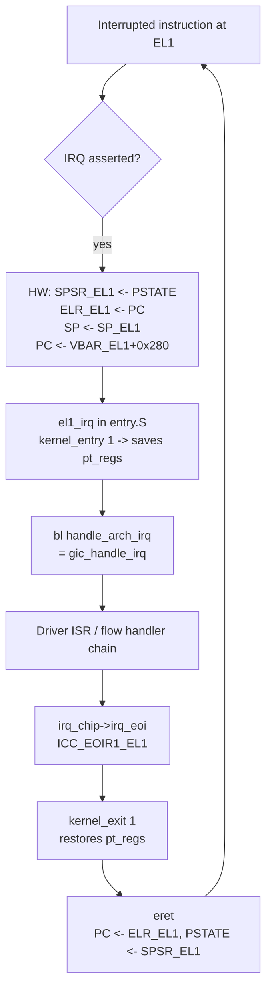
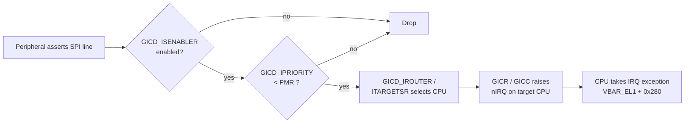
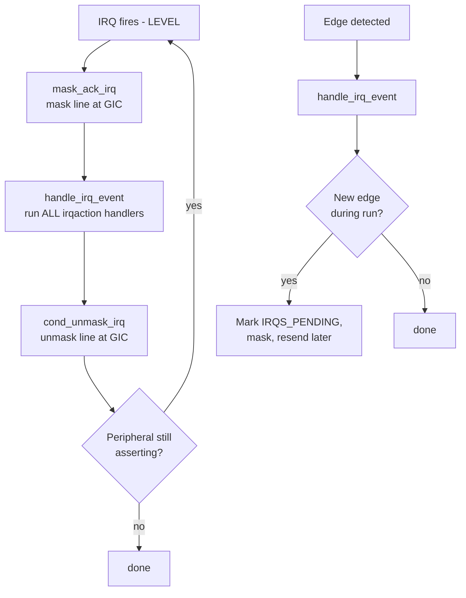
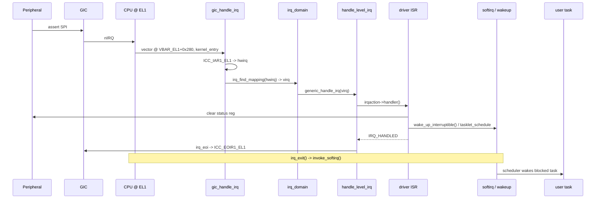
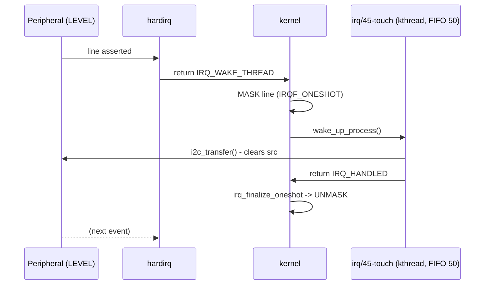
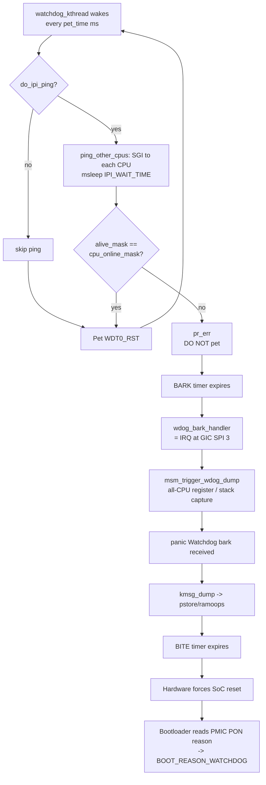
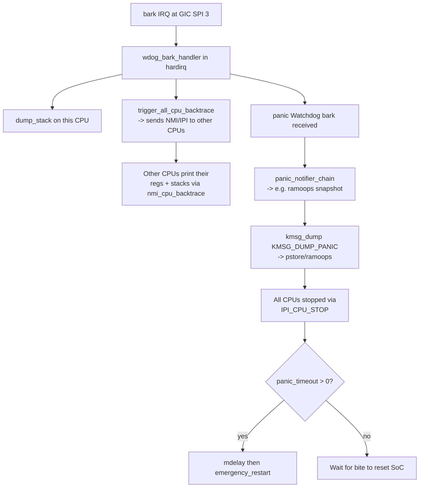

# ARM Interrupts, IPIs & Watchdog Subsystem — Consolidated Reference

> Consolidated technical reference covering the ARM (AArch64) exception model,
> the Generic Interrupt Controller (GIC v2/v3/v4), the Linux IRQ subsystem
> (`irq_desc`, `irq_chip`, `irq_domain`), top-half / bottom-half splits, IPIs,
> interrupt preemption, interrupt storms, the Linux watchdog framework, and
> the Qualcomm APSS / AOSS / TZ watchdog stack, with the full bark → panic →
> bite reset cascade.

---

## 1. Overview

Interrupts are the mechanism by which the CPU is notified of asynchronous
events without polling. On modern ARM SoCs the picture has several layers:

1. **Hardware peripheral** asserts an interrupt line (level or edge).
2. **GIC distributor** decides whether the interrupt is enabled, what its
   priority is, and which CPU(s) should receive it.
3. **CPU core** takes an exception (IRQ or FIQ), jumps through the vector
   table at `VBAR_EL1`, and switches to EL1.
4. **Linux IRQ subsystem** translates the hardware IRQ number (`hwirq`) into
   a Linux virtual IRQ (`virq`) via `irq_domain`, then dispatches via the
   flow handler (`handle_level_irq`, `handle_edge_irq`, …) to the registered
   `irqaction` chain.
5. **Driver ISR (top half)** runs in hardirq context with strict latency and
   sleep constraints. It typically defers heavier work to a **bottom half**
   (softirq, tasklet, workqueue, or threaded IRQ).
6. **Inter-Processor Interrupts (IPIs)** are special interrupts (SGIs on the
   GIC, IDs 0–15) used for SMP coordination — reschedule, function-call,
   CPU stop, timer broadcast, and the Qualcomm watchdog liveness ping.
7. **Watchdog subsystems** (hardware APSS WDT, TZ/AOSS WDT, Linux softdog,
   softlockup / hardlockup detectors) catch the situation where a CPU stops
   making forward progress and force a panic + post-mortem dump + reset.

This document focuses on the ARM64 path, but flags ARM32 differences where
relevant.

---

## 2. ARM Exception Model (AArch64)

### 2.1 Exception Levels

ARMv8/ARMv9 replaces ARM32 processor *modes* with four **Exception Levels**:

| EL  | Purpose                                |
| --- | -------------------------------------- |
| EL0 | User space                             |
| EL1 | Kernel (Linux)                         |
| EL2 | Hypervisor (KVM)                       |
| EL3 | Secure Monitor / TrustZone (QSEE/ATF)  |

IRQs and FIQs taken while the kernel is running are taken at **EL1**.

### 2.2 Hardware-saved state on exception entry

When an exception is taken to EL1 the hardware automatically:

- Saves `PSTATE` → `SPSR_EL1`.
- Saves the return address (PC of the interrupted instruction) → `ELR_EL1`.
- Switches `SP` to `SP_EL1` (handler stack pointer).
- Sets `PSTATE.{D,A,I,F}` to mask debug/SError/IRQ/FIQ (configurable).
- Loads PC from `VBAR_EL1 + <vector offset>`.

The fault syndrome for synchronous exceptions is reported in `ESR_EL1`:

```
ESR_EL1 layout (key fields)
  [31:26] EC   - Exception Class (e.g. 0x25 = Data Abort from current EL)
  [25]    IL   - 1 = 32-bit instruction, 0 = 16-bit (T32)
  [24:0]  ISS  - Instruction-Specific Syndrome (FSC, WnR, ...)
```

`ELR_EL1` holds the return PC; `eret` at the end of the handler restores
`PSTATE` from `SPSR_EL1` and PC from `ELR_EL1`.

### 2.3 Vector Table (`VBAR_EL1`)

`VBAR_EL1` is 2 KiB-aligned and contains 16 entries of 128 bytes each
(4 exception types × 4 source contexts):

```
Offset   Source / Type
0x000    Sync   | Current EL with SP_EL0
0x080    IRQ    | Current EL with SP_EL0
0x100    FIQ    | Current EL with SP_EL0
0x180    SError | Current EL with SP_EL0

0x200    Sync   | Current EL with SP_ELx
0x280    IRQ    | Current EL with SP_ELx   <-- KERNEL IRQ ENTRY  (el1_irq)
0x300    FIQ    | Current EL with SP_ELx
0x380    SError | Current EL with SP_ELx

0x400    Sync   | Lower EL using AArch64   <-- syscalls / user faults
0x480    IRQ    | Lower EL using AArch64   <-- USER IRQ ENTRY    (el0_irq)
0x500    FIQ    | Lower EL using AArch64
0x580    SError | Lower EL using AArch64

0x600..0x780  Lower EL using AArch32 (compat 32-bit user)
```

Each slot is **real code**, not just a branch — Linux puts the
`kernel_entry` macro plus a call to `handle_arch_irq` directly in the slot.

### 2.4 Mermaid: AArch64 exception entry / exit



### 2.5 ARM32 contrast

ARM32 has 7 processor modes (USR, SYS, SVC, IRQ, FIQ, ABT, UND), each with
banked SPs. IRQ entry briefly uses `SP_irq` (a tiny ~12 byte stack) before
switching to `SP_svc` (the task's 8 KiB kernel stack) where `pt_regs` is
saved. The vector table sits at `0x00000000` or `0xFFFF0000` depending on
`SCTLR.V` (HIVECS).

---

## 3. GIC — Generic Interrupt Controller

### 3.1 Versions

| Version | Era                  | Notes                                          |
| ------- | -------------------- | ---------------------------------------------- |
| GICv1   | Legacy ARMv7         | Rarely seen in current kernels                 |
| GICv2   | Cortex-A7/A9/A15/A53 | MMIO distributor + CPU interface; ≤ 8 CPUs    |
| GICv3   | Cortex-A55/A75+      | System-register CPU iface, redistributor, ITS |
| GICv4   | GICv3 + virt         | Direct virtual SGI/LPI injection (KVM)         |

### 3.2 GICv2 architectural blocks

- **Distributor (GICD)** — one per system. Global state: enable, priority,
  target CPU, edge/level configuration for all SPIs.
- **CPU interface (GICC)** — one per CPU. ACK (`GICC_IAR`), EOI
  (`GICC_EOIR`), priority mask (`GICC_PMR`), binary point (`GICC_BPR`).

### 3.3 GICv3 additions

- **Redistributor (GICR)** — one per CPU. Holds SGI/PPI state locally.
- **CPU interface as system registers** — `ICC_IAR1_EL1`, `ICC_EOIR1_EL1`,
  `ICC_PMR_EL1`, `ICC_SGI1R_EL1`, etc. No MMIO for the per-CPU side.
- **ITS (Interrupt Translation Service)** — translates MSI/MSI-X writes
  into LPIs (massive ID space, ≥ 8192).

### 3.4 Interrupt types

| Type | hwirq range | Purpose                                              |
| ---- | ----------- | ---------------------------------------------------- |
| SGI  | 0 – 15      | Software-Generated Interrupts (IPIs)                 |
| PPI  | 16 – 31     | Private Peripheral (per-CPU): arch timer, PMU, ...   |
| SPI  | 32 – 1019   | Shared Peripheral: UART, GPIO, DMA, I2C, eMMC, ...   |
| LPI  | ≥ 8192      | Locality-specific (MSI via ITS, GICv3+)              |

### 3.5 Key GICv3 registers

| Register             | Purpose                                          |
| -------------------- | ------------------------------------------------ |
| `GICD_CTLR`          | Distributor enable, group config                 |
| `GICD_ISENABLERn`    | Enable bit per SPI                               |
| `GICD_ICENABLERn`    | Disable (clear-enable) bit per SPI               |
| `GICD_IPRIORITYRn`   | Priority byte per interrupt (0 = highest)        |
| `GICD_IROUTERn`      | Target CPU affinity (GICv3, 64-bit MPIDR-style)  |
| `GICD_ICFGRn`        | Edge (0b10) vs level (0b00)                      |
| `ICC_IAR1_EL1`       | Acknowledge: read returns hwirq, deactivates     |
| `ICC_EOIR1_EL1`      | End-of-interrupt: priority drop + deactivate     |
| `ICC_PMR_EL1`        | Per-CPU priority mask                            |
| `ICC_SGI1R_EL1`      | Send SGI (IPI) to target CPU(s)                  |

### 3.6 Mermaid: hardware → CPU flow



### 3.7 ACK / EOI semantics

Reading `ICC_IAR1_EL1` simultaneously:

1. **Acknowledges** the interrupt.
2. Returns the **hwirq** number.
3. **Deactivates** the interrupt in the GIC (in non-split mode).

Writing `ICC_EOIR1_EL1` performs:

- **Priority drop** — allows lower-priority interrupts to preempt again.
- **Deactivate** — allows GIC to forward the same line again (level mode).

In **EOImode split** (used for KVM): `EOIR` only drops priority,
`ICC_DIR_EL1` performs the deactivate separately.

---

## 4. Linux IRQ Subsystem

### 4.1 The big picture

```
hwirq (per controller) --[irq_domain]--> virq (linear, Linux-wide)
                                          |
                                          v
                                       irq_desc[virq]
                                          |
                          +---------------+---------------+
                          |               |               |
                     irq_data         handle_irq      action chain
                  (chip, hwirq,     (flow handler)   (irqaction list,
                   affinity, ...)                     IRQF_SHARED)
```

### 4.2 `irq_desc` — the central descriptor

```c
struct irq_desc {
    struct irq_data      irq_data;      /* hwirq, domain, chip, affinity */
    irq_flow_handler_t   handle_irq;    /* handle_level_irq / handle_edge_irq */
    struct irqaction    *action;        /* linked list of registered ISRs */
    unsigned int         depth;         /* disable depth, 0 = enabled */
    unsigned int         irq_count;     /* stats */
    raw_spinlock_t       lock;
    const char          *name;
    /* ... */
};
```

### 4.3 `irq_chip` — hardware abstraction

```c
struct irq_chip {
    const char *name;
    void  (*irq_mask)(struct irq_data *);
    void  (*irq_unmask)(struct irq_data *);
    void  (*irq_ack)(struct irq_data *);
    void  (*irq_eoi)(struct irq_data *);
    int   (*irq_set_type)(struct irq_data *, unsigned int);
    int   (*irq_set_affinity)(struct irq_data *,
                              const struct cpumask *, bool force);
    void  (*irq_enable)(struct irq_data *);
    void  (*irq_disable)(struct irq_data *);
    /* ... */
};
```

GIC drivers (`drivers/irqchip/irq-gic-v3.c`, `irq-gic.c`) implement this for
the distributor; GPIO controllers and PMICs implement it for their own
secondary interrupt controllers.

### 4.4 `irq_domain` — hwirq → virq translation

```c
struct irq_domain {
    const char                  *name;
    const struct irq_domain_ops *ops;
    void                        *host_data;
    struct fwnode_handle        *fwnode;        /* DT or ACPI handle */
    irq_hw_number_t              hwirq_max;
    unsigned int                 revmap_size;
    struct radix_tree_root       revmap_tree;   /* sparse mapping */
    unsigned int                 linear_revmap[]; /* dense mapping */
};
```

Domain types:

| Type               | Use case                                          |
| ------------------ | ------------------------------------------------- |
| `LINEAR`           | Dense hwirq space (GIC SPIs, GPIO banks)          |
| `TREE`             | Sparse hwirq space (LPIs, MSIs)                   |
| `NOMAP`            | `virq == hwirq` (rare, legacy)                    |
| Hierarchical       | GICv3 + ITS, PCIe MSI chains                      |

### 4.5 Flow handlers — level vs edge



### 4.6 Registration APIs

```c
int request_irq(unsigned int irq,
                irq_handler_t handler,
                unsigned long flags,
                const char *name,
                void *dev_id);

int request_threaded_irq(unsigned int irq,
                         irq_handler_t handler,     /* hardirq (top half) */
                         irq_handler_t thread_fn,   /* threaded (bottom)  */
                         unsigned long flags,
                         const char *name,
                         void *dev_id);

void free_irq(unsigned int irq, void *dev_id);
```

Common flags:

| Flag                      | Effect                                            |
| ------------------------- | ------------------------------------------------- |
| `IRQF_SHARED`             | Allow multiple drivers on the same line           |
| `IRQF_TRIGGER_RISING`     | Edge, rising                                      |
| `IRQF_TRIGGER_FALLING`    | Edge, falling                                     |
| `IRQF_TRIGGER_HIGH/LOW`   | Level                                             |
| `IRQF_ONESHOT`            | Keep line masked until thread completes (level)   |
| `IRQF_NO_SUSPEND`         | Stay enabled across system suspend                |
| `IRQF_PERCPU`             | PPI-style per-CPU interrupt                       |

### 4.7 Return codes

| Return            | Meaning                                            |
| ----------------- | -------------------------------------------------- |
| `IRQ_NONE`        | Not my device — used in `IRQF_SHARED` chains       |
| `IRQ_HANDLED`     | Handled in hardirq                                 |
| `IRQ_WAKE_THREAD` | Minimal work done; wake the threaded handler       |

### 4.8 ISR skeleton

```c
static irqreturn_t mydev_isr(int irq, void *dev_id)
{
    struct mydev *dev = dev_id;
    u32 status;

    /* 1. Read hardware status. */
    status = readl(dev->base + REG_INT_STATUS);
    if (!(status & MY_INT_BITS))
        return IRQ_NONE;       /* not my interrupt (shared line) */

    /* 2. Clear the interrupt source IN HARDWARE. */
    writel(status & MY_INT_BITS, dev->base + REG_INT_CLEAR);

    /* 3. Minimal bookkeeping; defer the rest. */
    dev->ts_ns = ktime_get_ns();
    return IRQ_WAKE_THREAD;    /* run thread_fn next */
}

static irqreturn_t mydev_thread_fn(int irq, void *dev_id)
{
    struct mydev *dev = dev_id;

    mutex_lock(&dev->lock);            /* OK: process context */
    process_event(dev);                /* may sleep, do I2C, etc. */
    mutex_unlock(&dev->lock);

    return IRQ_HANDLED;                /* kernel will unmask (IRQF_ONESHOT) */
}

static int mydev_probe(struct platform_device *pdev)
{
    struct mydev *dev = ...;
    int irq = platform_get_irq(pdev, 0);

    /* Reset the device BEFORE requesting the IRQ. */
    writel(0, dev->base + REG_INT_ENABLE);
    writel(0xFFFFFFFF, dev->base + REG_INT_CLEAR);

    return devm_request_threaded_irq(&pdev->dev, irq,
                                     mydev_isr, mydev_thread_fn,
                                     IRQF_TRIGGER_HIGH | IRQF_ONESHOT,
                                     dev_name(&pdev->dev), dev);
}
```

### 4.9 End-to-end Mermaid: HW IRQ → ISR → softirq → wake_up



---

## 5. Top Half vs Bottom Half

### 5.1 Why split?

The hardirq runs with local interrupts disabled (or at least with the
specific line masked) and **cannot sleep, take a mutex, or do I2C/SPI
transfers**. Anything that takes more than a few microseconds, or that may
block, must be deferred to a *bottom half* running in a more relaxed
context.

### 5.2 Mechanisms

| Mechanism      | Context              | May sleep? | Can use mutex? | Typical use            |
| -------------- | -------------------- | ---------- | -------------- | ---------------------- |
| Softirq        | softirq (per-CPU)    | No         | No             | Net RX/TX, timers, RCU |
| Tasklet        | softirq via TASKLET  | No         | No             | Legacy short deferred  |
| Workqueue      | kworker thread       | Yes        | Yes            | I²C/SPI follow-ups     |
| Threaded IRQ   | dedicated `irq/N`    | Yes        | Yes            | Touch, PMIC, sensors   |

### 5.3 The softirq vector table

```c
enum {
    HI_SOFTIRQ = 0,        /* high-priority tasklets */
    TIMER_SOFTIRQ,         /* timer wheel + hrtimer expire */
    NET_TX_SOFTIRQ,
    NET_RX_SOFTIRQ,        /* most active on busy networks */
    BLOCK_SOFTIRQ,
    IRQ_POLL_SOFTIRQ,
    TASKLET_SOFTIRQ,       /* normal tasklets */
    SCHED_SOFTIRQ,         /* load balancing */
    HRTIMER_SOFTIRQ,
    RCU_SOFTIRQ,
    NR_SOFTIRQS            /* = 10, compile-time fixed */
};
```

Softirqs are **statically defined** (you cannot register new ones at
runtime) and are **reentrant across CPUs** — the same softirq may execute
on multiple CPUs simultaneously, so subsystems use per-CPU data
(e.g. `softnet_data`) to avoid locking.

### 5.4 `__do_softirq` and `ksoftirqd`

```c
asmlinkage __visible void __softirq_entry __do_softirq(void)
{
    unsigned long end = jiffies + MAX_SOFTIRQ_TIME;   /* 2 ms budget */
    int max_restart   = MAX_SOFTIRQ_RESTART;          /* 10 iterations */

    pending = local_softirq_pending();
restart:
    while (pending) {
        h = softirq_vec;
        while (pending) {
            if (pending & 1)
                h->action(h);
            h++;
            pending >>= 1;
        }
        pending = local_softirq_pending();
        if (pending) {
            if (time_before(jiffies, end) &&
                !need_resched() && --max_restart)
                goto restart;
            wakeup_softirqd();      /* hand off to ksoftirqd/N */
        }
    }
}
```

`ksoftirqd/N` is a per-CPU `SCHED_OTHER` kthread that runs softirq work
when the in-line budget is exhausted or when softirqs are raised outside a
hardirq.

### 5.5 Threaded IRQs

`request_threaded_irq` creates a dedicated kernel thread named
`irq/<virq>-<name>` at `SCHED_FIFO` priority 50. Combined with
`IRQF_ONESHOT`, the kernel keeps the line masked between hardirq completion
and threaded handler completion — eliminating the storm window that would
otherwise occur for level-triggered interrupts.



### 5.6 Tasklets are deprecated

Since Linux 5.9 tasklets are being actively retired in favour of threaded
IRQs and workqueues. New drivers should not use them.

---

## 6. IPIs — Inter-Processor Interrupts

### 6.1 SGI mechanism

SGIs use hwirq IDs 0–15. On GICv3, a CPU sends an SGI by writing
`ICC_SGI1R_EL1` with a target affinity (cluster.aff3.aff2.aff1, target
list, INTID, etc.) — **no MMIO needed**. The GIC redistributor on the
target CPU delivers the SGI like any other interrupt.

### 6.2 Linux IPI types (ARM64)

```c
/* arch/arm64/kernel/smp.c */
enum ipi_msg_type {
    IPI_RESCHEDULE,          /* SGI 0: ask CPU to call schedule()         */
    IPI_CALL_FUNC,           /* SGI 1: smp_call_function*                 */
    IPI_CPU_STOP,            /* SGI 2: panic / shutdown other CPUs        */
    IPI_CPU_CRASH_STOP,      /* SGI 3: kdump stop                         */
    IPI_TIMER,               /* SGI 4: broadcast tick                     */
    IPI_IRQ_WORK,            /* SGI 5: irq_work_queue                     */
    IPI_WAKEUP,              /* SGI 6: wake from suspend                  */
};
```

### 6.3 `smp_call_function_*` APIs

```c
/* Run func(info) on a single CPU.
 *   wait = 0 -> asynchronous (queue and return immediately)
 *   wait = 1 -> block until target CPU finishes
 */
int smp_call_function_single(int cpu, smp_call_func_t func,
                             void *info, int wait);

/* Run func(info) on all other online CPUs. */
void smp_call_function(smp_call_func_t func, void *info, int wait);

/* Run on a set of CPUs (mask). */
void smp_call_function_many(const struct cpumask *mask,
                            smp_call_func_t func, void *info, bool wait);

/* Run on each CPU including the caller. */
void on_each_cpu(smp_call_func_t func, void *info, int wait);
```

The callback runs in **hardirq context** on the remote CPU — keep it
minimal, no sleeping, no mutexes.

### 6.4 Example: per-CPU cache flush via IPI

```c
static void flush_local_cache(void *info)
{
    struct my_dev *dev = info;

    /* Runs in hardirq context on each target CPU. */
    raw_spin_lock(&dev->stats_lock);
    dev->stats[smp_processor_id()].flushes++;
    raw_spin_unlock(&dev->stats_lock);

    wbinvd_local();          /* or arch-specific cache op */
}

static void flush_all_caches(struct my_dev *dev)
{
    /* wait = 1: ensure every CPU has finished before we return. */
    on_each_cpu(flush_local_cache, dev, 1);
}
```

### 6.5 Why IPIs are central to the Qualcomm watchdog

The MSM watchdog driver periodically issues `smp_call_function_single()`
with `wait = 0` to every online CPU. The callback sets that CPU's bit in
an `alive_mask` `cpumask_t`. If any CPU fails to respond within
`IPI_WAIT_TIME` ms, the watchdog thread refuses to pet the hardware WDT —
forcing the bark → bite cascade described in §10.

---

## 7. Interrupt Preemption

### 7.1 Preemption flavours

| `CONFIG_PREEMPT_*`        | Behaviour                                          |
| ------------------------- | -------------------------------------------------- |
| `PREEMPT_NONE`            | Server-style throughput, no forced preemption      |
| `PREEMPT_VOLUNTARY`       | Explicit `cond_resched()` preemption points        |
| `PREEMPT_DYNAMIC`         | Runtime-selectable preemption model                |
| `PREEMPT` (low-latency)   | Kernel code preemptible at most points             |
| `PREEMPT_RT`              | Full RT preemption, threaded IRQs default, PI mutex|

`PREEMPT_RT` was merged into mainline for arm64, x86, x86_64 and RISC-V in
September 2024; an architecture must support kernel preemption and must
*not* select `CONFIG_ARCH_NO_PREEMPT`.

### 7.2 `preempt_count` layout

```
preempt_count() is a single 32-bit per-CPU value:

  bit 0..7    : PREEMPT_MASK     (preempt_disable nesting)
  bit 8..15   : SOFTIRQ_MASK     (in softirq + BH-disable nesting)
  bit 16..19  : HARDIRQ_MASK     (in hardirq nesting)
  bit 20      : NMI_MASK
  bit 21      : PREEMPT_NEED_RESCHED (inverted resched flag)
```

Convenience predicates:

```c
in_interrupt()    /* hardirq | softirq | NMI active */
in_hardirq()      /* HARDIRQ_MASK != 0              */
in_softirq()      /* SOFTIRQ_MASK != 0              */
in_atomic()       /* preempt disabled OR in_interrupt */
```

### 7.3 Nested interrupts and PMR masking

Linux on ARM64 generally **does not nest** hardirqs — IRQs stay masked
during the handler. Where finer control is desired, the GICv3 priority
mask (`ICC_PMR_EL1`) is used to mask low-priority interrupts while still
allowing higher-priority ones through. This is the foundation of the
"pseudo-NMI" feature (`CONFIG_ARM64_PSEUDO_NMI`): NMI-priority interrupts
are not masked even when `DAIF.I` is set.

### 7.4 Locking matrix

| Lock                     | Preempt  | IRQ      | Sleep |
| ------------------------ | -------- | -------- | ----- |
| `spin_lock`              | disabled | enabled  | no    |
| `spin_lock_bh`           | disabled | enabled  | no    |
| `spin_lock_irq`          | disabled | disabled | no    |
| `spin_lock_irqsave`      | disabled | saved    | no    |
| `mutex_lock`             | enabled  | enabled  | yes   |
| `rwsem_down_read/write`  | enabled  | enabled  | yes   |
| `semaphore` (`down`)     | enabled  | enabled  | yes   |

### 7.5 Preemption control APIs

```c
preempt_disable();      preempt_enable();
local_irq_disable();    local_irq_enable();
local_irq_save(flags);  local_irq_restore(flags);
local_bh_disable();     local_bh_enable();
```

Each `preempt_disable()` increments `preempt_count`; `preempt_enable()`
decrements it and, if it reaches zero and a resched is pending, calls
`__schedule()`. Sleeping while `in_atomic()` produces the classic
`BUG: scheduling while atomic` splat.

---

## 8. Interrupt Storms

### 8.1 Definition

An **interrupt storm** is a condition where the rate of hardware interrupt
assertions is so high that the CPU spends all of its time in IRQ entry /
ISR / EOI cycles, leaving none for the scheduler — a *livelock* in which
the system appears frozen even though it is technically still executing.

### 8.2 Causes (consolidated)

| #  | Cause                                          | Typical evidence                              |
| -- | ---------------------------------------------- | --------------------------------------------- |
| 1  | Shared IRQ + driver returns wrong `IRQ_HANDLED`| "nobody cared" in `dmesg`                     |
| 2  | Level-triggered line never cleared in HW       | One IRQ in `/proc/interrupts` rockets         |
| 3  | `request_irq` called before HW reset           | Storm starts at probe time                    |
| 4  | PCIe AER / MSI misconfiguration                | AER errors flooding                           |
| 5  | CMCI (Intel) — persistent corrected errors     | "CMCI storm detected"                         |
| 6  | NIC under DDoS / broadcast storm               | `NET_RX_SOFTIRQ` saturated, packet drops      |
| 7  | SMBus/I²C controller fault (e.g. i801)         | `i801_smbus` IRQ count climbs                 |
| 8  | Legacy ISA-mode PCI on modern routing          | Spurious IRQ count grows                      |
| 9  | BIOS/ACPI routing bugs (irq10/16/17)           | "spurious irq" warnings                       |
| 10 | Hardware metastability / loose connector       | Random IRQ count climbs                       |
| 11 | Resource conflicts (overlap memory/IRQ)        | Two devices firing on same line               |
| 12 | GPIO/CPLD missing debounce                     | `gpio-keys` IRQ count climbs                  |
| 13 | EDAC persistent corrected errors               | EDAC log entries climb                        |
| 14 | HPET/LAPIC/arch-timer misconfig                | Timer IRQ rate insane                         |
| 15 | USB hub flapping connect/disconnect            | xHCI IRQ count climbs                         |
| 16 | Thermal sensor at threshold                    | Thermal zone log loop                         |
| 17 | Failing NVMe/AHCI generating endless errors    | Storage IRQ rate climbs                       |

### 8.3 Detection

```sh
# Watch interrupt deltas in real time
watch -n 1 cat /proc/interrupts

# 1-second delta summary (per-CPU)
( cat /proc/interrupts; sleep 1; cat /proc/interrupts ) \
    | awk 'NR==FNR{a[$1]=$0; next} {print $0, "WAS:", a[$1]}'

# Has anything been auto-disabled?
dmesg | grep -E 'nobody cared|spurious|disabled'

# Per-softirq totals
cat /proc/softirqs

# perf-based hot ISR analysis
perf top -e irq:irq_handler_entry
perf stat -e irq:irq_handler_entry -a sleep 10

# ftrace IRQ entries
echo 1 > /sys/kernel/debug/tracing/events/irq/irq_handler_entry/enable
cat /sys/kernel/debug/tracing/trace_pipe
```

### 8.4 Spurious / unhandled detection in the kernel

```c
/* simplified from kernel/irq/spurious.c */
if (action_ret == IRQ_NONE) {
    desc->irqs_unhandled++;
    if (unlikely(desc->irqs_unhandled > 99900)) {
        __report_bad_irq(irq, desc, action_ret);
        desc->status |= IRQ_DISABLED;
        disable_irq_nosync(irq);
        pr_emerg("irq %u: nobody cared (try booting with the "
                 "\"irqpoll\" option)\n", irq);
    }
}
```

### 8.5 Mitigation strategies

- **NAPI** for network devices — switch to polling under load.
- **Interrupt coalescing** in NIC / storage controller hardware.
- **Threaded IRQs with `IRQF_ONESHOT`** to eliminate level-storm windows.
- **Polling mode fallback** (e.g. MCE CMCI storm → polling).
- **Affinity / `irqbalance`** to spread load.
- Always **reset the device and mask its IRQs** before calling
  `request_irq()` in `probe()`.
- Always validate `IRQ_HANDLED` — return `IRQ_NONE` when the device's own
  status bits say it didn't fire.

---

## 9. Watchdog Subsystem

### 9.1 Layers in a typical ARM Linux system

```
+-----------------------------------------------------------+
| Userspace daemon (systemd, watchdogd) -- /dev/watchdog    |
+-----------------------------------------------------------+
| Linux watchdog core (drivers/watchdog/watchdog_core.c)    |
|   - softdog (CONFIG_SOFT_WATCHDOG)                        |
|   - HW driver (e.g. qcom_wdt, dw_wdt, sp805_wdt, ...)    |
+-----------------------------------------------------------+
| Lockup detectors (kernel/watchdog.c, watchdog_hld.c)     |
|   - softlockup (per-CPU hrtimer, default 20 s)            |
|   - hardlockup (NMI / PMU on ARM, default 40 s)          |
+-----------------------------------------------------------+
| Hardware: APSS WDT, TZ/AOSS WDT, secure WDT, ...         |
+-----------------------------------------------------------+
```

### 9.2 Softdog

`CONFIG_SOFT_WATCHDOG` is a pure-software emergency timer using
`timer_list`. If userspace stops writing to `/dev/watchdog`, the timer
expires and the module triggers a reboot (or panic, depending on config).
No hardware involvement — useless if the kernel itself is wedged.

### 9.3 Softlockup detector

Per-CPU `hrtimer` fires every `watchdog_thresh / 5` seconds. The associated
high-priority `watchdog/N` kthread updates a per-CPU timestamp. If the
timer fires and sees that the timestamp hasn't moved in
`2 * watchdog_thresh` (default 20 s), the CPU is declared *soft-locked*:

```
watchdog: BUG: soft lockup - CPU#2 stuck for 22s! [kworker/2:1:1234]
```

Soft lockup means a CPU is spinning in kernel mode with **interrupts
enabled** but never calls `schedule()`.

### 9.4 Hardlockup detector (NMI)

On x86 a PMU NMI fires periodically; on ARM64 the equivalent uses the
PMU's overflow interrupt configured as a pseudo-NMI via the GICv3 priority
mask (`CONFIG_HARDLOCKUP_DETECTOR_PERF`). If a CPU stops servicing the
NMI for `2 * softlockup_thresh` (default 40 s), it is declared
*hard-locked*:

```
NMI watchdog: Watchdog detected hard LOCKUP on cpu 2
```

Hard lockup means a CPU is spinning with **interrupts disabled** — the
exact condition the Qualcomm IPI ping is designed to catch on SoCs where
NMI-style PMU watchdog isn't configured.

### 9.5 `/sys/class/watchdog/`

```
/sys/class/watchdog/watchdog0/
    bootstatus      # bitfield: WDIOF_CARDRESET, WDIOF_OVERHEAT, ...
    timeout         # current timeout in seconds
    pretimeout      # warning fire before reset
    state           # active | inactive
    identity        # driver name
    options         # supported WDIOF_* flags
    nowayout        # 1 = cannot stop once started
```

The classic `WDIOC_KEEPALIVE` ioctl and a write of `'V'` (magic close)
behaviour are exposed through `/dev/watchdog`.

---

## 10. Qualcomm Watchdog Specifics

### 10.1 Petting layers

| # | Subsystem               | Who pets             | Mechanism                                | Failure consequence                                |
| - | ----------------------- | -------------------- | ---------------------------------------- | -------------------------------------------------- |
| 1 | APSS HW WDT (WDT0)      | `msm_watchdog` kthr  | `writel(1, base + WDT0_RST)`             | Bark IRQ → panic → Bite → SoC reset                |
| 2 | Per-CPU liveness        | same kthread         | `smp_call_function_single()` IPI ping    | kthread stops petting WDT0 → same cascade          |
| 3 | TZ / QSEE secure WDT    | Linux via SCM        | `scm_call2(TZ_WDOG_PET)` (SMC #0)        | TZ triggers hard reset, **no ramdump**             |
| 4 | AOSS / AOP WDT          | TZ firmware          | internal AOSS timer                      | Full SoC power reset, no Linux involvement at all  |
| 5 | Linux softlockup WDT    | per-CPU `watchdog/N` | hrtimer reset                            | `panic("soft lockup")` after 20 s                  |
| 6 | Linux hardlockup WDT    | per-CPU              | NMI / PMU perf counter reset             | `panic("hard LOCKUP")` after 40 s                  |

### 10.2 APSS WDT register map

```
APSS_WDT_BASE  (varies per SoC, e.g. 0x17980000 on SDM845)

WDT0_RST   = APSS_WDT_BASE + 0x04   /* write 1 to pet (reset countdown)  */
WDT0_EN    = APSS_WDT_BASE + 0x08   /* enable / disable                   */
WDT0_BARK  = APSS_WDT_BASE + 0x10   /* bark timeout in ticks (first fire) */
WDT0_BITE  = APSS_WDT_BASE + 0x14   /* bite timeout in ticks (HW reset)   */
```

**Invariant:** `WDT0_BARK < WDT0_BITE`. Bark is the warning that lets
Linux capture a panic + ramdump; bite is the unconditional hardware reset.

### 10.3 Device-tree binding (excerpt)

```dts
watchdog@17980000 {
    compatible      = "qcom,msm-watchdog";
    reg             = <0x17980000 0x1000>;
    reg-names       = "wdt-base";
    interrupts      = <GIC_SPI 3 IRQ_TYPE_EDGE_RISING>,   /* bark */
                      <GIC_SPI 4 IRQ_TYPE_EDGE_RISING>;   /* bite */
    qcom,bark-time  = <11000>;    /* 11 s */
    qcom,pet-time   = <9000>;     /* pet every 9 s        */
    qcom,ipi-ping;                /* enable IPI liveness  */
};
```

### 10.4 Private data structure

```c
struct msm_watchdog_data {
    unsigned int       bark_time;       /* bark timeout (ms)             */
    unsigned int       bite_time;       /* bite timeout (ms)             */
    unsigned int       pet_time;        /* how often to pet (ms)         */
    bool               do_ipi_ping;
    void __iomem      *base;
    struct device     *dev;
    struct task_struct *watchdog_task;
    spinlock_t         freeze_lock;
    bool               freeze;
    cpumask_t          alive_mask;      /* set by IPI callback           */
    atomic_t           alive_count;
    unsigned long      last_pet;        /* jiffies of last successful pet*/
    int                bark_irq;
    struct wait_queue_head pet_complete;
    /* ... */
};
```

### 10.5 The pet thread

```c
static int watchdog_kthread(void *arg)
{
    struct msm_watchdog_data *wdog_dd = arg;

    while (!kthread_should_stop()) {
        wait_event_timeout(wdog_dd->pet_complete,
                           wdog_dd->timer_expired,
                           msecs_to_jiffies(wdog_dd->pet_time));

        if (wdog_dd->do_ipi_ping)
            ping_other_cpus(wdog_dd);

        /* Pet the hardware: this is the heartbeat. */
        __raw_writel(1, wdog_dd->base + WDT0_RST);
        wdog_dd->last_pet = jiffies;
    }
    return 0;
}
```

### 10.6 The IPI ping orchestrator

```c
static void ping_other_cpus(struct msm_watchdog_data *wdog_dd)
{
    int cpu;

    cpumask_clear(&wdog_dd->alive_mask);
    atomic_set(&wdog_dd->alive_count, 0);

    /* Asynchronous (wait=0) IPI to every online CPU. */
    for_each_cpu(cpu, cpu_online_mask)
        smp_call_function_single(cpu, wdog_ping_cb, wdog_dd, 0);

    /* Give the IPI handlers a fixed window to respond. */
    msleep(IPI_WAIT_TIME);

    if (!cpumask_equal(&wdog_dd->alive_mask, cpu_online_mask)) {
        /* DO NOT pet -> let bark fire -> capture state -> bite resets. */
        pr_err("Watchdog: CPU(s) failed IPI ping: %*pbl\n",
               cpumask_pr_args(cpu_online_mask));
    }
}

static void wdog_ping_cb(void *info)
{
    struct msm_watchdog_data *wdog_dd = info;

    /* Runs in hardirq context on the remote CPU.  Minimal work only. */
    cpumask_set_cpu(smp_processor_id(), &wdog_dd->alive_mask);
}
```

Key design points:

- **`wait = 0`** is mandatory. A synchronous call on a stuck CPU would
  block the watchdog thread itself — defeating the whole point.
- The callback uses `cpumask_set_cpu()` which is atomic, so concurrent
  remote-CPU writes do not corrupt the mask.
- Failure path is *implicit*: simply **don't pet** the hardware. The
  cascade then unfolds automatically.

### 10.7 Bark handler

```c
static irqreturn_t wdog_bark_handler(int irq, void *dev_id)
{
    struct msm_watchdog_data *wdog_dd = dev_id;

    pr_err("Watchdog bark! last pet: %lu ms ago\n",
           jiffies_to_msecs(jiffies - wdog_dd->last_pet));

    /* Capture register banks / call stacks for every CPU. */
    msm_trigger_wdog_dump();

    /* Generates ramdump via pstore/ramoops BEFORE bite resets the chip. */
    panic("Watchdog bark received!");

    return IRQ_HANDLED;
}
```

### 10.8 Mermaid: bark → panic → bite flow



### 10.9 Suspend / resume

```c
static int msm_watchdog_suspend(struct device *dev)
{
    __raw_writel(0, wdog_dd->base + WDT0_EN);
    mb();                              /* ensure write completes */
    wdog_dd->freeze = true;
    return 0;
}

static int msm_watchdog_resume(struct device *dev)
{
    __raw_writel(1, wdog_dd->base + WDT0_EN);
    __raw_writel(1, wdog_dd->base + WDT0_RST);
    wdog_dd->freeze = false;
    wake_up(&wdog_dd->pet_complete);
    return 0;
}
```

### 10.10 TZ / AOSS pet via SCM

```c
static void msm_pet_tz_watchdog(void)
{
    struct scm_desc desc = { 0 };

    desc.args[0] = 0;
    desc.arginfo = SCM_ARGS(1);

    /* SMC #0 -> EL3 (TrustZone) -> TZ pets AOSS internally. */
    scm_call2(SCM_SIP_FNID(SCM_SVC_BOOT, TZ_WDOG_PET_CMD), &desc);
}
```

### 10.11 A famously hard bug — IPI lost under cluster power collapse

**Symptom:** random reboots under light load. Ramdump shows CPUs 4–7
(Gold cluster) flagged as failing the IPI ping, but their PCs point inside
`cpu_do_idle` (`WFI`) — not stuck, just sleeping.

**Root cause:** when the Gold cluster enters cluster power collapse (deep
LPM), its GIC distributor is **clock-gated**. SGIs targeted at those CPUs
are silently dropped — the callback never runs, the alive bit is never
set, and the watchdog thread refuses to pet.

**Fix:**

```c
static void ping_other_cpus(struct msm_watchdog_data *wdog_dd)
{
    int cpu;

    cpumask_clear(&wdog_dd->alive_mask);

    for_each_cpu(cpu, cpu_online_mask) {
        if (msm_lpm_is_cpu_in_cluster_collapse(cpu)) {
            /* Idle != stuck.  Mark alive without an IPI. */
            cpumask_set_cpu(cpu, &wdog_dd->alive_mask);
            continue;
        }
        smp_call_function_single(cpu, wdog_ping_cb, wdog_dd, 0);
    }
    msleep(IPI_WAIT_TIME);
    /* ... evaluate as before ... */
}
```

A more robust alternative uses **FIQ routed through AOSS**, which bypasses
cluster gating.

---

## 11. Kernel Panic from Watchdog

### 11.1 The panic path



### 11.2 Anatomy of an ARM64 panic dump

```
[12345.678] Unable to handle kernel paging request at virtual address ffff800012345678
[12345.679] Mem abort info:
[12345.680]   ESR = 0x96000045
[12345.681]   EC = 0x25: DABT (current EL), IL = 32 bits
[12345.682]   FSC = 0x05: level 1 translation fault
[12345.683]   CM = 0, WnR = 1
[12345.684] Internal error: Oops: 96000045 [#1] PREEMPT SMP
[12345.685] CPU: 2 PID: 567 Comm: kworker/2:1 Tainted: G        W   5.15.0
[12345.686] pstate: 60400005 (nZCv daif +PAN -UAO -TCO -DIT -SSBS BTYPE=--)
[12345.687] pc : bad_write_fn+0x24/0x60 [mydriver]
[12345.688] lr : work_handler+0x48/0x90 [mydriver]
[12345.689] Call trace:
[12345.690]  bad_write_fn+0x24/0x60 [mydriver]
[12345.691]  work_handler+0x48/0x90 [mydriver]
[12345.692]  process_one_work+0x1c8/0x3c0
[12345.693]  worker_thread+0x50/0x3c0
[12345.694]  kthread+0x118/0x128
[12345.695]  ret_from_fork+0x10/0x18
[12345.696] Kernel panic - not syncing: Oops: Fatal exception
```

**ESR decoding:**

| Field        | Value | Meaning                                       |
| ------------ | ----- | --------------------------------------------- |
| `EC[31:26]`  | 0x25  | Data Abort from current EL                    |
| `IL[25]`     | 1     | 32-bit instruction                            |
| `FSC[5:0]`   | 0x05  | Level-1 translation fault (PGD entry invalid) |
| `WnR[6]`     | 1     | Write fault                                   |
| `pstate.PAN` | +PAN  | Privileged Access Never enabled               |

### 11.3 All-CPU backtrace

`trigger_all_cpu_backtrace()` uses `nmi_trigger_cpumask_backtrace()` to
send a pseudo-NMI / IPI to every other online CPU, which then prints its
own register state and stack — invaluable for debugging multi-CPU wedges.

### 11.4 Persistent storage for post-mortem

```
ramoops (pstore backend):
  - reserved region of DRAM that survives soft reset
  - kmsg dumper writes the last N KiB of dmesg on panic
  - exposed after reboot via /sys/fs/pstore/dmesg-ramoops-0

Qualcomm minidump / fulldump:
  - SDI (Software Defined Image) in TZ captures CPU register banks
  - DCC (Data Capture and Compare) snapshots HW registers
  - Both available from sahara/QPST after reboot
```

### 11.5 Common watchdog panic signatures

```
[12345.678] Watchdog bark! last pet: 11234 ms ago
[12345.679] Watchdog: CPU(s) failed IPI ping: 2
[12345.680] Kernel panic - not syncing: Watchdog bark received!

[12345.678] watchdog: BUG: soft lockup - CPU#2 stuck for 22s! [kworker/2:1:1234]

[12345.678] NMI watchdog: Watchdog detected hard LOCKUP on cpu 2
[12345.679] NMI backtrace for cpu 2
```

### 11.6 Reset reason from PMIC PON

```c
/* In LK / UEFI ABL on next boot: */
uint32_t pon_reason = pm8994_get_pon_reason();

if (pon_reason & PON_REASON_WATCHDOG) {
    smem_write_boot_reason(BOOT_REASON_WATCHDOG);
    /* Linux will see this via /proc/sys/kernel/boot_reason or similar. */
}
```

### 11.7 Watchdog kick from kernel / userspace

```c
/* Kernel side: pet the HW watchdog (msm_watchdog) */
static inline void msm_watchdog_kick(struct msm_watchdog_data *wdog_dd)
{
    __raw_writel(1, wdog_dd->base + WDT0_RST);
    wdog_dd->last_pet = jiffies;
}
```

```c
/* Userspace side: keep /dev/watchdog alive */
#include <fcntl.h>
#include <unistd.h>
#include <sys/ioctl.h>
#include <linux/watchdog.h>

int main(void)
{
    int fd = open("/dev/watchdog0", O_WRONLY);
    int timeout = 30;

    ioctl(fd, WDIOC_SETTIMEOUT, &timeout);

    for (;;) {
        ioctl(fd, WDIOC_KEEPALIVE, 0);   /* pet */
        sleep(timeout / 2);
    }
    /* Magic close: write 'V' before close() to avoid reset (if nowayout=0) */
}
```

---

## 12. `/proc/interrupts` and Tools

### 12.1 Sample `/proc/interrupts` (ARM64, GICv3)

```
            CPU0       CPU1       CPU2       CPU3
 17:         12          0          0          0     GICv3  27 Level     arch_timer
 18:    1234567    1100200    1098311    1056092     GICv3  30 Level     arch_timer
 25:        523          0          0          0     GICv3 132 Level     uart-pl011
 42:          0     345678          0          0     GICv3 161 Level     mmc0
 47:       5678          0          0          0     GICv3 195 Level     spi-bus, uart-pl011
 51:          0          0     901234     900111     GICv3 257 Edge      eth0-rx-0
 52:          0          0     900812     899900     GICv3 258 Edge      eth0-tx-0
IPI0:    300120     298450     297900     297100  Rescheduling interrupts
IPI1:     90123      89000      88444      87111  Function call interrupts
IPI2:         0          0          0          0  CPU stop interrupts
IPI3:         0          0          0          0  CPU stop (for crash dump)
IPI4:         0          0          0          0  Timer broadcast interrupts
IPI5:        10          9          8          7  IRQ work interrupts
IPI6:         0          0          0          0  CPU wake-up interrupts
Err:          0
```

Things to note:

- **Per-CPU columns** show how interrupts are distributed.
- **virq 47** has two driver names → `IRQF_SHARED`.
- **IPI rows** are accumulated SGI counts by type — sudden growth of
  `IPI1` may indicate an `smp_call_function` storm.
- `Err:` is the GIC "spurious" count (read ID 1023).

### 12.2 Sample `/proc/softirqs`

```
                    CPU0       CPU1       CPU2       CPU3
          HI:          0          0          0          0
       TIMER:    1500120    1499900    1500000    1498765
      NET_TX:        100         99         95         90
      NET_RX:    9000123    8998800    8995111    8990001
       BLOCK:      45000      44500      44800      44600
    IRQ_POLL:          0          0          0          0
     TASKLET:        200        198        201        199
       SCHED:     900100     899500     899800     899700
     HRTIMER:          0          0          0          0
         RCU:    1200345    1198900    1199800    1199500
```

### 12.3 IRQ affinity

```sh
# Which CPUs may serve IRQ 51?
cat /proc/irq/51/smp_affinity        # hex bitmask
cat /proc/irq/51/smp_affinity_list   # human form, e.g. "2-3"

# Pin IRQ 51 to CPU3 only.
echo 8 > /proc/irq/51/smp_affinity
```

### 12.4 Useful tools

| Tool / interface                | Purpose                                       |
| ------------------------------- | --------------------------------------------- |
| `/proc/interrupts`              | per-IRQ per-CPU counters                      |
| `/proc/softirqs`                | per-softirq per-CPU counters                  |
| `/proc/stat` (`intr` line)      | total interrupt count                         |
| `/sys/kernel/debug/irq/`        | per-`irq_desc` state, domain mapping          |
| `/sys/class/watchdog/*/`        | watchdog status, timeout, bootstatus          |
| `/sys/fs/pstore/`               | persistent crash dumps (ramoops)              |
| `mpstat -I ALL 1`               | per-CPU IRQ rates                             |
| `perf top -e irq:irq_handler_entry` | hottest ISRs                              |
| `ftrace irq` events             | per-IRQ timing trace                          |
| `bpftrace`                      | ad-hoc histograms of IRQ latency              |
| `crash` / `T32 / Trace32`       | post-mortem ramdump analysis                  |

---

## 13. Common Pitfalls & Debugging

### 13.1 Top pitfalls

1. **Forgetting `IRQF_ONESHOT`** on a threaded IRQ for a level-triggered
   line → instant storm.
2. **Calling `request_irq` before HW reset** → device asserts the line
   immediately, storm at probe time.
3. **Returning `IRQ_HANDLED` unconditionally** in a shared handler → other
   drivers on the same line are starved, kernel logs "nobody cared".
4. **Sleeping in hardirq** (e.g. calling `i2c_transfer()` from a tasklet) →
   `BUG: scheduling while atomic`.
5. **Using `wait = 1`** with `smp_call_function_single()` against a CPU
   that might be stuck → instant kernel deadlock; in a watchdog thread,
   this defeats the bark/bite recovery.
6. **Sending IPIs to CPUs in deep LPM** on SoCs with gated GICs → silent
   IPI loss (see §10.11).
7. **Holding a spinlock with IRQs enabled** while another CPU takes the
   same lock from hardirq context → deadlock.
8. **Calling `disable_irq()` from inside the handler of that same IRQ** →
   classic deadlock (use `disable_irq_nosync()`).
9. **Not clearing the device's interrupt status register** before EOI on a
   level line → endless storm.
10. **Incorrect `dev_id` on `free_irq`** for shared lines → wrong handler
    is removed (or none).

### 13.2 Debug techniques

- Enable `CONFIG_DEBUG_SHIRQ` to invoke each shared handler with a fake
  IRQ at registration and removal — catches bad `IRQ_NONE` returns.
- Enable `CONFIG_LOCKUP_DETECTOR` + `CONFIG_DETECT_HUNG_TASK` for early
  warning before the HW watchdog bites.
- Use `trace_printk()` (not `printk()`) in hot ISR paths — it writes into
  the per-CPU ring buffer without serializing on the console.
- Capture `irq_handler_entry` / `irq_handler_exit` ftrace events to
  measure ISR latency histograms.
- For Qualcomm: enable DCC and minidump so that bark-induced panics
  preserve full HW + CPU state across the bite reset.
- Read `/sys/kernel/debug/clk/summary` to verify clocks (including the
  GIC's) are on for the cluster you're investigating.

### 13.3 Suggested kernel config

```
CONFIG_PREEMPT=y
CONFIG_PREEMPT_RT=y                 # if real-time guarantees needed (6.12+)
CONFIG_IRQ_FORCED_THREADING=y
CONFIG_DEBUG_SHIRQ=y
CONFIG_LOCKUP_DETECTOR=y
CONFIG_SOFTLOCKUP_DETECTOR=y
CONFIG_HARDLOCKUP_DETECTOR=y
CONFIG_DETECT_HUNG_TASK=y
CONFIG_BOOTPARAM_HARDLOCKUP_PANIC=y
CONFIG_BOOTPARAM_SOFTLOCKUP_PANIC=y
CONFIG_PSTORE=y
CONFIG_PSTORE_RAM=y
CONFIG_ARM64_PSEUDO_NMI=y           # ARM64 NMI via GICv3 PMR
```

---

## 14. Cross-References

| Topic                                       | See                                            |
| ------------------------------------------- | ---------------------------------------------- |
| ARM/ARM64 memory model, page tables, MMU    | `01_Memory_Management.md`                      |
| Scheduling, preempt_count, RT, kthreads     | `02_Scheduling_and_Synchronization.md`         |
| Linux driver model, DT, /proc, /sys, syscalls | `04_Linux_Drivers_DT_proc_sysfs_Syscalls.md` |
| Crash dump analysis, T32, ramdump, minidump | `Crash_Dump_Analysis_Guide_Part1..3.md`        |
| Qualcomm boot flow, PMIC PON, secure WDT    | `Qualcomm_Boot_Flow_Doc1_Power_On_to_Kernel.md`|
| Hibernation, suspend/resume effects on WDT  | `Hibernation_and_Boot_Optimization_Doc3.md`    |

---

## 15. Further Reading

The four source documents consolidated into this reference:

1. `ARM_Interrupt_Driver_Reference_Sandeep_Kumar.md`
2. `ARM_Interrupt_Preemption_and_Interrupt_Storm___Complete_Guide_2026_05_14T20_23_08.md`
3. `watchdog_ipi_ping_reference.md`
4. `Part1_KernelPanic_QualcommWatchdog.md`
