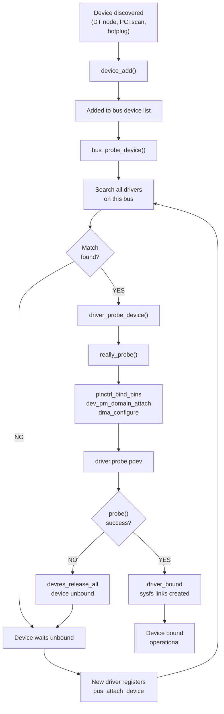
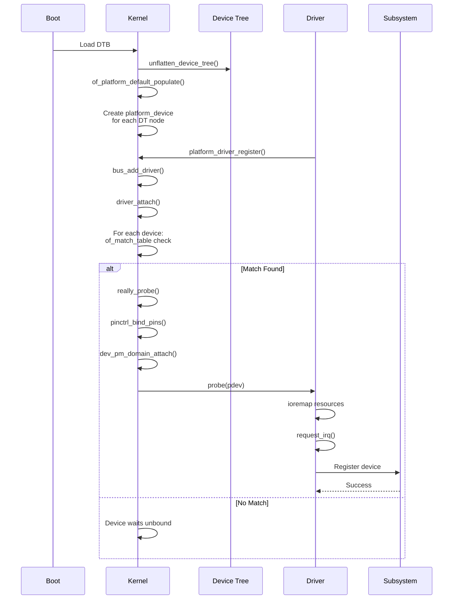
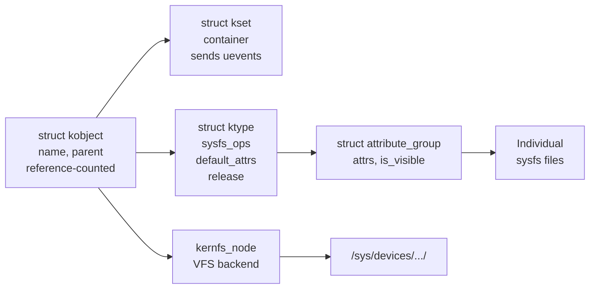

# Linux Drivers, Device Tree, procfs/sysfs & System Call Flow — Consolidated Reference

**Author**: Consolidated from ARM Linux Kernel Technical Documentation  
**Version**: 1.0  
**Target Audience**: Senior Embedded Linux Engineers, Staff-Level Interview Preparation

---

## 1. Overview

This document consolidates four critical domains of Linux kernel development:
- **Linux Device Model**: Character vs. block drivers, device registration, probe lifecycle
- **Device Tree**: Hardware description, DTBO overlays, Qualcomm SMEM-based selection
- **procfs & sysfs**: Kernel data export, kobject architecture, udev integration
- **System Call Flow**: ARM32/ARM64 execution, VFS routing, platform driver binding

These topics form the foundation of embedded systems development on ARM SoCs (Qualcomm, i.MX, Raspberry Pi).

---

## 2. Linux Device Model

### 2.1 Core Structures

The Linux device model is built on four fundamental abstractions:

```c
// struct device: represents a hardware device
struct device {
    const char *name;
    struct device *parent;
    struct device_driver *driver;        // Bound driver (NULL if unbound)
    struct kobject kobj;                 // sysfs representation
    struct device_node *of_node;         // Device Tree node
    dev_t devt;                          // Device number (for char/block)
    void *driver_data;                   // Per-instance context
    struct list_head links;              // Links to other devices
};

// struct device_driver: represents a driver class
struct device_driver {
    const char *name;
    struct bus_type *bus;
    int (*probe)(struct device *dev);
    int (*remove)(struct device *dev);
    void (*shutdown)(struct device *dev);
};

// struct bus_type: platform, pci, usb, i2c, spi, etc.
struct bus_type {
    const char *name;
    int (*match)(struct device *dev, struct device_driver *drv);
    int (*probe)(struct device *dev);
    const struct of_device_id *of_match_table;
};

// struct kobject: fundamental unit for sysfs representation
struct kobject {
    const char *name;
    struct kobject *parent;
    struct kset *kset;
    struct kobj_type *ktype;
    struct kernfs_node *sd;              // sysfs dir entry
    struct kref kref;                    // reference count
};
```

### 2.2 Device-Driver Binding Lifecycle



### 2.3 Probe/Release Pattern on ARM/Qualcomm

For platform devices (99% of SoC peripherals), the flow is:
1. **Boot**: Device Tree parsed → `of_platform_populate()` creates `platform_device` for each node
2. **Driver Load**: `platform_driver_register()` searches for matching compatible strings
3. **Match Found**: `of_match_table` compatible match → `really_probe()` called
4. **Probe Execution**: Hardware initialized, resources allocated, subsystem registration
5. **Runtime**: All syscalls dispatched via `device.driver.file_operations`
6. **Removal**: `remove()` called, `devm_*` resources auto-freed in reverse order

---

## 3. Character Drivers

Character drivers provide a byte-stream interface for sequential data access (UART, sensors, custom devices).

### 3.1 Registration and Major/Minor Numbers

```c
#include <linux/fs.h>
#include <linux/cdev.h>

#define MY_MAJOR     240          // Static assignment (not recommended)
#define MY_MINOR_BASE 0
#define MY_DEVICE_COUNT 1

static struct cdev my_cdev;
static dev_t my_devno;

// Recommended: dynamic allocation
static int char_driver_init(void)
{
    // Allocate major:minor range dynamically
    int ret = alloc_chrdev_region(&my_devno, MY_MINOR_BASE, 
                                   MY_DEVICE_COUNT, "my_char_dev");
    if (ret < 0)
        return ret;

    // Initialize cdev with file_operations
    cdev_init(&my_cdev, &my_fops);
    my_cdev.owner = THIS_MODULE;

    // Register cdev in the global cdev_map hash table
    ret = cdev_add(&my_cdev, my_devno, MY_DEVICE_COUNT);
    if (ret) {
        unregister_chrdev_region(my_devno, MY_DEVICE_COUNT);
        return ret;
    }

    // Create /dev node via devtmpfs/udev
    struct class *my_class = class_create(THIS_MODULE, "my_class");
    device_create(my_class, NULL, my_devno, NULL, "my_device0");

    pr_info("Registered char device: major=%d, minor=%d\n",
            MAJOR(my_devno), MINOR(my_devno));
    return 0;
}
```

### 3.2 File Operations Structure

```c
// Core operations every char driver must implement
static const struct file_operations my_fops = {
    .owner          = THIS_MODULE,
    .open           = my_open,           // Allocate per-instance context
    .release        = my_release,        // Free per-instance context
    .read           = my_read,           // Copy kernel data to user
    .write          = my_write,          // Copy user data to kernel
    .unlocked_ioctl = my_unlocked_ioctl, // Device-specific commands
    .mmap           = my_mmap,           // Memory-map device memory
    .poll           = my_poll,           // Wait for readiness (for select/epoll)
    .llseek         = my_llseek,         // Seeking support
};

// Simple read implementation
static ssize_t my_read(struct file *filp, char __user *buf,
                       size_t count, loff_t *f_pos)
{
    struct my_device *dev = filp->private_data;
    size_t to_copy;

    // Check buffer bounds
    if (*f_pos >= dev->size)
        return 0;
    
    to_copy = min(count, (size_t)(dev->size - *f_pos));

    // Copy from kernel buffer to user space
    // Validates user pointer, handles page faults automatically
    if (copy_to_user(buf, dev->data + *f_pos, to_copy))
        return -EFAULT;

    *f_pos += to_copy;
    return to_copy;
}

// Simple write implementation
static ssize_t my_write(struct file *filp, const char __user *buf,
                        size_t count, loff_t *f_pos)
{
    struct my_device *dev = filp->private_data;
    size_t to_copy;

    if (*f_pos >= dev->size)
        return -ENOSPC;

    to_copy = min(count, (size_t)(dev->size - *f_pos));

    // Copy from user space to kernel buffer
    if (copy_from_user(dev->data + *f_pos, buf, to_copy))
        return -EFAULT;

    *f_pos += to_copy;
    return to_copy;
}
```

---

## 4. Block Drivers

Block drivers service fixed-size block I/O requests, supporting filesystems and random access.

### 4.1 Block Driver Architecture: blk-mq Multi-Queue Model

```c
#include <linux/blkdev.h>
#include <linux/bio.h>

struct ramdisk_dev {
    unsigned long size;
    u8 *data;
    struct request_queue *queue;
    struct gendisk *gd;
    spinlock_t lock;
};

// Modern: Multi-queue block layer (blk-mq)
static blk_status_t ramdisk_queue_rq(struct blk_mq_hw_ctx *hctx,
                                      const struct blk_mq_queue_data *bd)
{
    struct request *req = bd->rq;
    struct ramdisk_dev *dev = req->q->queuedata;
    struct bio *bio;

    blk_mq_start_request(req);  // Acknowledge request to block layer

    // Process each bio (block I/O) in the request
    __rq_for_each_bio(bio, req) {
        struct bio_vec bvec;
        struct bvec_iter iter;

        // Iterate over all memory segments in bio
        bio_for_each_segment(bvec, bio, iter) {
            char *buffer = kmap_atomic(bvec.bv_page);
            sector_t sector = bio->bi_iter.bi_sector;
            
            // Copy between RAM buffer and bio pages
            if (bio_data_dir(bio) == WRITE)
                memcpy(dev->data + sector * 512, buffer + bvec.bv_offset,
                       bvec.bv_len);
            else
                memcpy(buffer + bvec.bv_offset, dev->data + sector * 512,
                       bvec.bv_len);
            
            kunmap_atomic(buffer);
            sector += bvec.bv_len / 512;
        }
    }

    blk_mq_end_request(req, BLK_STS_OK);  // Complete request
    return BLK_STS_OK;
}

// Register block device
static int ramdisk_setup(struct ramdisk_dev *dev)
{
    struct blk_mq_tag_set *tag_set;

    // Allocate RAM for disk
    dev->size = 16 * 1024 * 1024;  // 16 MB
    dev->data = vmalloc(dev->size);
    if (!dev->data)
        return -ENOMEM;

    // Configure blk-mq tag set (hardware queue parameters)
    tag_set = kzalloc(sizeof(*tag_set), GFP_KERNEL);
    tag_set->ops = &(struct blk_mq_ops) {
        .queue_rq = ramdisk_queue_rq,
    };
    tag_set->nr_hw_queues = 1;
    tag_set->queue_depth = 128;
    tag_set->cmd_size = 0;

    if (blk_mq_alloc_tag_set(tag_set)) {
        vfree(dev->data);
        return -ENOMEM;
    }

    // Initialize request queue
    dev->queue = blk_mq_init_queue(tag_set);
    if (IS_ERR(dev->queue)) {
        blk_mq_free_tag_set(tag_set);
        vfree(dev->data);
        return PTR_ERR(dev->queue);
    }

    // Allocate and configure gendisk (the device)
    dev->gd = alloc_disk(1);
    dev->gd->major = MY_BLOCK_MAJOR;
    dev->gd->first_minor = 0;
    dev->gd->fops = &(struct block_device_operations) {
        .open = ramdisk_open,
        .release = ramdisk_release,
        .getgeo = ramdisk_getgeo,
    };
    dev->gd->queue = dev->queue;
    dev->gd->private_data = dev;
    snprintf(dev->gd->disk_name, 32, "ramdisk");
    set_capacity(dev->gd, dev->size / 512);  // Size in 512-byte sectors

    add_disk(dev->gd);
    return 0;
}
```

### 4.2 Character vs. Block: Key Differences

| Aspect | Character | Block |
|--------|-----------|-------|
| **Data Unit** | Byte stream | Fixed-size blocks (512B–4KB) |
| **Access Pattern** | Sequential | Random |
| **Buffering** | None (direct I/O) | Kernel page cache |
| **Filesystem** | No | Yes (can mount) |
| **I/O Stack** | Minimal (low latency) | Multi-layer (I/O scheduler, cache) |
| **Examples** | UART, sensors, GPIO | Hard drives, SSDs, RAM disk |
| **Registration** | `register_chrdev_region()` | `register_blkdev()` + `add_disk()` |

---

## 5. Device Tree Concepts

### 5.1 Device Tree Fundamentals

Device Tree describes hardware in a human-readable, structured format. The Device Tree Compiler (`dtc`) converts DTS (source) to DTB (binary blob).

```dts
/* Example: Qualcomm GENI UART on SM8550 */

/ {
    compatible = "qcom,sm8550";

    #address-cells = <2>;
    #size-cells = <2>;

    soc@0 {
        compatible = "simple-bus";
        ranges;

        /* MMIO region: maps to physical 0xa94000 for 16KB */
        uart2: serial@a94000 {
            compatible = "qcom,geni-uart";
            reg = <0x0 0x00a94000 0x0 0x4000>;

            /* Interrupt: GIC_SPI 358 (level-triggered high) */
            interrupts = <GIC_SPI 358 IRQ_TYPE_LEVEL_HIGH>;

            /* Clocks and power */
            clocks = <&gcc GCC_QUPV3_WRAP1_S2_CLK>,
                     <&gcc GCC_QUPV3_WRAP1_S2_CBCR>;
            clock-names = "se", "m";

            power-domains = <&rpmhpd SM8550_CX>;

            /* Pin configuration */
            pinctrl-names = "default";
            pinctrl-0 = <&uart2_default>;

            /* Operating mode */
            status = "okay";  /* "disabled" = skip probing */
        };
    };
};
```

### 5.2 Device Tree Node Syntax

```dts
node_label: node_name@reg_address {
    compatible = "manufacturer,model";           /* For driver matching */
    reg = <address size>;                        /* MMIO address + size */
    interrupts = <GIC_TYPE irqnum flags>;        /* Hardware interrupt */
    #address-cells = <2>;                        /* Cells per address in children */
    #size-cells = <2>;                           /* Cells per size in children */
    clocks = <&phandle_ref clock_specifier>;     /* Phandle reference */
    power-domains = <&pm_domain domain_id>;
    pinctrl-names = "default", "sleep";
    pinctrl-0 = <&pin_group_1>;
    status = "okay";                             /* "okay", "disabled", "reserved" */

    /* Child nodes */
    child_node@0 {
        compatible = "child,device";
        reg = <0>;
    };
};
```

### 5.3 Of_* Kernel API for DT Parsing

```c
#include <linux/of.h>
#include <linux/of_address.h>
#include <linux/of_irq.h>

// Find node by full path
struct device_node *node = of_find_node_by_path("/soc/serial@a94000");

// Find node by compatible string (used in probing)
struct device_node *node = of_find_compatible_node(NULL, NULL, "qcom,geni-uart");

// Parse property (integer)
u32 reg_addr;
of_property_read_u32(node, "reg", &reg_addr);

// Parse property (string)
const char *status;
of_property_read_string(node, "status", &status);

// Parse reg property (handles variable #address-cells / #size-cells)
struct resource *res = of_get_address(node, 0, NULL, NULL);

// Get phandle reference (clock, regulator, GPIO)
struct clk *clk = of_clk_get_by_name(node, "se");

// Get GPIO
struct gpio_desc *gpio = of_get_named_gpio(node, "enable-gpio", 0);
```

### 5.4 Device Tree Overlays (DTBO)

Device Tree Overlays patch the base DTB at runtime, enabling board variants and add-on hardware:

```dts
/* overlay.dts – patching base DTB */
/dts-v1/;
/plugin/;

&i2c1 {    /* Reference existing node from base DTB */
    status = "okay";
    
    /* Add new I2C device */
    sensor@48 {
        compatible = "ti,tmp102";
        reg = <0x48>;
    };
};
```

Compilation and application:
```bash
# Compile overlay to DTBO
dtc -@ -I dts -O dtb -o overlay.dtbo overlay.dts

# Boot: Qualcomm ABL selects DTBO based on SMEM platform ID
# - Reads SMEM_ID_VENDOR0 (SoC ID), SMEM_ID_VENDOR1 (board ID)
# - Matches against DTBO table entries
# - Calls fdt_overlay_apply() to merge DTBO into base DTB
# - Kernel receives merged DTB via x0 boot protocol register

# Runtime: Linux configfs
mkdir /sys/kernel/config/device-tree/overlays/my_overlay
cat overlay.dtbo > /sys/kernel/config/device-tree/overlays/my_overlay/dtbo
```

---

## 6. Platform Drivers

### 6.1 Platform Device Probe Lifecycle



### 6.2 Complete Platform Driver Example

```c
#include <linux/module.h>
#include <linux/platform_device.h>
#include <linux/of.h>
#include <linux/io.h>

struct my_device {
    void __iomem *base;
    int irq;
    struct clk *clk;
};

// Device Tree compatible match
static const struct of_device_id my_driver_match[] = {
    { .compatible = "custom,my-device" },
    { }
};
MODULE_DEVICE_TABLE(of, my_driver_match);

// Probe: called when device-driver pair is matched
static int my_probe(struct platform_device *pdev)
{
    struct my_device *dev;
    struct resource *res;
    int ret;

    // Allocate device context (auto-freed via devm on remove)
    dev = devm_kzalloc(&pdev->dev, sizeof(*dev), GFP_KERNEL);
    if (!dev)
        return -ENOMEM;

    // Get memory resource from DT "reg" property
    res = platform_get_resource(pdev, IORESOURCE_MEM, 0);
    dev->base = devm_ioremap_resource(&pdev->dev, res);
    if (IS_ERR(dev->base))
        return PTR_ERR(dev->base);

    // Get IRQ from DT "interrupts" property
    dev->irq = platform_get_irq(pdev, 0);
    if (dev->irq < 0)
        return dev->irq;

    // Request IRQ with auto-cleanup
    ret = devm_request_irq(&pdev->dev, dev->irq, my_isr,
                           IRQF_TRIGGER_HIGH, "my-dev", dev);
    if (ret)
        return ret;

    // Get clock reference
    dev->clk = devm_clk_get(&pdev->dev, "core");
    if (IS_ERR(dev->clk)) {
        if (PTR_ERR(dev->clk) == -EPROBE_DEFER)
            return -EPROBE_DEFER;  // Retry when clock provider ready
        return PTR_ERR(dev->clk);
    }

    clk_prepare_enable(dev->clk);

    // Initialize hardware
    writel(0, dev->base + 0x00);  // Reset
    writel(1, dev->base + 0x04);  // Enable

    // Register with subsystem (char driver, hwmon, leds, etc.)
    // ... subsystem-specific registration ...

    // Save device context for later use in remove/suspend/resume
    platform_set_drvdata(pdev, dev);

    dev_info(&pdev->dev, "Device probed at 0x%llx IRQ %d\n",
             (u64)res->start, dev->irq);
    return 0;
}

// Remove: called on unbind or module unload
static int my_remove(struct platform_device *pdev)
{
    struct my_device *dev = platform_get_drvdata(pdev);

    // Subsystem unregistration
    // ... subsystem-specific cleanup ...

    // Disable hardware
    writel(0, dev->base + 0x04);
    clk_disable_unprepare(dev->clk);

    // All devm_ resources (ioremap, irq, clk) auto-freed
    // No manual cleanup needed

    return 0;
}

static struct platform_driver my_driver = {
    .probe  = my_probe,
    .remove = my_remove,
    .driver = {
        .name = "my-custom-device",
        .of_match_table = my_driver_match,
    },
};

module_platform_driver(my_driver);

MODULE_LICENSE("GPL");
MODULE_AUTHOR("Engineer");
MODULE_DESCRIPTION("Custom platform device driver");
```

---

## 7. procfs: Process and Kernel Information

### 7.1 procfs Architecture and API

```c
#include <linux/proc_fs.h>
#include <linux/seq_file.h>

// seq_file: handles large /proc output with automatic pagination
static void *my_start(struct seq_file *s, loff_t *pos)
{
    if (*pos >= 100)
        return NULL;
    return pos;  // Non-NULL = data available
}

static void *my_next(struct seq_file *s, void *v, loff_t *pos)
{
    ++(*pos);
    if (*pos >= 100)
        return NULL;
    return (void *)pos;
}

static void my_stop(struct seq_file *s, void *v)
{
    // Cleanup (if needed)
}

static int my_show(struct seq_file *s, void *v)
{
    loff_t *pos = v;
    seq_printf(s, "Item %lld: value=%d\n", *pos, *pos * 10);
    return 0;
}

static const struct seq_operations my_seq_ops = {
    .start = my_start,
    .next  = my_next,
    .stop  = my_stop,
    .show  = my_show,
};

// Open callback: wraps seq_file logic
static int my_open(struct inode *inode, struct file *filp)
{
    return seq_open(filp, &my_seq_ops);
}

static const struct proc_ops my_proc_ops = {
    .proc_open = my_open,
    .proc_read = seq_read,      // Generic seq_read handler
    .proc_lseek = seq_lseek,
    .proc_release = seq_release,
};

// Create /proc/my_proc_file
static int __init proc_init(void)
{
    proc_create("my_proc_file", 0444, NULL, &my_proc_ops);
    return 0;
}
```

### 7.2 Important /proc Entries

| Entry | Purpose | Example Use |
|-------|---------|-------------|
| `/proc/[pid]/maps` | Virtual memory layout | `gdb`: identify memory regions |
| `/proc/meminfo` | System memory statistics | `free`: show RAM/swap usage |
| `/proc/interrupts` | IRQ handler call counts | Debug: identify interrupt storms |
| `/proc/sys/...` | Tunable kernel parameters | `sysctl`: runtime kernel config |
| `/proc/devices` | Registered major numbers | Find char/block driver assignments |
| `/proc/iomem` | Physical memory regions (MMIO) | Identify peripheral address ranges |

---

## 8. sysfs: Device Model Representation

### 8.1 kobject, kset, ktype Architecture



### 8.2 Creating Device Attributes

```c
#include <linux/device.h>
#include <linux/sysfs.h>

// Simple attribute show/store callbacks
static ssize_t status_show(struct device *dev, struct device_attribute *attr,
                            char *buf)
{
    struct my_device *mydev = dev_get_drvdata(dev);
    return sysfs_emit(buf, "%u\n", mydev->status);
}

static ssize_t status_store(struct device *dev, struct device_attribute *attr,
                             const char *buf, size_t count)
{
    struct my_device *mydev = dev_get_drvdata(dev);
    int ret = kstrtou32(buf, 10, &mydev->status);
    return ret ? ret : count;
}

// Macro creates dev_attr_status with correct permissions
static DEVICE_ATTR_RW(status);

// Attribute group: atomic creation/removal
static struct attribute *my_attrs[] = {
    &dev_attr_status.attr,
    NULL,
};

static umode_t my_is_visible(struct kobject *kobj, struct attribute *attr,
                              int index)
{
    // Conditionally show/hide attributes based on hardware capability
    if (attr == &dev_attr_status.attr && !has_status_feature)
        return 0;  // Hide this attribute
    return attr->mode;
}

static const struct attribute_group my_group = {
    .attrs = my_attrs,
    .is_visible = my_is_visible,
};

ATTRIBUTE_GROUPS(my);  // Creates my_groups[] array for driver

// In probe():
// Use .dev_groups in platform_driver to auto-install attributes
static struct platform_driver my_driver = {
    .probe  = my_probe,
    .remove = my_remove,
    .driver = {
        .name = "my-device",
        .of_match_table = my_match,
        .dev_groups = my_groups,  // Auto-created on probe, removed on unbind
    },
};
```

### 8.3 sysfs vs procfs vs debugfs

| Aspect | sysfs | procfs | debugfs |
|--------|-------|--------|---------|
| **Purpose** | Device model hierarchy | Process/kernel info | Debug data only |
| **File Format** | One value per file (strict) | Multi-value, free-form | Unstructured |
| **ABI Stability** | Stable | Mostly stable | No guarantee |
| **Access** | World readable | World readable | Root only |
| **Backend** | kobject/kernfs | proc_ops/seq_file | debugfs_create_* |
| **Use Case** | Device attributes, power mgmt | Process stats, sysctl | Kernel development |

---

## 9. System Call Flow on ARM64

### 9.1 User Space to Kernel Entry

```mermaid
sequenceDiagram
    participant User as User Space<br/>EL0
    participant HW as ARM64 CPU
    participant Kernel as Kernel<br/>EL1
    participant VFS as VFS Layer

    User->>User: MOV x8, 56<br/>MOV x0-x5 (args)<br/>SVC #0
    User->>HW: SVC #0 instruction
    HW->>HW: EL0→EL1, disable IRQ<br/>Save PC→ELR_EL1<br/>Save PSTATE→SPSR_EL1
    HW->>Kernel: Jump to VBAR_EL1+0x400
    Kernel->>Kernel: el0_sync handler<br/>kernel_entry macro<br/>save all regs→pt_regs
    Kernel->>Kernel: el0_svc_handler()<br/>el0_svc_common()
    Kernel->>Kernel: syscall_trace_enter()<br/>ptrace/seccomp/audit
    Kernel->>Kernel: invoke_syscall()<br/>sys_call_table[56]
    Kernel->>VFS: __arm64_sys_openat()
    VFS-->>Kernel: return fd (or -errno)
    Kernel->>Kernel: syscall_trace_exit()
    Kernel->>Kernel: ret_to_user:<br/>check TIF_NEED_RESCHED<br/>check TIF_SIGPENDING
    Kernel->>Kernel: kernel_exit macro<br/>restore regs from pt_regs
    Kernel->>HW: ERET instruction
    HW->>HW: EL1→EL0, restore PSTATE<br/>jump to ELR_EL1
    HW->>User: Return to user space
```



### 9.2 ARM64 Register Conventions and Syscall Numbers

```c
// ARM64 (AArch64) syscall ABI
// x0–x5: arguments and return value
// x8: syscall number
// Return value in x0 (negative = -errno)

// Example: sys_read() implementation
SYSCALL_DEFINE3(read, unsigned int, fd, char __user *, buf, size_t, count)
{
    // Arguments automatically extracted from x0, x1, x2 by SYSCALL_DEFINE macro
    struct fd f = fdget(fd);
    ssize_t ret = -EBADF;

    if (f.file) {
        loff_t pos = file_pos_read(f.file);
        ret = vfs_read(f.file, buf, count, &pos);
        if (ret >= 0)
            file_pos_write(f.file, pos);
        fdput(f);
    }
    return ret;  // x0 = return value
}

// ARM64 syscall table (arch/arm64/kernel/sys.c)
const syscall_fn_t sys_call_table[__NR_syscalls] = {
    [0]  = __arm64_sys_io_setup,
    [1]  = __arm64_sys_io_destroy,
    ...
    [56] = __arm64_sys_openat,       // Our open() ends up here
    [63] = __arm64_sys_read,         // sys_read()
    [64] = __arm64_sys_write,        // sys_write()
    ...
};

// Entry point macro expansion
asmlinkage long __arm64_sys_openat(const struct pt_regs *regs)
{
    return __se_sys_openat(regs->regs[0],  // dfd
                           regs->regs[1],  // filename
                           regs->regs[2]); // flags
}
```

### 9.3 Data Structures: pt_regs, ESR_EL1, ELR_EL1

```c
// ARM64 pt_regs: saved CPU state on kernel stack
struct pt_regs {
    union {
        struct user_pt_regs user_regs;
        struct {
            u64 regs[31];      // x0–x30
            u64 sp;            // Stack pointer (from SP_EL0)
            u64 pc;            // Program counter (from ELR_EL1)
            u64 pstate;        // Processor state (from SPSR_EL1)
        };
    };
    u64 orig_x0;               // Original x0 for syscall restart after signal
    s32 syscallno;             // Syscall number from x8
};

// Exception Syndrome Register (ESR_EL1)
// Bits [31:26] = EC (Exception Class)
// 0x15 = SVC from AArch64 (syscall) <- SYSCALL MARKER
// 0x25 = Data Abort from lower EL
// 0x24 = Data Abort from same EL

// Exception Link Register (ELR_EL1)
// Contains return address (PC) to restore after exception

// Saved Program State Register (SPSR_EL1)
// User-space PSTATE saved here (condition flags, interrupt state, etc.)

// kernel_entry macro saves these:
// mrs x22, elr_el1              -> x22 = return PC
// mrs x23, spsr_el1             -> x23 = user PSTATE
// str x22, [sp, #S_PC]          -> pt_regs.pc = return address
// str x23, [sp, #S_PSTATE]      -> pt_regs.pstate = saved flags
```

### 9.4 Return Path and Syscall Restart

```c
// ret_to_user: checks for pending work before returning to user
ret_to_user:
    disable_daif                    // Atomic: disable interrupts
    ldr x1, [tsk, #TSK_TI_FLAGS]   // Load thread_info->flags
    and x2, x1, #_TIF_WORK_MASK    // Check for pending work

    cbnz x2, work_pending           // If TIF_NEED_RESCHED, TIF_SIGPENDING, etc.
    
    // Fast path: no pending work
    kernel_exit 0                   // Restore regs, ERET

work_pending:
    tst x1, #_TIF_NEED_RESCHED      // Scheduler wants to preempt?
    bne schedule                    // Yes -> call schedule()
    
    tst x1, #_TIF_SIGPENDING        // Signals pending?
    bne do_signal                   // Yes -> call do_signal()

// Syscall restart after signal: copy orig_x0 → x0
// Returned from signal handler: regs->regs[0] = regs->orig_x0
// CPU backs up PC by 4 bytes: regs->pc -= 4
// Next ERET re-executes SVC #0 with original arguments
```

---

## 10. ioctl Deep Dive

The ioctl interface allows driver-specific commands beyond standard read/write:

```c
#include <linux/ioctl.h>

// _IOC macro encodes command word (32-bit)
// Bits: [31:30] dir | [29:16] size | [15:8] type | [7:0] nr
#define MY_IOC_MAGIC    'M'
#define MY_IOC_SET_CFG  _IOW(MY_IOC_MAGIC, 1, struct my_config)
#define MY_IOC_GET_CFG  _IOR(MY_IOC_MAGIC, 2, struct my_config)
#define MY_IOC_RESET    _IO(MY_IOC_MAGIC, 3)

// Driver ioctl handler
static long my_ioctl(struct file *filp, unsigned int cmd,
                     unsigned long arg)
{
    struct my_device *dev = filp->private_data;
    struct my_config cfg;
    int ret;

    // Validate command magic and number
    if (_IOC_TYPE(cmd) != MY_IOC_MAGIC)
        return -ENOTTY;
    if (_IOC_NR(cmd) > MY_IOC_MAXNR)
        return -ENOTTY;

    switch (cmd) {
    case MY_IOC_SET_CFG:
        // Copy config struct from user space
        if (copy_from_user(&cfg, (void __user *)arg, sizeof(cfg)))
            return -EFAULT;
        
        // Validate and apply config
        if (cfg.speed > 3000000)
            return -EINVAL;
        dev->speed = cfg.speed;
        return 0;

    case MY_IOC_GET_CFG:
        cfg.speed = dev->speed;
        if (copy_to_user((void __user *)arg, &cfg, sizeof(cfg)))
            return -EFAULT;
        return 0;

    case MY_IOC_RESET:
        writel(0x1, dev->base + RESET_REG);
        udelay(10);
        writel(0x0, dev->base + RESET_REG);
        return 0;

    default:
        return -ENOTTY;  // "Not a typewriter" (unknown command)
    }
}
```

---

## 11. Common Pitfalls & Debugging

| Pitfall | Symptom | Solution |
|---------|---------|----------|
| **Buffer overflow in sysfs show()** | Kernel panic | Always use `sysfs_emit()` (PAGE_SIZE bounded), never `sprintf()` |
| **Wrong store() return value** | Infinite retry loop | Return `count` on success, not 0 |
| **Race on device removal** | Use-after-free, null pointer | Hold device reference, use proper locking |
| **Not using attribute groups** | Race with uevent | Use `.dev_groups` in driver struct for atomic attr creation |
| **Forgetting proc_remove()** | Kernel oops on read | Call `proc_remove()` in module exit |
| **Probe not happening** | Device never bound | Check: DT `status="okay"`, compatible match, `cat /sys/kernel/debug/devices_deferred` |
| **Major collision** | Device creation fails | Use `alloc_chrdev_region()` for dynamic major allocation |
| **Resource leak in probe** | Memory grows on repeated probe | Use `devm_*` functions, they auto-cleanup on failure |

### Debugging Commands

```bash
# sysfs debugging
udevadm monitor --kernel --udev
ls -la /sys/bus/platform/drivers/
cat /sys/bus/platform/devices/*/modalias
cat /sys/kernel/debug/devices_deferred

# procfs debugging
cat /proc/iomem         # Physical MMIO regions
cat /proc/sys/kernel/  # Tunable parameters
strace cat /proc/meminfo

# Device Tree debugging
dtc -I dtb -O dts /boot/dtb > /tmp/dtb.dts
cat /sys/firmware/devicetree/base/compatible
ls -la /sys/firmware/devicetree/base/

# Kernel logs
dmesg | grep -i probe
dmesg | tail -50 | grep -i error
```

---

## 12. Cross-References & Key Takeaways

**Recommended Learning Path:**
1. Character drivers (simplest I/O model)
2. Block drivers (complex request queue, caching)
3. Platform drivers (how DT → device matching works)
4. System calls (understanding the entry point)
5. sysfs/procfs (kernel introspection)
6. ioctl (device-specific commands)

**ARM/Qualcomm Specific Points:**
- Use ONLY MMIO on ARM (no I/O port space)
- Device Tree via `of_match_table` is the standard
- devm_* functions prevent resource leaks
- EPROBE_DEFER handles non-deterministic probe ordering
- SMEM-based hardware ID for DTBO selection on Qualcomm

---

## 13. Further Reading

- Linux Kernel Documentation: https://www.kernel.org/doc
- ARM Generic Interrupt Controller (GIC) Architecture
- Qualcomm Device Tree Bindings: qcom,* compatible strings
- libfdt: Device Tree manipulation library
- LWN.net: In-depth kernel articles and discussions
