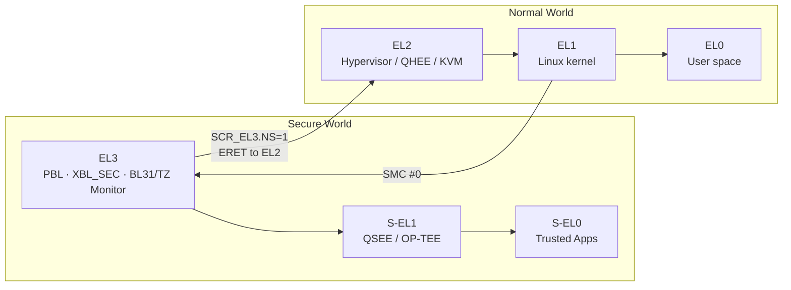
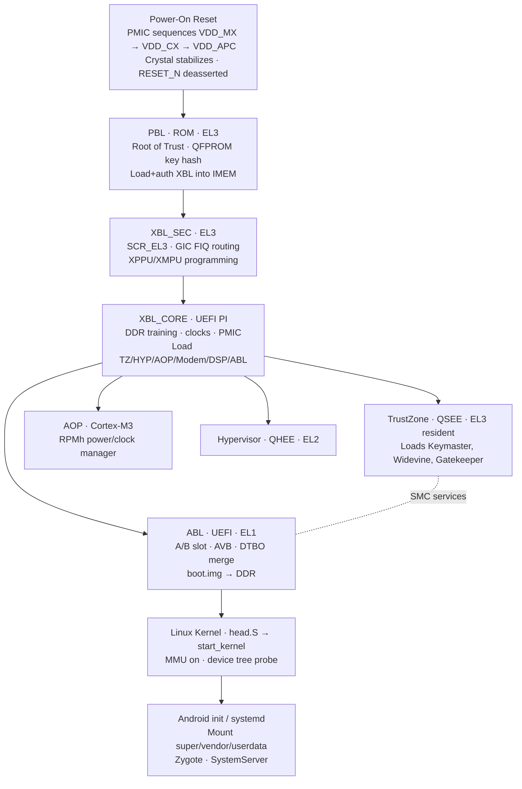
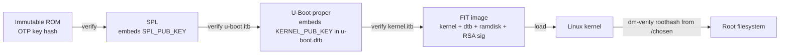
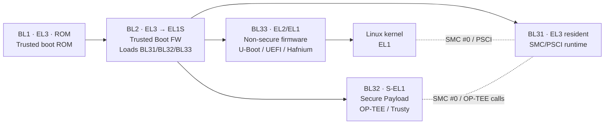
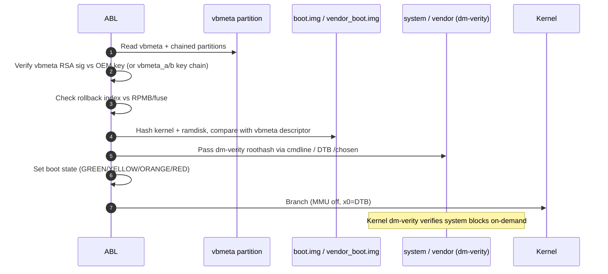
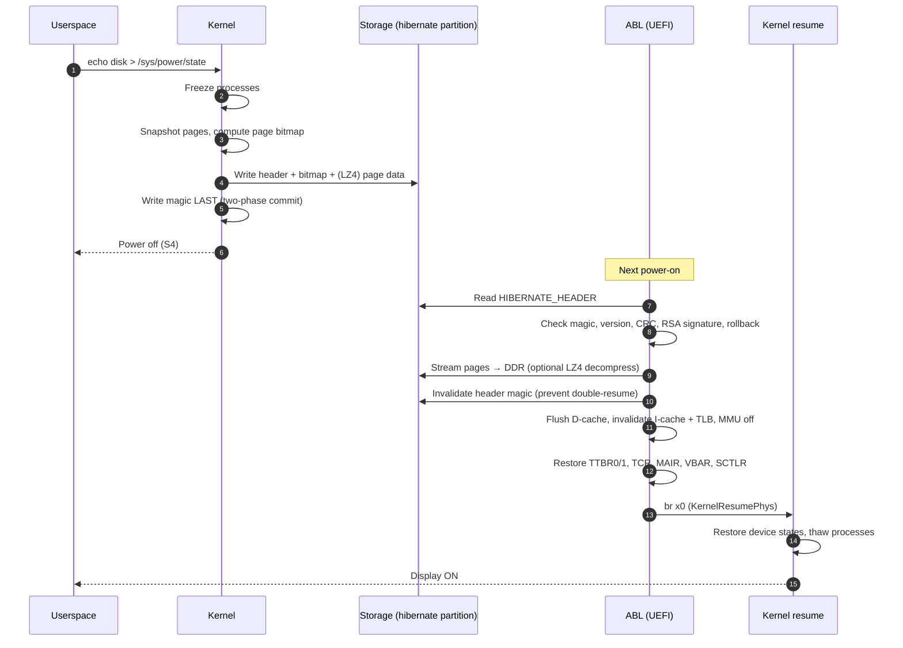

# Qualcomm/ARM Boot Flow, U-Boot, APPSBL, Hibernation & Boot Optimization — Consolidated Reference

> Knowledgebase document 05 of the ARM/Linux series. Consolidates the five raw notes
> covering the complete embedded boot path — from on-die ROM through Linux user
> space — across Qualcomm SoCs, generic ARM64 platforms, and U-Boot based boards.
> Includes verified boot, debugging walk-throughs, hibernation, and boot-time
> optimization material.

---

## 1. Overview & Scope

Embedded ARM64 boot is a multi-stage cryptographically-chained process. Each stage
runs with a specific privilege (Exception Level), in a specific world (Secure or
Normal), from a specific memory backing (on-die SRAM/IMEM, then DDR after training),
and authenticates the next stage before transferring control. This document brings
together the material from five source notes:

| # | Source File | Primary Subject |
|---|---|---|
| 1 | `Qualcomm_Boot_Flow_Doc1_Power_On_to_Kernel.md` | PBL → SBL/XBL → APPSBL → kernel timing & responsibilities |
| 2 | `Part2_UBoot_Verified_Boot.md` | FIT image format, RSA signing, rollback, SPL chain |
| 3 | `Part3_Qualcomm_Device_Boot_Flow.md` | XBL deep dive, TrustZone, AOP, PIL, EDL, QFPROM |
| 4 | `APPSBL_Debugging_Scenarios_Doc2.md` | RPMB race / DTBO mismatch field debugging |
| 5 | `Hibernation_and_Boot_Optimization_Doc3.md` | ABL hibernation resume + boot-time tuning |

**Scope summary:**

- ARM64 exception model and how each boot stage maps onto it.
- Qualcomm’s production boot chain (PBL → XBL → TZ/Hyp/AOP → ABL → kernel).
- Generic U-Boot architecture (SPL → U-Boot proper) and verified boot via FIT.
- ARM Trusted Firmware (TF-A) BL1/BL2/BL31/BL32/BL33 stages and PSCI.
- Linux ARM64 entry path (`head.S` → `__primary_switched` → `start_kernel`).
- Android boot.img / vendor_boot / AVB 2.0 image layout and A/B slot selection.
- Hibernation (S4) implemented inside ABL for automotive fast-resume.
- Boot-time measurement and stage-by-stage optimization techniques.
- Two real-world APPSBL debugging case studies with JTAG/UART evidence.

**Out of scope** (covered in other knowledgebase documents): runtime scheduling
(doc 02), drivers / sysfs (doc 04), GIC interrupt subsystem (doc 03), and MMU
page-table internals (doc 01).

---

## 2. ARM64 Boot Architecture (EL3 → EL2 → EL1, Secure vs Non-Secure World)

ARM64 (ARMv8-A) defines four Exception Levels (EL0–EL3) crossed with two security
states (Secure and Non-Secure / Normal). The boot flow walks downward through
ELs while transitioning from the Secure World (where ROM and TrustZone live) into
the Normal World (where Linux executes).

| EL | World | Typical Software | Capabilities |
|----|-------|------------------|--------------|
| EL3 | Secure | PBL ROM, BL1/BL2/BL31 (TF-A), Qualcomm XBL_SEC, TrustZone monitor | Full hardware access, owns `SCR_EL3`, `SCTLR_EL3`, SMC dispatcher |
| S-EL1 / S-EL0 | Secure | OP-TEE, QSEE Trusted Applications (Keymaster, Widevine) | Runs Trusted OS + TAs behind SMC interface |
| EL2 | Normal | Hypervisor (QHEE, KVM, Xen, Jailhouse) | Stage-2 translation, VM isolation, VHE for hosted Linux |
| EL1 | Normal | Linux kernel, BSD kernels, RTOS | OS kernel, syscalls, drivers, stage-1 MMU |
| EL0 | Normal | User space (Android framework, glibc apps) | Unprivileged execution |



Important transitions:

- **PBL → XBL**: Stays in EL3 / Secure (just a branch to a verified image).
- **XBL → TZ**: TZ becomes resident at EL3; XBL hands further boot to EL2/EL1.
- **TZ/Hyp → ABL**: `SCR_EL3.NS` flipped to 1 → drop into Normal-world EL2 then EL1.
- **ABL → Kernel**: Final `ERET`/branch at EL1 (or EL2 with VHE) with MMU OFF and
  `x0 = DTB phys addr` per ARM64 boot protocol.

Linux later issues SMCs (PSCI, SCM) which re-enter EL3 where TrustZone still
resides as the secure monitor for the lifetime of the system.

---

## 3. Qualcomm Power-On Sequence (PBL → SBL/XBL → TZ/Hyp → APPSBL → kernel)

The headline diagram of the entire Qualcomm chain. Each box is a separately
signed binary except for PBL (ROM) and the Power-On Reset hardware step.



### 3.1 Stage Responsibilities (Quick Reference)

| Stage | Backing memory | EL / World | Primary jobs |
|-------|----------------|------------|--------------|
| PBL (ROM) | IMEM only | EL3 Secure | Determine boot device, load+verify XBL, EDL fallback |
| XBL_SEC | IMEM → DDR | EL3 Secure | Secure config, XPPU/XMPU, drop NS bit later |
| XBL_CORE / UEFI PI | DDR | EL3 Secure | DDR training, clocks, PMIC, load all firmware |
| TZ (QSEE) | Reserved DDR (XMPU-locked) | EL3 resident | Secure monitor, TA hosting, secure WDT |
| AOP | Always-On SRAM | M-profile | RPMh, voltage/clock votes, SPMI to PMIC |
| Hypervisor (QHEE) | DDR | EL2 Normal | Stage-2 PT, optional GVMs |
| ABL (LK or UEFI ABL) | DDR | EL1 Normal | A/B select, AVB, DTBO, boot.img parse, MMU off, branch |
| Linux kernel | DDR | EL1 Normal | Page tables, device tree, drivers, init exec |

### 3.2 Headline Timing (typical SDM845/SM8150)

| Stage | Time | Optimization headroom |
|-------|------|------------------------|
| PMIC Power-On | ~5 ms | None (hardware) |
| PBL | ~25 ms | Very low (eFuse boot device select) |
| XBL (with DDR training) | ~365 ms | **Highest** (DDR fast boot saves 200–400 ms) |
| TZ + AOP load | ~40 ms | Low |
| ABL | ~90 ms | Medium (HW crypto for AVB, LZ4 kernel) |
| Kernel head.S → start_kernel | ~100 ms | Low (Image.lz4, quiet boot) |
| Kernel → init exec | ~600 ms | Medium (deferred probe, async probe) |
| Android init → launcher | ~2–4 s | **High** (parallel services, F2FS) |

---

## 4. PBL (Primary Bootloader) — ROM code, signature verification, PMIC init

PBL is mask-ROM. It cannot be patched after silicon manufacturing, which is
precisely what makes it the immutable **Root of Trust**. PBL is intentionally
minimal: just enough to load and authenticate the next stage.

### 4.1 What PBL does

1. **Minimal HW init** — configure CPU clocks to a safe XO frequency (~19.2 MHz),
   initialize IMEM (256 KB–1 MB on-die SRAM), set up exception vectors.
2. **Determine boot source** — read `BOOT_CONFIG` field from QFPROM fuses.
3. **Load SBL/XBL** — read GPT, locate `xbl` / `sbl1` partition, copy into IMEM.
4. **Authenticate** — verify MBN-format image signature against OEM public key
   hash burned into eFuses (`OEM_PK_HASH` row). RSA-2048/4096 via hardware Crypto
   Engine (CE), not software.
5. **Check DLOAD cookie** — if set, enter Emergency Download (EDL) mode.
6. **Branch to XBL** — set up SP in IMEM, jump to entry point.

### 4.2 BOOT_CONFIG Fuse Encoding

| `BOOT_CONFIG[3:0]` | Boot device | Notes |
|--------------------|-------------|-------|
| `0x0` | eMMC (SDC1) | Most phones/tablets |
| `0x1` | UFS | High-end SoCs; faster than eMMC |
| `0x2` | SD card (SDC2) | Dev boards / prototypes |
| `0x3` | USB (EDL) | Recovery; PBL listens for Firehose |
| `0x4` | NAND | Older IoT / industrial platforms |
| `0xF` | JTAG debug | Engineering only; **never** in production |

### 4.3 MBN Header (parsed by PBL/XBL/ABL)

```c
struct mbn_header {
    uint32_t image_id;       /* unique image identifier */
    uint32_t header_vsn_num; /* MBN header version */
    uint32_t image_src;      /* byte offset of image in flash */
    uint8_t *image_dest_ptr; /* physical load address */
    uint32_t image_size;     /* total (code + sig + cert) */
    uint32_t code_size;      /* code only */
    uint8_t *sig_ptr;        /* RSA signature blob */
    uint32_t sig_sz;         /* 256 = RSA-2048 */
    uint8_t *cert_chain_ptr; /* attached cert chain */
    uint32_t cert_chain_sz;
    uint32_t sw_version;     /* anti-rollback counter */
    uint32_t app_id;         /* TA app id, if applicable */
    uint32_t metadata_size;
    uint8_t  metadata[0];
};
```

### 4.4 PBL signature verification (conceptual)

```c
/* All steps actually run on the hardware Crypto Engine (CE). */
qfprom_read(QFPROM_OEM_PK_HASH_ROW0, &oem_key_hash[0]);
qfprom_read(QFPROM_OEM_PK_HASH_ROW1, &oem_key_hash[16]);

struct mbn_header *hdr = (struct mbn_header *)IMEM_XBL_BASE;
hw_sha256(hdr->cert_chain_ptr, hdr->cert_chain_sz, computed_key_hash);

if (memcmp(computed_key_hash, oem_key_hash, 32) != 0)
    pbl_error_handler(PBL_ERR_AUTH_FAIL);   /* halt or EDL */

ret = hw_rsa_verify(hdr->sig_ptr, hdr->sig_sz,
                    xbl_image, hdr->code_size,
                    hdr->oem_public_key);
if (ret) pbl_error_handler(PBL_ERR_AUTH_FAIL);

if (hdr->sw_version < qfprom_read_rollback_counter(IMAGE_XBL))
    pbl_error_handler(PBL_ERR_ROLLBACK);
```

### 4.5 DLOAD / EDL cookie

```c
#define DLOAD_MAGIC_COOKIE_ADDR (SHARED_IMEM_BASE + 0x10)
#define DLOAD_MAGIC_VALUE       0x10

if (*(volatile uint32_t *)DLOAD_MAGIC_COOKIE_ADDR == DLOAD_MAGIC_VALUE) {
    pbl_enter_dload();   /* USB enumerates as VID:05C6 PID:9008 */
    /* PBL waits for Firehose programmer ELF over USB */
}
```

---

## 5. SBL/XBL (Secondary/eXtensible Bootloader) — UEFI on newer SoCs, DDR training, fuse blowing

SBL (older) and XBL (newer, UEFI EDK2-based) inherit control from PBL and are
responsible for the heaviest hardware initialization, principally DDR training.

### 5.1 XBL Sub-stages

```
XBL = { XBL_SEC, XBL_CORE [, XBL_LOADER] }
        EL3 only    UEFI DXE / driver model
```

- **XBL_SEC** — secure-world setup: SCR_EL3, vector table, GIC FIQ routing to EL3,
  XPPU/XMPU programming, anti-rollback fuse access.
- **XBL_CORE** — UEFI Platform Initialization framework. Publishes DXE protocols,
  runs DDR training, configures clocks/PMIC, loads every firmware image.

### 5.2 DDR Training Sub-Steps

| Sub-step | Typical time | What it calibrates |
|----------|--------------|---------------------|
| Write Leveling | ~50 ms | CLK ↔ DQS alignment for writes |
| Read DQ Centering | ~80 ms | Sampling window for read data eye |
| Read DQS Centering | ~60 ms | Read strobe timing |
| Write DQ Centering | ~70 ms | Write data eye |
| Vref Training | ~40 ms | Internal reference voltage |
| CA Training (LPDDR4) | ~30 ms | Command/address bus skew |
| Verification | ~20 ms | Pattern R/W self-test |
| **Total (first boot)** | **~350 ms** | — |
| Fast-boot restore | ~40–80 ms | Apply saved params + quick R/W check |

### 5.3 Image load order (dependency-correct)

```c
void xbl_load_images(void) {
    load_and_auth_image("aop",   AOP_LOAD_ADDR);  boot_aop();
    load_and_auth_image("tz",    TZ_LOAD_ADDR);
    load_and_auth_image("hyp",   HYP_LOAD_ADDR);
    load_and_auth_image("devcfg",DEVCFG_LOAD_ADDR);
    load_and_auth_image("rpm",   RPM_LOAD_ADDR);  boot_rpm();
    load_and_auth_image("modem", MPSS_LOAD_ADDR);
    load_and_auth_image("adsp",  ADSP_LOAD_ADDR);
    load_and_auth_image("cdsp",  CDSP_LOAD_ADDR);
    load_and_auth_image("slpi",  SLPI_LOAD_ADDR);
    load_and_auth_image("abl",   ABL_LOAD_ADDR);
    xbl_jump_to_tz_and_abl();
}
```

### 5.4 XPPU / XMPU configuration (memory isolation)

```c
xmpu_configure_region(TZ_BASE,   TZ_SIZE,   XMPU_MASTER_TZ_ONLY,   XMPU_PERM_RWX);
xmpu_configure_region(MPSS_BASE, MPSS_SIZE, XMPU_MASTER_MPSS_ONLY, XMPU_PERM_RWX);
xmpu_configure_region(ADSP_BASE, ADSP_SIZE, XMPU_MASTER_ADSP_ONLY, XMPU_PERM_RWX);
xmpu_configure_region(CDSP_BASE, CDSP_SIZE, XMPU_MASTER_CDSP_ONLY, XMPU_PERM_RWX);
xmpu_configure_region(HLOS_BASE, HLOS_SIZE, XMPU_MASTER_APPS,      XMPU_PERM_RWX);
xmpu_lock_all_regions();
xppu_lock_all_regions();
```

### 5.5 Fuse blowing during manufacturing (illustrative)

```c
qfprom_write_row(QFPROM_OEM_PK_HASH_ROW0, pk_hash_low,  redundant_low);
qfprom_write_row(QFPROM_OEM_PK_HASH_ROW1, pk_hash_high, redundant_high);
qfprom_write_row(QFPROM_SECURE_BOOT_EN,   0x1, 0x1);   /* irreversible */
qfprom_write_row(QFPROM_ANTI_ROLLBACK_1,  INITIAL_XBL_VERSION, 0);
if (production_device)
    qfprom_write_row(QFPROM_JTAG_DISABLE, 0x1, 0x1);
```

---

## 6. TrustZone (TZ/QSEE) and Hypervisor (Hyp) Bring-up

TrustZone partitions the SoC into Secure and Normal worlds. After XBL completes,
TZ (running QSEE — Qualcomm Secure Execution Environment) installs itself as the
EL3 resident **Secure Monitor** and remains there for the lifetime of the device.

### 6.1 TZ Init

```c
void tz_init(void) {
    write_scr_el3(SCR_RW | SCR_SMD | SCR_HCE);   /* AArch64, SMC trap */
    write_vbar_el3((uintptr_t)&tz_vector_table);
    gic_configure_fiq_routing(WDT_BARK_IRQ, TARGET_EL3);
    qsee_init();
    qsee_load_ta("keymaster");
    qsee_load_ta("gatekeeper");
    qsee_load_ta("widevine");
    qsee_load_ta("hdcp");
    tz_wdog_configure(TZ_WDOG_PET_TIMEOUT_MS);
    tz_jump_to_normal_world(HYP_ENTRY_ADDR);     /* set NS=1, ERET to EL2 */
}
```

### 6.2 SMC bridge (Linux → TZ)

```c
#include <linux/arm-smccc.h>

static void msm_pet_tz_watchdog(void) {
    struct arm_smccc_res res;
    arm_smccc_smc(SCM_SIP_FNID(SCM_SVC_BOOT, TZ_WDOG_PET_CMD),
                  0,0,0, 0,0,0,0, &res);
    if (res.a0) pr_err("TZ WDT pet failed: %lx\n", res.a0);
}
```

The hypervisor (QHEE on Qualcomm, or KVM later in Linux) runs at EL2 and
configures Stage-2 page tables to isolate VMs. On non-virtualized phones it
still runs to provide stage-2 protection for HLOS.

---

## 7. APPSBL / LK (Little Kernel) / ABL — DTB selection, fastboot, A/B slots

APPSBL is the **applications bootloader** — the first stage the OEM customizes
heavily. Two implementations dominate Qualcomm devices:

- **LK (Little Kernel)** — small RTOS-like bootloader (MSM8996 and earlier).
- **UEFI ABL** — UEFI EDK2 application running inside XBL UEFI environment
  (SDM845+, current standard).

### 7.1 ABL responsibilities

1. Display init + splash + fastboot key detect.
2. Read `misc` partition Boot Control Block; pick A or B slot.
3. Read `boot.img` (+ `vendor_boot` on Android 11+) header and components.
4. AVB 2.0 verify — vbmeta chain, rollback index, dm-verity root hash.
5. Load + select correct DTBO overlay; merge with base DTB.
6. Update DTB `/chosen` with cmdline, ramdisk address, `androidboot.*` props.
7. `ExitBootServices()`; disable MMU/D-cache; branch to kernel.

### 7.2 boot.img layout

```
+--------------------------------+ offset 0
| boot_img_hdr (page_size bytes) |  magic="ANDROID!", sizes, addresses,
|                                |  cmdline[512], id[32]=SHA1
+--------------------------------+ offset page_size
| Kernel (Image / Image.lz4)     |  padded to page boundary
+--------------------------------+
| Ramdisk (initramfs cpio.gz)    |  padded
+--------------------------------+
| Second-stage bootloader (opt)  |
+--------------------------------+
| DTB / DTBO references          |
+--------------------------------+
```

### 7.3 A/B partition scheme

| Field | Width | Purpose |
|-------|-------|---------|
| `magic[4]` | 32-bit | `"BABC"` — Boot AB Control |
| `version` | 32-bit | Structure version (= 1) |
| `nb_slot` | 3-bit | Number of slots (= 2) |
| `recovery_tries_remaining` | 3-bit | Tries left before fall-back |
| `merge_status` | 2-bit | Virtual A/B merge state |
| `slot_suffix[4]` | 32-bit | Active suffix: `"_a"` or `"_b"` |
| `slot_info[2].priority` | 4-bit | Higher = preferred |
| `slot_info[2].tries_remaining` | 3-bit | Boot attempts left |
| `slot_info[2].successful_boot` | 1-bit | 1 if marked successful by HLOS |
| `slot_info[2].verity_corrupted` | 1-bit | 1 if dm-verity failed |
| `crc32_le` | 32-bit | CRC of the whole struct |

### 7.4 LK `boot_linux_from_mmc()` essentials

```c
void boot_linux_from_mmc(void) {
    struct boot_img_hdr *hdr = (struct boot_img_hdr *)boot_header_addr;
    mmc_read(BOOT_PARTITION, hdr, BOOT_IMG_HDR_SIZE);
    if (memcmp(hdr->magic, BOOT_MAGIC, BOOT_MAGIC_SIZE)) return;

    mmc_read(BOOT_PARTITION + hdr->page_size,
             (void *)hdr->kernel_addr, hdr->kernel_size);
    mmc_read(BOOT_PARTITION + ramdisk_offset,
             (void *)hdr->ramdisk_addr, hdr->ramdisk_size);
    mmc_read(BOOT_PARTITION + dtb_offset, (void *)dtb_addr, hdr->dt_size);

    if (avb_verify_boot_image(hdr) != AVB_SLOT_VERIFY_RESULT_OK) {
        if (!device.is_unlocked) halt();
    }
    apply_dtbo_overlays(dtb_addr);
    update_device_tree((void *)hdr->tags_addr, final_cmdline,
                       (void *)hdr->ramdisk_addr, hdr->ramdisk_size);

    arch_disable_cache(UCACHE);
    arch_disable_mmu();

    void (*entry)(unsigned,unsigned,unsigned) = (void *)hdr->kernel_addr;
    entry(0, 0, (unsigned)hdr->tags_addr);
}
```

### 7.5 Common fastboot commands

```bash
# Enter fastboot
adb reboot bootloader

# Flash / boot
fastboot flash boot       boot.img
fastboot flash dtbo       dtbo.img
fastboot flash vbmeta     vbmeta.img
fastboot --slot=b flash boot boot.img
fastboot boot             custom-kernel.img    # boot without flashing
fastboot reboot fastboot
fastboot oem unlock
fastboot getvar all | grep current-slot
```

---

## 8. APPSBL Debugging Scenarios — Common failures, JTAG, RAM dumps, log_buf, crash signatures

Two real-world walk-throughs from the source material.

### 8.1 Bug 1 (DIFFICULT) — Intermittent boot hang on A/B slot switch after OTA

**Symptom.** ~2 % of OTA-triggered slot switches on SDM845 hang after the splash.
ABL prints `Starting kernel at 0x80080000` then UART silence.

**Root cause.** Race between RPMB-to-eMMC partition transition and the next
`dtbo` read. AVB updated the rollback index in RPMB (success), but the eMMC
controller was still completing the RPMB-to-user-partition switch when ABL
issued the `dtbo_b` read. The read returned silently corrupted bytes (driver
reported `EFI_SUCCESS`). ABL applied a malformed DT overlay that omitted the
third memory region. The kernel parsed wrong memory, then crashed in early MM
before the UART driver was up.

**Decisive evidence.**

```
T32 JTAG attach:
  CurrentEL   = EL1   (kernel mode, not ABL)
  ESR_EL1     = 0x96000044   (Data Abort, Translation L0)
  FAR_EL1     = 0x1_40000000 (DDR address with no mapping)

dtc -I dtb -O dts dtb_dump.dtb:
  memory {
      reg = <0x00 0x80000000 0x00 0x40000000>,
            <0x00 0xC0000000 0x00 0x40000000>;
      /* MISSING third region 0x1_0000_0000 + 2 GB */
  };
```

**Fixes (defense in depth):**

```c
/* eMMC driver: explicit return to user partition + ready poll */
Status = EmmcSwitchPartition(EMMC_PARTITION_USER);
while (Timeout--) {
    EmmcSendStatus(&st);
    if (!EFI_ERROR(Status) && (st & EMMC_STATUS_READY)) break;
    gBS->Stall(1000);
}

/* ABL: verify merged DTB before handoff */
if (!ValidateMemoryNodes(BaseDtb))
    ReloadAndApplyDtOverlay(BaseDtb, SlotSuffix);
```

### 8.2 Bug 2 (INTERMEDIATE) — Black screen after `fastboot flash boot`

**Symptom.** SM6150 device boots fully to Android (`adb devices` works) but the
display stays black. Only reproducible when `boot.img` is flashed alone without
the matching `dtbo.img`.

**Root cause.** New `boot.img` raised the board revision from `0x20` → `0x21`.
The on-device `dtbo` partition still contained overlays for `board_rev=0x20`.
ABL’s match scoring fell back to the closest overlay (a *different* display
panel definition) without warning.

**Triage flow.**

```bash
adb devices                     # device shows up → not a hang, display only
adb shell cat /sys/class/graphics/fb0/msm_fb_panel_info
adb shell cat /sys/class/backlight/panel0-backlight/brightness   # 0
adb shell cat /sys/firmware/fdt > bad_fdt.dtb
dtc -I dtb -O dts bad_fdt.dtb | grep -A 30 dsi-display
```

**Fixes.**

1. ABL: penalize non-exact `board_rev` heavily (e.g. `-15`) so a fallback never
   beats no-match-with-warning.
2. ABL: print explicit `[DTB] WARNING: no exact overlay match` and (in eng
   builds) halt.
3. Build/OTA tooling: refuse to flash `boot.img` when `dtbo.img` checksum lookup
   reports a board-rev mismatch.

### 8.3 Quick reference — APPSBL crash signatures

| Symptom on UART | Likely root cause | First diagnostic |
|------------------|-------------------|------------------|
| Silent after `Starting kernel...` | Early kernel crash (bad DTB, bad MMU state) | JTAG: read PC, ESR_EL1, FAR_EL1 |
| `AVB verification failed` | vbmeta key mismatch / rollback / tamper | `mkimage -l`, AVB tool dump |
| `Signature check failed` (FIT) | U-Boot DTB key vs FIT key-name-hint mismatch | `fdtdump u-boot.dtb | grep key-` |
| `Rollback attack detected` | FIT `rollback-index` < OTP counter | Increment `.its`, re-sign |
| `Bad Magic Number` | Wrong load address / partial flash | Re-flash, verify `0xd00dfeed` for FIT |
| Hang inside DDR training | Bad CDT / temperature / PCB | UART error codes / LED pattern, JTAG |
| EDL VID:05C6 PID:9008 enumerates | PBL XBL auth failed | Inspect MBN signature, fuse state |

### 8.4 Minidump registration (Linux side)

```c
msm_minidump_add_region(&(struct md_region){
    .name      = "KLOGBUF",
    .phys_addr = virt_to_phys(log_buf),
    .virt_addr = (uintptr_t)log_buf,
    .size      = log_buf_len,
});
```

XBL reads the minidump table at `0x146BF000` after warm reset to dump only the
registered regions instead of all DDR.

---

## 9. U-Boot Architecture — SPL vs U-Boot proper, board init flow, env, fdt, bootcmd

U-Boot is the dominant **open-source** boot loader on non-Android embedded
Linux platforms (IoT, NXP i.MX, generic ARM SoCs). It can also replace ABL on
some Qualcomm IoT parts.

### 9.1 Two-stage layout

```
ROM (immutable)
    │ verifies
    ▼
SPL (Secondary Program Loader) ── small, runs from SRAM
    │ DDR init, minimal driver subset
    │ loads + verifies u-boot.itb (FIT image of U-Boot)
    ▼
U-Boot proper ── runs from DDR
    │ full driver model, env, network, FIT image of kernel
    ▼
Linux kernel
```

### 9.2 Typical default `bootcmd`

```bash
# U-Boot bootcmd for FIT-based verified boot
setenv bootcmd 'mmc dev 0; \
                load mmc 0:1 ${loadaddr} /boot/kernel.itb; \
                iminfo ${loadaddr}; \
                bootm ${loadaddr}'
setenv bootargs 'console=ttyS0,115200 root=/dev/mmcblk0p2 ro rootwait'
saveenv
```

### 9.3 Useful environment + DTB commands

```bash
# Environment
printenv
setenv ipaddr 192.168.1.42
setenv serverip 192.168.1.10
saveenv

# FDT inspection / live edits
fdt addr  ${fdtcontroladdr}      # control DTB (U-Boot's own)
fdt print /signature
fdt addr  ${loadaddr}            # FIT DTB
fdt print /configurations

# Verify FIT integrity manually
iminfo ${loadaddr}

# Network boot (TFTP) for development
setenv bootcmd 'tftp ${loadaddr} kernel.itb; bootm ${loadaddr}'
```

---

## 10. U-Boot Verified Boot — FIT image, signatures, public-key in DTB, rollback protection

The **FIT** (Flattened Image Tree) format bundles kernel + DTB + ramdisk into a
single signed `.itb` container. RSA-PKCS#1 v1.5 signature verification is
performed by U-Boot against a public key embedded in U-Boot’s own control DTB.



### 10.1 Example `kernel.its`

```dts
/dts-v1/;
/ {
    description = "Kernel + DTB + Initrd with signature";
    #address-cells = <1>;
    images {
        kernel@1 {
            description = "Linux Kernel";
            data = /incbin/("arch/arm64/boot/Image");
            type = "kernel"; arch = "arm64"; os = "linux";
            compression = "none";
            load = <0x80080000>;
            entry = <0x80080000>;
            hash@1 { algo = "sha256"; };
        };
        fdt@1 {
            description = "Device Tree Blob";
            data = /incbin/("arch/arm64/boot/dts/qcom/sdm845.dtb");
            type = "flat_dt"; arch = "arm64"; compression = "none";
            hash@1 { algo = "sha256"; };
        };
        ramdisk@1 {
            description = "Initial Ramdisk";
            data = /incbin/("initrd.img");
            type = "ramdisk"; arch = "arm64"; os = "linux";
            compression = "gzip";
            hash@1 { algo = "sha256"; };
        };
    };
    configurations {
        default = "conf@1";
        conf@1 {
            description = "Boot config";
            kernel  = "kernel@1";
            fdt     = "fdt@1";
            ramdisk = "ramdisk@1";
            rollback-index = <5>;
            signature@1 {
                algo = "sha256,rsa2048";
                key-name-hint = "dev";
                sign-images = "kernel", "fdt", "ramdisk";
            };
        };
    };
};
```

### 10.2 FIT image structure (summary table)

| Section | Purpose | Notes |
|---------|---------|-------|
| `/description` | Human-readable label | Logged at boot |
| `/images/kernel@1` | Kernel binary + load/entry addr + SHA256 hash | Per-component integrity |
| `/images/fdt@1` | DTB blob + SHA256 hash | One per board variant |
| `/images/ramdisk@1` | Initrd + optional gzip/lz4 + SHA256 hash | Optional |
| `/configurations/conf@1` | References the images that boot together | Multiple configs supported |
| `…/rollback-index` | Anti-rollback monotonic counter | Compared with OTP fuse |
| `…/signature@1` | `algo`, `key-name-hint`, `sign-images` | RSA over hashed images |

### 10.3 Key generation + signing flow

```bash
# 1. RSA key pair (private kept in HSM, public packaged for U-Boot)
openssl genrsa -F4 -out keys/dev.key 2048
openssl req -batch -new -x509 -key keys/dev.key -out keys/dev.crt \
            -days 3650 -subj "/CN=Verified Boot Dev Key/"

# 2. Build + sign FIT (and embed public key into U-Boot DTB)
mkimage -f kernel.its kernel.itb
mkimage -F -k keys/ -K u-boot.dtb -r kernel.itb

# 3. Rebuild U-Boot so DTB-with-key is compiled in
export CROSS_COMPILE=aarch64-linux-gnu-
make <board>_defconfig
make u-boot.bin

# 4. Verify
mkimage -l kernel.itb
fdtdump u-boot.dtb | grep -A 20 signature
```

### 10.4 Critical Kconfig options

| Symbol | Purpose |
|--------|---------|
| `CONFIG_FIT` | Enable FIT support |
| `CONFIG_FIT_SIGNATURE` | Enable RSA signature verification |
| `CONFIG_FIT_VERBOSE` | Useful diagnostics |
| `CONFIG_RSA` / `CONFIG_RSA_SOFTWARE_EXP` | RSA core |
| `CONFIG_SHA256` | Hash primitive |
| `CONFIG_REQUIRE_SIGNATURE` | **Mandatory in production** — refuse unsigned |
| `CONFIG_FIT_ROLLBACK_PROTECT` | Anti-rollback enforcement |

### 10.5 Rollback protection

```c
/* common/image-fit.c (simplified) */
fit_version = fdt_getprop_u32(fit, conf_noffset, "rollback-index");
if (fit_version == (uint32_t)-1) fit_version = 0;
read_rollback_counter_from_fuse(&hw_version);
if (fit_version < hw_version) {
    pr_err("Rollback attack detected! image=%u, fuse=%u\n",
           fit_version, hw_version);
    return -EPERM;
}
```

Hardware backing options:

| Platform | Storage | Mechanism |
|----------|---------|-----------|
| NXP i.MX6/8 | OCOTP | popcount of blown bits |
| Qualcomm | QFPROM `ANTI_ROLLBACK_*` | Blown via TZ SCM call |
| Generic | eMMC/UFS RPMB | Keymaster TA-protected counter |
| Generic | OP-TEE secure storage | Encrypted counter, key in TZ |

### 10.6 SPL → U-Boot key separation

Best practice uses *different* keys at each tier (ROM key → SPL key → U-Boot
key). A compromise at one level can be rotated without re-blowing higher fuses.

---

## 11. ARM Trusted Firmware (TF-A/ATF) — BL1/BL2/BL31/BL32/BL33, PSCI, SMC calls

ARM Trusted Firmware-A is the upstream reference implementation of the EL3
Secure Monitor on ARMv8-A. Qualcomm’s XBL/TZ chain is a vendor variant of the
same model; non-Qualcomm SoCs (Rockchip, NXP i.MX8, Allwinner, Amlogic) use
TF-A directly.



### 11.1 PSCI SMC stub (ARM Linux)

```c
int psci_cpu_on(unsigned long cpuid, unsigned long entry_point) {
    struct arm_smccc_res res;
    arm_smccc_smc(PSCI_FN_CPU_ON, cpuid, entry_point, 0,
                  0,0,0,0, &res);
    return (int)res.a0;
}

#define PSCI_FN_CPU_SUSPEND   0xC4000001
#define PSCI_FN_CPU_OFF       0x84000002
#define PSCI_FN_CPU_ON        0xC4000003
#define PSCI_FN_AFFINITY_INFO 0xC4000004
#define PSCI_FN_SYSTEM_OFF    0x84000008
#define PSCI_FN_SYSTEM_RESET  0x84000009
```

### 11.2 PSCI device-tree binding

```dts
psci {
    compatible = "arm,psci-1.0", "arm,psci-0.2";
    method = "smc";
    cpu_on      = <0xC4000003>;
    cpu_off     = <0x84000002>;
    cpu_suspend = <0xC4000001>;
};

cpus {
    cpu@0 {
        device_type   = "cpu";
        compatible    = "arm,cortex-a78";
        reg           = <0x0>;
        enable-method = "psci";
    };
};
```

### 11.3 SMC ABI summary

| Field | Bits | Encodes |
|-------|------|---------|
| 31 | 1 | Fast call (1) vs yielding (0) |
| 30 | 1 | SMC32 (0) vs SMC64 (1) |
| 29:24 | 6 | Owning entity (ARM=0, CPU=1, SiP=2, OEM=3, Trusted OS=4–5) |
| 15:0 | 16 | Function number |

---

## 12. Linux Kernel Entry on ARM64 — head.S, __primary_switch, __primary_switched, start_kernel

ARM64 kernel entry has three hard requirements set by the bootloader:

1. **MMU OFF** (`SCTLR_EL1.M = 0`) — the kernel installs its own page tables.
2. **D-cache OFF** (`SCTLR_EL1.C = 0`) — avoid stale bootloader data.
3. `x0 = DTB physical address`, `x1 = x2 = x3 = 0`. Run at EL2 (preferred) or EL1.

### 12.1 `arch/arm64/kernel/head.S` (annotated excerpt)

```asm
_head:
    b   primary_entry          // standard ARM64 Image header
    .quad 0                    // text_offset
    .quad _kernel_size
    .quad flags
    .quad 0, 0, 0
    .ascii "ARM\x64"           // magic

primary_entry:
    bl  preserve_boot_args     // stash x0 (DTB)
    bl  el2_setup              // if at EL2, configure VHE/HCR_EL2
    bl  set_cpu_boot_mode_flag
    bl  __create_page_tables   // identity + kernel mapping
    bl  __cpu_setup            // MAIR, TCR, TTBR, SCTLR (M still 0)
    b   __primary_switch

__primary_switch:
    adrp    x1, reserved_pg_dir
    adrp    x2, idmap_pg_dir
    bl      __enable_mmu       // <-- MMU ON, switched to virtual address
    bl      __primary_switched
    b       start_kernel       // C world begins here
```

### 12.2 `start_kernel()` skeleton

```c
asmlinkage __visible void __init start_kernel(void) {
    boot_init_stack_canary();
    setup_arch(&command_line);   /* parses DTB, builds memblock */
    mm_init();
    sched_init();
    irq_init();                  /* GIC v3 */
    time_init();                 /* arch_timer */
    setup_per_cpu_areas();
    softirq_init();
    console_init();
    rcu_init();
    pr_notice("%s", linux_banner);
    pr_notice("Command line: %s\n", boot_command_line);
    rest_init();                 /* spawns PID 1, becomes idle */
}
```

### 12.3 Secondary CPU bring-up

```c
asmlinkage notrace void secondary_start_kernel(void) {
    cpu = get_logical_index(read_cpuid_mpidr() & MPIDR_HWID_BITMASK);
    cpu_setup();
    notify_cpu_starting(cpu);
    gic_cpu_init();
    calibrate_delay();
    smp_store_cpu_info(cpu);
    set_cpu_online(cpu, true);
    local_irq_enable();
    cpu_startup_entry(CPUHP_AP_ONLINE_IDLE);
}
```

---

## 13. Kernel Command Line, ATAGs / DTB Handoff

On modern ARM64 the kernel command line is delivered **inside the DTB** via
`/chosen/bootargs`. ATAGs are a legacy ARM32 mechanism. Bootloaders edit DTB
`/chosen` to inject:

```dts
chosen {
    bootargs = "console=ttyMSM0,115200 androidboot.hardware=qcom \
                androidboot.serialno=ABCDEF12 root=/dev/mmcblk0p23 rootwait";
    linux,initrd-start = <0x84000000>;
    linux,initrd-end   = <0x84800000>;
    kaslr-seed         = <0x12345678 0x9abcdef0>;
};
```

Frequently-used kernel command-line options for boot tuning:

| Option | Effect |
|--------|--------|
| `quiet` / `loglevel=0` | Suppress most `printk` (~50–100 ms saved) |
| `console=null` | Disable kernel console entirely |
| `initcall_debug` | Print every initcall and its duration (debug only) |
| `printk.time=1` | Add `[time]` prefix to dmesg |
| `rootwait` | Wait for root device to appear (avoid panic) |
| `deferred_probe_timeout=30` | Bound deferred-probe retries |
| `no_console_suspend` | Keep console alive across suspend |
| `androidboot.*` | Read by Android init / property service |

---

## 14. initramfs / initrd, switch_root to rootfs

The kernel decompresses a CPIO archive into a `tmpfs` mounted as `/` early in
boot. This is the **initramfs**. It contains just enough binaries (busybox,
crypto, storage, dm-verity tools) to mount the real root filesystem and then
hand off via `switch_root` (or Android `init`’s `SwitchRoot`).

```bash
# Construct an initramfs cpio archive
( cd rootfs && find . | cpio -H newc -o ) | gzip > initramfs.cpio.gz

# Inspect kernel-time messages
dmesg | grep -E 'initramfs|switch_root|Run /init'

# Manual switch_root from a rescue initramfs
mount -t ext4 /dev/mmcblk0p23 /sysroot
exec switch_root /sysroot /sbin/init
```

On Android the analogous flow is `init` → `FirstStageMount` → mount super /
vendor / userdata → `SwitchRoot` to `/system`.

---

## 15. Android-Specific Boot (boot.img layout, vendor boot, AVB 2.0)

Android 10+ split the legacy `boot.img` into two:

| Partition | Owner | Contents |
|-----------|-------|----------|
| `boot.img` | Google (GKI) | Generic kernel + generic ramdisk (first-stage) |
| `vendor_boot.img` | OEM | Vendor ramdisk + vendor DTBs |
| `init_boot.img` (Android 13+) | Google | Generic ramdisk (split from `boot.img`) |
| `dtbo.img` | OEM | Per-board device tree overlays |
| `vbmeta.img` | OEM | AVB rollback indices, hashes, public-key descriptors |

### 15.1 AVB 2.0 chain



Boot states:

| State | Meaning |
|-------|---------|
| GREEN | Locked device, fully verified, no warning |
| YELLOW | Verified with user-supplied key |
| ORANGE | Unlocked bootloader (custom OS) |
| RED | Verification failed → halt (locked) or warn (unlocked) |

---

## 16. Hibernation (S4 / Suspend-to-Disk) — swsusp, hibernate image, resume path

Hibernation snapshots all of RAM to persistent storage, then powers the system
fully off (ACPI S4). Resume reconstructs RAM and jumps back to the kernel’s
resume entry point — orders of magnitude faster than a cold boot for a complex
user-space stack.

Two flavors:

1. **Classic Linux swsusp** — kernel does both save and restore. Resume still
   goes through PBL→XBL→ABL→**restore kernel**→user-space.
2. **ABL-based fast-resume** — ABL itself reads the snapshot from flash, sets
   up MMU/registers, and branches directly to the kernel resume entry. Skips
   the restore kernel entirely (used in automotive IVI for <2 s rear-view
   camera requirement).



### 16.1 Hibernate header (ABL view)

```c
typedef struct {
    UINT32 Magic;               /* 0x53574150 etc. — written LAST */
    UINT32 Version;
    UINT64 ImageSize;
    UINT64 PageCount;
    UINT64 KernelResumeAddr;    /* virtual */
    UINT64 KernelResumePhys;    /* trampoline target */
    UINT64 CpuStateOffset;
    UINT64 PageTableBase;
    UINT32 CrcChecksum;
    UINT8  Signature[256];      /* RSA-2048 over image */
    UINT32 CompressionType;     /* 0=none, 1=LZO, 2=LZ4 */
    UINT64 CompressedSize;
} HIBERNATE_HEADER;
```

### 16.2 ARM64 resume trampoline (excerpt)

```asm
.global HibernateResumeTrampoline
HibernateResumeTrampoline:
    msr     daifset, #0xf      // mask all interrupts
    bl      flush_dcache_all
    ic      iallu
    dsb     sy
    isb
    tlbi    vmalle1
    dsb     sy
    isb

    mrs     x2, sctlr_el1
    bic     x2, x2, #(1 << 0)  // M  = 0  (MMU off)
    bic     x2, x2, #(1 << 2)  // C  = 0  (D-cache off)
    bic     x2, x2, #(1 << 12) // I  = 0  (I-cache off)
    msr     sctlr_el1, x2
    isb

    ldr     x2, [x1, #CPU_STATE_TTBR0]
    ldr     x3, [x1, #CPU_STATE_TTBR1]
    ldr     x4, [x1, #CPU_STATE_TCR]
    ldr     x5, [x1, #CPU_STATE_MAIR]
    ldr     x6, [x1, #CPU_STATE_SCTLR]
    ldr     x7, [x1, #CPU_STATE_VBAR]
    ldr     x8, [x1, #CPU_STATE_SP]

    msr     ttbr0_el1, x2
    msr     ttbr1_el1, x3
    msr     tcr_el1,   x4
    msr     mair_el1,  x5
    msr     vbar_el1,  x7
    msr     sp_el1,    x8
    isb

    msr     sctlr_el1, x6      // re-enable MMU with kernel's PTs
    isb
    br      x0                 // jump to KernelResumePhys
```

### 16.3 Hibernation key challenges (table)

| Challenge | Mitigation |
|-----------|------------|
| DDR training params must still be valid | Save DDR params next to the hibernate image; force XBL to use them on resume |
| Peripheral state lost across power-off | Kernel resume re-inits peripherals; ABL can pre-init display from saved framebuffer |
| Image = entire kernel memory (incl. keys) | Sign with OEM key, RSA verify before restore, track its own rollback index |
| 2–3 GB images on 4 GB systems | LZ4 (~1 GB/s ARM64) + only save dirty pages |
| eMMC too slow (~300 MB/s) | UFS 3.1 (~2.1 GB/s) for <1 s resume |
| Power loss mid-write | Two-phase commit: write magic last; CRC over the whole image |

### 16.4 Storage speed → 2 GB resume

| Storage | Read speed | Time for 2 GB | Automotive viable? |
|---------|------------|---------------|--------------------|
| eMMC 5.1 | ~300 MB/s | ~6.7 s | No |
| UFS 2.1 | ~800 MB/s | ~2.5 s | Marginal |
| UFS 3.1 | ~2.1 GB/s | ~0.95 s | Yes |

---

## 17. Suspend-to-RAM (S3 / S2idle) vs Hibernation Comparison

| Aspect | S2idle / S3 (suspend-to-RAM) | S4 (hibernation, suspend-to-disk) |
|--------|------------------------------|-----------------------------------|
| RAM contents | Retained (self-refresh) | Discarded; reconstructed on resume |
| CPU state | Saved in DDR | Saved on disk (and rebuilt by kernel) |
| Power draw at rest | Low but non-zero (DDR refresh + always-on subsystems) | Zero |
| Resume latency | <200 ms typical | 1–7 s depending on storage / image size |
| Triggers | `echo mem > /sys/power/state`, idle | `echo disk > /sys/power/state` |
| Failure modes | Wake-up storms, missed IRQs | Stale device state, mismatched DDR params |
| Use cases | Phones, laptops day-to-day | Long shutdown, automotive cold-restart |

---

## 18. Boot Optimization Techniques

A toolkit of optimizations spanning every stage. Items marked **CRITICAL** are
where the largest savings usually live on Qualcomm-class SoCs.

### 18.1 Master Optimization Table

| Stage | Optimization | Savings | Risk | Priority |
|-------|--------------|---------|------|----------|
| PBL | Boot source eFuse pin | 10–20 ms | Low | Medium |
| PBL | XBL placement at low LBA | 5–10 ms | Low | Low |
| XBL | **DDR training fast-boot restore** | **200–400 ms** | Medium | **CRITICAL** |
| XBL | Parallel HW init (PMIC ∥ DDR ∥ storage) | 50–100 ms | Medium | High |
| XBL | Hardware Crypto Engine for RSA | 25–30 ms | Low | High |
| XBL | Strip unused drivers from XBL | 5–20 ms | Low | Medium |
| ABL | Display init pipelining | 20–30 ms | Low | High |
| ABL | HW crypto + DMA read/hash overlap (AVB) | 30–60 ms | Low | High |
| ABL | LZ4 kernel (read + decompress) | 30–50 ms | Low | High |
| ABL | Remove debug features in production | 20–40 ms | Medium | High |
| Kernel | LZ4 kernel image vs gzip | 40–120 ms | Low | High |
| Kernel | `quiet` / disable `printk` | 50–100 ms | Medium | High |
| Kernel | `late_initcall` for non-critical drivers | 100–300 ms | Medium | High |
| Kernel | `module_init` → async probe / deferred probe | 50–200 ms | Medium | Medium |
| Kernel | Continuous splash → no display re-init | 30–60 ms | Low | High |
| Init | **Parallel service startup** | **500–700 ms** | High | **CRITICAL** |
| Init | F2FS `/data`, EROFS `/system` | 100–200 ms | Medium | High |
| Init | Zygote preloading profile pruning | 100–200 ms | Medium | Medium |

### 18.2 DDR fast-boot implementation pattern

```c
EFI_STATUS DdrInit(VOID) {
    DDR_TRAINING_PARAMS saved;
    if (!EFI_ERROR(LoadDdrTrainingParams(&saved)) &&
         ValidateParamsCrc(&saved) &&
        !EFI_ERROR(ApplyDdrParams(&saved)) &&
        !EFI_ERROR(DdrQuickVerify())) {
        return EFI_SUCCESS;            /* ~40 ms fast path */
    }
    EFI_STATUS s = DdrFullTraining(&saved);  /* ~350 ms slow path */
    if (!EFI_ERROR(s)) SaveDdrTrainingParams(&saved);
    return s;
}
```

When to skip fast-boot: post-firmware update, ΔT > 30 °C, after long shelf
storage, or when quick verify fails.

### 18.3 Read–hash pipeline for AVB

```c
EFI_STATUS PipelinedHashVerify(EFI_HANDLE part, UINT64 size) {
    UINT8 buf[2][CHUNK_SIZE];
    HASH_CTX h; HashInit(&h, HASH_SHA256);
    UINT32 active = 0; UINT64 off = 0;
    ReadFromPartitionAsync(part, off, CHUNK_SIZE, buf[0]); off += CHUNK_SIZE;
    while (off < size) {
        UINT32 next = 1 - active;
        ReadFromPartitionAsync(part, off, CHUNK_SIZE, buf[next]);
        HashUpdate(&h, buf[active], CHUNK_SIZE);   /* HW CE in parallel */
        WaitForReadComplete();
        active = next; off += CHUNK_SIZE;
    }
    HashFinal(&h, DigestOut);
    return EFI_SUCCESS;
}
```

### 18.4 Kernel compression comparison

| Format | Size (30 MB src) | Decompress | Read + Decomp (eMMC) | Verdict |
|--------|------------------|------------|----------------------|---------|
| Uncompressed `Image` | 30 MB | n/a | ~100 ms | Baseline |
| `zImage` (gzip) | 10 MB | ~200 MB/s | ~33 + 150 = 183 ms | Avoid |
| `Image.lz4` | 12 MB | ~1.5 GB/s | ~40 + 20 = 60 ms | **Recommended** |
| `Image.lzo` | 11 MB | ~800 MB/s | ~37 + 37 = 74 ms | Good alt |
| `Image.zst` | 9 MB | ~500 MB/s | ~30 + 60 = 90 ms | Smaller, slower |

### 18.5 Kernel `.config` snippets for fast boot

```bash
CONFIG_KERNEL_LZ4=y
CONFIG_HAVE_KERNEL_LZ4=y
# CONFIG_PRINTK=n              # or use "quiet" on cmdline
# CONFIG_KALLSYMS=n
# CONFIG_DEBUG_INFO=n
CONFIG_MMC=y                   # built-in for fast root mount
CONFIG_USB=y
```

### 18.6 PSCI CPU_ON parallelism

Bringing CPUs online sequentially is wasteful; with PSCI 1.0 and async cpuhp
the kernel can issue `cpu_up()` for multiple secondaries in parallel — useful
during early SMP bring-up. Use `nr_cpus=`/`maxcpus=` to bound and `smp_init()`
parallelization on modern kernels.

### 18.7 Useful cmdline tuning recap

```text
quiet loglevel=0 console=null printk.time=1 initcall_debug=0 \
rootwait deferred_probe_timeout=30 androidboot.boottime=1
```

---

## 19. Boot Time Measurement (bootchart, systemd-analyze, printk_time, initcall_debug, qcom bootlog)

Always measure with at least two methods to cross-check.

### 19.1 UART + `printk` timestamps

```bash
# Kernel: enable per-message timestamps
echo Y > /sys/module/printk/parameters/time

# At boot
cat /proc/cmdline | tr ' ' '\n' | grep -E 'printk|loglevel|initcall'

# After boot, scan dmesg for slow initcalls
dmesg | awk '/initcall .* took/ { print }' | sort -k7 -n -r | head
```

### 19.2 systemd-analyze (non-Android)

```bash
systemd-analyze
systemd-analyze blame
systemd-analyze critical-chain
systemd-analyze plot > boot.svg
```

### 19.3 Android bootchart + boot_stats

```bash
adb shell touch /data/bootchart/enabled
adb reboot
adb pull /data/bootchart/
java -jar bootchart.jar /data/bootchart/

# Qualcomm SMEM-backed per-stage breakdown
adb shell cat /proc/boot_stats
# PBL: 52ms  XBL: 478ms  ABL: 270ms  Kernel: 890ms  Init: 2100ms  Total: 3790ms
```

### 19.4 GPIO toggle measurement (hardware-accurate)

```c
#define BOOT_MARKER_GPIO 42
void BootTimeMark(UINT32 stage) {
    GpioToggle(BOOT_MARKER_GPIO);
    MicroSecondDelay(10);
    GpioToggle(BOOT_MARKER_GPIO);
}
```

Combine with a logic analyzer for µs-level resolution that UART cannot match.

### 19.5 Real-world before / after

```
BEFORE: PBL 80ms | XBL 520ms | ABL 350ms | K+Init 4.2s → 5.15s
AFTER : PBL 65ms | XBL 180ms | ABL 190ms | K+Init 2.1s → 2.54s

Wins:
  XBL : DDR fast boot     -340 ms
        Parallel init      -50 ms
        HW crypto          -15 ms
  ABL : HW crypto AVB      -30 ms
        LZ4 kernel I/O     -40 ms
        Display init       -25 ms
        Strip debug        -40 ms
  K   : Quiet boot         -80 ms
        late_initcall     -200 ms
  Init: Parallel services -600 ms
        F2FS              -150 ms
```

---

## 20. Common Boot Failures & Debugging Checklist

Use this as a triage checklist when the system fails to reach user space.

### 20.1 Symptom → first action matrix

| Symptom | First action |
|---------|--------------|
| Completely dead, no UART, no display | Probe PMIC PON_REASON, scope CRYSTAL/RESET_N, check VDD_APC |
| EDL mode enumerates (VID:05C6 PID:9008) | PBL rejected XBL — inspect signature, fuses, MBN header |
| Stuck mid-DDR training | UART error code / LED pattern; verify CDT, temperature, PCB |
| Splash visible, hang after “Starting kernel” | JTAG attach → read EL, PC, ESR_EL1, FAR_EL1 (probable kernel crash) |
| Boots to Android but black display | `adb devices`; inspect `/sys/firmware/fdt` and DTBO match |
| Random reboots after seconds of uptime | TZ/AOP/secure WDT bite — check `/proc/boot_stats`, ramoops |
| `AVB verification failed` | Re-sign vbmeta or fix rollback index; verify slot suffix |
| `Signature check failed` (FIT) | `fdtdump u-boot.dtb`; rebuild `u-boot.dtb` via `mkimage -K` |
| `Rollback attack detected` | Bump `.its` `rollback-index ≥` fuse counter |
| Kernel panics in early MM | Bad DTB memory node — dump DTB via T32, `dtc -I dtb -O dts` |
| Hibernation resume hangs | Check hibernate magic, CRC, sig, DDR params, kernel version |

### 20.2 Always-handy commands

```bash
# Inspect signed FIT
mkimage -l kernel.itb
fdtdump kernel.itb | grep -A 30 configurations

# Compare modulus in U-Boot DTB vs cert
openssl x509 -in keys/dev.crt -noout -modulus | md5sum
fdtdump u-boot.dtb | grep 'rsa,modulus' | md5sum

# Linux side: kernel log + last panic
dmesg | head -200
cat /sys/fs/pstore/console-ramoops-0     # ramoops / pstore
cat /proc/last_kmsg                       # legacy

# Android boot-time profiling
adb shell getprop | grep -E 'sys.boot_completed|boot|qcom.boot'

# DTBO inspection
adb shell dd if=/dev/block/bootdevice/by-name/dtbo of=/data/local/tmp/dtbo.img
adb pull /data/local/tmp/dtbo.img
mkdtboimg dump dtbo.img
```

### 20.3 JTAG (Lauterbach T32) quick recipes

```
SYStem.CPU CortexA75
SYStem.Mode Attach
Register.view
PER.View SPR:(0x30,0x00,0x05,0x02,0x00)   ; ESR_EL1
PER.View SPR:(0x30,0x00,0x06,0x00,0x00)   ; FAR_EL1
PER.View SPR:(0x30,0x00,0x04,0x00,0x02)   ; CurrentEL
Data.SAVE.Binary "dtb_dump.dtb" 0x82000000--0x82100000
```

### 20.4 Process discipline

1. Reproduce reliably (automated boot-loop test for intermittent bugs).
2. Localize stage (which bootloader is alive when failure occurs?).
3. Capture evidence (UART, JTAG dump, ramoops, T32 register snapshot).
4. Form a hypothesis backed by **at least two** independent signals.
5. Validate the fix at scale (1 000+ boot cycles for low-rate bugs).
6. Add a regression guard (CI boot-time + functional test).

---

## 21. Cross-References

- **Document 01 — Memory Management**: complements section 12 (page tables set
  up in `__create_page_tables`, MMU enable, TTBR/TCR/MAIR configuration).
- **Document 02 — Scheduling & Synchronization**: explains what happens after
  `rest_init()` spawns PID 1 + `kthreadd`, and how SMP bring-up (sec. 12.3)
  feeds into CFS load balancing.
- **Document 03 — Interrupts, IPI, Watchdog**: GIC init in `start_kernel()`
  (sec. 12.2), the TZ secure watchdog discussed in sec. 6, and PSCI/SMC IPI
  hand-off in sec. 11.
- **Document 04 — Drivers, DT, /proc, /sysfs, Syscalls**: device-tree parsing
  during `setup_arch()` (sec. 12), the `/proc/boot_stats` interface used in
  sec. 19, deferred-probe mechanics referenced in sec. 18.

---

## 22. Further Reading

The five source notes consolidated into this document:

1. [`Qualcomm_Boot_Flow_Doc1_Power_On_to_Kernel.md`](_raw_text/Qualcomm_Boot_Flow_Doc1_Power_On_to_Kernel.md)
2. [`Part2_UBoot_Verified_Boot.md`](_raw_text/Part2_UBoot_Verified_Boot.md)
3. [`Part3_Qualcomm_Device_Boot_Flow.md`](_raw_text/Part3_Qualcomm_Device_Boot_Flow.md)
4. [`APPSBL_Debugging_Scenarios_Doc2.md`](_raw_text/APPSBL_Debugging_Scenarios_Doc2.md)
5. [`Hibernation_and_Boot_Optimization_Doc3.md`](_raw_text/Hibernation_and_Boot_Optimization_Doc3.md)

Suggested upstream references:

- ARM ARM (DDI 0487) — Exception model, SCR_EL3, SCTLR_EL1 chapters.
- *ARM PSCI 1.1 Specification* (DEN0022D).
- *Trusted Firmware-A Documentation* — BL1/BL2/BL31 design and porting guide.
- U-Boot tree: `doc/uImage.FIT/`, `doc/sign/`, `lib/rsa/`, `cmd/bootm.c`.
- Linux kernel: `Documentation/arm64/booting.rst`, `Documentation/power/swsusp.rst`.
- Android: *Android Verified Boot 2.0* spec, *A/B System Updates*.
- Qualcomm: *QFPROM Programming Guide*, *Secure Boot Application Note*, *XBL Architecture*.
