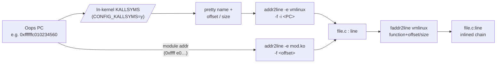
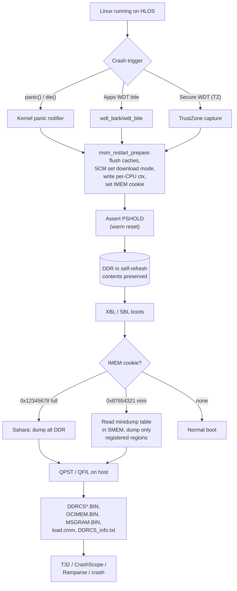
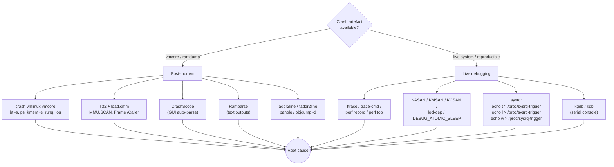

# Linux Kernel Crash Dumps & Common Kernel Errors — Consolidated Reference

> Consolidated from `Crash_Dump_Analysis_Guide_Part{1,2,3}.md` and
> `Linux_Kernel_Errors_Part{1,2,3}_of_3.md`. Overlap deduplicated; ARM64 /
> Qualcomm Snapdragon (SM8550 / QCS / SDX) focus.

---

## 1. Overview & Scope

When a Linux system misbehaves on an ARM64 / Qualcomm SoC, the kernel produces
diagnostic artefacts ranging from a single line in `dmesg` (`WARN_ON`) up to a
multi-gigabyte DDR snapshot delivered over USB via the Sahara protocol. This
document is the single-source reference for:

- **Kernel error taxonomy** — Oops vs BUG vs panic vs WARN vs softlockup vs
  hardlockup vs RCU stall vs hung-task.
- **Decoding** an ARM64 oops: ESR, FAR, PSTATE, PC/LR/SP, x0–x30, Code line.
- **Stack-trace mechanics** — frame pointers, unwind tables, KALLSYMS,
  `addr2line` / `faddr2line` workflow.
- **Runtime detectors** — KASAN, KFENCE, KMSAN, KCSAN, lockdep, SLUB_DEBUG,
  kmemleak, hung_task, watchdog.
- **Post-mortem pipelines** — kdump/kexec/`vmcore`, pstore/ramoops, Qualcomm
  ramdump/minidump, DCC, RTB, SSR per-subsystem dumps.
- **Common bug classes** with real `dmesg` excerpts and the canonical fix.
- **Tooling** — `crash(8)`, `gdb`, T32 (Lauterbach), CrashScope, Ramparse,
  `pahole`, `objdump`, `addr2line`, `ftrace`, `perf`, `trace-cmd`.

Cross-references (sibling docs in this knowledge base):

| Topic | See |
|---|---|
| MMU / page tables / faults at the hardware level | [01_ARM_ARM64_Memory_Management.md](01_ARM_ARM64_Memory_Management.md) |
| Scheduling internals, runqueues, preemption | [02_Scheduling_and_Synchronization.md](02_Scheduling_and_Synchronization.md) |
| Watchdog, IRQ storms, IPI, hardlockup detector | [03_Interrupts_IPI_and_Watchdog.md](03_Interrupts_IPI_and_Watchdog.md) |
| `procfs` / `sysfs` / driver model | [04_Linux_Drivers_DT_proc_sysfs_Syscalls.md](04_Linux_Drivers_DT_proc_sysfs_Syscalls.md) |

---

## 2. Kernel Error Taxonomy

The kernel reports anomalies through a small number of canonical mechanisms.
Knowing the difference dictates which post-mortem artefact you need to chase.

| Class | Severity | Continues? | Trigger | Primary artefact |
|---|---|---|---|---|
| `WARN_ON` / `WARN_ONCE` | Soft | Yes | Programmer assertion | `dmesg` + taint flag `W` |
| Oops | Hard (per-task) | Often yes (task killed) | Unhandled CPU exception in kernel | `dmesg` + Oops dump |
| `BUG_ON` | Hard | No (becomes panic on most configs) | Programmer assertion violation | Oops dump → panic |
| `panic()` | Fatal | No | Unrecoverable kernel state | Full panic dump + kdump/ramdump |
| Soft lockup | Hard | Often yes | CPU did not call `schedule()` for ~20 s | `dmesg`: "BUG: soft lockup" + all-CPU bt |
| Hard lockup | Fatal | No | No NMI/timer for >10 s (IRQs off too long) | NMI backtrace, then watchdog reset |
| RCU stall | Hard | Yes | RCU grace period not advancing | `dmesg`: "INFO: rcu_sched detected stalls" |
| Hung task | Hard | Yes | Task in `D` state > 120 s | `dmesg`: "INFO: task X blocked for more than 120s" |
| Watchdog bite | Fatal | No | HW WDT not pet in time | Reset, then ramdump on next boot |
| OOM | Fatal (per-task) | Yes | Memory exhausted | `dmesg`: oom-killer + score |

### 2.1 Tainted Kernel Flags

Tainting tells you the kernel cannot be fully trusted even before the crash.
Common flags seen in oops headers:

| Flag | Meaning |
|---|---|
| `G` | Only GPL modules loaded (clean) |
| `P` | Proprietary module loaded |
| `O` | Out-of-tree module loaded |
| `W` | A `WARN_ON()` previously fired |
| `F` | A module was force-loaded (`insmod -f`) |
| `E` | An unsigned module was loaded |
| `C` | Staging driver loaded |
| `D` | Kernel previously died (oops) and continued |

---

## 3. Anatomy of a Kernel Oops on ARM64

A complete ARM64 oops contains six logical sections. The example below is the
canonical "NULL+0x28" workqueue crash.

```text
[  142.857392] Unable to handle kernel NULL pointer dereference at virtual address 0000000000000028
[  142.857401] Mem abort info:
[  142.857404]   ESR = 0x96000005
[  142.857408]   EC = 0x25: DABT (current EL), IL = 32 bits
[  142.857412]   SET = 0, FnV = 0
[  142.857415]   EA = 0, S1PTW = 0
[  142.857418]   FSC = 0x05: level 1 translation fault
[  142.857421] Data abort info:
[  142.857424]   ISV = 0, ISS = 0x00000005
[  142.857427]   CM = 0, WnR = 0
[  142.857430] user pgtable: 4K pages, 48-bit VAs, pgdp=0000000087654000
[  142.857439] Modules linked in: wlan(O) machine_dlkm(O) snd_soc(O)
[  142.857456] CPU: 4 PID: 1523 Comm: kworker/4:1 Tainted: G        W  O  5.15.78 #1
[  142.857462] Hardware name: Qualcomm Technologies, Inc. SM8550 (DT)
[  142.857466] Workqueue: events my_buggy_work_handler [my_module]
[  142.857475] pstate: 60400005 (nZCv daif +PAN -UAO -TCO -DIT -SSBS BTYPE=--)
[  142.857483] pc : my_buggy_function+0x48/0x120 [my_module]
[  142.857491] lr : my_caller_function+0x84/0xf0 [my_module]
[  142.857498] sp : ffffffc01a3cbc80
[  142.857501] x29: ffffffc01a3cbc80  x28: ffffff8012345000  x27: 0000000000000001
[  142.857510] x26: ffffff8056789abc  x25: ffffffc0104e3000  x24: 0000000000000000
[  142.857518] x23: ffffff8034567890  x22: 0000000000000001  x21: ffffff8012340078
[  142.857526] x20: ffffff801234a000  x19: 0000000000000000  x18: ffffffc01a480000
[  142.857534] x17: 0000000000000000  x16: ffffffc010123450  x15: 0000000000000040
[  142.857583] x2 : 0000000000000028  x1 : 0000000000000000  x0 : 0000000000000000
[  142.857583] Call trace:
[  142.857586]  my_buggy_function+0x48/0x120 [my_module]
[  142.857594]  my_caller_function+0x84/0xf0 [my_module]
[  142.857601]  process_one_work+0x1e8/0x390
[  142.857608]  worker_thread+0x50/0x410
[  142.857614]  kthread+0x108/0x110
[  142.857620]  ret_from_fork+0x10/0x20
[  142.857628] Code: f9400693 b4000073 f9401663 f9400a84 (f9401660)
[  142.857636] ---[ end trace 8e4c23b5a1d3f678 ]---
[  142.857641] Kernel panic - not syncing: Oops: Fatal exception
```

### 3.1 ESR_EL1 Decode

```text
+--------+--------+----+------------------------+
| 63..32 | 31..26 | 25 |       24..0            |
|  RES0  |   EC   | IL |         ISS            |
+--------+--------+----+------------------------+
```

| Field | Bits | In example | Meaning |
|---|---|---|---|
| EC | [31:26] | `0x25` | Data Abort from current EL (kernel EL1) |
| IL | [25] | `1` | Faulting insn is 32-bit A64 |
| ISV | ISS[24] | `0` | Instruction Syndrome not valid |
| SET | ISS[12:11] | `0` | Recoverable synchronous error |
| FnV | ISS[10] | `0` | FAR_EL1 is valid |
| EA | ISS[9] | `0` | Not an external abort |
| S1PTW | ISS[7] | `0` | Not a stage-1 page-table walk fault |
| WnR | ISS[6] | `0` | **Read** fault (1 would be write) |
| FSC | ISS[5:0] | `0x05` | Level 1 translation fault |

**FSC quick decode** (the value usually shouted by the oops):

| FSC | Meaning |
|---|---|
| 0x04 | Translation fault, level 0 (wild ptr, completely unmapped) |
| 0x05 | Translation fault, level 1 (NULL + small offset typical) |
| 0x06 | Translation fault, level 2 |
| 0x07 | Translation fault, level 3 (specific PTE invalid / freed page) |
| 0x09–0x0B | Access flag fault L1/L2/L3 |
| 0x0D–0x0F | Permission fault L1/L2/L3 (RO write, PAN, exec-never) |
| 0x10 | Synchronous external abort (NoC / bus error) |
| 0x21 | Alignment fault (Device-nGnRnE unaligned access) |

### 3.2 PSTATE Decode

`pstate: 60400005` decoded as `nZCv daif +PAN -UAO -TCO -DIT -SSBS BTYPE=-- EL1`:

| Field | Value | Meaning |
|---|---|---|
| N Z C V | nZCv | last op result was zero with carry, not negative, no overflow |
| D A I F | `daif` (all set) | Debug, SError, IRQ, FIQ **all masked** — typical inside the panic handler |
| PAN | `+PAN` | Privileged Access Never set; kernel cannot directly touch user memory |
| EL | `01` | Exception Level 1 = kernel mode |

### 3.3 Register Roles (AAPCS64)

| Reg(s) | ABI role | Save class | Why it matters in an oops |
|---|---|---|---|
| `x0–x7` | Args / return value | Caller-saved | Arguments at call site; clobbered by callees |
| `x8` | Indirect result | Caller-saved | Used for sret of large structs |
| `x9–x15` | Temporaries | Caller-saved | Scratch — unreliable beyond the immediate frame |
| `x16 (IP0), x17 (IP1)` | Linker veneers | Caller-saved | Set by PLT stubs, not useful for state |
| `x18` | Per-CPU base (Linux) | Special | Holds `__per_cpu_offset` for the running CPU |
| `x19–x28` | Callee-saved | **Preserved** | **Most reliable** — usually holds the bad pointer |
| `x29 (FP)` | Frame pointer | Callee-saved | Chains stack frames for unwind |
| `x30 (LR)` | Link register | Special | Return address — tells you the immediate caller |
| `sp` | Stack pointer | Special | 16-byte aligned in AArch64 |

### 3.4 Decoding the `Code:` Line

```text
Code: f9400693 b4000073 f9401663 f9400a84 (f9401660)
                                           ^^^^^^^^^^
                                           faulting instruction
```

| Encoding | Disasm | Notes |
|---|---|---|
| `f9400693` | `LDR  X19, [X20, #0x8]` | Loaded the NULL into X19 |
| `b4000073` | `CBZ  X19, <skip>` | A NULL check existed but was bypassed by race |
| `f9401663` | `LDR  X3,  [X19, #0x28]` | First deref — same offset |
| `f9400a84` | `LDR  X4,  [X20, #0x10]` | Unrelated load |
| `f9401660` | `LDR  X0,  [X19, #0x28]` | **Faults**: X19 = 0, EA = 0 + 0x28 |

Cross-checked against `x19 = 0`, the FAR = `0x28`, WnR = 0: classic NULL +
struct-member dereference. `pahole -C <struct> vmlinux` will name the member.

### 3.5 ARM64 Address Bands (Mental Map)

| VA range | Meaning |
|---|---|
| `0x0000_0000_0000_0000 – 0x0000_0000_0000_FFFF` | NULL-deref zone |
| `0x0000_xxxx_xxxx_xxxx` | User VA (TTBR0_EL1) |
| `0xFFFF_8000_xxxx_xxxx` | Kernel linear map (`PAGE_OFFSET`) |
| `0xFFFF_C000_xxxx_xxxx` | vmalloc / `ioremap` region |
| `0xFFFF_E000_xxxx_xxxx` | Modules region (`.ko`) |
| `0xDEAD0000_0000_0100` | `LIST_POISON1` (freed `list_head.next`) |
| `0xDEAD0000_0000_0122` | `LIST_POISON2` (freed `list_head.prev`) |
| `0x6B6B6B6B6B6B6B6B` | SLUB freed poison — use-after-free |
| `0xA5A5A5A5A5A5A5A5` | SLAB allocated-uninitialised poison |

---

## 4. Stack Trace Interpretation

Reading a backtrace correctly is the single most useful skill for kernel
debugging.

### 4.1 Format

```text
function_name + offset / total_size [module]
       │            │         │         │
       │            │         │         └── empty for vmlinux text
       │            │         └── total function size in bytes
       │            └── offset into function (PC - function_start)
       └── symbol resolved via KALLSYMS
```

`process_one_work+0x1e8/0x390` ⇒ PC is 488 bytes into a 912-byte function.

### 4.2 Symbol Resolution Pipeline



### 4.3 Two Backtrace Mechanisms

- **Frame-pointer (FP) unwind** (`CONFIG_FRAME_POINTER=y`): walk `x29` chain.
  Cheap, robust, but every function must save FP — costs a register and ~4 %
  perf.
- **ORC / unwind tables** (`CONFIG_UNWINDER_ORC=y` on x86, ARM64 uses
  `.debug_frame` / EHABI on 32-bit, fp-based on 64-bit). No runtime cost; relies
  on per-function metadata generated at build time.

### 4.4 The `faddr2line` Workflow

```bash
# 1. Compile with debug info
make ARCH=arm64 CONFIG_DEBUG_INFO=y CONFIG_DEBUG_INFO_DWARF5=y vmlinux

# 2. Resolve a fragment from an oops
./scripts/faddr2line vmlinux process_one_work+0x1e8/0x390
# -> kernel/workqueue.c:2289

# 3. Or feed the whole dmesg
./scripts/decode_stacktrace.sh vmlinux < oops.txt

# 4. Module case
./scripts/faddr2line my_module.ko my_buggy_function+0x48/0x120
```

### 4.5 Stack-Frame Layout (ARM64)

```text
HIGH addresses
+-------------------------------------+
| ... caller's frame ...              |
+-------------------------------------+ <- caller's X29
| Saved X30 (caller's LR)             | [X29 + 8]
| Saved X29 (caller's FP)             | [X29 + 0]
+-------------------------------------+ <- current X29 (FP)
| Saved X30 (our return into caller)  | [FP + 8]
| Saved X29 (caller's FP — the chain) | [FP + 0]
| Saved callee regs (X19..X28 pairs)  |
| Local variables, spills             | (16-byte aligned)
+-------------------------------------+ <- current SP
LOW addresses
```

---

## 5. `BUG_ON`, `WARN_ON`, `panic()` Internals

### 5.1 What They Compile To

```c
/* include/asm-generic/bug.h (simplified) */
#define WARN_ON(cond)  __WARN_FLAGS(0,             cond)
#define BUG_ON(cond)   do { if (unlikely(cond)) BUG(); } while (0)
#define BUG()          do { __BUG(); unreachable(); } while (0)
```

On ARM64 both expand to a `BRK` instruction with an immediate that encodes the
bug type plus a `__bug_entry` recorded in a separate ELF section
(`__bug_table`). The trap handler matches the BRK PC against this table to pull
file/line/condition.

### 5.2 Behaviour Matrix

| Macro | Stop the kernel? | Backtrace? | Continue task? | Common use |
|---|---|---|---|---|
| `WARN_ON(c)` | No | Yes | Yes (taints `W`) | Programmer assertion in non-critical path |
| `WARN_ON_ONCE(c)` | No | Yes (once) | Yes | Rate-limited variant |
| `BUG_ON(c)` | Effectively yes on most configs | Yes | No (oops → panic) | "This must never happen" |
| `BUG()` | Same | Yes | No | Unreachable code |
| `panic("msg")` | Yes (full system halt) | Yes | No | Unrecoverable global state |

### 5.3 The `panic()` Path

```c
void panic(const char *fmt, ...)
{
    /* 1. Disable preemption, raise oops_in_progress */
    /* 2. Call panic_notifier_list (kdump prep, Qualcomm IMEM cookie set) */
    /* 3. crash_kexec() -> jump to capture kernel if configured */
    /* 4. console_unblank(), dump_stack(), bust_spinlocks() */
    /* 5. If panic_timeout != 0 -> emergency_restart() */
    /* 6. Else loop forever (hardware watchdog will reset) */
}
```

`panic_on_oops=1` (sysctl) promotes every oops to a panic — recommended for CI
and most embedded production builds.

---

## 6. Soft Lockup vs Hard Lockup Detectors

Both are implemented by `kernel/watchdog.c` and produce very different signals.

| Aspect | Soft lockup | Hard lockup |
|---|---|---|
| Definition | CPU did not call `schedule()` for `watchdog_thresh × 2` (~20 s) | No timer / NMI on the CPU for `watchdog_thresh × 5` (~10 s) |
| Mechanism | Per-CPU `watchdog/N` kthread updates timestamp; hrtimer checks | NMI/perf-event watchdog; if IRQs were never re-enabled it cannot fire |
| Implication | Kernel code looping with preemption disabled | Kernel code looping with **IRQs disabled** (much worse) |
| Knobs | `kernel.watchdog_thresh`, `kernel.softlockup_panic` | `kernel.hardlockup_panic`, `nmi_watchdog=` |
| Recovery | Often self-recovers when offending CPU yields | None — system has to be reset |

Example soft lockup `dmesg`:

```text
[  238.451004] watchdog: BUG: soft lockup - CPU#3 stuck for 23s! [stress-ng:1924]
[  238.451010] Modules linked in: my_buggy(O) ...
[  238.451045] CPU: 3 PID: 1924 Comm: stress-ng Not tainted 5.15.78 #1
[  238.451051] pstate: 80400005 (Nzcv daif +PAN -UAO -TCO -DIT -SSBS BTYPE=--)
[  238.451060] pc : queued_spin_lock_slowpath+0x144/0x300
[  238.451068] lr : _raw_spin_lock+0x60/0x70
[  238.451075] Call trace:
[  238.451078]  queued_spin_lock_slowpath+0x144/0x300
[  238.451084]  my_critical_section+0x40/0x90 [my_buggy]
[  238.451090]  process_one_work+0x1e8/0x390
```

Example hard lockup:

```text
[  300.001234] NMI watchdog: Watchdog detected hard LOCKUP on cpu 2
[  300.001240] CPU: 2 PID: 0 Comm: swapper/2 Tainted: G        W  O  5.15.78 #1
[  300.001247] pc : __delay+0x18/0x30
[  300.001252] lr : __const_udelay+0x30/0x40
[  300.001258] Call trace:
[  300.001260]  __delay+0x18/0x30
[  300.001266]  my_isr_buggy+0x84/0x100 [bad_driver]
[  300.001272]  __handle_irq_event_percpu+0x60/0x1b0
[  300.001280]  handle_irq_event+0x6c/0xc0
```

Triage: `crash> bt -a` to see **all** CPUs at once. A holder spinning in
`__delay` while another CPU spins in `queued_spin_lock_slowpath` for the same
lock is the classic ABBA / lock-with-IRQs-off pattern.

---

## 7. RCU Stall

RCU stall means a grace period has not advanced. The most common causes are:

- A CPU stuck with preemption / IRQs disabled (so it never reaches a quiescent
  state). Often co-reported with soft lockup.
- A real-time task hogging a CPU on `PREEMPT_RT` builds.
- Long-running `synchronize_rcu()` callers blocking other writers.
- Mis-configured offloaded callback CPUs (`rcu_nocbs=`).

Example:

```text
[  450.123456] rcu: INFO: rcu_sched self-detected stall on CPU
[  450.123461] rcu:     1-....: (5249 ticks this GP) idle=0c2/1/0x4000000000000002 softirq=12345/12345 fqs=2624
[  450.123470]  (t=5250 jiffies g=99457 q=128)
[  450.123476] Task dump for CPU 1:
[  450.123480] task:my_worker       state:R  running task     stack:    0 pid: 4321 ppid:     2
[  450.123488] Call trace:
[  450.123492]  dump_backtrace+0x0/0x1a0
[  450.123498]  show_stack+0x1c/0x28
[  450.123504]  sched_show_task+0x148/0x178
[  450.123509]  rcu_dump_cpu_stacks+0xe8/0x130
```

Useful knobs (under `/sys/module/rcupdate/parameters/` and
`/sys/module/rcutree/parameters/`):

| Parameter | Purpose |
|---|---|
| `rcu_cpu_stall_timeout` | Detection threshold in seconds (default 21) |
| `rcu_cpu_stall_suppress` | Mute stall reports (debug only) |
| `rcu_cpu_stall_ftrace_dump` | Auto-dump ftrace on stall |
| `rcu_normal` | Force synchronous behaviour for debugging |

---

## 8. Out-of-Memory (OOM) Killer

When all reclaim paths fail, `out_of_memory()` picks a victim by `oom_score`:

```text
oom_score(task) ~= total_vm + heuristics, scaled by oom_score_adj
```

`oom_score_adj` is a per-task knob in `/proc/<pid>/oom_score_adj`, range
`-1000` (immortal) … `+1000` (kill first). Android `lmkd` and many container
runtimes set this aggressively.

Example dmesg excerpt:

```text
[  900.111111] memhog invoked oom-killer: gfp_mask=0xcc0(GFP_KERNEL), order=0, oom_score_adj=0
[  900.111125] CPU: 0 PID: 2345 Comm: memhog Not tainted 5.15.78 #1
[  900.111140] Mem-Info:
[  900.111142] active_anon:524288 inactive_anon:0 isolated_anon:0
[  900.111150]  free:5120 free_pcp:120 free_cma:0
[  900.111171] Tasks state (memory values in pages):
[  900.111174] [  pid  ]   uid  tgid total_vm      rss pgtables_bytes swapents oom_score_adj name
[  900.111201] [   2345]     0  2345   1048640  1047120     8392704        0             0 memhog
[  900.111240] oom-killer: Out of memory: Killed process 2345 (memhog) total-vm:4194560kB, anon-rss:4188480kB
[  900.111260] oom_reaper: reaped process 2345 (memhog), now anon-rss:0kB, file-rss:0kB, shmem-rss:0kB
```

The **`oom_reaper` kthread** (since 4.6) asynchronously tears down the victim's
anonymous mappings so even an uncooperative process releases memory promptly.
Absence of the `oom_reaper: reaped` line ⇒ the victim had `MMF_OOM_SKIP` or was
holding `mmap_lock` for write (the OOM livelock pattern).

---

## 9. Kernel Memory Bugs — Sanitizers & Debug Allocators

| Tool | Catches | Overhead | Use |
|---|---|---|---|
| KASAN (`CONFIG_KASAN=y`) | UAF, out-of-bounds (heap/stack/global) | 2–3× slowdown, ~1.5× memory | Dev / CI |
| KFENCE (`CONFIG_KFENCE=y`) | Sampling heap UAF / OOB | <1 % | Production |
| KMSAN (`CONFIG_KMSAN=y`, clang) | Uninitialised reads | ~3× | Dev |
| KCSAN (`CONFIG_KCSAN=y`) | Data races | Sampling | Dev / CI |
| `SLUB_DEBUG=y` (`slub_debug=FZPU`) | Slab corruption, double-free | Moderate | CI / soak |
| `DEBUG_PAGEALLOC=y` | UAF of whole pages (unmaps on free) | High | Dev |
| `PAGE_POISONING=y` | Stale data after page-free | Moderate | Dev |
| `kmemleak` | Long-lived orphan allocations | Low | Periodic soak |
| `page_owner` (`page_owner=on`) | Who allocated which page | Boot flag | Dev |

### 9.1 Sample KASAN Report (UAF)

```text
==================================================================
BUG: KASAN: use-after-free in vfe_isr+0x84/0x1f0 [camera_vfe]
Read of size 8 at addr ffff0000c5a23040 by task irq/97-vfe/231

CPU: 4 PID: 231 Comm: irq/97-vfe Tainted: G    B    W  O  5.15.78 #1
Call trace:
 dump_backtrace+0x0/0x1a0
 show_stack+0x1c/0x28
 dump_stack_lvl+0x68/0x84
 print_address_description.constprop.0+0x70/0x2c8
 kasan_report+0x1a8/0x1f8
 __asan_load8+0x9c/0xc0
 vfe_isr+0x84/0x1f0 [camera_vfe]
 irq_thread_fn+0x34/0xa8

Allocated by task 1205:
 kasan_save_stack+0x28/0x58
 __kasan_kmalloc+0x90/0xb0
 kmem_cache_alloc_trace+0x16c/0x308
 vfe_buf_alloc+0x40/0x90 [camera_vfe]
 vb2_queue_init+0x1d4/0x2d8

Freed by task 1209:
 kasan_save_stack+0x28/0x58
 kasan_set_track+0x28/0x40
 kasan_set_free_info+0x24/0x40
 __kasan_slab_free+0x100/0x148
 kfree+0x9c/0x1d0
 vfe_buf_cleanup+0x38/0x60 [camera_vfe]
 vb2_buffer_done+0xa4/0x150

The buggy address belongs to the object at ffff0000c5a23000
 which belongs to the cache kmalloc-128 of size 128
==================================================================
```

The report names **allocator**, **alloc stack**, **free stack** and the
**access stack** — almost always enough to identify the missing
`synchronize_irq()` / `cancel_work_sync()` / refcount.

### 9.2 Quick Boot-line Reference

```text
kasan.fault=panic          # turn first KASAN report into a panic (CI)
slub_debug=FZPU            # F=free poison, Z=redzone, P=panic, U=user tracking
slub_debug=FZPU,kmalloc-128 # restrict to one cache (lower overhead)
page_owner=on              # record alloc stack per-page
page_poison=1              # poison freed pages
init_on_free=1             # zero memory on free
init_on_alloc=1            # zero memory on alloc
```

---

## 10. Use-After-Free, Double-Free, Out-of-Bounds — Signatures and Fixes

### 10.1 Use-After-Free

| Hint | Meaning |
|---|---|
| FAR / register = `0x6b6b6b6b6b6b6b6b` | SLUB freed poison still in place |
| KASAN report with `Freed by task …` | Confirmed UAF (with both stacks) |
| Random "translation fault L3" on a kernel VA that **was** valid earlier | Page-level UAF |
| Sporadic crashes that disappear under `slub_debug=F` | Indirect confirmation (poison stops reuse) |

**Canonical fix** — synchronise the consumer **before** freeing:

```c
/* WRONG */
kfree(dev->rx_buf);              /* freed... */
cancel_work_sync(&dev->rx_work); /* ...too late, work may have run */

/* RIGHT */
cancel_work_sync(&dev->rx_work); /* drain consumer first */
disable_irq(dev->irq);
synchronize_irq(dev->irq);
dmaengine_terminate_sync(dev->rx_chan);
kfree(dev->rx_buf);
dev->rx_buf = NULL;
```

### 10.2 Double-Free

```text
==================================================================
BUG: KASAN: double-free or invalid-free in qcom_remove+0x48/0x90
Free of addr ffff0000c1234500 by task rmmod/1892
First free  : kfree+0x90/0x1c0 -> qcom_runtime_suspend+0x34/0x80
Second free : kfree+0x90/0x1c0 -> qcom_remove+0x48/0x90
==================================================================
```

Golden rule: **always `ptr = NULL;` immediately after `kfree()`**. `kfree(NULL)`
is a no-op, so the second free becomes harmless instead of corrupting the SLUB
freelist into a circular list (which silently returns the same address from two
subsequent `kmalloc()` calls).

### 10.3 Out-of-Bounds

```text
==================================================================
BUG: KASAN: slab-out-of-bounds in ipa_parse_headers+0x44/0x80 [ipa]
Write of size 8 at addr ffff0000c1234580 by task qmi_worker/567
The buggy address belongs to the object at ffff0000c1234500
 which belongs to the cache kmalloc-128 of size 128
The buggy address is located 0 bytes to the right of 128-byte region
==================================================================
```

The phrase "**0 bytes to the right**" plus a `<=` loop bound is the textbook
off-by-one. Fix the loop, not the buffer size.

---

## 11. Deadlocks & Lockdep

When `CONFIG_PROVE_LOCKING=y`, lockdep tracks every locking class and the order
in which classes are acquired. Two reports dominate practice.

### 11.1 "Possible Recursive Locking"

```text
============================================
WARNING: possible recursive locking detected
5.15.78 #1 Tainted: G        W  O
--------------------------------------------
CPU0/1234 is trying to acquire lock:
ffff800012345678 (&dev->lock){+.+.}-{2:2}, at: my_handler+0x40/0x90 [drv]

but task is already holding lock:
ffff800012345678 (&dev->lock){+.+.}-{2:2}, at: my_caller+0x60/0xc0 [drv]
```

Diagnosis: the same `struct mutex` / `spinlock_t` was taken twice on the same
path. Either restructure the call graph, or use a recursive primitive
(`mutex_lock_nested()` with subclass) when the recursion is correct-by-design.

### 11.2 "Inconsistent Lock State" (Hardirq-safe vs Hardirq-unsafe)

```text
================================
WARNING: inconsistent lock state
5.15.78 #1 Tainted: G        W
--------------------------------
inconsistent {IN-HARDIRQ-W} -> {HARDIRQ-ON-W} usage.
swapper/0/0 [HC0[0]:SC0[0]:HE1:SE1] takes:
ffff800012345678 (&q->lock){+.+.}-{2:2}, at: process_path+0x20/0x80

{IN-HARDIRQ-W} state was registered at:
  lock_acquire+0xb8/0x158
  _raw_spin_lock+0x40/0x60
  irq_handler+0x30/0x80
```

This is "you took this lock from an IRQ handler before, and now you are taking
it from process context **without** disabling IRQs." Fix: change the process
path to `spin_lock_irqsave()`.

### 11.3 ABBA Circular Deadlock

```text
======================================================
WARNING: possible circular locking dependency detected
------------------------------------------------------
the existing dependency chain (in reverse order) is:
-> #1 (&A){+.+.}-{3:3}:
       process_one_work -> wq_work_fn -> takes A then B
-> #0 (&B){+.+.}-{3:3}:
       my_other_path  -> takes B then A
```

Lockdep prints the exact two paths that establish the cycle. The fix is almost
always to enforce a global lock order in code (and document it in a header).

---

## 12. Kdump & vmcore

`kdump` is the upstream "reserve memory, boot a tiny second kernel on panic,
dump RAM" mechanism. It is rare on phone SoCs (which use the Qualcomm warm-reset
ramdump path instead) but standard on server / automotive Linux.

### 12.1 Pipeline

```mermaid
flowchart LR
    Boot["Boot kernel<br/>(production)"] -->|crashkernel=512M| Reserve["Reserve crash<br/>memory at boot"]
    Reserve --> Run["Normal operation"]
    Run -->|panic() / oops| KE["crash_kexec()"]
    KE --> Cap["Boot capture kernel<br/>in reserved region"]
    Cap --> Mount["Mount /proc/vmcore<br/>(ELF view of old RAM)"]
    Mount --> Save["makedumpfile -d 31<br/>compress + filter"]
    Save --> Disk[/"vmcore on disk<br/>or via NFS/SSH"/]
    Disk --> Crash["crash vmlinux vmcore"]
    Crash --> Analyst[("Engineer")]
```

### 12.2 Setup Cheatsheet

```bash
# 1. Reserve memory at boot
#    Cmdline: crashkernel=512M-:256M  (256M if total >=512M)
grep crashkernel /proc/cmdline

# 2. Install + enable kdump tooling
apt install kdump-tools makedumpfile crash
systemctl enable --now kdump-tools

# 3. Verify the capture kernel is loaded
kexec --kexec-file-syscall -l /boot/vmlinuz-$(uname -r) \
      --initrd=/boot/initrd.img-$(uname -r) \
      --reuse-cmdline

# 4. Trigger a test panic (will reboot through capture kernel)
echo c > /proc/sysrq-trigger

# 5. After reboot, the dump lives at /var/crash/<timestamp>/vmcore
ls -lh /var/crash/$(ls -t /var/crash | head -1)
```

### 12.3 `makedumpfile` Filtering

```text
makedumpfile -d <level> <input vmcore> <output vmcore.zst>
  -d 1 : zero pages
  -d 2 : cache pages
  -d 4 : cache + private (anon)
  -d 8 : user data
  -d 16: free pages
  -d 31: ALL of the above (smallest dump)
  -c | -l | -p : compress with zlib / lzo / snappy / zstd
```

---

## 13. `crash(8)` Utility — Basic Commands

`crash` opens either a vmcore or a Qualcomm ramdump (via Ramparse-produced
vmcore wrapper) with a matching `vmlinux`:

```bash
crash vmlinux vmcore               # kdump
crash vmlinux @ramdump_dir         # Qualcomm parsed ramdump
crash --minimal vmlinux            # live kernel introspection (no vmcore)
```

| Command | What it does |
|---|---|
| `log` | Full kernel log (`dmesg`) at crash time |
| `bt` | Backtrace of the panicking task |
| `bt -a` | Backtrace of **all** CPUs (must-have for lockups) |
| `bt -F` | Frame sizes — find the deepest call site |
| `bt <pid>` | Backtrace of a specific task |
| `ps` / `ps -k` | All tasks / kernel threads only |
| `task <addr>` | Pretty-print a `task_struct` |
| `runq` | Per-CPU run queues |
| `irq -a` | All IRQ descriptors and handlers |
| `mod` | Loaded modules and their load addresses |
| `mod -S /path/to/mods` | Load module debug symbols |
| `files <pid>` | Open file descriptors of a task |
| `vm <pid>` | VMAs of a task |
| `kmem -s` | Slab usage |
| `kmem -i` | Memory info (free/used/buddy) |
| `kmem <addr>` | Identify what kind of object lives at an address |
| `rd <addr> <count>` | Read raw memory |
| `dis <sym>` / `dis -l <addr>` | Disassemble (with source if available) |
| `struct task_struct` | Show layout of a type |
| `p init_task` | Print a global |
| `search -u <pattern>` | Search memory for a pattern |
| `whatis <sym>` | Type of a symbol |

---

## 14. Qualcomm RAM Dumps — SDI, T32, QPST/QFIL, Ramparse

Qualcomm uses a **warm-reset** path so DDR contents survive: the PMIC parks
DRAM in self-refresh while the apps processor goes through PSHOLD → XBL, and
the bootloader inspects an IMEM cookie to decide between normal boot and dump
collection (Sahara/Firehose over USB).

### 14.1 End-to-End Architecture



### 14.2 Full Ramdump vs Minidump

| Aspect | Full Ramdump | Minidump |
|---|---|---|
| Size | Entire DDR (2 – 12 GB+) | 50 – 200 MB |
| Collection time | Minutes (USB-bound) | Seconds |
| Content | All physical memory | Only `msm_minidump_add_region()` registered ranges |
| Production-safe? | No | Yes |
| Kconfig | `CONFIG_QCOM_DLOAD_MODE=y` | `CONFIG_QCOM_MINIDUMP=y` |
| Tooling | T32, crash, CrashScope, Ramparse | Ramparse, CrashScope |

### 14.3 Default Minidump Regions

| Region | Content |
|---|---|
| `KLOGBUF` | Kernel log buffer (printk ring) |
| `KCRASHINFO` | Crash metadata / panic reason |
| `KCPUCONTEXT_<n>` | Per-CPU register context at crash |
| `KCURRENTTASK_<n>` | Per-CPU `task_struct` of current task |
| `KSTACK_<n>` | Per-task kernel stack |
| `KIRQSTACK_<n>` | Per-CPU IRQ stack |
| `KPANICDUMP` | Panic info |
| `KRUNQUEUES` | Scheduler runqueues |
| `KWQACTIVE` | Active workqueues |
| `KPGTABLE` | `swapper_pg_dir` |
| `KTIMER` | Timer wheels |
| `KRCU` | RCU tree |
| `KMODULES` | Loaded modules + addresses |
| `KRTB` | Register Trace Buffer (per-CPU event ring) |
| `DCC_SRAM` | DCC captured hardware registers |

### 14.4 Registering a Custom Region

```c
#include <soc/qcom/msm_minidump.h>

static char drv_state[PAGE_SIZE] __aligned(PAGE_SIZE);
static struct md_region md;

scnprintf(md.name, sizeof(md.name), "MY_DRV_STATE");
md.virt_addr = (u64)drv_state;
md.phys_addr = virt_to_phys(drv_state);
md.size      = PAGE_SIZE;
if (msm_minidump_add_region(&md) < 0)
    dev_warn(dev, "minidump register failed\n");
```

### 14.5 DCC (Data Capture & Compare)

DCC is a dedicated hardware block that autonomously latches a programmed list
of MMIO register addresses into on-chip SRAM when a crash trigger fires. It can
capture state (clock gates, NoC status, BIMC, TLMM, RPM) **after** the CPU has
already wedged. Output appears as `DCC_SRAM` in every dump.

### 14.6 Ramparse

```bash
python ramparse.py \
    --vmlinux vmlinux \
    --ram-file DDRCS0_0.BIN@0x80000000 \
    --ram-file DDRCS0_1.BIN@0xC0000000 \
    --outdir parsed/ --everything

# Minidump variant
python ramparse.py --vmlinux vmlinux \
    --minidump-dir minidump/ --outdir parsed/ --everything
```

Output (`parsed/`) typically contains: `dmesg.txt`, `tasks.txt`,
`backtrace.txt`, `irq.txt`, `workqueues.txt`, `timers.txt`, `modules.txt`,
`runqueue.txt`, `softirq.txt`, `rtb.txt`, `dcc.txt`, `slabinfo.txt`,
`watchdog.txt`.

### 14.7 T32 Loading Snippet

```text
; auto-generated load.cmm equivalent
SYStem.CPU CORTEXA73
SYStem.Option MMUSPACES ON
Data.Load.Binary "DDRCS0_0.BIN" 0x80000000--0xBFFFFFFF /NoClear
Data.Load.Binary "DDRCS0_1.BIN" 0xC0000000--0xFFFFFFFF /NoClear
Data.Load.Binary "OCIMEM.BIN"   0x14680000--0x1469FFFF /NoClear
Data.Load.Elf    "vmlinux"      /NoCODE /NoClear /StripPART 4
MMU.FORMAT LINUXTABLES swapper_pg_dir
MMU.SCAN
MMU.ON
Register.Set PC <crash_pc>
Register.Set SP <crash_sp>
Frame /Caller
List
```

### 14.8 Subsystem (SSR) Dumps

| Subsystem | Mechanism | Tool | Path |
|---|---|---|---|
| Apps (HLOS) | full / mini | crash, T32, CrashScope, Ramparse | USB (Sahara) |
| Modem (MPSS) | SSR via PIL | T32 + modem syms | `/data/vendor/ssrdump/modem/` |
| ADSP | SSR via PIL | T32 + Hexagon | `/data/vendor/ssrdump/adsp/` |
| CDSP | SSR via PIL | T32 + Hexagon | `/data/vendor/ssrdump/cdsp/` |
| SLPI | SSR via PIL | T32 + SLPI syms | `/data/vendor/ssrdump/slpi/` |
| TZ (secure) | TZBSP logs | restricted | — |
| RPM / AOP | RPM region | T32 + RPM syms | inside ramdump |

---

## 15. pstore / ramoops

`pstore` is a generic "preserve printk across reboot" facility. The two backends
that matter on ARM:

- **ramoops** — reserved chunk of normal DRAM (kept by warm reset / SoC
  self-refresh) divided into `dmesg`, `console`, `pmsg` (user) and `ftrace`
  sub-regions.
- **EFI variables** — useful on UEFI systems.

### 15.1 DT Reservation

```dts
reserved-memory {
    ramoops@a0000000 {
        compatible = "ramoops";
        reg = <0x0 0xa0000000 0x0 0x100000>; /* 1 MiB */
        record-size  = <0x20000>;            /* 128 KiB per dmesg slot */
        console-size = <0x20000>;
        ftrace-size  = <0x20000>;
        pmsg-size    = <0x20000>;
        ecc-size     = <16>;
    };
};
```

### 15.2 Retrieval After Reboot

```bash
mount -t pstore pstore /sys/fs/pstore
ls /sys/fs/pstore/
# dmesg-ramoops-0   console-ramoops-0   pmsg-ramoops-0   ftrace-ramoops-0
cat /sys/fs/pstore/dmesg-ramoops-0 | head -60
# Older kernels:
cat /proc/last_kmsg
```

After reading, **delete the file** to free the slot for the next crash:

```bash
rm /sys/fs/pstore/dmesg-ramoops-0
```

---

## 16. Watchdog-Triggered Dumps

Two layers cooperate on Qualcomm platforms:

1. **Software watchdog** (`drivers/soc/qcom/qcom_wdt.c`) — a per-CPU `bark` ISR
   fires first (printable warning + bt of stuck CPU), then a `bite` IRQ ~3 s
   later if not pet, which writes the IMEM cookie and triggers the warm reset
   for dump capture.
2. **Hardware watchdog** (in the PMIC / TZ) — final safety net; resets the SoC
   unconditionally if even the bite path hangs.

```text
[  150.000000] qcom_wdt: Apps Watchdog bark! Now = 150.000
[  150.000010] qcom_wdt: CPU3 not responding to pet -> dumping all CPUs
[  150.000050] Call trace of CPU0..7 ...
[  153.000000] qcom_wdt: Apps Watchdog bite! Restarting via warm reset
```

After collection, follow the same Ramparse / T32 / CrashScope workflow as for a
panic.

---

## 17. Real-World Crash Walkthroughs

### 17.1 NULL Dereference in a Workqueue (DT-platform driver)

`dmesg` (truncated): `Unable to handle kernel NULL pointer dereference at
virtual address 0x0000000000000008` from `qcom_clk_probe+0x3c/0x1a0`.

```c
/* BUG */
const struct of_device_id *match =
    of_match_device(qcom_clk_match, &pdev->dev);
clk_data = (struct qcom_clk_data *)match->data;   /* match == NULL */

/* FIX */
match = of_match_device(qcom_clk_match, &pdev->dev);
if (!match || !match->data) {
    dev_err(&pdev->dev, "no matching device data\n");
    return -ENODEV;
}
clk_data = match->data;
```

Lesson: every `of_*`, `platform_get_*`, `devm_*` helper that can fail must be
checked. For pointer-returning APIs use `IS_ERR()` (e.g. `devm_clk_get` returns
`ERR_PTR(-EPROBE_DEFER)`, not `NULL`).

### 17.2 List Corruption / Use-After-Free in V4L2 Camera

KASAN reports UAF in `vfe_isr` after `vfe_buf_cleanup` freed the buffer during
`streamoff`. The free path raced with the in-flight VFE interrupt.

```c
/* FIX: stop hardware, sync IRQ, then free */
static void vfe_stop_streaming(struct vb2_queue *q)
{
    writel(0x0, vfe->base + VFE_IRQ_MASK);
    writel(0x1, vfe->base + VFE_HALT_CMD);
    synchronize_irq(vfe->irq);
    list_for_each_entry_safe(buf, tmp, &vfe->active_bufs, queue) {
        list_del(&buf->queue);
        vb2_buffer_done(&buf->vb.vb2_buf, VB2_BUF_STATE_ERROR);
    }
}
```

### 17.3 IRQ Storm / "nobody cared"

```text
[   45.123456] irq 114: nobody cared (try booting with the "irqpoll" option)
[   45.123470] handlers:
[   45.123473] [<00000000a1b2c3d4>] fg_thread_fn threaded [usb_irq]
[   45.123480] Disabling IRQ #114
```

Cause: `request_threaded_irq(... NULL, fg_thread_fn, IRQF_TRIGGER_LOW, ...)` —
no `IRQF_ONESHOT` was set, so the level-triggered line was never masked while
the thread handler ran, and the IRQ kept re-firing immediately.

```c
/* FIX */
request_threaded_irq(client->irq, NULL, fg_thread_fn,
                     IRQF_TRIGGER_LOW | IRQF_ONESHOT, "qcom-fg", fg);
```

### 17.4 "Scheduling while atomic" / Spinlock + Sleep

```text
BUG: sleeping function called from invalid context at mm/slab.h:494
in_atomic(): 1, irqs_disabled(): 0, non_block: 0, pid: 1205
preempt_count: 1
Call trace:
 __might_sleep+0x4c/0x80
 kmem_cache_alloc_trace+0x3c/0x2f0
 qcom_adsp_push_buffer+0x44/0xb0
```

`preempt_count = 1` means a spinlock is held. Fix by either allocating before
the lock or switching to `GFP_ATOMIC`:

```c
/* RIGHT — alloc outside lock */
buf = kmalloc(len, GFP_KERNEL);
if (!buf) return -ENOMEM;
spin_lock(&adsp->buf_lock);
list_add_tail(&buf->node, &adsp->buf_list);
spin_unlock(&adsp->buf_lock);
```

### 17.5 RCU Stall Triggered by Tight Loop

A driver added a `while (!cond) cpu_relax();` in a softirq with no upper bound.
Under load it spun for >21 s; RCU stall dump showed the same CPU at the same PC
over multiple samples. Fix: convert to `wait_event_timeout()` or a
`workqueue` + `completion`, since the original code path was already allowed to
sleep.

---

## 18. Debugging Tools Cheatsheet



| Tool | Best for |
|---|---|
| `crash(8)` | Interactive post-mortem on vmcore / parsed ramdump |
| `gdb vmlinux vmcore` | Same, when `crash` is unavailable; lower-level |
| T32 (Lauterbach) | JTAG/post-mortem with MMU walk, source-level views, watchpoints |
| CrashScope | One-shot Qualcomm GUI auto-parse |
| Ramparse | Python text-only auto-parse |
| `addr2line` | PC → file:line (vmlinux or `.ko`) |
| `faddr2line` | `function+offset/size` → file:line (handles inlines) |
| `pahole -C type vmlinux` | Identify struct member at a fault offset |
| `objdump -d vmlinux` | Manual disassembly around a PC |
| `ftrace` / `trace-cmd` | Live function tracing, latency tracers (irqsoff, preemptoff) |
| `perf` | CPU sampling, lock contention, scheduler events |
| `bpftrace` | Ad-hoc tracing via eBPF |
| `sysrq` (`echo c/t/l/w > /proc/sysrq-trigger`) | Force panic, dump tasks, all-CPU bt, blocked tasks |
| `kmemleak` | Long-running leak detection |

---

## 19. Common Pitfalls

1. **Mismatched `vmlinux`.** A 1-line patch shifts every address. Verify with
   `file vmlinux | grep "BuildID"` against the crashed kernel's `KERN_VERSION`.
2. **Free-then-sync.** `kfree()` followed by `synchronize_irq()` /
   `cancel_work_sync()` / `tasklet_kill()` — always the wrong order. Sync first.
3. **Checking `!ptr` instead of `IS_ERR(ptr)`** for APIs that return
   `ERR_PTR(-EPROBE_DEFER)` (clocks, regulators, GPIOs, PHYs).
4. **`spin_lock_irqsave` versus `spin_lock_bh`.** Pick by **the other side**:
   hardirq ⇒ `irqsave`; softirq/tasklet ⇒ `_bh`; nothing async ⇒ plain mutex.
5. **Forgetting `IRQF_ONESHOT`** on level-triggered + threaded IRQs — instant
   storm.
6. **Reading registers as the wrong width** (`readl` on a 1-byte PCIe config
   reg) causes a synchronous external abort, not a translation fault.
7. **Mixing `devm_*` and manual allocation** on the same struct: `devm_kzalloc`
   container freed automatically, the `kmalloc`'d sub-buffer leaks.
8. **Direct deref of `__user` pointers** — fails immediately with PAN enabled;
   always use `copy_{from,to}_user()` / `get_user()` / `put_user()`.
9. **Modifying a PTE without `flush_tlb_*()`** — silent data corruption, no
   fault; the CPU happily uses the cached translation.
10. **`mmap()` without `pgprot_noncached()`** for MMIO regions — cache
    incoherency, undefined reads.
11. **Treating a `WARN_ON` as harmless.** It taints the kernel `W`; later
    behaviour is no longer trusted. Investigate every first occurrence.
12. **Using a tainted `vmlinux` for decoding** — out-of-tree modules can move
    inline symbols; resolve `[module]` frames against the corresponding `.ko`,
    not `vmlinux`.

---

## 20. Cross-References

- ARM64 page-table layout, fault classes, SMMU/IOMMU — see
  [01_ARM_ARM64_Memory_Management.md](01_ARM_ARM64_Memory_Management.md).
- Scheduler, runqueues, preemption model, RCU primitives — see
  [02_Scheduling_and_Synchronization.md](02_Scheduling_and_Synchronization.md).
- IRQ subsystem, GIC, IPI, watchdog architecture — see
  [03_Interrupts_IPI_and_Watchdog.md](03_Interrupts_IPI_and_Watchdog.md).
- Driver model, devm APIs, sysfs/procfs lifetime — see
  [04_Linux_Drivers_DT_proc_sysfs_Syscalls.md](04_Linux_Drivers_DT_proc_sysfs_Syscalls.md).

---

## 21. Further Reading

Source documents consolidated into this reference:

1. [_raw_text/Crash_Dump_Analysis_Guide_Part1.md](_raw_text/Crash_Dump_Analysis_Guide_Part1.md)
2. [_raw_text/Crash_Dump_Analysis_Guide_Part2.md](_raw_text/Crash_Dump_Analysis_Guide_Part2.md)
3. [_raw_text/Crash_Dump_Analysis_Guide_Part3.md](_raw_text/Crash_Dump_Analysis_Guide_Part3.md)
4. [_raw_text/Linux_Kernel_Errors_Part1_of_3.md](_raw_text/Linux_Kernel_Errors_Part1_of_3.md)
5. [_raw_text/Linux_Kernel_Errors_Part2_of_3.md](_raw_text/Linux_Kernel_Errors_Part2_of_3.md)
6. [_raw_text/Linux_Kernel_Errors_Part3_of_3.md](_raw_text/Linux_Kernel_Errors_Part3_of_3.md)
