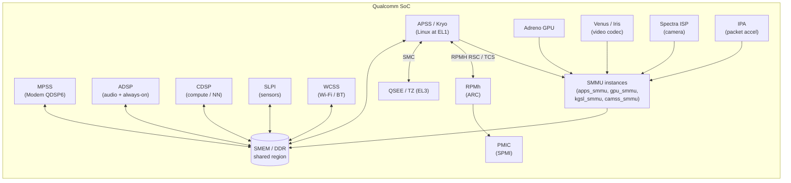
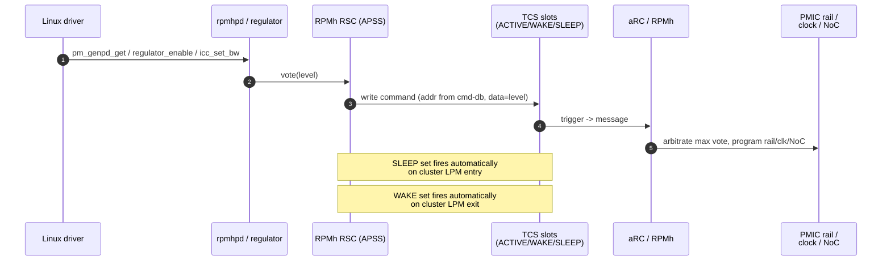
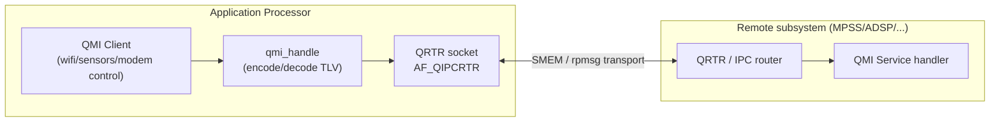
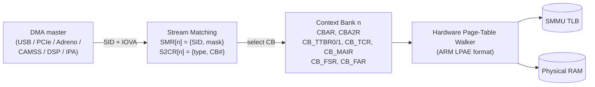
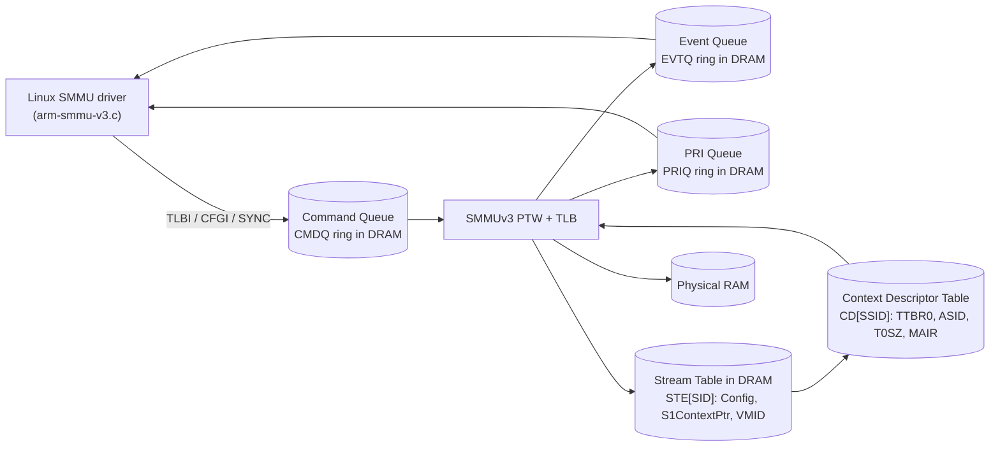
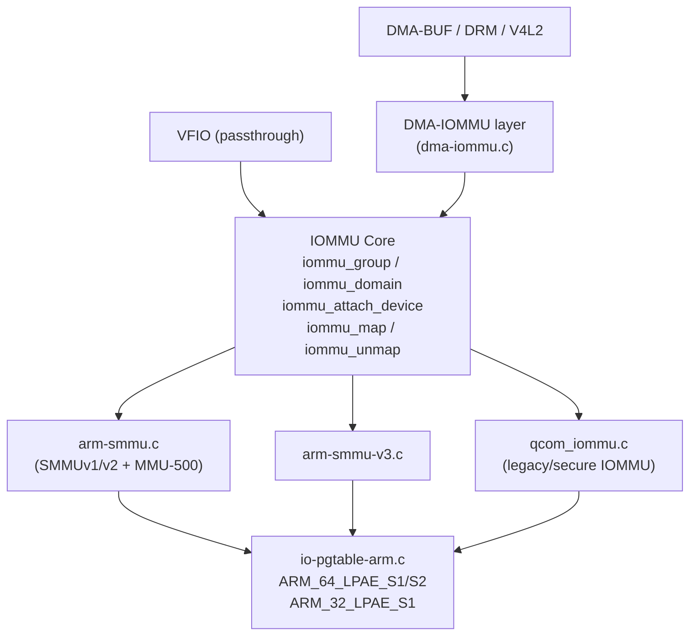
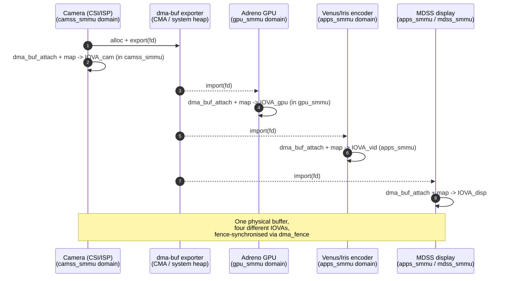

# Qualcomm Platform Internals — IOMMU/SMMU, Subsystems & Kernel Specifics — Consolidated Reference

> Synthesis of the Qualcomm Interview Guide (Parts 1–3) and the Qualcomm
> Linux Kernel Prep (Parts 1–3). Q&A material from those sources has been
> converted into prose; the reference question bank lives separately in
> `09_Interview_QA_Master.md`. This document is the **technical reference**
> for Qualcomm SoC kernel work, with deep emphasis on the ARM SMMU stack.

---

## 1. Overview of Qualcomm SoC Architecture (APSS, modem, ADSP, CDSP, SLPI, video/GPU)

Modern Qualcomm Snapdragon SoCs (SM8x50, SC8x80, SDX modems, automotive SA series)
are not a single CPU complex — they are a federation of heterogeneous processors,
each running independent firmware, each owning private SRAM/TCM, and each
arbitrated by Qualcomm's own interconnect, power, and security infrastructure.
From a Linux point of view the kernel runs on the application subsystem only
and talks to every other subsystem through shared memory, message routers, and
the SMMU. The major blocks are summarised below.

| Subsystem | Common name(s) | Function | Linux-side interface |
|-----------|----------------|----------|----------------------|
| APSS | Application Processor Subsystem, "apps", Kryo | Runs HLOS (Linux/Android), EL0–EL3 | The kernel itself |
| MPSS | Modem Subsystem, "modem", Hexagon QDSP6 | 4G/5G baseband, RF control | QMI services, rmnet, remoteproc, IPA |
| ADSP | Audio DSP, also called LPASS-aDSP | Audio decode/encode, voice, low-power sensors fastpath | ASoC, fastrpc, QMI |
| CDSP | Compute DSP, Hexagon NSP/HTA | NN/ML inference, image processing, general compute offload | fastrpc (`/dev/fastrpc-cdsp`), QNN SDK |
| SLPI | Sensor Low Power Island | Always-on sensor fusion (accel, gyro, mag) | QMI sensor service, IIO |
| WCSS / WCNSS | Wi-Fi / BT / FM connectivity | 802.11ax/be, Bluetooth, coex | mac80211 (ath11k/ath12k), QMI |
| Adreno GPU | Graphics processor (Adreno 7xx/8xx) | OpenGL ES, Vulkan, OpenCL | DRM/KMS (`msm` driver), Freedreno/Mesa |
| Video (Venus / Iris) | Hardware video codec | H.264/HEVC/VP9/AV1 encode/decode | V4L2 stateful/stateless |
| CAMSS / Spectra ISP | Image Signal Processor | Camera RAW pipeline, CSI-2 | V4L2 subdev, libcamera |
| IPA | Internet Packet Accelerator | LAN/WAN packet path offload | rmnet, `drivers/net/ipa/` |
| RPMh / aRC | Always-on Resource Controller | Shared-resource voting (rails, clocks, NoC) | `rpmh-rsc`, `rpmhpd`, cmd-db |
| PMIC family | PM8550, PMK8550, PMR735A, etc. | Voltage rails, GPIO/MPP, RTC, vibrator | SPMI bus, `qcom-spmi-*` |
| TZ / QSEE | Secure World firmware (EL3) | TrustZone monitor, secure storage, DRM | `qcom_scm`, SMC calls |



Two architectural truths follow from this picture:

1. **The kernel is one citizen among many.** A "boot" is not just `start_kernel()`
   coming up — by the time Linux enters `start_kernel()`, the modem, ADSP, RPMh
   and TZ are already alive (or about to be brought up by `remoteproc`), and
   memory in DDR is already partitioned between them.
2. **DMA is fundamentally untrusted.** Every accelerator above (GPU, video, ISP,
   IPA, modem, CDSP, Wi-Fi) has its own DMA master. The SMMU is therefore the
   *primary* memory-safety boundary; the CPU MMU only protects the CPU.

---

## 2. Qualcomm Boot & Secure Architecture summary (link to doc 05)

The full boot chain — PBL → XBL → ABL → Linux, the verified-boot chain of
trust, fuse-anchored PKH, ramdumps, and warm-boot optimisation — is covered
in detail in [`05_Qualcomm_Boot_Secure.md`](05_Qualcomm_Boot_Secure.md). The
brief recap relevant to this document is:

- **PBL (Primary Bootloader, ROM):** anchored in fused PKHash; loads XBL.
- **XBL (eXtensible Bootloader):** UEFI-based; DDR training, PMIC bring-up,
  loads TZ/QSEE and ABL. Reads board ID, populates parts of SMEM.
- **TZ / QSEE (EL3 + secure EL1):** owns secure context banks of the SMMU,
  publishes SCM call entry points, brings up the secure heap.
- **ABL (Android Boot Loader, LK-based):** selects DTB by board ID/SKU,
  appends kernel cmdline (including `earlycon=`), loads `Image`/`Image.gz`
  and the ramdisk into RAM, jumps to the kernel per the ARM64 boot protocol
  (`x0 = FDT phys`, `x1..x3 = 0`).
- **Linux:** `head.S` → `start_kernel()` → driver `initcall` ladder; brings
  up `qcom_scm`, then `rpmh-rsc`, then `arm-smmu`, then peripheral drivers
  that depend on them via `EPROBE_DEFER`.

The two security-relevant artefacts that flow into the SMMU discussion are:

- **PSCI at EL3** (`SMC` interface) — used for CPU on/off, suspend, system reset.
- **`qcom_scm` SMC service** — used by the SMMU driver to assign memory between
  VMs (`qcom_scm_assign_mem`), to read fuses, and to ask TZ to program
  secure context banks on the kernel's behalf.

---

## 3. RPMh / RPM / APR — Resource Power Manager, async packet router

Qualcomm SoCs centralise all shared-resource arbitration (rails, clocks above
the always-on island, NoC bandwidth, DDR f_min) into a dedicated
always-on controller. The naming has changed over generations:

| Generation | Controller | Linux drivers |
|------------|------------|---------------|
| Pre-SDM845 | **RPM** (Resource Power Manager) — a single Cortex-M | `smd-rpm`, `qcom-rpm-regulator`, `qcom-rpmcc` |
| SDM845 → 8550 → today | **RPMh** ("Hardened") — autonomous **aRC / ARC** state machine plus a dedicated message bus | `rpmh-rsc`, `rpmhpd`, `qcom-rpmh-regulator`, interconnect/qcom |

### 3.1 RSC and TCS — the request fabric

Each cluster (APSS, display, etc.) owns an **RSC** (Resource State Coordinator).
An RSC contains a small number of **TCS** (Triggered Command Sets), each of
which is a tiny scratch SRAM holding a sequence of writes destined for the
RPMh. TCS slots are split by purpose:

- **ACTIVE-set TCS:** sent immediately when a driver votes.
- **WAKE-set TCS:** pre-loaded; fired automatically when the cluster
  exits an LPM (low-power mode).
- **SLEEP-set TCS:** pre-loaded; fired when the cluster enters LPM, so the
  rail voltage can drop, the clock can be gated, and the NoC bandwidth can
  be relaxed *without any CPU wake-up*.

Drivers therefore do not "set a voltage"; they **vote** a level into a
resource and the aRC arbitrates the max vote across all clients.



### 3.2 cmd-db

`cmd-db` (`drivers/soc/qcom/cmd-db.c`) is a small read-only table placed in
SMEM by XBL. It maps a human-readable resource string (e.g. `"smpa3"`,
`"ldoa11"`, `"clka1"`) to the address word used by the RPMh wire protocol.
Drivers do `cmd_db_read_addr("smpa3")` at probe time so that the binary kernel
image is not tied to a specific RPMh address layout — XBL is free to change it
across silicon revisions.

### 3.3 APR — Asynchronous Packet Router

`APR` (Asynchronous Packet Router) is the legacy messaging layer used by the
audio DSP for ASoC sound paths. On RPMh-era platforms it has been largely
superseded by GPR/AVS/QMI for control, but the kernel still exposes
`drivers/soc/qcom/apr.c` as a `rpmsg` provider for ADSP services. From a
power point of view APR is irrelevant; from an audio path point of view it is
how ASM/ADM/AFE services are reached on the DSP.

### 3.4 Linux RPMh consumers

- **`rpmhpd` (power domains):** exposes CX, MX, LCX, LMX, GFX, MMCX, EBI as
  generic-PD domains; drivers attach via `power-domains = <&rpmhpd ...>`.
- **`qcom-rpmh-regulator`:** publishes PMIC rails as `struct regulator`.
- **`interconnect/qcom`:** turns `interconnects = <&...>` properties into
  BCM (Bus Clock Manager) votes via RPMh.

> **Pitfall.** All three subsystems quietly depend on `cmd-db` having been
> populated by XBL. If you re-flash an XBL that does not match the kernel's
> expected resources, `rpmh_rsc` will probe, but consumers will fail with
> obscure `-ENODEV` from `cmd_db_read_addr()`.

---

## 4. SMP2P / SMEM / QMI — shared memory & inter-processor messaging

The application processor has three distinct mechanisms for talking to other
subsystems, layered roughly as `signalling -> shared state -> structured RPC`.

### 4.1 SMEM (Shared Memory)

SMEM is a fixed physical-DDR region carved out at boot, described to the
kernel as `no-map` reserved memory:

```dts
reserved-memory {
    #address-cells = <2>;
    #size-cells    = <2>;

    smem_region: smem@86000000 {
        compatible = "qcom,smem";
        reg        = <0 0x86000000 0 0x200000>;   /* 2 MiB */
        no-map;
        hwlocks    = <&tcsr_mutex 3>;             /* HW mutex for access */
    };
};
```

The driver (`drivers/soc/qcom/smem.c`) parses the SMEM header — a table of
items keyed by `host_id` and `item_id` — and exposes:

```c
#include <linux/soc/qcom/smem.h>

size_t size;
void *p = qcom_smem_get(QCOM_SMEM_HOST_ANY, SMEM_BOARD_INFO, &size);
if (!IS_ERR(p)) {
    const struct smem_board_info *bi = p;
    dev_info(dev, "board_id=%u hw_ver=%u\n", bi->board_id, bi->hw_ver);
}
```

Important items consumed by Linux include:

| Item | Producer | Consumer |
|------|----------|----------|
| `SMEM_BOARD_INFO` | XBL / ABL | DTB selection in ABL, kernel diagnostics |
| `SMEM_HW_SW_BUILD_ID` | XBL | `socinfo` driver → `/sys/devices/soc0/` |
| `SMEM_BOOT_INFO` | PBL/XBL | warm-boot detection |
| `SMEM_MODEM_REASON` | Modem | SSR / ramdump tooling |
| `SMEM_POWER_ON_STATUS` | PMIC driver | reset-reason userspace |
| `SMEM_CMD_DB` | XBL | `cmd-db` (§3) |

### 4.2 SMP2P (Shared Memory Point-to-Point)

SMP2P is a lightweight one-bit signalling layer built on top of SMEM. Each
processor pair gets a pair of 32-bit words and an associated mailbox IRQ.
The kernel exposes SMP2P entries to drivers as GPIO controllers, so a remote
subsystem can "raise an interrupt" by toggling a bit, and the kernel routes it
through `pinctrl` / `irqchip` as if it were a real GPIO line. This is how
`remoteproc` learns "modem has crashed", "WLAN firmware has loaded", and so
on.

### 4.3 QMI (Qualcomm MSM Interface) and QRTR

QMI is the structured RPC layer. A QMI service is described in an IDL,
encoded as Type-Length-Value (TLV) records, and routed by **QRTR** — the
Qualcomm IPC Router — which presents itself as a Linux socket family
(`AF_QIPCRTR`, `drivers/net/qrtr/`). QRTR runs on top of either SMEM
transport (`qrtr-smd`) or modern `rpmsg` channels, and lets a service
advertise an `<service_id, version, instance>` triple that clients look up.



QMI in the kernel is used (among others) by:

- WLAN firmware initialisation (`ath11k`, `ath12k`).
- `rmnet` and `ipa` modem-data control.
- Sensors via SLPI (`iio` quirks, vendor stacks).
- The remoteproc subsystem-restart (SSR) flow.

---

## 5. Qualcomm Clock Framework (clk_qcom, GCC, MMCC)

Qualcomm clocks are exposed via the Common Clock Framework (CCF). The
hardware structure is a hierarchy of PLLs, root clock generators (RCGs),
branch gates (BRANCH), dividers and muxes, all instantiated from one or
more clock controllers:

| Controller | Driver | Covers |
|------------|--------|--------|
| **GCC** (Global Clock Controller) | `drivers/clk/qcom/gcc-<soc>.c` | UFS, USB, QUPv3, AOP, PCIe, NoC |
| **DISPCC** | `dispcc-<soc>.c` | MDP/display pixel and link clocks |
| **CAMCC** | `camcc-<soc>.c` | CAMSS, CSI, ISP, IFE clocks |
| **VIDEOCC / VIDCC** | `videocc-<soc>.c` | Venus/Iris video codec |
| **GPUCC** | `gpucc-<soc>.c` | Adreno GPU domain |
| **MMCC** (older SoCs) | `mmcc-<soc>.c` | Multimedia subsystem on pre-RPMh SoCs |
| **AOSS_CC / TCSR_CC** | `aoss-cc-*`, `tcsr-cc-*` | Always-on / TCSR clocks |

Drivers consume clocks via the standard CCF API:

```c
priv->core = devm_clk_get(&pdev->dev, "core");
if (IS_ERR(priv->core))
    return PTR_ERR(priv->core);

ret = clk_prepare_enable(priv->core);
if (ret)
    return ret;
```

Two Qualcomm-specific points to remember:

- **OPP-driven RCGs.** Many RCGs (QUPv3 serial engines, UFS, GPU) are driven
  off OPP tables via `dev_pm_opp_set_rate()`. The driver calls
  `dev_pm_opp_set_rate()` and the clock controller programs the right PLL/RCG
  config and asks `rpmhpd` to raise the CX/MX corner. This is the standard
  DVFS path on RPMh SoCs.
- **`clk_summary` for debug.** `cat /sys/kernel/debug/clk/clk_summary`
  is the first thing to look at when a peripheral does not work — verify the
  enable count and the rate. A common bring-up bug is forgetting an AHB
  branch clock, leaving the core clock at the right rate but the controller
  unreachable from the AP.

---

## 6. Regulator & PMIC (SPMI, qcom-spmi-regulator)

Qualcomm PMICs (PM8550, PMK8550, PMR735A, PM7250B …) sit on the **SPMI**
(System Power Management Interface) bus, a two-wire MIPI bus connecting the
SoC's PMIC arbiter (`spmi-pmic-arb`) to one or more PMIC slaves. The Linux
stack is layered as follows:

```
              consumers (regulator_get / power-domains)
                              |
            qcom_spmi_regulator   qcom_rpmh_regulator
                              |
                         regmap (SPMI)
                              |
                  spmi_pmic_arb (drivers/spmi/)
                              |
                         SPMI bus
                              |
                     PMIC slave devices
```

Two regulator providers coexist:

- **`qcom-spmi-regulator`** drives PMIC LDOs/SMPS *directly* over SPMI.
  Used for rails that are owned by the AP (some debug rails, certain
  always-on rails on legacy SoCs).
- **`qcom-rpmh-regulator`** does **not** touch SPMI. It publishes the same
  rails as `struct regulator` but every set/enable/disable becomes a TCS
  vote into RPMh (§3); RPMh in turn programs the PMIC over SPMI from the
  always-on side. This is the modern path and the only one that respects the
  SLEEP/WAKE TCS sets.

A typical consumer binding looks like:

```dts
&i2c3 {
    sensor@48 {
        compatible = "vendor,sensor";
        reg        = <0x48>;
        vdd-supply = <&pm8550_l10>;
        vio-supply = <&pm8550_l2>;
    };
};
```

PMICs also act as GPIO/MPP controllers, RTC providers, vibrator drivers,
PMIC-USB type-C controllers, etc. — all of which share the same SPMI fabric
but live under `drivers/{gpio,rtc,input,usb}/`.

---

## 7. Pinctrl / TLMM (Top-Level Mode Multiplexer)

TLMM is Qualcomm's pin controller. Every SoC pin can be programmed for
function (mux), drive strength, pull, and direction; in addition every pin
can act as an interrupt source. The Linux driver lives at
`drivers/pinctrl/qcom/pinctrl-msm.c` plus an SoC-specific table
(e.g. `pinctrl-sm8550.c`).

The DT model uses `pinctrl-N` / `pinctrl-names` on the *consumer* and named
state nodes on the *TLMM*:

```dts
&tlmm {
    uart0_active: uart0-active-state {
        pins          = "gpio4", "gpio5";
        function      = "qup0_se0_l0";
        drive-strength = <2>;
        bias-disable;
    };
    uart0_sleep: uart0-sleep-state {
        pins          = "gpio4", "gpio5";
        function      = "gpio";
        drive-strength = <2>;
        bias-pull-down;
    };
};

&uart0 {
    pinctrl-names = "default", "sleep";
    pinctrl-0     = <&uart0_active>;
    pinctrl-1     = <&uart0_sleep>;
    status        = "okay";
};
```

GPIO-as-IRQ is wired through the same node — TLMM is its own `irqchip`, so
interrupt consumers write `interrupts-extended = <&tlmm 25 IRQ_TYPE_EDGE_RISING>;`
and the framework synthesises the cascaded SPI behind the scenes.

For debugging:

```
/sys/kernel/debug/pinctrl/<tlmm>/pinconf-pins
/sys/kernel/debug/pinctrl/<tlmm>/pinmux-pins
/sys/kernel/debug/gpio
```

are the canonical inspection points.

---

## 8. ARM SMMU Overview — what IOMMU/SMMU is and why; difference vs MMU

An **IOMMU** is an architecture-agnostic concept: an MMU sitting between a
DMA-capable device and physical memory, translating I/O Virtual Addresses
(IOVA) to Physical Addresses (PA) and enforcing per-device permissions.
The **SMMU** is ARM's specification of that concept; Intel calls theirs
**VT-d**, AMD calls it **AMD-Vi**. On every modern Qualcomm SoC the SMMU is
ARM's MMU-500 IP (an SMMUv2 implementation) or, on newest parts, an SMMUv3
implementation; Linux drives both via `drivers/iommu/arm/`.

Without an SMMU, every DMA master sees physical addresses directly:

```
   DMA device  ----- PA -----> Physical RAM     (no isolation)
```

With an SMMU in the path:

```
   DMA device  -- IOVA -->  SMMU  -- PA -->  Physical RAM
                            (per-device page table; faults on stray accesses)
```

Even though the CPU MMU and the SMMU are conceptually similar, they differ
in important ways:

| Aspect | CPU MMU (ARMv8) | SMMU (IOMMU) |
|--------|-----------------|--------------|
| Translates for | CPU instruction fetches / data accesses | Device DMA transactions |
| VA source | CPU VA from instructions | IOVA on the bus, tagged by Stream ID |
| Translation regimes | `TTBR0_EL1`/`TTBR1_EL1` per-process | per Context Bank (SMMUv2) or per CD (SMMUv3) |
| Context-switch trigger | Process switch (`mm_switch_to`) | Device attach/detach to an `iommu_domain` |
| Identity tag | ASID (per address space) | Stream ID (per device) + ASID in CD |
| Page-table format | ARM LPAE / AArch64 | Same — `io-pgtable-arm.c` is shared |
| Fault delivery | Synchronous exception at EL1 (`do_page_fault`) | Async IRQ to AP (`arm_smmu_context_fault`) |
| TLB shootdown | `TLBI ... IS` (broadcast in inner shareable) | SMMU TLB invalidation via regs (v2) or CMDQ (v3) |
| Stage-2 | `VTTBR_EL2` at EL2 | Stage-2 inside the CB / STE for VM passthrough |

The key insight is that the SMMU **uses the same page-table format as the
CPU MMU**, which is why Linux can share `io-pgtable-arm.c`. The user of those
page tables is different — the SMMU does the walk on behalf of a DMA
transaction, not a CPU access — but the on-memory encoding is identical to
what a Stage-1 table for `TTBR0_EL1` would look like.

### Why IOMMU/SMMU exists

The five canonical reasons are:

1. **DMA protection.** A buggy driver or compromised PCIe endpoint cannot
   write arbitrary kernel or TZ memory; the SMMU only routes mapped IOVA.
2. **Address translation.** A 32-bit-DMA-bus device can still reach DRAM
   above 4 GB by going through an IOVA in its 32-bit window.
3. **Scatter-gather.** Physically non-contiguous pages can be presented as a
   contiguous IOVA range, eliminating bounce buffers.
4. **Virtualization.** Stage-2 translation lets a hypervisor pass a device
   directly to a VM while still constraining what physical memory the VM
   can DMA into.
5. **SVA.** SMMUv3 with PASID lets a device share a CPU process's
   page tables outright, enabling user-pointer DMA from GPUs/NPUs.

---

## 9. SMMUv2 vs SMMUv3 Architecture — stream IDs, contexts, stages (S1 / S2 / Nested)

### 9.1 SMMUv2 (ARM MMU-500) — register-driven



The fundamental unit is the **Context Bank (CB)**. Each CB is a private
address space with its own translation registers and its own dedicated
fault interrupt line. A device's Stream ID is matched by the `SMR[n]`
register; the corresponding `S2CR[n]` says whether that stream is
BYPASSed, FAULTed, or TRANSLATEd, and if translated, which CB to route to.

Each CB can be configured (via `CBAR.TYPE`) for:

| `CBAR.TYPE` | Stages active | Use case |
|-------------|---------------|----------|
| `S1_TRANS_S2_BYPASS` | Stage-1 only | Standard HLOS device (IOVA → PA) |
| `S1_TRANS_S2_FAULT` | Stage-1 only | Secure-allocated CB; faults if S2 expected |
| `S2_TRANS` | Stage-2 only | Hypervisor IPA → PA passthrough |
| `S1_TRANS_S2_TRANS` | Stage-1 + Stage-2 | Nested — guest IOVA → IPA → PA |

### 9.2 SMMUv3 — queue- and table-driven



SMMUv3 is a clean redesign:

- The bounded SMR/S2CR register file is replaced by a **Stream Table in
  DRAM**, either linear (small SID space) or 2-level (sparse SID space, as
  needed for PCIe).
- Each STE points to a **Context Descriptor (CD) table**; the
  **SubstreamID / PASID** indexes into that table, giving one device many
  independent address spaces (the foundation of SVA).
- Driver-to-hardware communication moves to **CMDQ / EVTQ / PRIQ** rings in
  DRAM. TLB invalidation, config invalidation, and synchronisation are now
  commands (`TLBI_NH_VA`, `CFGI_STE`, `CFGI_CD`, `SYNC`).
- The **STALL** model lets the SMMU pause an offending DMA, raise a STALL
  event, and either RESUME(RETRY) after the OS has mapped the page, or
  RESUME(ABORT) — making demand-paged DMA possible.
- PCIe **ATS** and **PRI** are first-class, so devices can cache
  translations and request demand-paging directly.

### 9.3 Side-by-side

| Feature | SMMUv2 | SMMUv3 |
|---------|--------|--------|
| Config interface | Register MMIO (SMR / S2CR / CBAR) | CMDQ + Stream Table in DRAM |
| Stream mapping | SMR registers (≤ ~128 entries) | Stream Table (linear or 2-level, scalable) |
| Per-stream config | Context Bank (per-CB TTBR) | Context Descriptor table (per-SID/SSID) |
| Substream / PASID | Not supported | Yes — enables SVA |
| Stall model | No — immediate fault/abort | Yes — stall, OS resolves, resume |
| PCIe ATS / PRI | Not supported | Full ATS + PRI |
| TLB invalidation | Register writes + TLBSYNC | CMDQ commands + SYNC w/ MSI completion |
| Fault reporting | Per-CB IRQ line | EVTQ + single SMMU IRQ |
| Page-table format | LPAE (ARMv7-LPAE / AArch64) | AArch64 (4K/16K/64K granule, up to 4 levels) |

---

## 10. SMMU Register Map Highlights

### 10.1 SMMUv2 (selected globals and per-CB)

| Register | Offset | Purpose |
|----------|--------|---------|
| `SMMU_CR0` (`sCR0`) | 0x000 | Global: client enable (`CLIENTPD`), USFCFG, GFRE, GFIE, GCFGFRE; bypass disable |
| `SMMU_CR1`, `SMMU_CR2` | 0x004 / 0x008 | Inner/outer shareability + memory attributes for PTWs |
| `SMMU_ACR` | 0x010 | Auxiliary control (impl-defined) |
| `SMMU_IDR0..IDR7` | 0x020+ | Capability discovery (number of CBs, SIDs, S2 caps, granule support) |
| `SMMU_GFSR` / `GFAR` / `GFSYNR0..2` | 0x048+ | Global fault status / address / syndrome |
| `SMMU_TLBIALLNSNH` | 0x068 | TLB invalidate all non-secure non-hyp |
| `SMMU_SMR[n]` | 0x800 + 4·n | Stream Match: `{StreamID[15:0], Mask[15:0], VALID}` |
| `SMMU_S2CR[n]` | 0xC00 + 4·n | Stream-to-Context: `{TYPE, CBNDX, PRIVCFG, ...}` |
| `CBAR[n]` | per-CB | CB attributes — type, BPSHCFG, MemAttr, VMID (S2) |
| `CBA2R[n]` | per-CB | 64-bit (VA64) enable, VMID16 |
| `CB_TTBR0` | CB+0x020 | Stage-1 translation table base + ASID (when ASID-in-TTBR is enabled) |
| `CB_TTBR1` | CB+0x028 | Optional second TTBR for split address space |
| `CB_TCR`   | CB+0x030 | T0SZ/T1SZ, TG0/TG1, EPD0/EPD1, IRGN/ORGN, SH |
| `CB_TCR2`  | CB+0x010 | PASize, SEP, AS (16-bit ASID), HD/HA hints |
| `CB_MAIR0/1` | CB+0x038/0x03C | Memory Attribute Indirection (8 slots × 8 bits) |
| `CB_SCTLR` | CB+0x000 | Per-CB enable bits: M (translation), CFRE, CFIE |
| `CB_FSR`   | CB+0x058 | Fault Status: TF, AFF, PF, EF, TLBMCF, TLBLKF, MULTI, SS |
| `CB_FAR`   | CB+0x060 | Faulting IOVA |
| `CB_FSYNR0/1` | CB+0x068/0x06C | Syndrome: WNR, NSATTR, PNU, IND, SS, STREAMID |
| `CB_TLBIVA / IPA / ASID` | CB+0x600/0x630 | Per-CB TLB invalidation primitives |

### 10.2 SMMUv3 (key memory-resident structures)

| Structure | Purpose |
|-----------|---------|
| **STE** (64 B) | Stream Table Entry — `Config` (BYPASS/ABORT/S1/S2), `S1ContextPtr` (→ CD table), `S1CDMax`, `VMID` (S2), `S2TTB`/`S2VTCR` |
| **CD**  (64 B) | Context Descriptor — `TTB0`, `TTB1`, `T0SZ`/`T1SZ`, `MAIR`, `ASID`, `EPD0/EPD1`, `AA64`, `S` (stall) |
| **CMDQ entry** (16 B) | `OP_CODE` + parameters (TLBI_NH_VA, CFGI_STE, CFGI_CD, SYNC, PREFETCH_CONFIG, RESUME) |
| **EVTQ entry** (32 B) | `EVT_TYPE` (C_BAD_STE, F_TRANSLATION, F_PERMISSION, F_STALL), `SID`, `SSID`, `INPUT_ADDR`, `IPA`, `Flags` |
| **PRIQ entry** (16 B) | `SID`, `SSID`, `INPUT_ADDR`, `PerR/W`, `LPIG` — PCIe page request |

Driver-visible registers fall mostly into three buckets:

- `SMMU_IDR0..5` / `SMMU_AIDR` — feature discovery (Linear or 2-level
  Stream Table support, max SID/SSID width, BTM, COHACC, ATS, PRI).
- `SMMU_CR0`/`CR1`/`CR2` — global enable + queue enable bits (SMMUEN,
  CMDQEN, EVTQEN, PRIQEN).
- `SMMU_*BASE`, `*PROD`, `*CONS` — base/producer/consumer pointers for
  Strtab, CMDQ, EVTQ, PRIQ.

---

## 11. Stream Matching, Substreams, Context Bank Allocation

### 11.1 SMMUv2 stream matching

The matching rule is:

```
  for n in 0 .. NUMSMRG-1:
      if SMR[n].VALID and
         (SMR[n].ID & ~SMR[n].MASK) == (incoming_SID & ~SMR[n].MASK):
              apply S2CR[n]
```

`S2CR[n].TYPE` is one of:

- **`TRANSLATE`** — use `S2CR[n].CBNDX` to select the Context Bank.
- **`BYPASS`** — pass the transaction straight through (with the
  attributes from `S2CR[n].BPSHCFG`/`PRIVCFG`/`MemAttr`).
- **`FAULT`** — raise a global fault. The default the kernel programs for
  unconfigured streams once `arm-smmu.disable_bypass=1` (the upstream
  default since v5.x).

Because masks are allowed, a single SMR entry can capture a *range* of SIDs.
That is how PCIe sub-functions get folded onto a small set of context banks:

```dts
pcie@1c00000 {
    compatible = "qcom,pcie-sm8550";
    iommus     = <&apps_smmu 0x1c00 0x1f>;   /* SID base 0x1c00, mask 0x1f */
};
```

means "all 32 SIDs in `[0x1c00 .. 0x1c1f]` belong to this device".

### 11.2 Context Bank allocation in Linux

`drivers/iommu/arm/arm-smmu/arm-smmu.c` maintains a per-instance bitmap of
free CBs. On first `arm_smmu_attach_dev()` for a new `iommu_domain`:

1. Allocate a free CB index from the bitmap.
2. Program `CBAR[idx]` for the right CB type and VMID.
3. Allocate Stage-1 page tables via `alloc_io_pgtable_ops(ARM_64_LPAE_S1, ...)`,
   which gives back a `struct io_pgtable_ops` and a fully-formed TCR/MAIR
   pair.
4. Program `CB_TTBR0`, `CB_TCR`, `CB_MAIR0/1` from the io-pgtable config.
5. Set `CB_SCTLR.M = 1` to enable translation.
6. For each Stream ID owned by the device (from `iommu-fwspec`), program a
   free `SMR` and point its `S2CR` at `CBNDX = idx`.

Detach reverses the process and frees the CB index back to the bitmap.

### 11.3 SMMUv3 Stream Table + CD table

In SMMUv3 there are no per-CB MMIO registers — the equivalent state lives in
DRAM. Linux maintains:

- One **Stream Table** per SMMU. Linear if `SIDSIZE` is small, 2-level
  otherwise. Each STE for a translating stream points to a per-master
  **CD table**.
- One **CD table** per master (per device, conceptually). For non-SVA
  devices the table has one entry at `SSID = 0`. For SVA devices, each
  PASID is a separate CD whose `TTB0` points at the mm's PGD.

Stream Table / CD edits are made visible to the SMMU by issuing
`CFGI_STE` / `CFGI_CD` commands on the CMDQ, followed by a `SYNC`.

### 11.4 SVA / PASID

For SVA, the driver does roughly:

```c
struct iommu_sva *handle = iommu_sva_bind_device(dev, current->mm);
u32 pasid = iommu_sva_get_pasid(handle);
/* program the device's PASID register so its DMAs carry this PASID */
```

`iommu_sva_bind_device()` allocates a PASID, walks the mm, sets up an
`iommu_sva_domain` whose CD points at `mm->pgd`, and installs that CD in
the device's CD table at index `pasid`. From then on, DMAs from the device
tagged with `pasid` translate using the **user's** page tables —
faults are handled like CPU faults (`__handle_mm_fault()`), and STALL/PRI
machinery resumes the transaction afterwards.

---

## 12. Linux IOMMU Subsystem — iommu_ops, iommu_domain, iommu_group, of_iommu

The IOMMU core (`drivers/iommu/iommu.c`) sits between the device model and
the per-arch IOMMU backends:



### 12.1 Core data structures

```c
/* One isolated address space. */
struct iommu_domain {
    unsigned int type;                /* UNMANAGED, DMA, IDENTITY, BLOCKED, SVA */
    const struct iommu_ops *ops;
    unsigned long pgsize_bitmap;
    iommu_fault_handler_t handler;
    void *handler_token;
    struct iommu_domain_geometry geometry;  /* IOVA aperture */
    /* ... */
};

/* Group of devices that MUST share a domain (ACS group, platform stream). */
struct iommu_group {
    struct list_head devices;         /* struct group_device */
    struct iommu_domain *domain;
    char *name;
    /* ... */
};
```

### 12.2 Backend `iommu_ops`

`arm-smmu.c` and `arm-smmu-v3.c` both implement `struct iommu_ops`. The
shape (simplified) is:

```c
struct iommu_ops {
    struct iommu_device *(*probe_device)(struct device *dev);
    void (*release_device)(struct device *dev);
    struct iommu_domain *(*domain_alloc)(unsigned int type);
    int  (*attach_dev)(struct iommu_domain *domain, struct device *dev);
    int  (*map)  (struct iommu_domain *domain, unsigned long iova,
                  phys_addr_t paddr, size_t size, int prot, gfp_t gfp);
    size_t (*unmap)(struct iommu_domain *domain, unsigned long iova,
                    size_t size, struct iommu_iotlb_gather *gather);
    phys_addr_t (*iova_to_phys)(struct iommu_domain *domain, dma_addr_t iova);
    struct iommu_group *(*device_group)(struct device *dev);
    void (*iotlb_sync)(struct iommu_domain *domain,
                       struct iommu_iotlb_gather *gather);
    /* SVA, fault handling, page response, etc. */
};
```

### 12.3 Typical driver-facing flow

```c
/* 1. Allocate a domain (usually done by the DMA-IOMMU core, not the driver). */
struct iommu_domain *dom = iommu_domain_alloc(dev->bus);

/* 2. Attach the device to the domain. */
ret = iommu_attach_device(dom, dev);

/* 3. Map an IOVA region to physical memory. */
ret = iommu_map(dom, iova, paddr, SZ_4K,
                IOMMU_READ | IOMMU_WRITE | IOMMU_CACHE, GFP_KERNEL);

/* 4. ... DMA happens ... */

/* 5. Tear down. */
iommu_unmap(dom, iova, SZ_4K);
iommu_detach_device(dom, dev);
iommu_domain_free(dom);
```

In practice, ordinary drivers never call these directly — they call the DMA
API (`dma_alloc_coherent`, `dma_map_sg`, …) and the **DMA-IOMMU layer**
calls `iommu_map`/`iommu_unmap` underneath (see §13).

### 12.4 `of_iommu` and `iommus =`

`of_iommu_configure()` runs during driver-core probing of every platform
device. It reads the `iommus = <&smmu sid [mask]...>` property, populates an
`iommu_fwspec` on the device, and asks the right IOMMU backend to attach
that device to a domain. From the consumer's point of view all of this is
opaque — the driver just sees that its DMA APIs return IOVAs instead of
PAs, but otherwise works exactly the same way.

### 12.5 IOMMU groups

`iommu_group` is the smallest set of devices that **must** share a domain:

- On PCIe, the group is dictated by ACS — peer-to-peer-capable functions
  must be co-attached because the SMMU cannot see traffic between them.
- On platform devices, each device is usually its own group (no
  peer-to-peer path exists outside the SMMU).
- For VFIO passthrough, the whole group must be assigned to a VM together,
  which is why `/sys/kernel/iommu_groups/` matters operationally.

---

## 13. DMA-IOMMU Layer (`dma-iommu.c`) — how `dma_map_*` uses the IOMMU transparently

The DMA-IOMMU layer (`drivers/iommu/dma-iommu.c`) is what turns the
`dma_alloc_coherent` / `dma_map_*` API into IOMMU page-table operations
without the consumer driver needing to know.

```mermaid
sequenceDiagram
    autonumber
    participant Drv as Device driver
    participant DMA as DMA API<br/>(dma_alloc_coherent / dma_map_single)
    participant DI as dma-iommu.c
    participant IOVA as iova allocator<br/>(iova.c)
    participant CORE as iommu_core
    participant SMMU as arm-smmu(_v3).c
    participant IOPT as io-pgtable-arm.c
    participant RAM as Physical RAM

    Drv->>DMA: dma_alloc_coherent(dev, size, &dma_addr)
    DMA->>DI: iommu_dma_alloc(dev, size, ...)
    DI->>RAM: alloc_pages() -> PA(s)
    DI->>IOVA: alloc_iova(domain, size, dma_mask)
    IOVA-->>DI: IOVA range
    DI->>CORE: iommu_map_sg(domain, iova, sg, prot)
    CORE->>SMMU: arm_smmu_map_pages()
    SMMU->>IOPT: ops->map_pages()
    IOPT-->>RAM: write PTEs: IOVA->PA
    DI-->>Drv: cpu_vaddr + dma_addr=IOVA

    Note over Drv,SMMU: Device DMAs to IOVA;<br/>SMMU translates IOVA -> PA;<br/>stray accesses cause context fault.
```

Two important consequences:

- **`dma_handle` is now an IOVA, not a PA.** The number you program into
  the device's DMA address register is meaningful only inside that
  device's SMMU domain.
- **`dma_alloc_coherent` no longer implies CMA.** With IOMMU in the path
  the physical pages need not be contiguous; the SMMU stitches them into a
  contiguous IOVA range. CMA is only needed when no IOMMU is present, or
  when an `iommu_domain_geometry` requires it.

Cache maintenance still happens at the DMA-API boundary
(`dma_sync_single_for_device`, etc.) and is independent of whether
translation is on; `dma-coherent;` in DT tells the framework that the
device is on a coherent NoC port (CCI/DSU) and lets the DMA layer skip
explicit cache ops.

Streaming maps work identically:

```c
dma_addr_t iova = dma_map_single(dev, cpu_addr, size, DMA_TO_DEVICE);
if (dma_mapping_error(dev, iova)) { /* handle */ }
writel(lower_32_bits(iova), dev_base + DMA_ADDR_LO);
writel(upper_32_bits(iova), dev_base + DMA_ADDR_HI);
writel(size,                dev_base + DMA_LEN);
writel(1,                   dev_base + DMA_GO);
/* ... wait for completion ... */
dma_unmap_single(dev, iova, size, DMA_TO_DEVICE);
```

Scatter-gather is the headline win — physically scattered pages appear to
the device as one contiguous IOVA range:

```c
int nents = dma_map_sg(dev, sgt->sgl, sgt->nents, DMA_FROM_DEVICE);
/* sgt->sgl[i].dma_address is an IOVA, and the IOVAs may be contiguous
 * even when the underlying pages are not. */
```

---

## 14. ARM SMMU Driver (`drivers/iommu/arm/arm-smmu/`) walk-through

### 14.1 Probe

```c
static int arm_smmu_device_probe(struct platform_device *pdev)
{
    struct arm_smmu_device *smmu;
    struct resource *res;
    int err;

    smmu = devm_kzalloc(&pdev->dev, sizeof(*smmu), GFP_KERNEL);
    /* 1. Map MMIO. */
    res = platform_get_resource(pdev, IORESOURCE_MEM, 0);
    smmu->base = devm_ioremap_resource(&pdev->dev, res);

    /* 2. Wire up global and per-CB IRQs from DT. */
    err = arm_smmu_setup_irqs(pdev, smmu);

    /* 3. Read IDR0..IDR7: number of CBs, SIDs, granule, ASID width, S2 caps. */
    err = arm_smmu_device_cfg_probe(smmu);

    /* 4. Reset: disable bypass globally (CR0.CLIENTPD), enable EAE, set up
     *    SMRG/S2CR defaults (all streams -> FAULT until claimed). */
    arm_smmu_device_reset(smmu);

    /* 5. Register with IOMMU core. arm_smmu_ops will then be called by
     *    of_iommu_configure() for every device with iommus = <&this ...>. */
    iommu_device_register(&smmu->iommu, &arm_smmu_ops, &pdev->dev);
    return 0;
}
```

### 14.2 Per-device attach

When a consumer driver probes and DMA setup runs, `of_iommu_configure`
calls back into `arm-smmu` for each Stream ID:

```c
static int arm_smmu_attach_dev(struct iommu_domain *domain, struct device *dev)
{
    struct arm_smmu_master_cfg *cfg = dev_iommu_fwspec_get(dev)->iommu_priv;
    struct arm_smmu_domain *smmu_domain = to_smmu_domain(domain);

    /* 1. On first attach to this domain: alloc a free CB. */
    if (!smmu_domain->cb_valid)
        arm_smmu_init_domain_context(domain, cfg->smmu, dev);
    /* arm_smmu_init_domain_context() does:
     *   - alloc_io_pgtable_ops(ARM_64_LPAE_S1, &pgtbl_cfg, smmu_domain)
     *   - write CB_TCR / CB_MAIR0/1 / CB_TTBR0 from pgtbl_cfg
     *   - write CBAR.TYPE = S1_TRANS_S2_BYPASS, set VMID/ASID
     *   - set CB_SCTLR.M = 1 to enable translation
     */

    /* 2. For each SID in iommu-fwspec, claim a free SMR and program S2CR. */
    return arm_smmu_domain_add_master(smmu_domain, cfg);
}
```

### 14.3 Map / unmap

`arm_smmu_map_pages()` is a thin wrapper around the io-pgtable ops:

```c
static int arm_smmu_map_pages(struct iommu_domain *domain, unsigned long iova,
                              phys_addr_t paddr, size_t pgsize, size_t pgcount,
                              int prot, gfp_t gfp, size_t *mapped)
{
    struct io_pgtable_ops *ops = to_smmu_domain(domain)->pgtbl_ops;
    return ops->map_pages(ops, iova, paddr, pgsize, pgcount, prot, gfp, mapped);
}
```

`io-pgtable-arm.c` allocates 4K/16K/64K page-table pages (matching the
granule the CPU MMU is using on that platform), writes PTEs with the same
LPAE attributes (`AP[2:1]`, `SH[1:0]`, `AttrIndx`, `XN`, `AF`, `nG`), and
emits TLB invalidations through callbacks the SMMU driver registered when
allocating the io-pgtable.

### 14.4 SMMUv3 differences

The v3 driver (`arm-smmu-v3.c`) replaces register-poking with CMDQ pushes:

- Attach: write a new STE in the Stream Table, issue `CFGI_STE` + `SYNC`.
- Map: identical io-pgtable calls; TLBI callback pushes `TLBI_NH_VA`.
- Unmap + sync: `iotlb_sync()` pushes a `SYNC` and waits on its
  completion MSI/poll.

### 14.5 Useful debug knobs

- `arm-smmu.disable_bypass=1` (default upstream) — refuse to silently
  bypass unconfigured streams. Forces SID issues to surface early.
- `arm-smmu.disable_bypass=0` — temporary workaround during bring-up.
- `iommu.strict=0` — defer TLB flushes (faster but with longer
  unmap-to-flush windows; security trade-off).
- `iommu.passthrough=1` — global identity mapping for the IOMMU; useful
  to triage "is the SMMU itself the bug?".

---

## 15. Qualcomm SMMU Specifics (`qcom_iommu`, secure context banks, TZ-owned SMMU)

Qualcomm SoCs typically instantiate the same ARM MMU-500/SMMUv3 IP **several
times**, each owning a distinct slice of the SoC. The common breakdown is:

| Instance | Owns |
|----------|------|
| `apps_smmu` | Most HLOS-facing peripherals — USB (DWC3), PCIe, UFS, IPA, video, display, ETR/QDSS |
| `gpu_smmu` / `kgsl_smmu` | Adreno GPU |
| `camss_smmu` | CAMSS / Spectra ISP |
| `lpass_smmu` | Audio / aDSP fastpath |
| `cdsp_smmu` | Compute DSP (NN inference) |
| `mdss_smmu` | Display pipeline (on some SoCs, merged into apps_smmu) |

Each instance typically owns 64–128 context banks. The kernel binding
selects the right Qualcomm quirks via the compatible string:

```dts
apps_smmu: iommu@15000000 {
    compatible       = "qcom,sm8550-smmu-500", "arm,mmu-500";
    reg              = <0 0x15000000 0 0x100000>;
    #iommu-cells     = <2>;          /* <SID mask> */
    #global-interrupts = <2>;
    interrupts =
        <GIC_SPI 65  IRQ_TYPE_LEVEL_HIGH>, /* global fault 0 */
        <GIC_SPI 97  IRQ_TYPE_LEVEL_HIGH>, /* global fault 1 */
        <GIC_SPI 100 IRQ_TYPE_LEVEL_HIGH>, /* CB0 fault    */
        /* ... one IRQ per usable context bank ... */
        <GIC_SPI 227 IRQ_TYPE_LEVEL_HIGH>;
    clocks = <&gcc GCC_SMMU_500_AXI_CLK>,
             <&gcc GCC_AGGRE_USB_NOC_AXI_CLK>;
    clock-names = "iface", "bus";
    power-domains = <&rpmhpd RPMHPD_CX>;
    qcom,smmu-500-fw-impl-safe-errata;        /* SoC quirk */
};

usb_1: usb@a600000 {
    compatible = "qcom,sm8550-dwc3", "qcom,dwc3";
    reg        = <0 0x0a600000 0 0x10000>;
    iommus     = <&apps_smmu 0x740 0x0>;      /* USB SID = 0x740 */
    dma-coherent;
};

pcie_0: pcie@1c00000 {
    compatible = "qcom,pcie-sm8550";
    iommus     = <&apps_smmu 0x1c00 0x1f>;    /* PCIe SID range */
};

remoteproc_cdsp: remoteproc@26300000 {
    compatible = "qcom,sm8550-cdsp-pas";
    iommus     = <&apps_smmu 0x2161 0x04>,
                 <&apps_smmu 0x1183 0x04>;
};
```

### 15.1 Secure context banks and TZ-owned SMMU

Some context banks of `apps_smmu` are **owned by TZ/QSEE**, not Linux.
Examples include:

- The CB used by the Widevine/PlayReady secure video pipeline so that
  decrypted compressed video frames can be DMA'd from the modem/Wi-Fi
  buffers to the secure video decoder without ever being mapped by HLOS.
- The CB used for protected camera frames (DRM-protected biometrics or
  preview-to-encoder paths).

These CBs are programmed by QSEE; the kernel cannot touch their registers.
The `arm-smmu` driver knows to skip them by reading their `CBAR.NS` bit
during probe and excluding them from the free-CB bitmap, and by handling
the SCM-mediated assignment hand-shake:

```c
struct qcom_scm_vmperm src_vm = { QCOM_SCM_VMID_HLOS, PERM_RWX };
struct qcom_scm_vmperm dst_vm = { QCOM_SCM_VMID_MSS_MSA,   PERM_RW  };

ret = qcom_scm_assign_mem(buf_phys, buf_size,
                          &src_vm_bitmap, &dst_vm, 1);
```

`qcom_scm_assign_mem` issues an SMC to TZ asking it to change the
ownership of a physical region from HLOS to a secure VM, *and* to update
the corresponding SMMU programming so the new owner — and only the new
owner — can DMA into it.

### 15.2 `qcom_iommu` (legacy)

Pre-MMU-500 Qualcomm parts use a non-ARM IOMMU IP whose driver lives at
`drivers/iommu/qcom_iommu.c`. It implements the same `iommu_ops` but talks
to a different hardware register layout. It still uses `io-pgtable-arm`
for actual page-table management.

### 15.3 Stage-2 and QHEE

Qualcomm's hypervisor (QHEE — Qualcomm Hypervisor Execution Environment)
uses SMMU Stage-2 to constrain device passthrough to guests:

- Guest's SMMU driver programs Stage-1 (IOVA → IPA) inside the guest.
- QHEE programs Stage-2 (IPA → HPA) at EL2 on the host side.
- A device's CB therefore runs in `S1_TRANS_S2_TRANS` (nested) mode while
  passed through to a VM.

This is the SoC-level equivalent of VT-d-with-EPT on x86, and is the
mechanism behind Android's pKVM device passthrough story.

---

## 16. Fault Handling — Context Fault (`CB_FSR`, `CB_FAR`), Global Fault, IOVA debugging

### 16.1 SMMUv2 fault delivery

```mermaid
sequenceDiagram
    autonumber
    participant Dev as DMA device
    participant SMMU as SMMU (CB n)
    participant GIC as GIC
    participant K as arm_smmu_context_fault()
    participant Log as dmesg / iommu_report_device_fault
    Dev->>SMMU: DMA to IOVA (no PTE / bad perm / wrong SID)
    SMMU->>SMMU: page-table walk fails
    SMMU->>SMMU: latch CB_FSR, CB_FAR, CB_FSYNR0
    SMMU->>GIC: assert CB n IRQ line
    GIC->>K: arm_smmu_context_fault(irq, dev_id=cb)
    K->>SMMU: read CB_FSR, CB_FAR, CB_FSYNR0
    K->>Log: "Unhandled context fault: iova=..., fsr=..., sid=..., cb=n"
    K->>SMMU: write 1 to CB_FSR bits to clear
    Note over K: If a per-domain handler is registered, it<br/>can map the page and resume; otherwise the<br/>transaction is terminated.
```

The most useful information lives in three registers:

| Register | Field(s) | Meaning |
|----------|----------|---------|
| `CB_FSR` | `TF` | Translation fault — IOVA had no mapping |
|          | `AFF` | Access flag fault — PTE walk succeeded but `AF` not set |
|          | `PF` | Permission fault — RO mapping written, etc. |
|          | `EF` | External abort during table walk |
|          | `SS` | Fault came from streamside (device DMA), not table walk |
|          | `MULTI` | More than one fault captured before clear |
| `CB_FAR` | full IOVA | The exact IOVA that faulted |
| `CB_FSYNR0` | `WNR` | 1 = write, 0 = read |
|             | `STREAMID` | Originating SID |

A typical message therefore reads like:

```
arm-smmu 15000000.iommu: Unhandled context fault:
    fsr=0x402, iova=0x0000000001234000, fsynr=0x10071, cbndx=3, sid=0x740
```

which decodes to: write-on-unmapped fault on IOVA `0x1234000` from SID
`0x740` (the USB DWC3 controller), serviced by CB 3.

### 16.2 SMMUv3 fault delivery (STALL model)

```mermaid
sequenceDiagram
    autonumber
    participant Dev as DMA device
    participant SMMU as SMMUv3
    participant EVTQ as Event Queue (DRAM)
    participant K as arm_smmu_evtq_thread()
    participant OS as iommu_report_device_fault<br/>+ optional SVA handler
    participant CMDQ as Command Queue (DRAM)
    Dev->>SMMU: DMA to unmapped IOVA
    alt CD has S=1 (stall enabled)
        SMMU->>EVTQ: push F_STALL event<br/>(holds the transaction)
        SMMU->>K: SMMU IRQ
        K->>EVTQ: drain events
        K->>OS: iommu_report_device_fault(STALL, sid, iova, ...)
        OS->>OS: handle_mm_fault() / install PTE
        OS->>K: iommu_page_response(RETRY)
        K->>CMDQ: RESUME(RETRY) for stalled record
        CMDQ->>SMMU: resume the transaction
        SMMU->>Dev: completion (success)
    else CD has S=0
        SMMU->>EVTQ: push F_TRANSLATION / F_PERMISSION
        SMMU->>K: SMMU IRQ
        K->>OS: report; transaction was aborted
    end
```

### 16.3 IOVA debugging on Qualcomm

The standard playbook is:

```sh
# 1. Capture the fault.
dmesg | grep -iE 'smmu|iommu|context fault'

# 2. Map cbndx -> device.
ls /sys/class/iommu/                       # SMMU instances
ls /sys/kernel/iommu_groups/<n>/devices    # devices in a group
cat /sys/bus/platform/devices/a600000.usb/iommu_group     # group of a device

# 3. Sanity-check the live mapping (if debugfs IOMMU is built in).
ls /sys/kernel/debug/iommu/
cat /sys/kernel/debug/iommu/devices

# 4. Force-translate to find out what the SMMU thinks of an IOVA
#    (only on kernels with iommu debug enabled).
echo "a600000.usb 0x1234000" > /sys/kernel/debug/iommu/iova_to_phys

# 5. Boot-time tightening to make stray DMAs surface immediately.
#    Add to bootargs:  arm-smmu.disable_bypass=1  iommu.strict=1
```

Common root causes when interpreting an `Unhandled context fault`:

- The driver programmed a *physical* address into the device register
  instead of the IOVA returned by `dma_alloc_coherent` / `dma_map_*`.
  Easy to spot — the address is a low DDR PA, not in the IOVA aperture.
- The driver issued DMA after `dma_unmap_single` (use-after-unmap).
- The DT `iommus = ...` property has the wrong SID for the SoC, so the
  device's stream is hitting a different (or no) CB.
- The IOVA crossed an unmap-flush race window because `iommu.strict=0` is
  set; either tighten to `strict=1` or fix the driver lifetime.
- The device was reset (power-domain off → on) without `pm_runtime` keeping
  the SMMU CB programmed; on resume, fresh DMAs hit an empty CB.

---

## 17. IOMMU and DMA-BUF for graphics/camera/video pipelines

Camera, GPU, and video form long DMA pipelines: ISP captures into a
buffer, the GPU composes from it, the video encoder consumes the composed
output, the display engine scans it out. None of these engines should
need to memcpy through the CPU; they share the same physical pages via
**`dma-buf`**, and each one re-maps those pages into its own SMMU domain.



A few things to keep in mind:

- Each importer calls `dma_buf_map_attachment()` which, under the hood,
  calls `dma_map_sg_attrs()` on the importer's `struct device`. The
  DMA-IOMMU layer then walks the right `iommu_domain` for that device and
  installs a fresh IOVA mapping. The same physical pages thus appear at
  **four different IOVAs**, one per SMMU domain.
- Cache coherency is tracked per attachment using `dma_buf_begin_cpu_access`
  / `dma_buf_end_cpu_access` for any CPU access; producer/consumer
  ordering is enforced with `dma_fence`.
- For *secure* paths (DRM video, secure camera), the exporter is a secure
  heap (TZ-owned memory) and `qcom_scm_assign_mem` is used to migrate
  ownership; ordinary HLOS importers cannot map secure dma-bufs and will
  fail at attach time.

---

## 18. Common Qualcomm Driver Patterns (probe order, deferred probe, syscon, regmap)

Qualcomm drivers tend to converge on a handful of patterns:

- **Deferred probe is the rule, not the exception.** A peripheral driver
  almost always depends on the GCC, an `rpmhpd` power domain, an
  interconnect path, and pinctrl. Use the `devm_*_get*` helpers — they
  return `-EPROBE_DEFER` cleanly when the dependency is not yet
  registered, and the device-core re-queues the probe.

  ```c
  priv->iface_clk = devm_clk_get(&pdev->dev, "iface");
  if (IS_ERR(priv->iface_clk))
      return dev_err_probe(&pdev->dev, PTR_ERR(priv->iface_clk),
                           "iface clk\n");

  priv->vdd = devm_regulator_get(&pdev->dev, "vdd");
  if (IS_ERR(priv->vdd))
      return dev_err_probe(&pdev->dev, PTR_ERR(priv->vdd), "vdd\n");

  priv->path = devm_of_icc_get(&pdev->dev, "ddr");
  if (IS_ERR(priv->path))
      return dev_err_probe(&pdev->dev, PTR_ERR(priv->path), "icc\n");
  ```

- **`syscon` for shared TCSR/GCC registers.** Several drivers need to
  poke bits in a shared register block that another driver "owns". The
  pattern is:

  ```dts
  &my_dev {
      qcom,tcsr = <&tcsr_regs 0x1000>;
  };
  ```

  ```c
  priv->tcsr = syscon_regmap_lookup_by_phandle(np, "qcom,tcsr");
  regmap_update_bits(priv->tcsr, 0x1000, BIT(0), BIT(0));
  ```

- **`regmap` over MMIO/I2C/SPI/SPMI.** Qualcomm PMIC drivers, audio
  CODECs, and many sensor drivers use `regmap_*` rather than direct
  `readl`/`writel` so the same code can sit on top of different
  transports.
- **`devm_*` everywhere.** Resource leaks on probe failure are a
  recurring class of bugs on shared SoCs because the SMMU CB and the
  power domain stay programmed if you forget to undo them; `devm_*` makes
  the unwind automatic.
- **`pm_runtime` everywhere.** Almost every Qualcomm peripheral driver
  uses runtime PM with autosuspend to drop the rpmhpd vote, gate the
  clocks, and release the interconnect path:

  ```c
  pm_runtime_set_autosuspend_delay(&pdev->dev, 50);
  pm_runtime_use_autosuspend(&pdev->dev);
  pm_runtime_set_active(&pdev->dev);
  pm_runtime_enable(&pdev->dev);

  /* fast path: */
  pm_runtime_get_sync(&pdev->dev);
  /* ... touch hardware ... */
  pm_runtime_mark_last_busy(&pdev->dev);
  pm_runtime_put_autosuspend(&pdev->dev);
  ```

- **GENI / QUPv3 wrappers.** I2C, SPI, and UART controllers are all
  implemented on the same GENI Serial Engine IP and share a parent QUPv3
  wrapper for clocks and interconnect. Each SE picks its protocol
  (I2C/SPI/UART) at probe time from DT.

---

## 19. Debugging Tools (qcom-debug, msm_drm trace events, ftrace events for iommu)

The Qualcomm-specific debug surface, on top of the standard ftrace/perf/eBPF
stack documented in `06_Performance_Profiling_Tracing.md`, includes:

- **`coresight` / QDSS.** Embedded Trace Macrocell (ETM), System Trace
  Macrocell (STM), funnels and ETB/TMC sinks are all wired up through
  `drivers/hwtracing/coresight/`. The kernel exposes them via
  `/sys/bus/coresight/devices/` and `perf record -e cs_etm/...`.
- **`ramdump` / EDL.** On a kernel panic the SBL/XBL can capture full
  DDR into a host-side ramdump over EDL or USB. The kernel side is
  configured via `restart-modes` and `qcom,reset-reason` in DT; the host
  side uses Qualcomm's tooling or the open-source `crash` utility with
  vmlinux + DWARF debug info.
- **`msm_drm` trace events.** The `msm` DRM driver exposes a
  rich set of tracepoints under `events/dpu/`, `events/gpu/`, and
  `events/msm_gpu/`. Useful for chasing display underruns, GPU job
  latency, and KMS commits.
- **IOMMU ftrace events.** The IOMMU core ships tracepoints under
  `events/iommu/`:

  ```sh
  cd /sys/kernel/debug/tracing
  echo 1 > events/iommu/io_page_fault/enable
  echo 1 > events/iommu/map/enable
  echo 1 > events/iommu/unmap/enable
  echo 1 > events/iommu/add_device_to_group/enable
  cat trace_pipe
  ```

  Combined with `events/dma_fence/*` for graphics pipelines and
  `events/sched/*` for tracing the offending thread, this is usually
  enough to track a stray DMA back to its issuing context.
- **dynamic_debug.** `echo 'module arm_smmu +p' >`
  `/sys/kernel/debug/dynamic_debug/control` turns on the rich `pr_debug`
  output inside the SMMU driver without rebuilding the kernel.
- **`qcom-debug` / `qcom,llcc-edac` / `qcom-cpr-debug`.** SoC-level RAS
  and characterisation drivers expose counters under
  `/sys/devices/platform/...`; useful when correlating LLCC ECC events,
  CPR voltage corner adjustments, or NoC errors with crashes.

---

## 20. Common Pitfalls (SID mis-assignment, missing `iommus=` property, S1+S2 misconfig)

These are the recurring failure modes that show up on day one of a Qualcomm
bring-up or after a kernel rebase:

- **`iommus = ...` omitted on a DMA master.** The device gets no SMMU
  domain. With `arm-smmu.disable_bypass=1` (upstream default), all of its
  DMAs fault as "stream not configured" at the global level; with
  `disable_bypass=0` they silently bypass and trash memory.
- **Wrong Stream ID.** A copy-pasted DTSI sets the SID to a value that
  belongs to a *different* peripheral. The other peripheral's CB then
  receives unexpected DMA and faults — leading to seemingly unrelated
  errors. Always cross-check SIDs against the SoC TRM.
- **SID mask too wide.** A PCIe node uses `iommus = <&apps_smmu 0x1c00 0xff>`
  when only `0x1c00..0x1c1f` are PCIe; the extra SIDs catch unrelated
  streams. Use the narrowest mask that covers the actual function space.
- **Driver programmes a PA into a hardware DMA register on an SMMU-managed
  device.** The address looks plausible but lies outside the device's
  IOVA aperture; SMMU faults with `TF`. Always use the value returned by
  the DMA API.
- **Forgetting `dma-coherent;` on a coherent NoC port.** The framework
  performs redundant cache maintenance, hurting throughput and sometimes
  causing data corruption on streaming DMA because the device sees a
  partially-flushed buffer.
- **`pm_runtime` imbalance with SMMU.** Putting the device to runtime
  suspend tears down some Qualcomm-specific SMMU state (TBU power gating,
  CX vote) without taking the corresponding `pm_runtime_get` on the SMMU
  itself. The first DMA after resume faults at IOVA 0.
- **`S1_TRANS_S2_TRANS` programmed without a hypervisor.** A driver or
  DTSI flips a CB into nested mode but no Stage-2 page tables are
  installed; every transaction faults at S2. Only valid under QHEE/KVM.
- **Secure CB collision.** The kernel tries to allocate a CB that TZ has
  already claimed (because the kernel did not parse the secure CB mask).
  Either upgrade to a kernel/driver that knows about that SoC's secure CB
  range, or update the DT quirks.
- **`cmd-db` mismatch.** XBL and kernel disagree about the RPMh resource
  layout, so regulator/clock voting silently does nothing — the SMMU
  itself then loses its clock or rail and faults all incoming DMA with
  external aborts (`EF=1`).
- **`hwlocks` missing on the SMEM node.** Two processors race to update
  the SMEM table; the kernel reads a half-written item. Always wire
  `hwlocks = <&tcsr_mutex N>;` and use the standard `qcom,smem` binding.

---

## 21. Cross-References

- [`01_ARM_ARM64_Memory_Management.md`](01_ARM_ARM64_Memory_Management.md) —
  CPU MMU details (`TTBR0/1_EL1`, `TCR_EL1`, `MAIR_EL1`, LPAE format) that
  the SMMU re-uses.
- [`02_Scheduling_and_Synchronization.md`](02_Scheduling_and_Synchronization.md) —
  CFS/EEVDF, EAS, uclamp; relevant when reasoning about DMA-completion
  threads and BPF schedulers that prioritise inference threads talking to
  the CDSP.
- [`03_Interrupts_IPI_and_Watchdog.md`](03_Interrupts_IPI_and_Watchdog.md) —
  GICv3, threaded IRQs, IPIs; relevant because each SMMU CB has a
  dedicated SPI line and the SMMUv3 driver uses a threaded IRQ for EVTQ.
- [`04_Linux_Drivers_DT_proc_sysfs_Syscalls.md`](04_Linux_Drivers_DT_proc_sysfs_Syscalls.md) —
  platform driver model, OF matching, `devm_*`, `regmap`, runtime PM —
  the substrate every Qualcomm driver in this document sits on.
- `05_Qualcomm_Boot_Secure.md` — PBL/XBL/ABL chain, TZ/QSEE, ramdumps,
  `qcom_scm` interface. The SMMU section here links into TZ-owned CBs
  and `qcom_scm_assign_mem`.
- `06_Performance_Profiling_Tracing.md` — `perf`, `ftrace`, eBPF,
  `coresight`/QDSS, `crash` utility. Companion to §19 above.
- `08_Linux_Kernel_Crash_and_Errors.md` — kernel oops/panic anatomy and
  ramdump analysis. Most SMMU faults are *not* panics, but a sustained
  fault storm typically masks an upstream driver bug whose backtrace
  ends up there.
- `09_Interview_QA_Master.md` — the Q&A form of every interview question
  whose technical content was folded into this reference.

---

## 22. Further Reading

The six raw source documents synthesised into this reference:

1. `_raw_text/Qualcomm_Interview_Guide_Part1.md` — ARMv7/ARMv8
   fundamentals, MMU layout, page-fault path, CFS basics.
2. `_raw_text/Qualcomm_Interview_Guide_Part2.md` — GICv3, platform
   drivers (I2C/SPI/PCIe/USB), TLMM, QSEE/SCM, RPMH, SMEM, QMI, ftrace,
   JTAG/QDSS.
3. `_raw_text/Qualcomm_Interview_Part3_IOMMU_SMMU.md` — SMMUv2 and
   SMMUv3 deep dive, Stream IDs, context banks, page-table format,
   DMA-IOMMU integration, fault handling, Qualcomm specifics.
4. `_raw_text/qualcomm_linux_kernel_prep_part1.md` — kernel
   fundamentals, scheduling (CFS/EEVDF/sched-ext/EAS), memory
   management (buddy/SLUB/CMA/THP/PSI), power management
   (CPUFreq/CPUIdle/DVFS/thermal/EM/regulators).
5. `_raw_text/qualcomm_linux_kernel_prep_part2.md` — boot optimisation,
   ARM64 architecture, performance tools (perf/ftrace/eBPF/crash),
   upstream development workflow, KVM/VHE/pKVM.
6. `_raw_text/qualcomm_linux_kernel_prep_part3.md` — containers
   (namespaces/cgroups/OverlayFS), device drivers, sched-ext deep dive,
   AI/ML on Hexagon DSP via FastRPC, userspace resource management
   (cgroups v2 / uclamp / PSI / systemd / LMKD).

External references worth keeping bookmarked:

- ARM **System Memory Management Unit Architecture Specification, v2** and
  **v3.x** — the canonical wire-level reference for SMR/S2CR/CB layout
  and for STE/CD/CMDQ/EVTQ formats respectively.
- ARM **MMU-500 Technical Reference Manual** — the actual IP block used as
  `apps_smmu` on most Qualcomm SoCs.
- Linux kernel sources: `drivers/iommu/iommu.c`, `dma-iommu.c`,
  `arm/arm-smmu/`, `arm/arm-smmu-v3/`, `io-pgtable-arm.c`,
  `drivers/soc/qcom/{smem.c,smp2p.c,rpmh-rsc.c,cmd-db.c,qcom_scm.c}`,
  `drivers/firmware/qcom_scm.c`, `Documentation/devicetree/bindings/iommu/`
  and `bindings/soc/qcom/`.
- Linaro Connect / Plumbers talks on Qualcomm upstreaming
  (Bjorn Andersson, Dmitry Baryshkov, Konrad Dybcio) — practical context
  for many of the patterns documented here.
