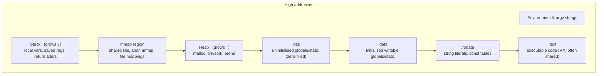
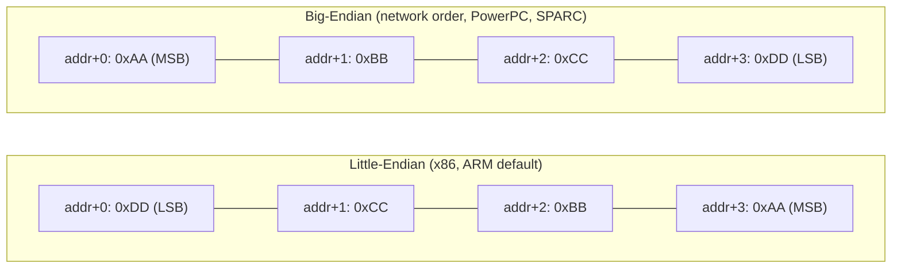

# C String Fundamentals, Memory Layout & Bitwise Programming — Consolidated Reference

> Authoritative cross-reference for systems / embedded / Linux-kernel interviews.
> Companion file `09_Interview_QA.md` quotes this document for canonical answers.

---

## 1. Overview & Why It Matters for Systems Programming

C is the lingua franca of operating systems, bootloaders, device drivers, and embedded firmware. Two C topics dominate low-level interviews because they expose how the machine *actually* works:

1. **Strings & process memory layout** — every buffer overflow, every stack-smash, every dangling-pointer crash, and every `EFAULT` from a syscall traces back to how C represents strings (raw bytes + a `'\0'` terminator) and where those bytes live (`.rodata` vs stack vs heap vs MMIO).
2. **Bitwise programming** — register programming, GIC priority masking, page-table entry construction, endian conversion in network/storage stacks, bitmap allocators, lock-free ring buffers (kfifo) — all of it is bit manipulation.

A senior engineer is expected to:

- Predict the exact memory segment of any declared object.
- Read and write a hardware register *atomically with respect to other fields*, choosing between RMW and W1C semantics.
- Recognize and avoid undefined behavior in shifts, signed arithmetic, pointer aliasing, and string truncation.
- Know the Linux-kernel idiom for the same problem (`is_power_of_2`, `cpu_to_le32`, `__set_bit`, `kfifo`).

This document consolidates those topics into a single deep reference.

---

## 2. C Memory Layout of a Process

When the kernel `exec`s an ELF binary, it lays out the address space into the segments below. Each segment has distinct permissions, lifetime, and growth direction.

### 2.1 Segment Map



(`mmap` typically sits between the stack and heap on Linux; on some architectures it is allocated top-down from just below the stack.)

### 2.2 Segment Summary Table

| Segment   | Contents                                | Init source       | Permissions | Lifetime         | Modifiable? |
|-----------|------------------------------------------|--------------------|-------------|------------------|-------------|
| `.text`   | Compiled machine code                    | ELF file          | r-x         | Process lifetime | No (W^X)    |
| `.rodata` | String literals, `const` globals, vtables| ELF file          | r--         | Process lifetime | No (SIGSEGV)|
| `.data`   | Initialised globals/`static`             | ELF file          | rw-         | Process lifetime | Yes         |
| `.bss`    | Uninitialised globals/`static`           | Zero-filled by kernel | rw-     | Process lifetime | Yes         |
| Heap      | `malloc`, `calloc`, `realloc`            | Programmer        | rw-         | Until `free`     | Yes         |
| `mmap`    | Shared libs, anon pages, file mappings   | Kernel/loader     | varies      | Until `munmap`   | Per-flags   |
| Stack     | Locals, saved regs, return PCs, alloca   | Function entry    | rw-         | Until return     | Yes         |
| argv/env  | Argument & environment strings           | Kernel at exec    | rw-         | Process lifetime | Yes         |

### 2.3 Visualising It With `size(1)` and `/proc/<pid>/maps`

```sh
$ size ./a.out
   text    data     bss     dec     hex filename
   1842     616       8    2466     9a2 a.out

$ cat /proc/$$/maps | head
55a... r-xp ...  /bin/bash     # .text
55a... r--p ...  /bin/bash     # .rodata
55a... rw-p ...  /bin/bash     # .data + .bss
7ff... rw-p ...  [heap]
7ff... rw-p ...  [stack]
```

### 2.4 Why the Distinction Matters

- Writing to a string literal (`.rodata`) → `SIGSEGV`. Returning a pointer to a stack local → use-after-return. `malloc`-ing 5 bytes for `"Hello"` → one-byte heap overflow.
- The kernel relies on these segments for `CoW` of `.data`, demand-paging of `.text`, and ASLR of stack/heap/mmap.

---

## 3. String Literals vs Character Arrays — storage, mutability, lifetime

A *C string* is just a sequence of `char` ending in a `'\0'` (NUL byte). There is no first-class string type. Two constructs *look* identical but have very different storage:

```c
char *p = "Hello";   // pointer in .data/stack → bytes in .rodata
char  a[] = "Hello"; // array of 6 bytes on the stack, initialised from the literal
```

| Property                | `char *p = "Hello"`              | `char a[] = "Hello"`               |
|-------------------------|----------------------------------|------------------------------------|
| Where the bytes live    | `.rodata`                        | Stack (or `.data` if global)       |
| Where `p` / `a` lives   | `p` is a pointer (stack/`.data`) | `a` *is* the array — no separate pointer |
| `sizeof`                | size of a pointer (4/8 bytes)    | 6 (`5 + '\0'`)                     |
| Modifiable?             | **No** — writing is UB → SIGSEGV | Yes                                |
| Re-assignable?          | Yes — `p = "World"` is fine      | No — `a = "World"` is a syntax error|
| Lifetime of bytes       | Whole program (static duration)  | Enclosing block (auto duration)    |
| Returnable from func?   | Yes (the literal outlives caller)| **No** — dangling pointer          |

### 3.1 String Literal Pooling

The C standard *allows* but does not *require* the compiler to merge identical literals:

```c
char *s1 = "Hello";
char *s2 = "Hello";
// s1 == s2 is implementation-defined (often true with -O2; never rely on it).
```

Never compare strings with `==`; that compares pointers, not characters. Use `strcmp`.

---

## 4. `char *s = "hello"` vs `char s[] = "hello"` — deep dive

This is the most-asked C interview question. The deeper answer covers *storage class*, *modifiability*, *sizeof semantics*, *decay*, and *lifetime*.

### 4.1 Diagrammatic Difference

```text
char *p = "Hello";                  char a[] = "Hello";

  stack                                stack
  ┌────────────┐                     ┌──────────────────────┐
  │ p: 0x4007c8├──► .rodata          │ a: 'H','e','l','l','o','\0' │
  └────────────┘    "Hello\0"        └──────────────────────┘
                    (read-only)        (writable, lives in this frame)
```

### 4.2 Stack vs `.rodata` table

| Code                                | Where `"Hello"` bytes live | Where the symbol lives | sizeof   | `s[0]='h'` legal? |
|-------------------------------------|-----------------------------|------------------------|----------|--------------------|
| `char *s = "Hello";` (local)        | `.rodata`                   | Stack (pointer)        | `sizeof(char*)` | No (UB)      |
| `char *s = "Hello";` (global)       | `.rodata`                   | `.data` (pointer)      | `sizeof(char*)` | No (UB)      |
| `char s[] = "Hello";` (local)       | Stack (copy of literal)     | Same as the array      | 6        | Yes               |
| `char s[] = "Hello";` (global)      | `.data`                     | Same as the array      | 6        | Yes               |
| `static char s[] = "Hello";` (local)| `.data`                     | Same as the array      | 6        | Yes               |
| `const char s[] = "Hello";` (global)| `.rodata`                   | Same as the array      | 6        | No (compile err)  |

### 4.3 `&arr` vs `arr` Subtlety

For an array `char a[6]`:

- `a` decays to `char *` pointing to `&a[0]`.
- `&a` has type `char (*)[6]` — a pointer to the *whole* array.
- Numerically `a` and `&a` are the same address; their **types** (and therefore pointer arithmetic) differ.

For a pointer `char *p`:

- `p` is the pointer value; `&p` is the address *of the pointer itself*. Different addresses.

### 4.4 Returning Strings From Functions

```c
char *bad(void)  { char x[] = "Hi"; return x;          } // dangling — UB
char *ok1(void)  { return "Hi";                         } // literal lives forever
char *ok2(void)  { static char x[] = "Hi"; return x;    } // static storage
char *ok3(void)  { char *x = malloc(3); strcpy(x,"Hi"); return x; } // caller frees
```

---

## 5. Pointer Arithmetic on Strings — pitfalls, `sizeof` vs `strlen`

### 5.1 `sizeof` is a compile-time *type* query; `strlen` is a runtime *content* scan.

```c
char a[10] = "Hi";
sizeof(a);   // 10 — the declared array size
strlen(a);   // 2  — bytes before first '\0'
sizeof("Hi"); // 3 — literal type is char[3]
```

### 5.2 Array → Pointer Decay Loses Size

```c
void f(char s[100]) { sizeof(s); }   // sizeof(char*), NOT 100!
```

In a function parameter list, `T s[N]` *is* `T *s`. The `[100]` is documentation only.

### 5.3 Pointer Arithmetic Walks in `sizeof(T)` Units

```c
int *p; p + 1;   // address advances by sizeof(int) bytes
char *s = "abc";
s+1; // points at 'b'
*(s+2) == s[2]; // identity by definition
```

### 5.4 Common Pitfalls

- `strlen(p)` on a non-`'\0'`-terminated buffer reads past the end (UB, leaks via Heartbleed-style bugs).
- `sizeof(ptr)/sizeof(ptr[0])` to count array elements works only on true arrays, *not* on a parameter or a decayed pointer.
- Subtracting pointers into different objects is UB; into the same array is defined (yields `ptrdiff_t`).

---

## 6. Standard String Functions — strcpy, strncpy, strlcpy, strdup, strtok, snprintf

| Function   | Behaviour                                            | Safe?  | Notes / quirks |
|------------|------------------------------------------------------|--------|----------------|
| `strcpy(d, s)` | Copies until `'\0'` in `s`; appends `'\0'`        | **No** | Classic overflow. Banned in many style guides. |
| `strncpy(d, s, n)` | Copies up to `n` bytes; **pads with `'\0'`** if `s` shorter; **does NOT NUL-terminate** if `s` ≥ `n` | Half-safe | Pathological zero-fill, missing terminator. |
| `strlcpy(d, s, n)` (BSD) | Always NUL-terminates; returns `strlen(s)` so truncation is detectable | **Yes** | Not in glibc by default; use libbsd or kernel’s version. |
| `strdup(s)` | `malloc`s `strlen(s)+1` and copies                  | Yes (caller must `free`) | POSIX, in C23. |
| `strtok(s, delim)` | Destructive in-place tokenisation                 | Not thread-safe | Use `strtok_r` (POSIX) instead. |
| `snprintf(d, n, fmt,…)` | Writes at most `n-1` chars + `'\0'`; returns *needed* length | **Yes** | Preferred safe formatter. Check return value for truncation. |
| `memcpy` / `memmove` | Raw byte copy of known length                    | Yes    | Use when length is known; not string-aware. |

### 6.1 The `strncpy` Trap

```c
char dst[6];
strncpy(dst, "Hello world", 6);   // dst = {'H','e','l','l','o','w'} — NO '\0'!
puts(dst);                         // UB: walks off the array
```

Idiomatic fix: `dst[sizeof dst - 1] = '\0';` after the call, or use `snprintf`/`strlcpy`.

### 6.2 `strtok` Re-entrancy

```c
char s[] = "a,b,c";
for (char *t = strtok(s, ","); t; t = strtok(NULL, ","))
    puts(t);
// In signal handlers / threads, use strtok_r with an explicit save_ptr.
```

---

## 7. Safe String Handling — overflows, off-by-one, NUL-termination

Three rules that prevent ~70% of all C string bugs:

1. **Always allocate `strlen(src) + 1`** — the `+1` is the `'\0'`.
2. **Always force termination after a bounded copy** — `dst[n-1] = '\0'`.
3. **Prefer length-returning APIs** — `snprintf`, `strlcpy` — so truncation is detectable.

### 7.1 Classic Off-by-One

```c
char *p = malloc(strlen(src));         // ❌ no room for '\0'
char *p = malloc(strlen(src) + 1);     // ✅
```

### 7.2 Stack Smash Reproduction

```c
void greet(const char *name) {
    char buf[16];
    strcpy(buf, name);     // attacker supplies 200-byte name → overwrites saved RIP
}
```

Compile with `-D_FORTIFY_SOURCE=2 -fstack-protector-strong` to catch most of these at runtime.

### 7.3 NUL-Termination Invariants in the Kernel

The Linux kernel forbids `strcpy`/`strncpy` in new code (`checkpatch.pl --strict`). Use `strscpy`, which is the kernel equivalent of `strlcpy` and is guaranteed to NUL-terminate and detect truncation via a negative return value.

---

## 8. Wide chars, UTF-8, multibyte (brief)

- `char` is a *byte*, not a *character*. UTF-8 encodes one Unicode code point in 1–4 bytes; ASCII (0x00–0x7F) is a strict subset.
- `wchar_t` is implementation-defined (16-bit on Windows, 32-bit on Linux). Avoid for portable storage; prefer UTF-8 in `char *`.
- `mbstowcs` / `wcstombs` convert between the current locale’s multibyte encoding and `wchar_t`.
- C11 added `char16_t` / `char32_t` and `u"…"` / `U"…"` literals for explicit UTF-16/UTF-32.
- `strlen` returns *bytes*, not *characters*. To count code points in UTF-8, decode explicitly.

---

## 9. Bitwise Operators in C — &, |, ^, ~, <<, >> (incl. signed-shift UB)

| Operator | Symbol | Truth-table summary           | Typical use                       |
|----------|--------|-------------------------------|------------------------------------|
| AND      | `&`    | `1` iff both bits are `1`     | Mask, clear bits, test bits        |
| OR       | `|`    | `1` if either bit is `1`      | Set bits, merge flags              |
| XOR      | `^`    | `1` if bits differ            | Toggle, parity, swap, hashing      |
| NOT      | `~`    | Inverts every bit             | Build complement masks             |
| LSHIFT   | `<<`   | Shift left, fill with `0`     | Multiply by 2ⁿ, build masks `1<<n` |
| RSHIFT   | `>>`   | Shift right; signed = arith (impl-def), unsigned = logical | Divide by 2ⁿ, extract field |

### 9.1 Operator Precedence (excerpt — common gotchas)

| Precedence | Operators                                  | Associativity |
|------------|---------------------------------------------|---------------|
| 1 (highest)| `()  []  ->  .`                            | Left          |
| 2          | `!  ~  ++  --  +x  -x  *p  &p  (type)`     | Right         |
| 3          | `*  /  %`                                  | Left          |
| 4          | `+  -`                                     | Left          |
| 5          | `<<  >>`                                   | Left          |
| 6          | `<  <=  >  >=`                             | Left          |
| 7          | `==  !=`                                   | Left          |
| 8          | `&`                                        | Left          |
| 9          | `^`                                        | Left          |
| 10         | `|`                                        | Left          |
| 11         | `&&`                                       | Left          |
| 12         | `||`                                       | Left          |
| 13         | `?:`                                       | Right         |
| 14         | `=  +=  -=  …`                             | Right         |

The infamous footgun is that `==` binds *tighter* than `&`, `^`, `|`:

```c
if (flags & MASK == 0)        // parsed as: flags & (MASK == 0) → almost certainly a bug
if ((flags & MASK) == 0)      // what you meant
```

### 9.2 Shift Undefined Behaviour (C11 §6.5.7)

- Shifting by a count `≥` the operand’s width is **UB** (`u << 32` for a 32-bit `u`).
- Shifting a *negative* signed integer left is **UB**.
- Right-shifting a negative signed integer is *implementation-defined* (GCC/Clang guarantee arithmetic shift on every supported target — kernel relies on this).
- For portable code that needs logical right shift, cast to `unsigned` first: `(unsigned)x >> n`.

---

## 10. Integer Promotion & Type Conversions in Bit Ops (gotchas)

Bitwise operators apply *after* the usual arithmetic conversions, which promote operands smaller than `int` to `int`. This bites in three classic ways:

### 10.1 `1 << 31` is UB on 32-bit `int`

```c
uint32_t mask = 1 << 31;     // UB: 1 is int; shifting a signed 1 into the sign bit
uint32_t mask = 1u << 31;    // OK
uint32_t mask = (uint32_t)1 << 31; // OK
```

### 10.2 `~` on small types

```c
uint8_t x = 0x0F;
uint8_t y = ~x;       // x promoted to int → ~0x0000000F = 0xFFFFFFF0; assignment truncates to 0xF0
                      // OK numerically, but compare ~x to 0xF0 and you’ll be surprised:
if (~x == 0xF0) ...   // false! LHS is int 0xFFFFFFF0.
```

Idiom: `uint8_t y = (uint8_t)~x;` or `~x & 0xFF`.

### 10.3 Signed vs Unsigned Mix

```c
if (-1 < (unsigned)1)   // false! -1 promoted to UINT_MAX
```

Choose `unsigned` types for bit work; reserve signed only for arithmetic that genuinely needs negatives.

---

## 11. Common Bit Tricks

Each snippet is the canonical interview answer; the one-line note states *why* it works.

```c
n |=  (1U << k);                       // SET bit k         (OR-with-1 always sets)
n &= ~(1U << k);                       // CLEAR bit k       (AND-with-0 always clears)
n ^=  (1U << k);                       // TOGGLE bit k      (XOR-with-1 flips)
int set = (n >> k) & 1U;               // TEST bit k        (extract single bit)

unsigned low = n & -n;                 // ISOLATE lowest set bit  (two’s complement carry)
n &= (n - 1);                          // CLEAR lowest set bit    (Kernighan)
int p2 = n && !(n & (n - 1));          // IS power of 2           (only one set bit)

int popcnt(unsigned n){int c=0;while(n){n&=n-1;c++;}return c;}      // popcount (Kernighan)
int parity(unsigned n){int p=0;while(n){p^=1;n&=n-1;}return p;}     // parity

uint32_t roundup_pow2(uint32_t n){      // round UP to next power of 2
    n--; n|=n>>1; n|=n>>2; n|=n>>4; n|=n>>8; n|=n>>16; return ++n;
}

void xswap(int *a,int *b){if(a!=b){*a^=*b;*b^=*a;*a^=*b;}}          // XOR swap (no temp)

int abs_branchless(int x){int m=x>>31; return (x^m)-m;}             // branchless |x|

int min_b(int x,int y){return y ^ ((x^y) & -(x<y));}                // branchless min
int max_b(int x,int y){return x ^ ((x^y) & -(x<y));}                // branchless max
int opposite_sign(int x,int y){return (x^y) < 0;}                   // sign-bit XOR
```

### 11.1 Why `n & (n-1)` Clears the Lowest Set Bit

```text
n   = ...X 1 0 0 0      (rightmost 1 followed by k zeros)
n-1 = ...X 0 1 1 1      (rightmost 1 becomes 0, zeros become 1)
AND = ...X 0 0 0 0      (the rightmost 1 is gone)
```

### 11.2 Why `n & -n` Isolates the Lowest Set Bit

```text
n    = ...a 1 0 0 0
~n   = ...ā 0 1 1 1
~n+1 = ...ā 1 0 0 0     (carry propagates exactly to the rightmost 1)
n&-n = 0...0 1 0 0 0    (only that bit survives)
```

### 11.3 Reverse 32 Bits — Divide & Conquer

```c
uint32_t reverseBits_fast(uint32_t n) {
    n = (n >> 16) | (n << 16);
    n = ((n & 0xFF00FF00) >> 8)  | ((n & 0x00FF00FF) << 8);
    n = ((n & 0xF0F0F0F0) >> 4)  | ((n & 0x0F0F0F0F) << 4);
    n = ((n & 0xCCCCCCCC) >> 2)  | ((n & 0x33333333) << 2);
    n = ((n & 0xAAAAAAAA) >> 1)  | ((n & 0x55555555) << 1);
    return n;
}
```

Each line swaps neighbouring groups whose width halves on every step: halves → bytes → nibbles → pairs → bits. Total ≈ 15 instructions, no loop.

### 11.4 Add Without `+`

```c
int add(int a, int b) {
    while (b) { int carry = a & b; a ^= b; b = carry << 1; }
    return a;
}
```

XOR is sum-without-carry; AND is the carry; shift the carry into the next column; loop until no carry.

### 11.5 Find the Single Unique Element

```c
int unique(int *a, int n){int r=0; for(int i=0;i<n;i++) r^=a[i]; return r;}
```

`x ^ x = 0` cancels every pair; the lonely element survives.

### 11.6 Two Uniques (everyone else paired)

```c
void two_unique(int *a, int n, int *x, int *y) {
    int axor = 0; for (int i=0;i<n;i++) axor ^= a[i];      // = x ^ y
    int bit = axor & -axor;                                 // any bit where x,y differ
    *x = *y = 0;
    for (int i=0;i<n;i++) (a[i] & bit ? *x : *y) ^= a[i];
}
```

---

## 12. Endianness — little vs big, htonl/ntohl, byte-swap idioms, detection

### 12.1 Visual



Word stored: `0xAABBCCDD`.

### 12.2 Byte-Swap Idioms

```c
uint16_t bswap16(uint16_t n){ return (n >> 8) | (n << 8); }

uint32_t bswap32(uint32_t n){
    return ((n >> 24) & 0x000000FFu)
         | ((n >> 8)  & 0x0000FF00u)
         | ((n << 8)  & 0x00FF0000u)
         | ((n << 24) & 0xFF000000u);
}
```

GCC/Clang: `__builtin_bswap16/32/64` map to single ARM `REV16`/`REV` or x86 `bswap` instructions.

### 12.3 POSIX / Kernel Helpers

| Helper                              | Purpose                                  |
|-------------------------------------|------------------------------------------|
| `htonl(x)`, `ntohl(x)`              | Host ↔ network (big-endian) — 32-bit     |
| `htons(x)`, `ntohs(x)`              | 16-bit version                           |
| `cpu_to_be32(x)`, `be32_to_cpu(x)`  | Kernel: CPU ↔ big-endian explicit        |
| `cpu_to_le32(x)`, `le32_to_cpu(x)`  | Kernel: CPU ↔ little-endian explicit     |
| `get_unaligned_le32(p)`             | Safe unaligned little-endian load        |

### 12.4 Runtime Detection

```c
int is_little_endian(void){ uint16_t x = 1; return *(uint8_t*)&x; }
// or, C11 compile-time:  #if __BYTE_ORDER__ == __ORDER_LITTLE_ENDIAN__
```

---

## 13. Bit-Fields in Structs — portability, packing, alignment

```c
struct ctrl {
    unsigned enable : 1;
    unsigned mode   : 3;
    unsigned        : 0;   // force alignment to next storage unit
    unsigned div    : 8;
};
```

Bit-fields are concise but treacherous:

- **Order is implementation-defined.** GCC packs LSB-first on little-endian targets, MSB-first on big-endian. Two compilers may disagree on layout.
- **No atomicity.** A read-modify-write of one bit-field reads, modifies, and writes the *enclosing* storage unit. Adjacent fields can be corrupted by concurrent writes.
- **`volatile` on bit-fields is poorly defined** — MMIO drivers should prefer explicit shift/mask macros (see §14, §20 of this doc and `REG_SET_FIELD`).
- **`sizeof` includes padding** and may grow beyond the sum of declared widths due to alignment.

Use bit-fields for compact data structures *in memory you fully own*; use explicit masks for hardware registers and on-the-wire formats.

---

## 14. Bitmasks for Flags & Register Programming

### 14.1 Generic Read-Modify-Write

```c
#define REG_SET_FIELD(reg, mask, shift, value)                     \
    do {                                                            \
        uint32_t tmp = read_register(reg);                          \
        tmp &= ~(mask);                                             \
        tmp |= ((value) << (shift)) & (mask);                       \
        write_register(reg, tmp);                                   \
    } while (0)

#define REG_GET_FIELD(reg, mask, shift) \
    ((read_register(reg) & (mask)) >> (shift))
```

The `do {…} while(0)` wrapper makes the macro safe after `if`/`else` without dangling semicolons.

### 14.2 Worked Example — UART Config Register

| Bits   | Field      | Encoding                              |
|--------|------------|---------------------------------------|
| [1:0]  | Parity     | 00=None, 01=Odd, 10=Even              |
| [3:2]  | Stop bits  | 00=1, 01=1.5, 10=2                    |
| [5:4]  | Data bits  | 00=5, 01=6, 10=7, 11=8                |
| [6]    | Enable     | 0=Disable, 1=Enable                   |

```c
void configure_uart(uint8_t parity, uint8_t stop, uint8_t data, uint8_t en) {
    uint32_t r = 0;
    r |= (parity & 0x3) << 0;
    r |= (stop   & 0x3) << 2;
    r |= (data   & 0x3) << 4;
    if (en) r |= (1u << 6);
    write_register(UART_CTRL_REG, r);
}
```

### 14.3 W1C (Write-1-to-Clear) Caveat

For status registers where writing `1` *clears* the corresponding flag:

```c
*status_reg = ERROR_MASK;   // clears bits in ERROR_MASK; does NOT touch others
```

Do **not** use RMW on W1C — reading and OR-ing back can reclear bits already serviced by other code. Always check the IP datasheet for register semantics: R/W, R/O, W1C, W1S, RWC, RC.

### 14.4 Multi-Error Bitmask Return

```c
#define ERR_NONE     0x00
#define ERR_TIMEOUT  (1u << 0)
#define ERR_OVERFLOW (1u << 1)
#define ERR_PARITY   (1u << 2)

uint32_t err = check_uart_errors();
if (err & ERR_TIMEOUT)  handle_timeout();
if (err & ERR_PARITY)   handle_parity();
if (err == ERR_NONE)    /* all good */;
```

The Linux `poll()` `revents` mask and many `ioctl()` flag arguments follow this same one-bit-per-event convention.

### 14.5 MMIO `volatile`

```c
volatile uint32_t *reg = (volatile uint32_t *)0x40001000;
```

`volatile` forbids the compiler from caching the read or eliding the write — essential for any memory whose value changes outside the program (MMIO, signal handlers, ISR-shared variables). It is *not* a memory barrier; on SMP/weakly-ordered cores you also need `dmb`/`smp_mb()`/`READ_ONCE`/`WRITE_ONCE`.

---

## 15. Bitmap Data Structures (kernel-style)

The Linux kernel uses arrays of `unsigned long` as packed bitmaps for CPU masks, IRQ allocation, page-frame ownership, etc. Each `long` holds `BITS_PER_LONG` bits (32 or 64).

Indexing helpers:

```c
#define BIT_WORD(nr)  ((nr) / BITS_PER_LONG)
#define BIT_MASK(nr)  (1UL << ((nr) % BITS_PER_LONG))
```

Core API (`<linux/bitops.h>`):

| Macro / function                       | Purpose                                                |
|----------------------------------------|--------------------------------------------------------|
| `set_bit(nr, addr)`                    | Atomic set                                             |
| `__set_bit(nr, addr)`                  | Non-atomic set (single-thread fast path)               |
| `clear_bit(nr, addr)` / `__clear_bit`  | Atomic / non-atomic clear                              |
| `change_bit(nr, addr)`                 | Atomic toggle                                          |
| `test_bit(nr, addr)`                   | Read one bit                                           |
| `test_and_set_bit(nr, addr)`           | Atomic RMW — returns the old value (lock primitive)    |
| `find_first_zero_bit(addr, size)`      | Lowest 0-bit index (allocator)                         |
| `find_first_bit(addr, size)`           | Lowest 1-bit index                                     |
| `for_each_set_bit(bit, addr, size)`    | Iterate over all 1-bits                                |
| `bitmap_weight(addr, size)`            | popcount over a bitmap                                 |

`test_and_set_bit` is the kernel’s primary spin-lock-free building block — see `bit_spin_lock`, IRQ chip enable masks, and the page-flag operations on `struct page`.

---

## 16. Floating-Point Bit Tricks (IEEE 754 layout, fast inverse sqrt summary)

### 16.1 IEEE 754 Layout

| Type     | Total bits | Sign | Exponent | Mantissa | Bias  |
|----------|-----------:|-----:|---------:|---------:|------:|
| `float`  | 32         | 1    | 8        | 23       | 127   |
| `double` | 64         | 1    | 11       | 52       | 1023  |

Value (normal): `(-1)^S × 1.M × 2^(E - bias)`

### 16.2 Type-Punning Without UB

```c
// Strict-aliasing-safe punning since C99
float f = 1.0f;
uint32_t bits;
memcpy(&bits, &f, sizeof bits);   // bits == 0x3F800000
```

`union` punning is also accepted by GCC/Clang as an extension and by C11 §6.5.2.3 footnote 95. Casting through `(uint32_t*)&f` violates strict aliasing under `-O2`.

### 16.3 Quake III Fast Inverse Square Root (sketch)

```c
float Q_rsqrt(float number) {
    long i;
    float x2 = number * 0.5f, y = number;
    memcpy(&i, &y, 4);
    i  = 0x5f3759df - (i >> 1);     // initial guess via exponent halving
    memcpy(&y, &i, 4);
    y  = y * (1.5f - x2 * y * y);   // one Newton-Raphson iteration
    return y;
}
```

The magic number exploits the fact that the IEEE float bit pattern is, roughly, a log-base-2 of the value; shifting right by 1 *halves* the exponent → square root; subtracting from a constant *negates* it → reciprocal.

### 16.4 Other Float Bit Hacks

- `signbit(f) == ((bits >> 31) & 1)` — sign test without comparison.
- `fabs(f)` ≡ clear the sign bit: `bits &= 0x7FFFFFFF`.
- Comparing two floats by their *bit pattern* (when both same-signed) gives the same ordering as the floats themselves — used in some lock-free comparators.

---

## 17. Hash & CRC Bit Operations (brief)

- **FNV-1a (32-bit)**: `h = 0x811C9DC5; for each byte b: h ^= b; h *= 0x01000193;` — XOR + multiply, no table.
- **Murmur / xxHash** rely heavily on `^`, `*`, and rotates (`(x << r) | (x >> (32-r))`).
- **CRC-32**: shift-and-XOR with a generator polynomial (0xEDB88320 for Ethernet). Hardware now exposes it via `crc32` on ARMv8 and `_mm_crc32_u8` on x86-SSE4.2.
- **Bit rotation idiom** (no built-in C operator):

```c
static inline uint32_t rotl32(uint32_t x, int r) { return (x << r) | (x >> (32 - r)); }
```

Watch for the *undefined* case `r == 0` or `r == 32` — guard with `r & 31` or use `__builtin_rotateleft32`.

---

## 18. Worked Code Walkthroughs

The two `.c` source files are the canonical worked examples. The most instructive snippets are quoted below; consult the originals for full context.

### 18.1 From `C_String_Fundamentals_and_Memory_Layout.c`

**(a) Four ways to spell “the same” string — and why they aren’t the same.**

```c
char *ptr   = "Hello";     // pointer on stack → bytes in .rodata; read-only
char  arr[] = "Hello";     // 6-byte stack array, fully writable
char  buf[10] = "Hello";   // explicit size; trailing bytes zeroed
char *heap  = malloc(6);   // pointer on stack, bytes on heap; must free
strcpy(heap, "Hello");
```

What the snippet demonstrates: storage segment, modifiability, `sizeof` semantics, and the lifetime contract for each form. Trying `ptr[0] = 'h'` is the textbook segmentation fault.

**(b) `&arr` vs `arr` for arrays.**

```c
printf("&arr = %p, arr = %p (same!)\n",   (void*)&arr, (void*)arr);
printf("&ptr = %p, ptr = %p (different!)\n", (void*)&ptr, (void*)ptr);
```

The output proves that an array name *evaluates* to the address of its first element, but has the *type* “array of N”; a pointer is a separate object with its own address.

**(c) Const-correctness cheat sheet.**

```c
const char *p1     = "Hello"; // bytes are const,  pointer can move
char *const p2     = arr;     // bytes mutable,    pointer is fixed
const char *const p3 = "Hello"; // both fixed
```

Read declarations right-to-left: `const char * const p` → “p is a const pointer to const char”.

**(d) The null-terminator pitfalls block.**

```c
char bad[5]  = {'H','e','l','l','o'};        // NOT a string — strlen is UB
char good[6] = {'H','e','l','l','o','\0'};   // valid
char tricky[] = "Hello\0World";
strlen(tricky); // 5  — stops at first '\0'
sizeof(tricky); // 12 — counts every byte in the literal
```

Embedded `'\0'` is a frequent source of “my buffer looks short but isn’t”.

**(e) Struct padding around `char` fields.**

```c
struct StringInStruct {
    char name[7]; // offsets 0..6
    int  id;      // needs 4-byte alignment → pad to offset 8
    char tag[3];  // offsets 12..14
};                // sizeof == 16 (3 bytes of tail padding for next-element alignment)
```

Use `offsetof(struct, member)` and `__attribute__((packed))` consciously — packing trades alignment-friendly access for size.

**(f) Dangling-pointer trap.**

```c
char *get(void){ char local[] = "Hi"; return local; } // ❌ UB — stack frame gone
```

Fixes: return a literal, a `static`, or a `malloc`-ed copy.

### 18.2 From `Comprehensive_Bitwise_Interview_Questions.c`

**(a) Kernighan’s popcount.**

```c
int countSetBits(unsigned int n){
    int c = 0;
    while (n) { n &= n - 1; c++; }
    return c;
}
```

Loops once per set bit, not once per total bit — `O(popcount)` versus `O(width)`. Trace `n = 13`: three iterations.

**(b) Reverse 32 bits in O(log N) with no loop.**

```c
n = ((n & 0xFF00FF00) >> 8)  | ((n & 0x00FF00FF) << 8);
n = ((n & 0xF0F0F0F0) >> 4)  | ((n & 0x0F0F0F0F) << 4);
n = ((n & 0xCCCCCCCC) >> 2)  | ((n & 0x33333333) << 2);
n = ((n & 0xAAAAAAAA) >> 1)  | ((n & 0x55555555) << 1);
```

Each step is a swap of two interleaved bit-groups whose width halves on every line; combined with the initial 16-bit half-swap, the whole reversal completes in ~15 instructions.

**(c) Find two unique elements among pairs.**

```c
int axor = 0;
for (int i = 0; i < n; i++) axor ^= a[i]; // = x ^ y
int bit = axor & -axor;                   // any differing bit
for (int i = 0; i < n; i++)
    (a[i] & bit ? *x : *y) ^= a[i];       // partition + XOR each side
```

Demonstrates the partition-by-differing-bit pattern, common in bit-hack interviews and used in `kfifo_get`.

**(d) UART configuration with explicit field macros.**

```c
reg &= ~PARITY_MASK; reg |= (parity & 0x3) << PARITY_SHIFT;
reg &= ~STOP_MASK;   reg |= (stop   & 0x3) << STOP_SHIFT;
reg &= ~DATA_MASK;   reg |= (data   & 0x3) << DATA_SHIFT;
if (enable) reg |= (1 << ENABLE_BIT);
write_register(UART_CTRL_REG, reg);
```

Note the **clear-then-set** sequence — `|=` alone cannot overwrite an existing non-zero value. Always mask off the field before OR-ing the new bits in.

**(e) Generic RMW macro.**

```c
#define REG_SET_FIELD(reg, mask, shift, value) do {                 \
    uint32_t tmp = read_register(reg);                              \
    tmp &= ~(mask);                                                 \
    tmp |= ((value) << (shift)) & (mask);                           \
    write_register(reg, tmp);                                       \
} while (0)
```

Reusable across every IP block. Pair with `volatile` MMIO accessors and memory barriers on SMP.

**(f) Power-of-2 circular buffer (`kfifo`-style).**

```c
#define BUFFER_SIZE  256
#define BUFFER_MASK  (BUFFER_SIZE - 1)
buf->data[buf->head & BUFFER_MASK] = byte;   buf->head++;
return    buf->data[buf->tail & BUFFER_MASK]; buf->tail++;
```

`& BUFFER_MASK` replaces `% BUFFER_SIZE` — a single AND instead of a divide. The `head/tail` counters intentionally overflow naturally; subtracting them (masked) yields the live count.

**(g) Endian byte-swap.**

```c
uint32_t swap_endian_32(uint32_t n){
    return ((n>>24)&0x000000FFu) | ((n>>8)&0x0000FF00u)
         | ((n<<8)&0x00FF0000u)  | ((n<<24)&0xFF000000u);
}
```

GCC will fold this into a single ARM `REV` or x86 `bswap` if recognised; otherwise `__builtin_bswap32` is the explicit intrinsic.

---

## 19. Common Pitfalls & Undefined Behavior

| Pitfall                                                  | Why it bites                                       | Fix                                                  |
|----------------------------------------------------------|----------------------------------------------------|------------------------------------------------------|
| Writing through `char *p = "lit";`                       | `.rodata` is read-only → SIGSEGV                   | Use `char p[] = "lit";` or `strdup`                  |
| `malloc(strlen(s))` then `strcpy`                        | One-byte overflow (no room for `'\0'`)             | `malloc(strlen(s)+1)`                                |
| `strncpy(dst, src, n)` with `strlen(src) >= n`           | `dst` *not* NUL-terminated                         | `strscpy`/`strlcpy` or force `dst[n-1]='\0'`         |
| `sizeof(arr)/sizeof(arr[0])` on a function parameter     | Parameter has decayed to pointer → wrong count     | Pass length explicitly; or use macro on caller side  |
| Returning pointer to local                               | Stack frame destroyed → dangling                   | Use `static`, malloc, or literal                     |
| `1 << 31` for `uint32_t`                                 | `1` is signed `int`; shifts to sign bit → UB       | `1u << 31` or `(uint32_t)1 << 31`                    |
| Shift count `>=` operand width (`x << 32` on 32-bit `x`) | UB                                                 | Mask the count or use wider type                     |
| Right-shifting a negative signed integer                 | Implementation-defined (usually arithmetic)        | Cast to `unsigned` for logical shift                 |
| `if (a & b == c)`                                        | Parses as `a & (b == c)`                           | Parenthesise: `if ((a & b) == c)`                    |
| XOR swap with same address (`xswap(x, x)`)               | Zeros the variable                                 | Always `if (a != b)`                                 |
| Comparing strings with `==`                              | Compares pointers, not contents                    | Use `strcmp` / `memcmp`                              |
| Reading MMIO without `volatile`                          | Compiler folds repeated reads → never observes HW change | Declare pointer `volatile`                       |
| Bit-fields shared with ISR/SMP                           | RMW of whole word can corrupt sibling field        | Use explicit atomic ops or `READ_ONCE`/`WRITE_ONCE`  |
| Strict-aliasing-violating float pun (`*(uint32_t*)&f`)   | UB under `-O2`; may compile to wrong code          | Use `memcpy` or `union`                              |
| `strtok` in a signal handler / multi-thread context      | Shared internal state → corruption                 | Use `strtok_r`                                       |

---

## 20. Cross-References

- **`02_Scheduling_and_Synchronization.md`** — uses `test_and_set_bit` and bit-spinlocks discussed in §15.
- **`03_Interrupts_IPI_and_Watchdog.md`** — GIC priority masks and IRQ enable bitmaps build directly on §14.
- **`04_Linux_Drivers_DT_proc_sysfs_Syscalls.md`** — MMIO accessors and `volatile` semantics (§14.5) underpin every driver.
- **`01_ARM_ARM64_Memory_Management.md`** — TTBR / page-table entry construction is bit-field packing (§13–14) at scale.
- **`09_Interview_QA.md`** (companion) — short Q&A entries that cite the deep treatments here.

---

## 21. Further Reading

Source files consolidated into this reference:

1. `ARM_Linux_Kernel_Knowledgebase/_raw_text/bitwise_interview_guide.md`
2. `C_String_Fundamentals_and_Memory_Layout_2026_05_15T06_00_48.c`
3. `Comprehensive_Bitwise_Interview_Questions_with_Detailed_Explanations_2026_05_15T05_36_37.c`
4. `table_2026_05_15T05_36_54.md`

External references worth reading in full:

- *Hacker’s Delight*, 2nd ed., Henry S. Warren — the canonical bit-hack reference.
- Sean Eron Anderson, *Bit Twiddling Hacks* — https://graphics.stanford.edu/~seander/bithacks.html.
- *The C Programming Language*, Kernighan & Ritchie, §2.9 (bitwise) and §5 (pointers/arrays).
- Linux kernel: `include/linux/bitops.h`, `include/linux/log2.h`, `include/linux/kfifo.h`, `include/uapi/linux/byteorder/*.h`.
- ISO C11 §6.5.7 (shift), §6.5.16 (assignment & type conversion), §6.3.1 (integer promotions).
- ARM ARM (DDI 0487): chapter on memory ordering and `DMB`/`DSB`/`ISB` — required reading once `volatile` is no longer enough.
