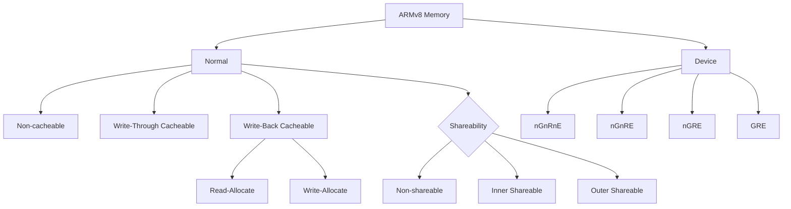
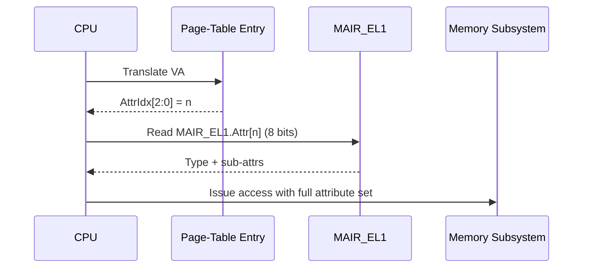

# 01.01 — Normal vs Device Memory Types

> **ARM ARM Reference**: §B2.7, §B2.8 — *Memory types and attributes*

---

## 1. Overview

ARMv8-A defines **exactly two memory types** at the architectural level:

| Type | Purpose | Speculation | Reordering | Gathering | Merging |
|------|---------|-------------|------------|-----------|---------|
| **Normal** | RAM-like, well-behaved | Allowed | Allowed | Allowed | Allowed |
| **Device** | MMIO / peripherals | Forbidden | Restricted | Restricted | Restricted |

Every byte of the physical address space, as seen through a translation, is tagged as Normal **or** Device via the page-table descriptor's `AttrIdx[2:0]` field, which indexes into `MAIR_ELx`.

This binary split is the foundation of the entire ARM memory model — caches, barriers, ordering, and coherency rules all key off it.

---

## 2. Normal Memory

### 2.1 Semantics
- Models well-behaved RAM. Reads have no side effects; writes simply update state.
- The CPU may:
  - **Speculatively read** ahead.
  - **Reorder** accesses (within program-order rules for the same location).
  - **Gather** multiple stores into a single bus transaction.
  - **Merge** repeated writes to the same address.
  - **Prefetch** into caches.

### 2.2 Sub-attributes (orthogonal to "Normal")
- **Cacheability** — Non-cacheable, Write-Through, Write-Back, with Read-Allocate / Write-Allocate hints. Set independently for **Inner** and **Outer** cache domains.
- **Shareability** — Non-shareable, Inner Shareable, Outer Shareable.
- **Transient hint** — bit indicating short-lived data (allows different cache replacement policy).

### 2.3 Typical Use
- All RAM backing user-mode and kernel-mode code/data.
- DMA buffers (often Normal **Non-cacheable** + Outer Shareable, or Normal Cacheable + explicit cache maintenance).

---

## 3. Device Memory

### 3.1 Why a separate type?
Peripheral registers have **side effects on read**. A speculative load to a UART RX FIFO would pop a byte that the program never asked for. Device memory disables all the optimizations that would break MMIO.

### 3.2 The Four Device Sub-types

| Sub-type | Gathering | Reordering | Early Write Ack |
|----------|-----------|------------|-----------------|
| **Device-nGnRnE** | **n**o | **n**o | **n**o |
| **Device-nGnRE**  | no | no | **E**arly |
| **Device-nGRE**   | no | **R**eordering OK | Early |
| **Device-GRE**    | **G**athering OK | Reordering OK | Early |

- **Gathering** — two stores to the same/adjacent addresses may be combined.
- **Reordering** — accesses to different Device addresses may reorder w.r.t. each other.
- **Early Write Ack** — the interconnect may ack a write before it reaches its endpoint.

`nGnRnE` is the strictest (use for legacy/strongly-ordered peripherals like a UART control register). `GRE` is the loosest Device variant (use for framebuffers / write-combining surfaces).

### 3.3 Device memory is ALWAYS:
- **Non-cacheable** (never lives in CPU data caches).
- **Outer Shareable** by definition.
- **Execute-Never (XN)** is implied — fetching instructions from Device memory is `UNPREDICTABLE`.
- Reads/writes are **non-speculative**.

---

## 4. Diagrams

### 4.1 Type & attribute hierarchy



### 4.2 Resolution path: PTE → MAIR → behavior



---

## 5. Worked Example — Encoding `Normal Inner/Outer Write-Back, Non-transient, RA+WA`

The 8-bit MAIR attribute field:

```
bit:  7   6   5   4   3   2   1   0
     [ Outer (4 bits)  ][ Inner (4 bits) ]
```

For Normal Write-Back, Non-transient, R+W allocate, each nibble = `0b1111`.

→ `Attr = 0b1111_1111 = 0xFF`

If software programs `MAIR_EL1.Attr0 = 0xFF`, then a PTE with `AttrIdx = 0b000` gets fully-cacheable Normal memory.

For Device-nGnRnE: `Attr = 0x00`.
For Device-GRE:    `Attr = 0x0C`.

### Common MAIR layout used by Linux

| Idx | Encoding | Meaning |
|-----|----------|---------|
| 0   | `0x00`   | Device-nGnRnE |
| 1   | `0x04`   | Device-nGnRE |
| 2   | `0xFF`   | Normal WB Inner+Outer, RA+WA |
| 3   | `0x44`   | Normal Non-cacheable Inner+Outer |
| 4   | `0xBB`   | Normal WT Inner+Outer |

---

## 6. Software Implications

- **DMA coherent buffers** — typically Normal Non-cacheable + Outer Shareable on non-IO-coherent systems; on IO-coherent SoCs (most modern), Normal WB + Outer Shareable + ACE coherency.
- **MMIO drivers** — `ioremap()` in Linux maps to `Device-nGnRE` by default; `ioremap_wc()` requests `Normal Non-cacheable` (or Device-GRE on some configs) for write-combining framebuffers.
- **JIT / self-modifying code** — must perform `DC CVAU` (clean to PoU) + `IC IVAU` + `DSB ISH` + `ISB` because instruction cache is not coherent with data cache.
- **Spinlocks on Device memory** — *illegal*. Exclusive monitors (`LDXR/STXR`, `LDAXR/STLXR`) are **only defined on Normal Cacheable Inner-Shareable** memory.

---

## 7. Common Pitfalls

1. **Treating MMIO as Normal** — leads to spurious peripheral activity from speculation.
2. **Spinlock on Device memory** — `LDXR` on Device is `CONSTRAINED UNPREDICTABLE`.
3. **Forgetting outer shareability for DMA** — IP block's view of memory may differ from CPU's.
4. **Assuming Device-nGnRnE implies barriers** — it does **not** order against Normal memory; you still need `DSB`.
5. **Mixing aliases with different attributes** — architecturally `UNPREDICTABLE`. Never alias the same PA as both Normal and Device.

---

## 8. Interview Q&A

**Q1. Why two memory types instead of one?**
RAM tolerates speculation/reordering; peripheral registers do not (side effects). A single type would either kill RAM performance or break MMIO.

**Q2. What are the four Device sub-types and which is strictest?**
`nGnRnE > nGnRE > nGRE > GRE`. `nGnRnE` forbids gathering, reordering, and early write ack — used for the most order-sensitive registers (interrupt controllers, some legacy peripherals).

**Q3. Can Device memory be cached?**
No. Architecturally Device memory is non-cacheable; placing it in a data cache is `UNPREDICTABLE`.

**Q4. Why is Device memory implicitly Execute-Never?**
Instruction fetch is inherently speculative (branch prediction, prefetch). Fetching from a peripheral region would trigger uncontrolled reads with side effects.

**Q5. How does software tell the CPU the type of a region?**
Each PTE carries `AttrIdx[2:0]`. That indexes one of 8 byte-fields in `MAIR_ELx`, which holds the encoded type+sub-attributes.

**Q6. What attribute would you use for a framebuffer?**
Normal Non-cacheable + Outer Shareable, or Device-GRE — both allow write combining for burst efficiency to display memory.

**Q7. Is `LDXR` legal on Non-cacheable Normal memory?**
Implementation-defined whether exclusives work on Non-cacheable. Architecturally guaranteed only on Normal Inner-Shareable Cacheable. Linux requires WB Inner-Shareable for atomics.

**Q8. What ordering does Device-nGnRnE give you vs other Device-nGnRnE accesses?**
Program-order is preserved between two `nGnRnE` accesses — no reordering, no gathering. But it does NOT order against Normal memory; use `DSB` for that.

**Q9. Difference between "Early Write Ack" allowed vs not?**
With early ack, an interconnect may signal completion before the write reaches the slave. `nGnRnE` forbids this — completion means the slave has accepted the data (needed for, e.g., GIC EOI registers in some implementations).

**Q10. How does shareability interact with type?**
Shareability applies to Normal memory and selects the coherency domain (Inner = cluster, Outer = system). Device memory is implicitly Outer Shareable.

---

## 9. Cross-references

- [02 Cacheability & Shareability](02_Cacheability_Shareability.md)
- [03 MAIR encoding](03_MAIR_and_Attribute_Encoding.md)
- [04 Weakly-Ordered Memory Model](04_Weakly_Ordered_Memory_Model.md)
- [05 Cache coherency](../05_Caches/04_Cache_Coherency_MESI_MOESI.md)
- [06.01 DMB/DSB/ISB](../06_Memory_Barriers_Ordering/01_DMB_DSB_ISB.md)
