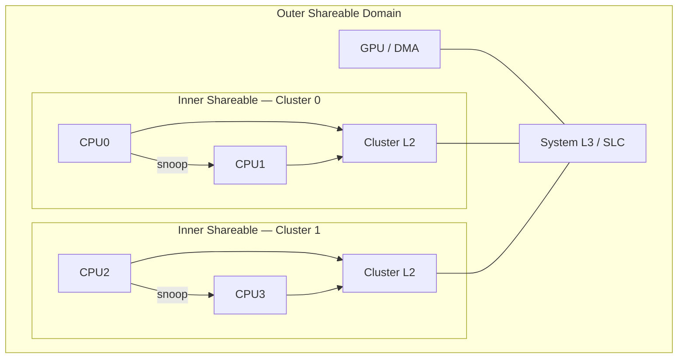
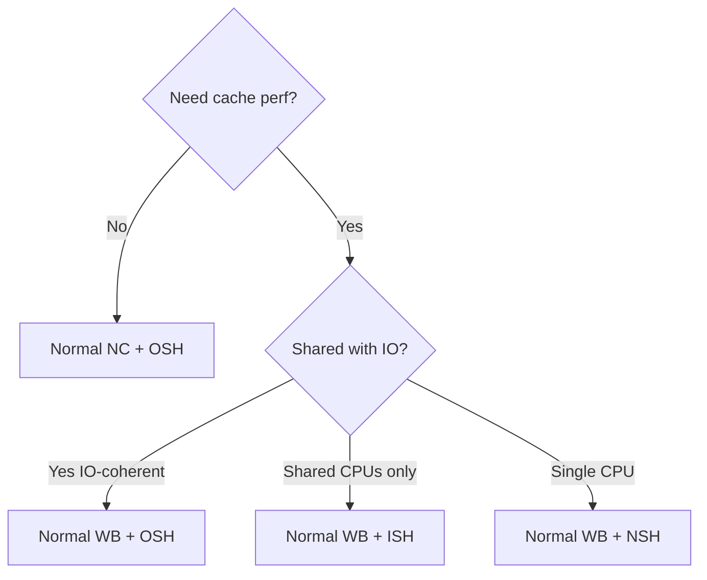

# 01.02 — Cacheability & Shareability

> **ARM ARM Reference**: §B2.7.2, §D5.5 — *Cacheability and Shareability attributes*

---

## 1. Overview

For **Normal memory** every page carries two orthogonal attribute sets:

1. **Cacheability** — whether and how a region may live in caches, independently for **Inner** and **Outer** cache domains.
2. **Shareability** — the **coherency domain** in which hardware must keep this region coherent (Non-shareable / Inner Shareable / Outer Shareable).

These two together (plus the type bit) form the full attribute set encoded in `MAIR_ELx`.

---

## 2. Cacheability

### 2.1 Encodings (per Inner / per Outer)

| Encoding | Meaning |
|---|---|
| `00` | Non-cacheable |
| `01` | Write-Back, Transient |
| `10` | Write-Through, Non-transient |
| `11` | Write-Back, Non-transient |

Plus allocation hints: **Read-Allocate (RA)** and **Write-Allocate (WA)**.

### 2.2 Write policies
- **Write-Through (WT)** — every store updates the cache **and** propagates to next level. Simpler coherency, lower performance.
- **Write-Back (WB)** — store updates cache line only; line is marked dirty and written back on eviction. Higher performance; needs coherency protocol + maintenance ops.
- **Write-Allocate** — on a write miss, fetch the line into cache before writing. Good for streaming writes with later reuse.
- **No Write-Allocate** — on miss, write straight through, line not fetched. Good for purely-streaming output.

### 2.3 Inner vs Outer
- **Inner cache** — caches close to the CPU (L1, often L2).
- **Outer cache** — caches further out (system-level / L3 / SLC).
- The boundary is **implementation-defined**; ARM ARM merely defines the two domains.
- A region can be e.g. Inner-WB + Outer-Non-cacheable (useful if you have a coherent inner cluster but a non-coherent system fabric).

---

## 3. Shareability

### 3.1 Three domains

| Domain | Scope | Typical mapping |
|---|---|---|
| **Non-shareable (NSH)** | Single PE only; no coherency required | Per-CPU stacks (rare in SMP) |
| **Inner Shareable (ISH)** | A coherent cluster (e.g. all CPUs in one socket) | Normal SMP RAM |
| **Outer Shareable (OSH)** | Entire system incl. coherent masters (GPU, DMA) | Shared with IO-coherent devices |

### 3.2 What shareability does
- Determines **which observers** must see writes in a coherent manner.
- Drives the **broadcast scope of TLBI and barriers** — `DSB ISH` waits for completion across the Inner Shareable domain only.
- Drives the **coherency protocol scope** (e.g. ACE snoops in the ISH domain).

### 3.3 Interaction with Non-cacheable
Non-cacheable Normal memory is implicitly treated as Outer Shareable for coherency purposes — there is no cache to snoop, so writes are visible to all observers via main memory.

---

## 4. Diagrams

### 4.1 Shareability domains

### 4.2 Cacheability × Shareability decision matrix

---

## 5. Worked Example — DMA Buffer Selection

**Scenario**: Driver needs to share a 1 MB buffer with a DMA engine.

| System | Recommended attrs | Why |
|---|---|---|
| **No IO-coherency** (legacy SoC) | Normal NC + Outer Shareable | CPU cache won't hold stale data; DMA sees memory directly. |
| **IO-coherent fabric** (ACE / CHI) | Normal WB + Outer Shareable | DMA snoops CPU caches — full perf, no manual flushes. |
| **CPU-only buffer (no DMA)** | Normal WB + Inner Shareable | Smallest broadcast domain, best perf within cluster. |

Without IO coherency, if you *did* mark it WB + ISH and forgot to `DC CIVAC` before the DMA, the device would read stale memory while the dirty line sits in L1.

---

## 6. System Register Touch-points

| Register | Field | Effect |
|---|---|---|
| `MAIR_EL1.Attr<n>` | 8 bits | Encodes Inner/Outer cacheability + sub-attrs |
| PTE | `AttrIdx[2:0]` | Selects one of 8 MAIR slots |
| PTE | `SH[1:0]` | Shareability: `00` NSH, `10` OSH, `11` ISH |
| `SCTLR_EL1.C`, `.I` | data/instr cache enable | Global gates |
| `TCR_EL1.SH0/SH1`, `IRGN0/1`, `ORGN0/1` | Walker attributes | Attributes used for **page-table walks** themselves |

---

## 7. Software Implications

- **Mismatched-attribute aliases are UNPREDICTABLE.** Never map the same PA as both WB and NC simultaneously without an intervening cache-flush sequence.
- **TCR walker attrs** should match the attrs you give the page-table memory itself, typically `IRGN=ORGN=WB + SH=ISH`.
- **`mmap()` of /dev/mem on Linux** uses NC by default; explicit calls can request WB if the kernel allows.
- **GPU/NPU buffers** on SoCs are often **Inner-NC + Outer-WB** — coherent through SLC but bypassing CPU L1/L2.

---

## 8. Pitfalls

1. **Mixed-attribute aliasing.** Two VAs → same PA with differing attrs → architecturally unsafe.
2. **Forgetting walker attrs.** If TCR says walker is NC but tables sit in WB cached pages, walker may read stale TT entries.
3. **Using NSH on SMP RAM.** Other CPUs may not see updates → catastrophic.
4. **Assuming Outer Shareable implies coherency with all masters.** Only with masters that are *in* the OSH domain (i.e. coherent IO).
5. **Confusing cacheability with coherency.** Non-cacheable isn't "incoherent"; coherency is a property of the **shareability** + protocol.

---

## 9. Interview Q&A

**Q1. Difference between cacheability and shareability?**
Cacheability controls *if/how* a region is cached. Shareability controls *who* must observe it coherently.

**Q2. Why specify Inner and Outer cacheability separately?**
Hardware may have multiple cache levels with different coherency reach. Software might want close-in caching but bypass a system cache (or vice versa).

**Q3. What does `DSB ISH` actually wait for?**
Completion of memory accesses (and TLB/cache maintenance) by all observers in the Inner Shareable domain — typically the local cluster.

**Q4. Can two cores in different clusters share Inner-Shareable memory?**
Only if the SoC defines them as a single Inner Shareable domain. Otherwise you must use Outer Shareable.

**Q5. Why is mismatched-attributes aliasing dangerous?**
The CPU may cache one alias while the other expects fresh memory — leading to lost writes, stale reads, and coherency-protocol confusion.

**Q6. What's the impact of marking DMA memory Non-cacheable?**
Every CPU access goes to DRAM — high latency, low bandwidth efficiency. On IO-coherent systems you can keep it WB and let snoops handle coherency.

**Q7. Is there a performance reason to use Write-Through?**
Rarely on modern ARM. WT simplifies coherency with non-coherent observers but loses write-combining. Used historically for video memory and some early-boot mappings.

**Q8. How does the page-table walker know what attributes to use for itself?**
From `TCR_ELx.SH0/SH1`, `IRGN0/1`, `ORGN0/1` — independent of the attributes encoded *inside* the PTEs.

---

## 10. Cross-references

- [01 Memory types](01_Memory_Types_Normal_Device.md)
- [03 MAIR encoding](03_MAIR_and_Attribute_Encoding.md)
- [07.02 TTBR/TCR](../07_System_Registers/02_TTBR0_TTBR1_TCR.md)
- [05.04 Coherency](../05_Caches/04_Cache_Coherency_MESI_MOESI.md)
