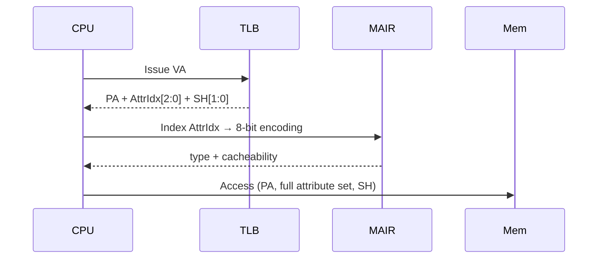

# 01.03 — MAIR_ELx and Attribute Indirection

> **ARM ARM Reference**: §D13.2.95 (`MAIR_EL1`), §B2.7.2

---

## 1. Overview — Why Indirection?

A page-table descriptor has very few bits to spare. Instead of encoding the full attribute set (~10 bits: type, Inner-cacheability, Outer-cacheability, gathering/reordering flags, etc.) **inside every PTE**, ARMv8 uses **3 bits** (`AttrIdx[2:0]`) as an index into an 8-entry table held in the `MAIR_ELx` system register.

Each entry of `MAIR_ELx` is 8 bits → total register width = 64 bits → 8 attribute slots per translation regime.

This is conceptually identical to **PAT (Page Attribute Table) on x86**.

---

## 2. MAIR_ELx Layout

```
 63              56 55           48 47           40 39           32
+------------------+----------------+---------------+---------------+
|     Attr7        |    Attr6       |    Attr5      |    Attr4      |
+------------------+----------------+---------------+---------------+
 31              24 23           16 15            8 7             0
+------------------+----------------+---------------+---------------+
|     Attr3        |    Attr2       |    Attr1      |    Attr0      |
+------------------+----------------+---------------+---------------+
```

PTE `AttrIdx = n` ⇒ access uses `MAIR_ELx.Attr<n>`.

---

## 3. 8-bit Attr Encoding

```
 7   6   5   4   3   2   1   0
[ Outer (4) ][ Inner (4) ]      ← when bits[7:4] != 0000
```

### 3.1 Top-nibble decisions

| `Attr[7:4]` | Meaning |
|---|---|
| `0000` | Device memory (bottom 4 bits select sub-type) |
| `00RW` (`R,W` not both 0) | Reserved |
| `0100` | Normal Inner Non-cacheable (always paired with `Inner[3:0]=0100`) |
| `XXYY` (else) | Normal — Outer policy in [7:4], Inner policy in [3:0] |

### 3.2 Normal cacheability nibble

| Nibble | Cacheability |
|---|---|
| `0100` | Non-cacheable |
| `10RW` | Write-Through Non-transient (R=RA, W=WA) |
| `11RW` | Write-Back Non-transient (R=RA, W=WA) |
| `00RW` (R,W non-zero) | Write-Through Transient |
| `01RW` (R,W non-zero) | Write-Back Transient |

### 3.3 Device sub-type (when `Attr[7:4] = 0000`)

| `Attr[3:0]` | Device type |
|---|---|
| `0000` | Device-nGnRnE |
| `0100` | Device-nGnRE |
| `1000` | Device-nGRE |
| `1100` | Device-GRE |

---

## 4. Canonical Linux Kernel MAIR (arm64)

```c
/* arch/arm64/include/asm/memory.h */
#define MT_DEVICE_nGnRnE       0
#define MT_DEVICE_nGnRE        1
#define MT_NORMAL_NC           2
#define MT_NORMAL              3
#define MT_NORMAL_WT           4
#define MT_NORMAL_TAGGED       5   /* MTE */
```

| Idx | Encoding | Meaning |
|---|---|---|
| 0 | `0x00` | Device-nGnRnE |
| 1 | `0x04` | Device-nGnRE |
| 2 | `0x44` | Normal Inner+Outer NC |
| 3 | `0xFF` | Normal WB Inner+Outer, RA+WA, Non-transient |
| 4 | `0xBB` | Normal WT Inner+Outer, RA+WA, Non-transient |
| 5 | `0xF0` | Normal Tagged (MTE) |

⇒ `MAIR_EL1 = 0x00_F0_BB_FF_44_04_00 (packed)` → e.g. `0xBBFF44FF04000000`-ish depending on slot use.

---

## 5. Worked Example — Decoding `Attr = 0xFF`

```
0xFF = 1111_1111
       [Outer ][Inner]
       1111    1111
```

- Top nibble `1111` → Write-Back, Non-transient, Read-Allocate=1, Write-Allocate=1
- Bottom nibble `1111` → same for Inner

→ **Normal, Inner+Outer Write-Back, RA+WA, Non-transient** — the "fully cacheable RAM" encoding used for kernel/user RAM.

### Reverse: encode "Device-nGnRE"
- Top nibble = `0000` (Device)
- Bottom nibble = `0100` (nGnRE)
- → `0x04`

---

## 6. Diagram — Attribute lookup at access time



Note: The TLB caches the **resolved attributes**, not the MAIR index, so changes to `MAIR_ELx` require a TLB invalidation (and an `ISB`) to take effect.

---

## 7. System Register Interactions

| Register | Role |
|---|---|
| `MAIR_EL1` | Stage-1 EL1&0 attribute table |
| `MAIR_EL2` | Stage-1 EL2 attribute table (and EL2&0 if VHE) |
| `MAIR_EL3` | Stage-1 EL3 attribute table |
| `AMAIR_ELx` | Auxiliary MAIR (IMPLEMENTATION DEFINED extensions) |
| Stage-2 translation | Uses MemAttr field directly in PTE (no MAIR), encoded similar to MAIR byte |

---

## 8. Pitfalls

1. **Modifying MAIR without TLBI + ISB.** Stale resolved attributes in TLB → wrong type used.
2. **Mismatching MAIR layouts between EL1 and EL2.** A guest's view through stage-1 doesn't directly influence stage-2 attribute combining; the resulting "effective memory type" is the *combination* of stage-1 and stage-2 attributes — typically the more-restrictive wins.
3. **Out-of-range AttrIdx** = `UNPREDICTABLE`.
4. **Confusing AttrIdx[2:0] with SH[1:0]** — shareability is **not** in MAIR; it's directly in the PTE.

### Stage-1 / Stage-2 combination (summary table)

| S1 Type | S2 Type | Effective |
|---|---|---|
| Normal | Normal | Normal — combined cacheability (most-restrictive wins) |
| Device | Normal | Device (Device wins) |
| Normal | Device | Device (Device wins) |
| Device-nGnRnE vs Device-GRE | | nGnRnE (most-restrictive Device) |

---

## 9. Interview Q&A

**Q1. Why indirect attributes via MAIR instead of encoding in the PTE?**
Saves PTE bits and allows fast policy changes (re-program MAIR + TLBI) without rewriting page tables.

**Q2. How many distinct attribute encodings can be active at once per regime?**
Eight — limited by `AttrIdx[2:0]`.

**Q3. After changing MAIR_EL1, what must software do?**
Issue `TLBI VMALLE1IS` (or equivalent) + `DSB ISH` + `ISB`. The TLB caches resolved attrs.

**Q4. Does stage-2 translation also use MAIR?**
No. Stage-2 PTEs encode the MemAttr directly (8 bits, similar to a MAIR slot). The architecture then combines the stage-1 and stage-2 attributes; "Device wins, most-restrictive wins."

**Q5. What encoding would you use for an MTE-tagged Normal page?**
`0xF0` — Normal Tagged, Inner+Outer WB.

**Q6. What is `0x44` and why is it useful for DMA?**
Normal Non-cacheable Inner+Outer. Used for DMA buffers on systems without IO coherency.

**Q7. Is AttrIdx checked at translation time or access time?**
Translation time (during walk) — the resolved attribute set is cached in the TLB alongside the PA.

**Q8. What happens if EL1 sets MAIR_EL1 but executing code is at EL2?**
EL2 uses `MAIR_EL2`. EL1's MAIR doesn't apply until you `eret` back.

---

## 10. Cross-references

- [01 Memory types](01_Memory_Types_Normal_Device.md)
- [02 Cacheability & shareability](02_Cacheability_Shareability.md)
- [07.03 MAIR register detail](../07_System_Registers/03_MAIR_and_Attribute_Indirection.md)
- [03.04 Stage1 vs Stage2](../03_Page_Tables_and_Translation/04_Stage1_vs_Stage2_Translation.md)
