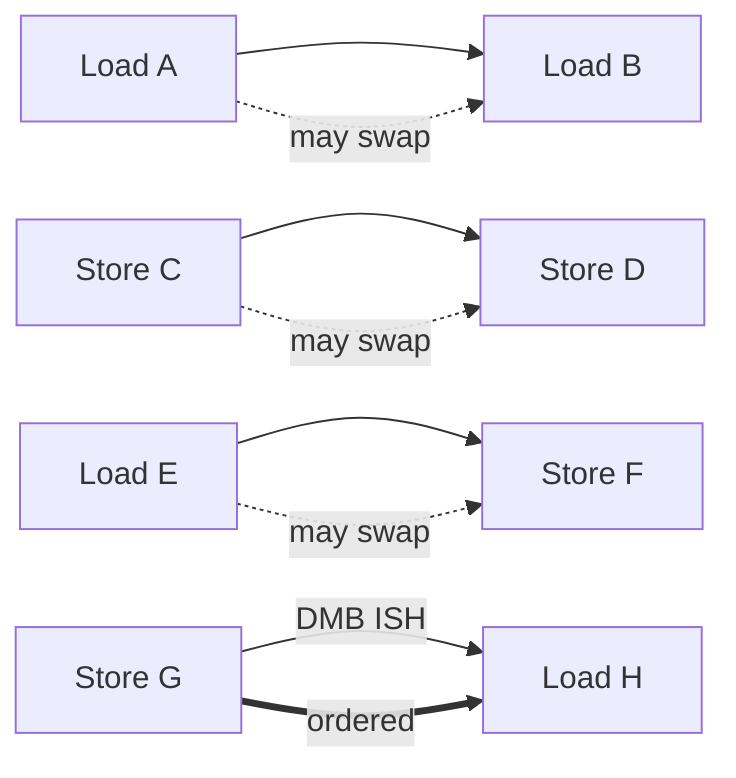

# 01.04 — The ARMv8 Weakly-Ordered Memory Model

> **ARM ARM Reference**: §B2.3 — *Definition of the ARMv8 memory model*

---

## 1. Overview

ARMv8 implements a **weakly-ordered** memory model. The architecture allows the CPU and memory system to **reorder, gather, and speculate** on memory accesses to maximize performance — subject only to **two universal rules** plus the constraints that **barriers** and **acquire/release** ops impose.

The two universal rules:
1. **Program-order coherence per address** — to a single location, observers see a consistent total order of writes.
2. **Address dependencies are respected** — a load whose address is computed from a prior load cannot be reordered before that prior load.

Everything else is fair game unless software explicitly forbids it.

Compare:
- **x86 / TSO**: strong — only Store→Load reordering allowed.
- **ARMv8 / Power**: weak — almost any pair can reorder.
- **ARMv8 multi-copy atomic** (since v8.0) — all observers see writes to *different* locations in a single, consistent order (no "private" observation).

---

## 2. What Can Reorder?

| Pair (in program order) | Reorder allowed? |
|---|---|
| Load → Load (different addr) | ✅ |
| Load → Store (different addr) | ✅ |
| Store → Store (different addr) | ✅ |
| Store → Load (different addr) | ✅ |
| Same-address pair | ❌ (coherence) |
| Address-dependent pair | ❌ (LDR x1,[x0]; LDR x2,[x1] are ordered) |
| Control-dependent pair | Partial — store-after-branch is ordered w.r.t. the controlling load |
| Data-dependent store after load | Ordered (cannot perform store with stale data) |

---

## 3. The Tools to Constrain Order

| Mechanism | Direction | Scope |
|---|---|---|
| `DMB <opt>` | Memory ↔ Memory ordering | By type (Ld/St) and shareability |
| `DSB <opt>` | Full completion | Waits until all earlier mem ops & maintenance complete |
| `ISB` | Pipeline | Flush + re-fetch; orders context-changing ops |
| `LDAR / LDAPR` | Acquire load | Subsequent ops can't move before it |
| `STLR` | Release store | Prior ops can't move after it |
| `LDAXR / STLXR` | Acquire/Release exclusive | Build lock-free atomics |

The barrier `<opt>` field combines:
- **Access type** — `LD` (load-load + load-store), `ST` (store-store), or full.
- **Shareability scope** — `NSH`, `ISH`, `OSH`, `SY` (full system).

Common forms: `DMB ISHLD`, `DMB ISHST`, `DMB ISH`, `DSB ISH`, `DSB SY`.

---

## 4. The Litmus Tests You Must Know

### 4.1 Message Passing (MP) — needs release/acquire

```
T0:                       T1:
STR  #1, [data]           wait: LDR x = [flag]
STR  #1, [flag]                 CBZ x, wait
                                LDR y = [data]   // can y == 0 on ARM?
```

**Yes**, without barriers `y == 0` is permitted on ARM (impossible on x86-TSO).

Fix:
```
T0: STR data; DMB ISHST; STR flag         // or STLR flag
T1: LDR flag (LDAR);  /* implies acq */   LDR data
```

### 4.2 Store Buffering (SB) — needs full barrier

```
T0: STR #1, [X]    T1: STR #1, [Y]
    LDR r1, [Y]        LDR r2, [X]
```

`(r1, r2) == (0, 0)` allowed on ARM (and x86). Requires `DMB ISH` (full) on both sides to prevent.

### 4.3 Independent Reads of Independent Writes (IRIW) — multi-copy atomicity

```
T0: STR 1,[X]    T1: STR 1,[Y]
T2: LDR X→1;LDR Y→0    T3: LDR Y→1;LDR X→0
```

ARMv8 (8.0+) is **multi-copy atomic**: this outcome is forbidden — observers agree on the order of writes to different locations. (ARMv7 and Power do allow IRIW; ARMv8 tightened it.)

---

## 5. Diagram — what can move past what



---

## 6. Dependencies — Free Ordering

The architecture gives some ordering for free:

| Dep type | Example | Ordering |
|---|---|---|
| **Address** | `LDR x1,[x0]; LDR x2,[x1]` | Second waits for first |
| **Data** | `LDR x1,[x0]; STR x1,[x2]` | Store after load |
| **Control (load→store)** | `LDR x1; CBZ x1, skip; STR ...` | Store ordered after load |
| **Control (load→load)** | `LDR x1; CBZ x1, skip; LDR x2` | **NOT ordered** — need `ISB` or `DMB` |

Note: **Control→Load is not ordered.** This bites speculatively-executed loads after branches (Spectre v1 class).

---

## 7. Software Implications

- **Lock implementations** use `LDAXR`/`STLXR` + `DMB ISH` or pure acquire/release.
- **Per-CPU data** can use `DMB NSH` if truly private.
- **Driver MMIO sequences** mix `DSB SY` for ordering between Normal and Device, and `DSB OSH` to ensure DMA-visible ordering.
- **Lock-free queues** require careful release/acquire pairing — see MP litmus.

### Typical lock_release pattern
```asm
    STLR  WZR, [lock]       ; release store
```

### Typical DMA-kick pattern
```asm
    STR   data, [buf]
    DSB   OSH               ; ensure data visible to coherent DMA
    STR   GO,  [doorbell]   ; doorbell is Device-nGnRE
```

---

## 8. Pitfalls

1. **Assuming x86-TSO semantics.** Code that "just works" on Intel will race on ARM.
2. **Using only address dependencies.** Compiler can break the dep chain (e.g., constant folding); use `READ_ONCE` / `volatile`.
3. **DMB ISH inside a hot loop.** Often unnecessary if you can use `LDAR/STLR`.
4. **Forgetting that control→load is unordered.** Spectre-v1 mitigations and double-checked locking traps.
5. **Believing `DSB` is sufficient to order Device against DMA.** Need shareability scope matching the DMA observer (`OSH` for IO-coherent, otherwise explicit cache maintenance).

---

## 9. Interview Q&A

**Q1. What is "weakly ordered"?**
The hardware may reorder memory accesses unless software specifies otherwise via barriers, acquire/release, or address dependencies.

**Q2. Which pair of operations is forbidden to reorder without any barrier?**
Accesses to the **same address** (per-location coherence), and **address-dependent** load chains.

**Q3. Difference between DMB and DSB?**
`DMB` orders memory accesses w.r.t. each other but doesn't stall the CPU. `DSB` blocks execution until all earlier memory ops (and maintenance) complete.

**Q4. When do you need ISB?**
After context-changing operations (writing SCTLR/TCR/TTBR, cache enable, exception level changes) to flush the pipeline so subsequent instructions see the new state.

**Q5. Is ARMv8 multi-copy atomic?**
Yes (since v8.0). All observers agree on the ordering of writes to different locations. ARMv7 and Power are not.

**Q6. What's the cheapest correct way to publish a producer→consumer flag?**
`STLR flag` on the producer; `LDAR flag` on the consumer. Avoids explicit barriers.

**Q7. Are control dependencies enough to order a subsequent load?**
No. Use `ISB` or `DMB ISHLD` (or replace the control dep with an address dep / `LDAR`).

**Q8. What's the difference between DMB ISHLD and DMB ISHST?**
`ISHLD` — loads on the before-side are ordered w.r.t. all on the after-side. `ISHST` — stores on the before-side ordered w.r.t. stores on the after-side. `ISH` (no suffix) — full barrier.

**Q9. Why does ARM expose so many barrier variants?**
Cost. A full `DSB SY` is the most expensive operation in modern ARM; tuning to `ISH` or `ISHST` saves hundreds of cycles in hot paths.

**Q10. Litmus test where x86 disallows but ARM allows?**
MP without barriers — consumer reads new flag but old data.

---

## 10. Cross-references

- [06.01 DMB / DSB / ISB](../06_Memory_Barriers_Ordering/01_DMB_DSB_ISB.md)
- [06.02 Acquire / Release](../06_Memory_Barriers_Ordering/02_Acquire_Release_LDAR_STLR.md)
- [06.03 Reordering examples](../06_Memory_Barriers_Ordering/03_Load_Store_Reordering_Examples.md)
- [05 Atomicity](05_Atomicity_and_Single_Copy_Atomic.md)
