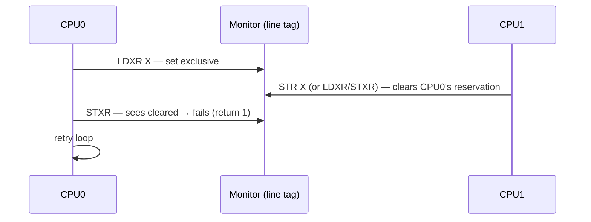

# 01.05 — Atomicity: Single-Copy and Multi-Copy

> **ARM ARM Reference**: §B2.2 — *Single-copy atomicity*, §B2.3 — *Multi-copy atomicity*

---

## 1. Two Notions of Atomicity

| Property | Definition |
|---|---|
| **Single-copy atomic** | An access either fully occurs or doesn't — never observed as a partial value. About **one access** seen by **one observer**. |
| **Multi-copy atomic** | All observers see the same total order of writes to different locations. About **multiple accesses** seen by **multiple observers**. |

ARMv8 provides both, with rules.

---

## 2. Single-Copy Atomicity Rules

A memory access is **single-copy atomic** if its full value reaches memory (or is observed) as one indivisible unit — no observer ever sees a "torn" half-update.

### 2.1 Architecturally guaranteed single-copy atomic accesses

| Access | Alignment required | Atomic? |
|---|---|---|
| Byte access (B) | byte | ✅ always |
| Halfword (H) | 2-byte aligned | ✅ |
| Word (W) | 4-byte aligned | ✅ |
| Doubleword (X, D) | 8-byte aligned | ✅ |
| Quadword pair (`STP X0,X1`) | 16-byte aligned | Each X is atomic; the pair as a whole is **not** |
| SIMD Q-reg (128 bits) | 16-byte aligned | NOT architecturally single-copy atomic |
| Misaligned access | — | NOT atomic (may tear at byte boundaries) |

### 2.2 Special: `LDXP / STXP` and FEAT_LSE2
- ARMv8.4 **FEAT_LSE2** guarantees single-copy atomicity for all naturally-aligned loads/stores up to 128 bits within a cache line, including SIMD Q-reg accesses.
- Without LSE2, software needing 128-bit atomicity must use `LDXP/STXP` pairs or `CASP` (FEAT_LSE).

---

## 3. Multi-Copy Atomicity

> "All observers agree on the order of writes to different locations."

### 3.1 The IRIW litmus test

Two stores by different cores, two readers observing in opposite orders:

```
T0: STR 1,[X]       T1: STR 1,[Y]
T2: LDR X→1; LDR Y→0    T3: LDR Y→1; LDR X→0
```

| ISA | Outcome allowed? |
|---|---|
| **x86 / TSO** | ❌ |
| **ARMv7 / Power** | ✅ (not multi-copy atomic) |
| **ARMv8 (default)** | ❌ (multi-copy atomic) |

ARMv8 is sometimes labeled "**other-multi-copy atomic**" — every store becomes visible to **all other observers** at the same logical point (the store may not be visible to the issuing CPU before others, due to store-buffer forwarding, but it appears atomic to the rest of the system).

### 3.2 Why this matters
Lock-free algorithms (RCU, hazard pointers, Dekker-style synchronization) often rely on multi-copy atomicity for correctness. Code correct on ARMv8 may fail on ARMv7 or Power.

---

## 4. Atomic Read-Modify-Write Mechanisms

### 4.1 LL/SC — Load-Exclusive / Store-Exclusive
```asm
loop:
    LDAXR  W1, [X0]        ; load-exclusive (acquire)
    ADD    W1, W1, #1
    STLXR  W2, W1, [X0]    ; store-exclusive (release)
    CBNZ   W2, loop        ; W2 != 0 → STXR failed, retry
```

- A **local monitor** (per-PE) and a **global monitor** (in coherency fabric) track the exclusive reservation.
- `STXR` may fail if any other observer wrote the line, or on a context switch, or due to a "false-positive" cache-line-granularity collision.
- Reservation granule is implementation-defined but ≥ word and ≤ 2 KB; common is one cache line (64 B).

### 4.2 LSE — Large System Extensions (ARMv8.1)
Single-instruction atomics: `CAS`, `CASP`, `LDADD`, `LDSET`, `LDCLR`, `LDEOR`, `SWP`, etc. With `A`/`L`/`AL` suffixes for acquire/release/both.

```asm
    LDADDAL  W1, W2, [X0]   ; atomic add with acquire+release
```

Advantages:
- No retry loop → bounded latency.
- Better scaling — handled at the **PoC / interconnect** ("far-atomics") rather than CPU spinning.
- Critical for >32-core systems where LL/SC livelock-prone.

### 4.3 When to use which
| Scenario | Use |
|---|---|
| Counter increment, simple RMW | LSE (`LDADD`) |
| Lock-free struct update (>1 word) | LL/SC pair or `CASP` |
| Compare-and-swap | `CAS{A,L,AL}` (LSE) |
| Conditional multi-step transaction | LL/SC loop |

---

## 5. Diagram — LL/SC monitor



---

## 6. Worked Example — torn 64-bit write?

```c
// shared, 8-byte aligned
volatile uint64_t counter;

// T0
counter = 0x1122334455667788ULL;

// T1
uint64_t v = counter;   // Can v == 0x1122334400000000 ?
```

- If `counter` is 8-byte aligned and access is one `STR X`: NO, single-copy atomic, `v` is either old or new full value.
- If misaligned (e.g., `__attribute__((packed))` straddling lines): YES, may tear.

---

## 7. Pitfalls

1. **Assuming 128-bit SIMD loads are atomic** without LSE2 — they're not.
2. **Mismatched LL/SC granularity** — two unrelated variables on the same line cause spurious STXR failures (false sharing).
3. **STXR inside an interrupt-disabled section is still not guaranteed to succeed** — kernel preemption isn't the only thing that clears the monitor.
4. **Using LSE on Non-cacheable memory** — most atomics are architecturally defined only on Inner-Shareable Cacheable; check FEAT_LSE rules for your platform.
5. **Misaligned access tearing** — even when allowed (SCTLR.A=0), atomicity is lost.

---

## 8. Interview Q&A

**Q1. Single-copy vs multi-copy atomicity?**
Single-copy: one access is not observed half-done. Multi-copy: all observers agree on the global order of writes.

**Q2. Is ARMv8 multi-copy atomic?**
Yes — "other-multi-copy atomic." IRIW is forbidden.

**Q3. Is a 16-byte `STP X0,X1` atomic as a whole?**
No (pre-LSE2). Each X is atomic individually, but another observer may see one updated and the other not.

**Q4. What does the local vs global LL/SC monitor do?**
Local tracks reservations from this PE; global is in the coherency interconnect and breaks on any external write to the line.

**Q5. Why prefer LSE atomics over LL/SC at scale?**
LL/SC scales poorly: contention causes repeated STXR failures and retries. LSE atomics are handled near the PoC and provide bounded latency.

**Q6. What's the reservation granule?**
IMPLEMENTATION DEFINED, between 1 word and 2 KB; commonly one cache line (64 B).

**Q7. What happens to the exclusive monitor on context switch?**
The architecture allows it to be cleared. Linux issues a `CLREX` on context switch to be safe.

**Q8. Why might `LDXR; STXR` loop livelock?**
Two cores both reserving and racing to commit — one always loses. Modern ARM uses backoff and the LSE atomics path to mitigate.

**Q9. Difference between FEAT_LSE and FEAT_LSE2?**
LSE (v8.1) — atomic RMW instructions. LSE2 (v8.4) — single-copy atomicity for ≤128-bit naturally-aligned accesses (including SIMD Q).

**Q10. Is `STR` to misaligned address atomic if it doesn't cross a cache line?**
Architecturally NO — single-copy atomicity requires natural alignment, regardless of whether the access stays on one line.

---

## 9. Cross-references

- [04 Weak memory model](04_Weakly_Ordered_Memory_Model.md)
- [05.04 Coherency MESI/MOESI](../05_Caches/04_Cache_Coherency_MESI_MOESI.md)
- [06.02 Acquire/Release](../06_Memory_Barriers_Ordering/02_Acquire_Release_LDAR_STLR.md)
