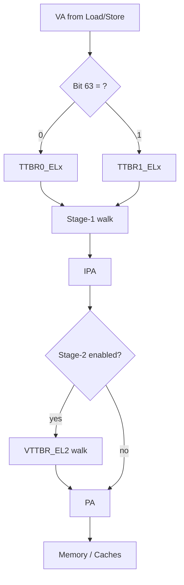

# 02.01 — VMSAv8 Overview and Address Spaces

> **ARM ARM Reference**: §D5 — *The AArch64 Virtual Memory System Architecture (VMSAv8-64)*

---

## 1. What is VMSAv8?

**VMSAv8** is the formal name of ARMv8's MMU architecture. It defines:
- How **Virtual Addresses (VA)** map to **Intermediate Physical Addresses (IPA)** and **Physical Addresses (PA)**.
- The translation-table format, granules, and walk procedure.
- How permissions, attributes, and faults are determined.
- Two variants:
  - **VMSAv8-64** for AArch64 (this document's focus).
  - **VMSAv8-32** for AArch32 (LPAE 64-bit descriptors or short-descriptor legacy format).

Each Exception Level has its own translation regime and registers.

---

## 2. Address Spaces


| Space | Width | Owner | Set by |
|---|---|---|---|
| **VA** | up to 48 (or 52 with FEAT_LVA) | Process / kernel | `TCR_ELx.T0SZ/T1SZ` |
| **IPA** | up to 48 (or 52 with FEAT_LPA) | Virtual machine guest | `VTCR_EL2.PS` and `T0SZ` |
| **PA** | up to 48 (or 52 with FEAT_LPA) | Physical hardware | `ID_AA64MMFR0_EL1.PARange` |

Without virtualization, the guest concept collapses and IPA = PA (stage-2 is bypassed/disabled).

---

## 3. AArch64 VA Layout — The Two Halves

AArch64 has **two TTBRs per EL1 regime**: `TTBR0_EL1` (lower) and `TTBR1_EL1` (upper). They are selected by the **top bits** of the VA:

```
 Address space (48-bit VA example):
 +-----------------------------------+ 0xFFFF_FFFF_FFFF_FFFF
 |  Kernel space (TTBR1_EL1)         |
 |  top bits = 1                     |
 +-----------------------------------+ 0xFFFF_0000_0000_0000
 |        — FAULT REGION —           |   (canonical hole)
 +-----------------------------------+ 0x0000_FFFF_FFFF_FFFF
 |  User space (TTBR0_EL1)           |
 |  top bits = 0                     |
 +-----------------------------------+ 0x0000_0000_0000_0000
```

- The "canonical hole" between the two halves causes a Translation Fault if accessed — any non-sign-extended pointer is caught.
- This split lets a context switch only swap `TTBR0_EL1` (user) while kernel mappings stay constant — a major perf win and **the entire mechanism behind PCID-like ASID separation**.

EL2 and EL3, by default, only have `TTBR0_ELx` — single half. **VHE (Virtualization Host Extensions)** gives EL2 both TTBRs so a Linux kernel can run at EL2.

---

## 4. VA Size Configuration (TxSZ)

The active VA size for each half is `64 − TxSZ`.

| `T0SZ` | VA bits in lower half | Top of TTBR0 region |
|---|---|---|
| 16 | 48 | `0x0000_FFFF_FFFF_FFFF` |
| 25 | 39 | `0x0000_007F_FFFF_FFFF` |
| 28 | 36 | `0x0000_000F_FFFF_FFFF` |

Linux on arm64 typically: **48-bit VA** (T0SZ=T1SZ=16) or **39-bit VA** (T0SZ=T1SZ=25, 3-level tables, smaller kernel).

With **FEAT_LVA** (v8.2): up to **52-bit VA** when using 64K granule.

---

## 5. Translation Regimes

A "regime" = the set of translations for a given EL (and sometimes Security state).

| Regime | TTBRs | Stage-1 | Stage-2 |
|---|---|---|---|
| EL1 & 0 | `TTBR0_EL1`, `TTBR1_EL1` | Yes | Optional (under EL2) |
| EL2 | `TTBR0_EL2` | Yes | — |
| EL2 & 0 (VHE) | `TTBR0_EL2`, `TTBR1_EL2` | Yes | — |
| EL3 | `TTBR0_EL3` | Yes | — |

Under a hypervisor running at EL2, **EL1&0 VAs traverse stage-1 then stage-2**; EL2 itself only does stage-1.

---

## 6. Diagram — Full address-resolution pipeline



---

## 7. Worked Example — Decoding a VA

Assume `TCR_EL1.T0SZ=16` (48-bit VA), 4 KB granule.

VA = `0x0000_0040_1234_5678`:

```
Bit 63   = 0           → TTBR0_EL1
Bits 47:39 = 0x080     → L0 index = 0x080
Bits 38:30 = 0x100     → L1 index = 0x100
Bits 29:21 = 0x091     → L2 index = 0x091
Bits 20:12 = 0x145     → L3 index = 0x145
Bits 11:0  = 0x678     → page offset
```

Walker fetches:
1. `TTBR0_EL1` base → L0 table → entry[0x080]
2. → L1 table → entry[0x100]
3. → L2 table → entry[0x091]
4. → L3 table → entry[0x145]
5. PTE provides PA[47:12]; concatenate with `0x678` → PA.

---

## 8. Disabling the MMU

`SCTLR_ELx.M = 0` → MMU disabled at that EL. Behavior:
- Data accesses are **Device-nGnRnE** (strongest order).
- Instruction fetches are **Normal Non-cacheable** (configurable).
- VA = PA — flat identity.
- Used during very early boot before page tables are constructed.

---

## 9. System Register Quick-Map

| Register | Role |
|---|---|
| `SCTLR_ELx` | Global MMU/cache enables, endianness, alignment check |
| `TTBR0_ELx`, `TTBR1_ELx` | Translation table base addresses (+ ASID for EL1) |
| `TCR_ELx` | Per-regime walk config (TxSZ, granule, walker attrs, etc.) |
| `MAIR_ELx` | Attribute table |
| `VTCR_EL2`, `VTTBR_EL2` | Stage-2 base & config for EL1&0 guest |
| `ID_AA64MMFR0_EL1` | PA range, granules supported, etc. |

---

## 10. Pitfalls

1. **Non-canonical pointers** — any VA with `bit[63:VA_size]` not equal to bit[VA_size-1] is invalid (or hits the hole). Tagging via TBI changes this.
2. **TBI (Top-Byte Ignore)** — `TCR.TBI0/TBI1` lets bits[63:56] be tag (ignored for translation). Used by MTE, HWASAN.
3. **Switching TxSZ on the fly** — requires invalidate + ISB; partial setups can wedge the walker.
4. **Forgetting `TTBR1` on context switch** — only `TTBR0` typically changes; if you blow away `TTBR1`, you've lost the kernel mapping.
5. **Stage-2 enabled but no walker attrs configured** — walker reads will hit Device memory and fail strangely.

---

## 11. Interview Q&A

**Q1. Why two TTBRs in EL1?**
To separate user (low half) and kernel (high half) without touching the kernel mapping on context switch — only TTBR0 changes.

**Q2. What does TBI do?**
Top-Byte Ignore. The MMU ignores bits[63:56] of the VA, so software can stuff tags there. Required by MTE and HWASAN.

**Q3. What is the canonical hole?**
The fault-on-access region between the highest TTBR0 address and the lowest TTBR1 address. Catches pointer-arithmetic bugs.

**Q4. How is the granule chosen?**
`TCR_ELx.TG0/TG1`. Options: 4K, 16K, 64K. Each granule yields different table sizes and levels.

**Q5. What's the difference between an IPA and a PA?**
IPA is the output of stage-1 (the guest's view of "physical"). PA is the output of stage-2 (real hardware address). Without virtualization, they coincide.

**Q6. What's VHE and why does it matter?**
Virtualization Host Extensions (v8.1) — lets a host OS run at EL2 with both TTBRs available, so kernel binaries don't need recompilation to support hypervisor mode efficiently.

**Q7. What happens if SCTLR_EL1.M = 0?**
MMU is off. VA=PA, attribute is fixed (data = Device-nGnRnE). Used at very early boot.

**Q8. How does the CPU pick TTBR0 vs TTBR1?**
By the top bit (or top-VA-bit) of the VA after TBI is applied. Lower-half → TTBR0; upper-half → TTBR1.

**Q9. Can EL2 have two TTBRs?**
Only with VHE enabled (`HCR_EL2.E2H=1`). Then EL2 has `TTBR0_EL2` and `TTBR1_EL2`.

**Q10. What's the max VA on ARMv8-A today?**
52 bits with FEAT_LVA + 64K granule, otherwise 48.

---

## 12. Cross-references

- [02 Translation regimes & ELs](02_Translation_Regimes_and_ELs.md)
- [03 Granules](03_Translation_Granules_4K_16K_64K.md)
- [04 VA/IPA/PA layout](04_VA_IPA_PA_Layout.md)
- [03.02 Multi-level walk](../03_Page_Tables_and_Translation/02_Multi_Level_Page_Walk.md)
- [07.02 TTBR / TCR](../07_System_Registers/02_TTBR0_TTBR1_TCR.md)
