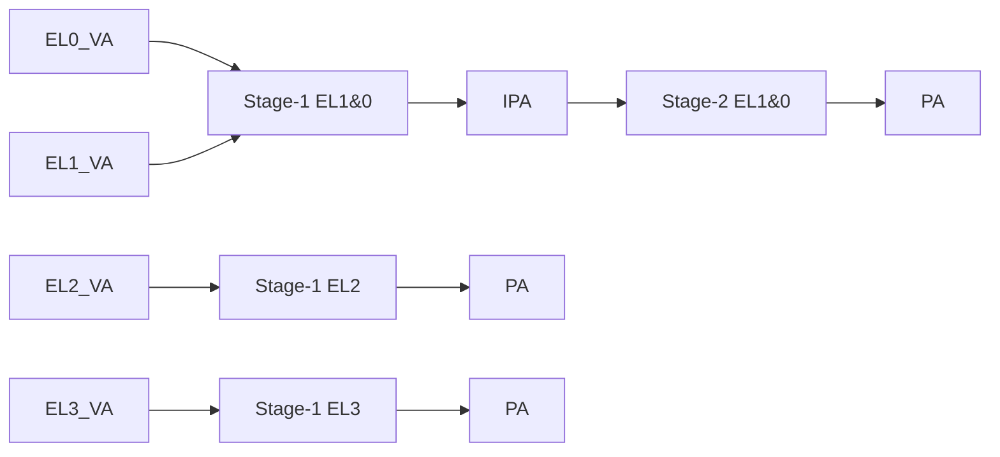

# 02.02 — Translation Regimes and Exception Levels

> **ARM ARM Reference**: §D5.2

---

## 1. Exception Levels Recap

| EL | Typical use |
|---|---|
| EL0 | Userspace |
| EL1 | OS kernel |
| EL2 | Hypervisor (or VHE-host kernel) |
| EL3 | Secure monitor (TrustZone) |

Each EL (except EL0) owns translation system registers.

---

## 2. Translation Regimes

A **regime** = the {stage-1, stage-2} translations applicable to code running at a given EL.

| Regime | Stage-1 base | Stage-2? | TTBRs |
|---|---|---|---|
| **EL1&0** | `TTBR0_EL1`, `TTBR1_EL1` | yes (if `HCR_EL2.VM=1`) | 2 |
| **EL2** (no VHE) | `TTBR0_EL2` | n/a | 1 |
| **EL2&0** (VHE, `HCR_EL2.E2H=1`) | `TTBR0_EL2`, `TTBR1_EL2` | n/a | 2 |
| **EL3** | `TTBR0_EL3` | n/a | 1 |

EL0 has no system registers of its own — it inherits the regime of whichever EL1 / EL2&0 it sits beneath.

---

## 3. Stage-1 vs Stage-2

- **Stage-1**: VA → IPA, controlled by the guest OS.
- **Stage-2**: IPA → PA, controlled by the hypervisor at EL2.
- Stage-2 is **only** applied to EL1&0 translations and only when `HCR_EL2.VM=1`.
- Stage-2 has its own page tables (`VTTBR_EL2`) and its own TLB taggings (VMID).

---

## 4. VHE — Why It Matters

Without VHE, EL2 only has one TTBR. A Linux kernel cannot run efficiently at EL2 because it depends on user/kernel TTBR split.

With VHE (`HCR_EL2.E2H=1` + `TGE=1`):
- EL2 gains `TTBR1_EL2`, `MAIR_EL2` semantics matching EL1.
- "Hosted hypervisor" model — KVM runs in EL2 alongside the host kernel.
- System register accesses from EL2 are redirected (e.g., `TTBR0_EL1` accessed at EL2 actually touches `TTBR0_EL2`).

---

## 5. Pitfalls

1. **Booting at EL3/EL2 then dropping to EL1** without properly clearing EL2 trap registers leaves EL1 trapping unexpectedly to EL2.
2. **Stage-2 enabled, but guest TTBRs not configured** — every guest access faults.
3. **VHE toggling on the fly** requires great care — invalidates everything tagged with the wrong scheme.

---

## 6. Interview Q&A

**Q1. What is a translation regime?**
The set of stage-1 (and optional stage-2) translations for an EL plus its associated TTBRs and TCR.

**Q2. Which ELs have two TTBRs?**
EL1 always; EL2 only with VHE enabled.

**Q3. When does stage-2 apply?**
For EL1&0 accesses, when `HCR_EL2.VM=1` (or `HCR_EL2.DC=0` and friends). EL2 and EL3 never go through stage-2.

**Q4. What's `HCR_EL2.E2H`?**
Selects VHE — gives EL2 the EL1-style two-TTBR regime so a host kernel can natively run at EL2.

**Q5. Where does EL0 fit?**
EL0 has no registers of its own; it uses the regime of EL1 (or EL2&0 in VHE host-userspace).

---

## 7. Cross-refs

- [01 VMSA overview](01_VMSA_Overview_and_Address_Spaces.md)
- [09.01 Two-stage translation](../09_Virtualization_Memory/01_Two_Stage_Translation_for_Hypervisor.md)
