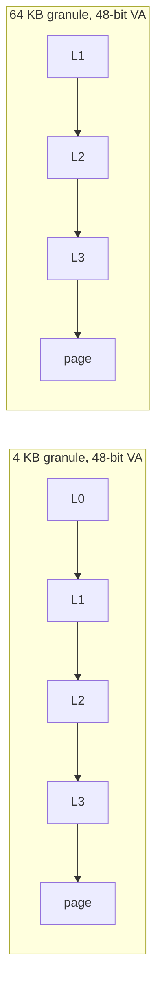

# 02.03 — Translation Granules: 4 KB / 16 KB / 64 KB

> **ARM ARM Reference**: §D5.3

---

## 1. What is a "Granule"?

The **translation granule** is the smallest page size *and* the size of each translation table at every level. ARMv8 supports three:

| Granule | Page size | Table size | PTEs per table | Index bits per level | Block sizes |
|---|---|---|---|---|---|
| **4 KB** | 4 KB | 4 KB | 512 (2⁹) | 9 | 2 MB (L2), 1 GB (L1) |
| **16 KB** | 16 KB | 16 KB | 2048 (2¹¹) | 11 | 32 MB (L2) only |
| **64 KB** | 64 KB | 64 KB | 8192 (2¹³) | 13 | 512 MB (L2) only |

Configured per regime per TTBR via `TCR_ELx.TG0` and `TCR_ELx.TG1`.

---

## 2. Levels Required vs VA Size

| VA bits | 4 KB granule | 16 KB granule | 64 KB granule |
|---|---|---|---|
| 48 | 4 levels (L0–L3) | 4 levels (L0–L3) | 3 levels (L1–L3) |
| 47–40 | 4 levels | 3 levels | 3 levels |
| 39 | 3 levels (L1–L3) | 3 levels | 2 levels (L2–L3) |
| 36 | 3 levels | 2 levels | 2 levels |

The walk uses only the levels needed; the starting level is derived from `TxSZ`.

---

## 3. VA Decode by Granule (48-bit VA)

```
4 KB granule:
 bits 47:39 = L0    (9 bits, 512 entries)
 bits 38:30 = L1    (9 bits)   ← block here = 1 GB
 bits 29:21 = L2    (9 bits)   ← block here = 2 MB
 bits 20:12 = L3    (9 bits)   ← page = 4 KB
 bits 11:0  = offset

16 KB granule:
 bit 47     = L0    (1 bit, 2 entries — just selects upper/lower half)
 bits 46:36 = L1    (11 bits)
 bits 35:25 = L2    (11 bits)   ← block here = 32 MB
 bits 24:14 = L3    (11 bits)
 bits 13:0  = offset

64 KB granule (48-bit VA, no L0):
 bits 47:42 = L1    (6 bits, 64 entries)
 bits 41:29 = L2    (13 bits)   ← block here = 512 MB
 bits 28:16 = L3    (13 bits)
 bits 15:0  = offset
```

---

## 4. Trade-offs

| Aspect | 4 KB | 16 KB | 64 KB |
|---|---|---|---|
| Memory fragmentation | best | medium | worst |
| TLB pressure (small allocs) | high | medium | low |
| Hugepage opportunity | 2 MB / 1 GB | 32 MB | 512 MB |
| Walk depth (48-bit VA) | 4 | 4 | 3 |
| Page-walk latency | most levels | medium | fewest |
| Linux default | ✅ | rare | rare (some Android, some HPC) |
| Apple silicon | — | ✅ | — |

64 KB shines for HPC/database workloads where TLB miss rate matters more than fragmentation. 16 KB is Apple's choice — a balance with smaller walks and reasonable fragmentation.

---

## 5. Diagram — walk depth comparison



---

## 6. The Contiguous Bit

Each granule supports the **contiguous hint** in PTEs — a set of 16 (or 32) adjacent PTEs mapping a naturally-aligned region can be coalesced into a single TLB entry.

| Granule | Contig count | Effective coalesced size |
|---|---|---|
| 4 KB  | 16 | 64 KB |
| 16 KB | 128 | 2 MB |
| 64 KB | 32 | 2 MB |

Software responsibility: when changing one PTE in a contiguous group, **break-before-make** the entire group.

---

## 7. Pitfalls

1. **Granule mismatch between guest and hypervisor stage-2** — guest uses 4 KB but stage-2 uses 64 KB → finer-grained stage-1 mappings can still work but expose IPA range issues.
2. **Not all granules are mandatory** on all implementations. Check `ID_AA64MMFR0_EL1.TGran4/16/64`.
3. **Changing granule on the fly** is essentially impossible without re-establishing the regime — needs disable/flush/enable.
4. **Block descriptors only at certain levels**: in 16K/64K granule, no L1 block — only L2 block + L3 page.

---

## 8. Interview Q&A

**Q1. Why does ARM support three granules?**
Different markets: 4K for compatibility & low fragmentation, 64K for HPC TLB efficiency, 16K as Apple's chosen balance.

**Q2. Why is 64K walk only 3 levels for 48-bit VA?**
Each level resolves 13 bits + 16 offset = 29 bits per level after the first. Three levels cover ≤48 bits.

**Q3. What block sizes does 4 KB give you?**
2 MB at L2, 1 GB at L1.

**Q4. What's the contiguous bit?**
A PTE flag indicating that 16/32/128 adjacent PTEs map a naturally-aligned region; the TLB can fold them into one entry to reduce pressure.

**Q5. Which granule does Linux/arm64 default to?**
4 KB. 64 KB and 16 KB are configurable kernel builds.

**Q6. Trade-off of 64 KB?**
Big advantage: fewer TLB misses, fewer walk levels. Big disadvantage: internal fragmentation (every alloc rounds up to 64 KB).

**Q7. Can different processes use different granules?**
No — granule is set per regime (`TCR_EL1`) and applies to all EL1&0 translations.

---

## 9. Cross-refs

- [01 VMSA overview](01_VMSA_Overview_and_Address_Spaces.md)
- [03.03 Block vs page](../03_Page_Tables_and_Translation/03_Block_vs_Page_Mappings.md)
- [04.04 Hugepages & contig bit](../04_TLB/04_TLB_Performance_and_Hugepages.md)
