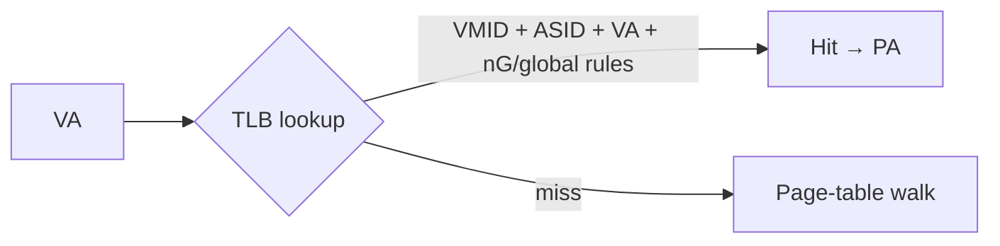

# 02.05 — ASID and VMID

> **ARM ARM Reference**: §D5.10

---

## 1. Why Tag the TLB?

A TLB caches `{VA → PA, attrs, perms}` translations. Two distinct contexts can use overlapping VAs:
- Two **processes** both use VA `0x4000_0000` for different data → distinguished by **ASID** (Address Space Identifier).
- Two **VMs** both use IPA `0x4000_0000` for different stage-2 mappings → distinguished by **VMID** (Virtual Machine Identifier).

Without tagging, every context switch would require flushing the entire TLB. With tagging, the TLB stores `{ASID, VA → PA}` and `{VMID, IPA → PA}`, and a context switch is just a TTBR/VMID write.

---

## 2. ASID

| Property | Value |
|---|---|
| Width | 8 bits (default) or **16 bits** if `TCR_EL1.AS=1` (and supported) |
| Location | `TTBR0_EL1[63:48]` *or* `TTBR1_EL1[63:48]` — selected by `TCR_EL1.A1` |
| Scope | Tags stage-1 EL1&0 TLB entries |
| Global pages | Marked with `nG=0` in PTE — match regardless of ASID |

### Switching ASID
Write a new TTBR with a new ASID — TLB entries tagged with old ASID remain valid for the old process (still usable when it runs again).

Linux uses a **rollover** scheme: 16-bit ASIDs give 65535 unique IDs; on rollover, **all** TLB entries are flushed and ASIDs are reassigned.

---

## 3. VMID

| Property | Value |
|---|---|
| Width | 8 or 16 bits (`VTCR_EL2.VS`) |
| Location | `VTTBR_EL2[63:48]` |
| Scope | Tags stage-2 (and combined stage-1+2) TLB entries for the guest |
| Set by | Hypervisor on each guest switch |

A hypervisor assigning per-VM VMIDs allows context switching VMs without TLB flushes.

---

## 4. Combined Tagging

Under virtualization, an EL1&0 TLB entry is effectively keyed by `{VMID, ASID, VA}`:
- VMID isolates VMs.
- ASID (per-VM) isolates processes inside a VM.
- Global (`nG=0`) bits exempt entries from ASID match (used for kernel mappings).
- Non-secure vs secure also adds a tag.

---

## 5. TLBI ASID/VMID Scoping

`TLBI` instructions can be scoped by ASID/VMID:

| Instruction | Scope |
|---|---|
| `TLBI VMALLE1` | All EL1&0 entries for current VMID |
| `TLBI ASIDE1, Xt` | All entries for given ASID (current VMID) |
| `TLBI VAE1, Xt` | One VA in current ASID/VMID |
| `TLBI VMALLS12E1` | All stage-1+2 for current VMID |
| `TLBI ALLE2` | All EL2 entries |
| `TLBI VMALLE1IS` | Broadcast to Inner Shareable |

---

## 6. Pitfalls

1. **Reusing an ASID before flushing** — old stale entries from a previous owner of that ASID will alias the new process's memory.
2. **8-bit ASID rollover** — 256 IDs is small; large systems prefer 16-bit ASID.
3. **Global mapping (`nG=0`) collision** — global kernel pages match all ASIDs; an incorrectly-marked user page would leak across processes.
4. **VMID change without proper barrier sequence** — speculative walks may use stale VMID.
5. **Concurrent ASID rollover on SMP** — needs careful synchronization (Linux uses an "active ASIDs" cpumask).

---

## 7. Interview Q&A

**Q1. What problem does ASID solve?**
Avoids flushing TLB on every context switch by tagging entries with a process identifier.

**Q2. How wide is ASID?**
8 or 16 bits, selected by `TCR_EL1.AS`.

**Q3. Where is ASID stored?**
In the high bits (63:48) of TTBR0 or TTBR1 (selected by `TCR_EL1.A1`).

**Q4. What's a "global" mapping?**
A PTE with `nG=0` — its TLB entry matches regardless of ASID, used for kernel pages shared across all processes.

**Q5. What is VMID for?**
Tags TLB entries with a per-VM ID so the hypervisor can switch guests without flushing.

**Q6. What happens on ASID rollover?**
Linux flushes the entire TLB and reassigns ASIDs from a fresh generation. The old generation is invalidated.

**Q7. Can two CPUs simultaneously use the same ASID for different processes?**
No — that's the entire point of the per-CPU active-ASID tracking. Linux ensures one ASID is owned by one mm at a time globally.

**Q8. How does VMID interact with ASID in TLB lookup?**
A TLB entry matches when both VMID and ASID (or `nG=0` for global) match the current context.

---

## 8. Cross-refs

- [04.01 TLB architecture](../04_TLB/01_TLB_Architecture_and_Tagging.md)
- [04.02 TLBI](../04_TLB/02_TLB_Maintenance_Instructions.md)
- [09.02 IPA / VMID](../09_Virtualization_Memory/02_IPA_Space_and_VMID.md)
