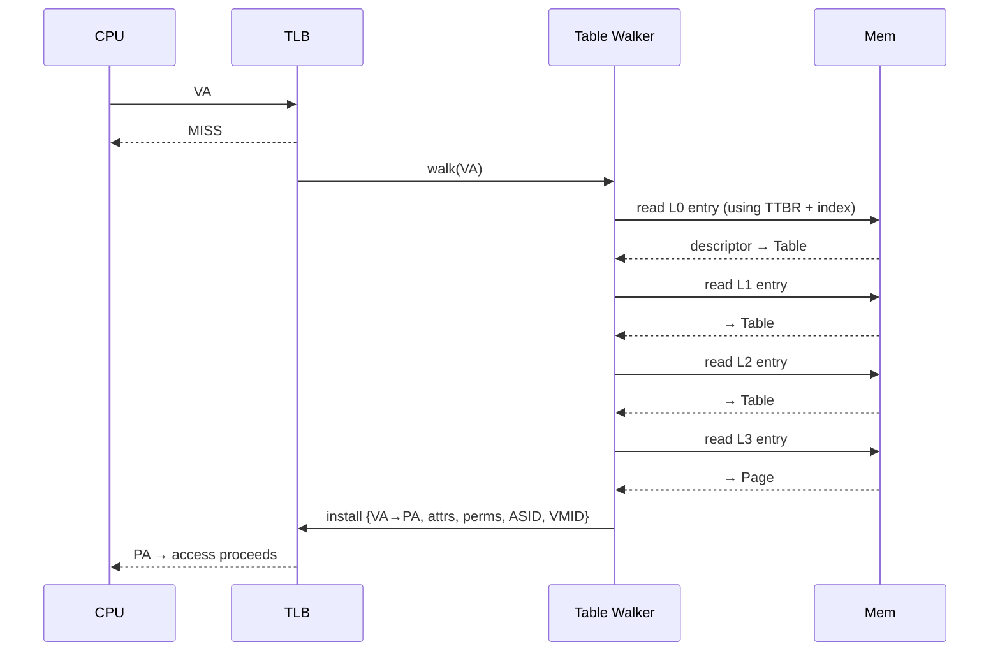

# 03.02 — Multi-Level Page-Table Walk

> **ARM ARM Reference**: §D5.3, §D5.4

---

## 1. The Walk in Plain English

When the TLB misses, the **Translation Table Walker (TTW)** — a hardware unit, *not* the CPU pipeline — fetches descriptors from memory starting at the appropriate TTBR. It walks one level per memory access until it hits a leaf (Block or Page) or an Invalid descriptor (→ fault).

---

## 2. Walk Inputs

The walk needs:

| Input | Source |
|---|---|
| VA | The instruction |
| Starting table base | `TTBR0/TTBR1_ELx` |
| Starting level | Derived from `TCR.TxSZ` and granule |
| Granule | `TCR.TG0/TG1` |
| Walker memory attrs | `TCR.IRGN0/1`, `ORGN0/1`, `SH0/1` |
| ASID | TTBR[63:48] (plus `TCR.A1`) |
| Stage-2 (if enabled) | `VTTBR_EL2`, `VTCR_EL2` |

---

## 3. Level Sequence (48-bit VA, 4 KB granule)

| Level | Index bits | Covers (per entry) | Block size at this level |
|---|---|---|---|
| L0 | 47:39 | 512 GB | (block not allowed) |
| L1 | 38:30 | 1 GB | 1 GB |
| L2 | 29:21 | 2 MB | 2 MB |
| L3 | 20:12 | 4 KB | 4 KB (page) |

`Start_Level = 4 − ⌈(VA_bits − 12) / 9⌉` (for 4 KB granule). E.g., 39-bit VA → start L1, 48-bit VA → start L0.

---

## 4. Worked Example — Full Walk

**Setup**: 48-bit VA, 4 KB, TTBR0_EL1 = `0x0000_0080_0000_0000`.

VA = `0x0000_0040_1234_5678`:

| Step | Action | Detail |
|---|---|---|
| 1 | L0 index = `(VA >> 39) & 0x1FF` | `0x080` |
| 2 | L0 entry addr = `TTBR0 + (L0idx << 3)` | `0x80_0000_0400` |
| 3 | Read L0 desc → table @ `0x80_0010_0000` | type=Table |
| 4 | L1 index = `(VA >> 30) & 0x1FF` | `0x100` |
| 5 | L1 entry addr = `0x80_0010_0000 + 0x800` | `0x80_0010_0800` |
| 6 | Read L1 desc → table @ `0x80_0020_0000` | type=Table |
| 7 | L2 index = `(VA >> 21) & 0x1FF` | `0x091` |
| 8 | L2 entry addr = `0x80_0020_0000 + 0x488` | `0x80_0020_0488` |
| 9 | Read L2 desc → table @ `0x80_0030_0000` | type=Table |
| 10 | L3 index = `(VA >> 12) & 0x1FF` | `0x145` |
| 11 | L3 entry addr = `0x80_0030_0000 + 0xA28` | `0x80_0030_0A28` |
| 12 | Read L3 desc → page, OA = `0xABCDE` | type=Page |
| 13 | PA = `(OA << 12) \| offset` = `0xABCDE_678` | done |

Total memory accesses for the walk: **4** (one per level).

---

## 5. Walk Costs and Walk Caches

A cold walk = 4 cache-line fetches → ~100s of cycles each if all miss. Mitigations:

- **TLBs** at multiple levels (μTLB → main TLB → STLB).
- **Page-walk caches** — caches *intermediate* table entries so partial walks can resume mid-tree.
- **Stride/structural prefetchers** seeded by the walker.

Under **stage-2 nested translation**, each stage-1 walk fetch is itself a stage-2 IPA→PA translation that may need its own (up to 4-level) walk. Worst case:
- 4 stage-1 levels × (1 + 4 stage-2 levels) + 4 final stage-2 = **24 memory accesses** for one TLB miss.

This is why **nested page walks are pathological** for hypervisor performance, and why **SLAT TLBs** with combined-translation entries are critical.

---

## 6. Pitfalls

1. **Walker memory not coherent** — if TT memory is not Inner-Shareable, walks across cores can race on updates.
2. **Speculative walks** — the TTW may walk for speculative loads; mis-speculation can populate TLB with garbage. Side-channel attacks (Spectre-class) exploit this.
3. **Modifying live tables without break-before-make** — atomic 64-bit PTE store is single-copy atomic, but changing certain fields requires invalidate first to avoid TLB-incoherency violations.
4. **Wrong starting level** — programming `TxSZ` outside the valid range for the chosen granule = boot wedge.
5. **Aliasing the same VA via two TTBRs** — undefined.

---

## 7. Interview Q&A

**Q1. What hardware performs the walk?**
A dedicated **Translation Table Walker (TTW)**, separate from the CPU pipeline.

**Q2. How many memory accesses for a 4 KB / 48-bit VA walk?**
Four (L0→L1→L2→L3).

**Q3. What can shorten the walk?**
Block descriptors at L1 (1 GB) or L2 (2 MB) skip remaining levels.

**Q4. How is walking affected by nested virtualization?**
Each stage-1 walk fetch itself goes through stage-2 → up to **24 memory accesses** in the worst case for one TLB miss.

**Q5. What attributes does the walker use to read tables?**
Configured in `TCR_ELx.SH0/SH1`, `IRGN0/1`, `ORGN0/1` — independent of the attributes encoded in the PTEs.

**Q6. Can walks be speculative?**
Yes — to populate TLB ahead of demand. They can cause side-channel leakage and may be observed via cache-side-channels.

**Q7. What's a "walk cache" or "intermediate cache"?**
Microarchitectural cache of partial walk results (table addresses at L0/L1/L2) so subsequent walks within the same region restart deeper.

**Q8. Why is break-before-make needed?**
Changing certain PTE fields (size, attributes, output address) while a stale TLB entry exists is architecturally `UNPREDICTABLE`. BBM sequence: write invalid → DSB → TLBI → DSB → write new → DSB → ISB.

---

## 8. Cross-refs

- [01 Descriptor formats](01_Translation_Table_Format_Descriptors.md)
- [03 Block vs page](03_Block_vs_Page_Mappings.md)
- [04 Stage1/2](04_Stage1_vs_Stage2_Translation.md)
- [04.01 TLB architecture](../04_TLB/01_TLB_Architecture_and_Tagging.md)
