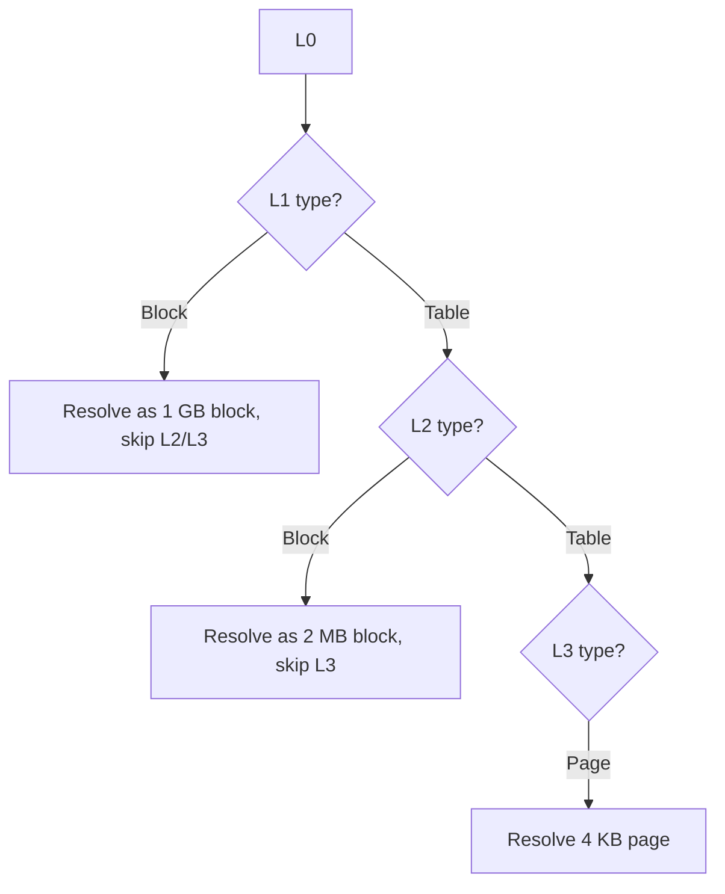

# 03.03 — Block vs Page Mappings (Hugepages)

> **ARM ARM Reference**: §D5.3, §D5.7

---

## 1. Block vs Page

| Term | Where | Size |
|---|---|---|
| **Page** | Last-level descriptor (L3 for 4 KB, L3 for 16/64 KB) | Granule (4 / 16 / 64 KB) |
| **Block** | Non-last level descriptor | Coarser power-of-two |

Blocks are the architectural mechanism for **hugepages**.

---

## 2. Allowed Block Sizes

| Granule | L1 block | L2 block | L3 page |
|---|---|---|---|
| 4 KB  | 1 GB | 2 MB | 4 KB |
| 16 KB | — (no L1 block) | 32 MB | 16 KB |
| 64 KB | — | 512 MB | 64 KB |

(L0 never allows a block descriptor.)

---

## 3. When to Use a Block

- The mapped region is **large** and naturally aligned.
- The attributes/permissions are uniform across the entire region.
- TLB pressure must be minimized (one TLB entry covers the whole block).

Example: kernel direct-mapped DRAM → use 1 GB blocks where possible (Linux "linear map" uses 2 MB or 1 GB blocks on arm64).

---

## 4. The Contiguous Hint — "Soft" Hugepages

For pages too small to be blocks but where 16/32/128 adjacent PTEs share attributes, set the **Contiguous bit** in each PTE. TLB may coalesce.

| Granule | Required contiguous count | Effective merged size |
|---|---|---|
| 4 KB at L3 | 16 PTEs | 64 KB |
| 4 KB at L2 (blocks) | 16 entries | 32 MB |
| 16 KB at L3 | 128 PTEs | 2 MB |
| 64 KB at L3 | 32 PTEs | 2 MB |

All entries in the group must:
- Be naturally aligned in both VA and PA.
- Have identical attributes & permissions.
- Have the contiguous bit set.

Break-before-make required if changing any entry in the group.

---

## 5. Diagram — block vs page resolution

---

## 6. Software Implications

### Linux on arm64
- **Linear map (kernel direct map of all DRAM)** uses block mappings — 1 GB if possible, else 2 MB, falling back to 4 KB at edges.
- **Transparent Hugepages (THP)** uses 2 MB blocks (L2 block at 4 KB granule).
- **HugeTLBfs** allows 64 KB (contig), 2 MB (block), 32 MB (contig at 16K), 1 GB (block).
- **VMALLOC** typically 4 KB pages (mappings sparse).

### Gotchas
- Splitting a 1 GB block → write new tables for 512 × 2 MB → BBM each one.
- Merging back to a block requires invalidating each fine entry first.

---

## 7. Pitfalls

1. **Setting contiguous bit but failing alignment** — `UNPREDICTABLE`.
2. **Splitting blocks while another core executes from them** — needs BBM; otherwise stale TLB may persist.
3. **Block descriptors at L1 with 16K/64K granule** — not allowed.
4. **Forgetting that AF/Dirty bits apply per-TLB-entry** — for a contiguous group, HW updates each PTE individually.

---

## 8. Interview Q&A

**Q1. What block sizes does a 4 KB granule give?**
1 GB (L1 block) and 2 MB (L2 block).

**Q2. Why use a 1 GB block?**
One TLB entry covers 1 GB → huge TLB-reach win for kernel direct map or large databases.

**Q3. What's the contiguous bit?**
A PTE hint telling the TLB that a group of adjacent PTEs share attributes and can be folded into one TLB entry.

**Q4. Difference between contiguous PTEs and a block?**
A block is a single descriptor at a non-last level. Contiguous is a group of last-level descriptors. Block sizes are larger; contiguous is more flexible alignment-wise.

**Q5. What happens if I split a block into pages?**
Allocate a new next-level table populated with pages, then BBM the parent entry from block → table.

**Q6. Why no L1 block with 64 KB granule?**
The architecture only defines L2 block (512 MB) and L3 page (64 KB) for that configuration.

**Q7. THP on arm64 — what's the typical hugepage size?**
2 MB (L2 block, 4 KB granule).

---

## 9. Cross-refs

- [01 Descriptor formats](01_Translation_Table_Format_Descriptors.md)
- [02 Walk](02_Multi_Level_Page_Walk.md)
- [04.04 TLB perf & hugepages](../04_TLB/04_TLB_Performance_and_Hugepages.md)
