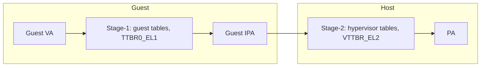

# 03.04 — Stage-1 vs Stage-2 Translation

> **ARM ARM Reference**: §D5.2, §D5.5

---

## 1. The Two Stages

| Stage | Maps | Controlled by | Tables |
|---|---|---|---|
| **Stage-1** | VA → IPA | Guest OS (EL1) or EL2/3 | `TTBR0/1_ELx` |
| **Stage-2** | IPA → PA | Hypervisor (EL2) | `VTTBR_EL2` |

For **EL1&0 under a hypervisor**, every VA goes through both. For EL2 and EL3 code, only stage-1 applies.

---

## 2. Activation

Stage-2 for EL1&0 is enabled by `HCR_EL2.VM=1`. When 0, EL1&0 IPAs flow directly to PA (essentially identity at stage-2).

---

## 3. Differences in Descriptor Format

| Property | Stage-1 | Stage-2 |
|---|---|---|
| Attribute encoding | `AttrIdx[2:0]` → MAIR | `MemAttr[3:0]` direct |
| Permissions | `AP[2:1]` + UXN/PXN (R/W/X, EL0 vs EL1) | `S2AP[1:0]` (read/write) + XN[1:0] |
| ASID | yes (in TTBR) | n/a |
| VMID | n/a | yes (in VTTBR) |
| Granule | per-TTBR (`TG0/TG1`) | per-`VTCR_EL2.TG0` |
| Start level | derived from `TxSZ` | `VTCR_EL2.SL0` (explicit) |

Stage-2 has a single TTBR and a single TxSZ — no "two halves".

---

## 4. Combined Attributes

When both stages exist, hardware combines results:

| Stage-1 type | Stage-2 type | Effective |
|---|---|---|
| Normal | Normal | Normal — combined cacheability (intersection / "most restrictive") |
| Device | * | Device (stage-1 wins as Device) |
| * | Device | Device |
| Device-X vs Device-Y | | Most restrictive sub-type |

Shareability: stage-2 SH applies if more restrictive than stage-1.

Permissions: AND of stage-1 perms and stage-2 perms. Either stage can deny.

---

## 5. Fault Reporting

| Fault from | Reported via |
|---|---|
| Stage-1 | `ESR_ELx`, `FAR_ELx` (faulting VA) |
| Stage-2 (translation of a guest IPA) | `ESR_EL2`, `HPFAR_EL2` (faulting IPA) + `FAR_EL2` (guest VA) |
| Stage-2 during a stage-1 walk | "S1PTW" bit set in ESR; HPFAR carries IPA of the table-fetch |

---

## 6. Pitfalls

1. **`HCR_EL2.VM=0` but VTTBR loaded** — easy to forget to enable; guest behaves as if running on bare metal.
2. **Stage-2 granule mismatch** — guest uses 4 KB but stage-2 uses 64 KB → fine-grained guest mappings still work but stage-2 fragmentation is large.
3. **IPA size mismatch** — `VTCR_EL2.PS` smaller than guest's TxSZ → top IPA bits cause faults.
4. **VMID reuse** — must invalidate stale stage-2 TLB entries when reassigning a VMID.
5. **Nested walks pathological cost** — see [Walk doc](02_Multi_Level_Page_Walk.md).

---

## 7. Interview Q&A

**Q1. What does stage-1 produce?**
An IPA (intermediate physical address) — the guest's notion of "physical."

**Q2. Who programs stage-2?**
The hypervisor at EL2 (via VTTBR_EL2 and VTCR_EL2).

**Q3. When does stage-2 not apply?**
For EL2 and EL3 accesses, or when `HCR_EL2.VM=0` (no virtualization).

**Q4. How are permissions combined?**
Logical AND. Either stage denying access causes a fault, attributed to the stage that denied.

**Q5. How are memory types combined?**
Device-wins; among Devices, most-restrictive sub-type wins. Among Normals, cacheability intersection.

**Q6. What's the worst-case TLB-miss walk cost under nested translation?**
Up to 24 memory accesses (4 stage-1 fetches × 5 each, plus 4 final stage-2).

**Q7. What's the S1PTW bit?**
In `ESR_EL2`, indicates that the fault was on a stage-2 translation of a stage-1 page-table walk fetch (vs. a guest data access).

---

## 8. Cross-refs

- [02 Walk](02_Multi_Level_Page_Walk.md)
- [09.01 Two-stage translation](../09_Virtualization_Memory/01_Two_Stage_Translation_for_Hypervisor.md)
- [09.02 IPA/VMID](../09_Virtualization_Memory/02_IPA_Space_and_VMID.md)
- [08.02 ESR decoding](../08_Faults_and_Aborts/02_ESR_FAR_HPFAR_Decoding.md)
