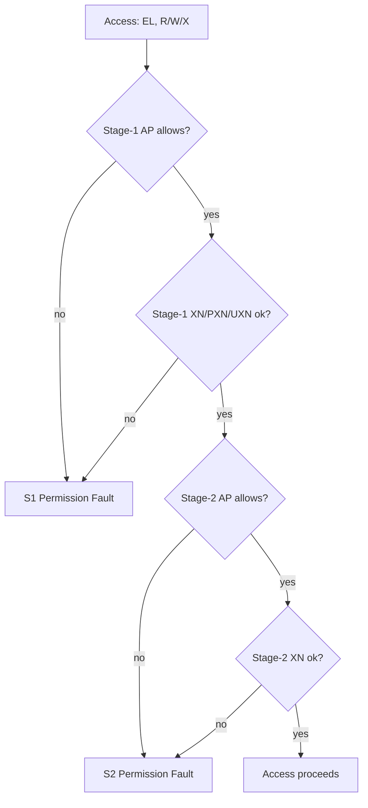

# 03.06 — Permission Checks: AP, UXN, PXN

> **ARM ARM Reference**: §D5.4

---

## 1. The Three Permission Axes

| Axis | Bits | Controls |
|---|---|---|
| **Data R/W + EL** | `AP[2:1]` | Read-only vs RW; EL0 access allowed or not |
| **Unprivileged execute** | `UXN` (bit 54) | Whether EL0 can execute |
| **Privileged execute**   | `PXN` (bit 53) | Whether EL1 can execute |

The TLB caches the effective permissions; permission checks happen at access time using cached values.

---

## 2. AP[2:1] Encoding (stage-1, EL1&0)

| AP[2:1] | EL1 access | EL0 access |
|---|---|---|
| `00` | R/W | none |
| `01` | R/W | R/W |
| `10` | R   | none |
| `11` | R   | R   |

- AP[2] = 1 means **read-only**; AP[2] = 0 means writable.
- AP[1] = 1 means **EL0 may access**; AP[1] = 0 means EL0 access denied.

For EL2 and EL3 regimes (single-TTBR), AP[1] is RES1 and only AP[2] controls R/W (no EL0 in those regimes).

---

## 3. Execute Permissions

| Bit | Effect |
|---|---|
| **UXN** (Unprivileged eXecute Never) | If 1, EL0 cannot execute this page |
| **PXN** (Privileged eXecute Never) | If 1, EL1 cannot execute this page |

Best practices:
- All EL0 data pages: `UXN=1`.
- All EL0 user mappings: `PXN=1` (kernel must never execute user pages — this prevents **ret2user** exploits; ARM analog of SMEP).
- All EL1 data pages: `PXN=1, UXN=1`.

PAN (Privileged Access Never, FEAT_PAN, v8.1) extends this: when `PSTATE.PAN=1`, EL1 loads/stores to EL0-accessible pages fault — analogous to x86 SMAP.

---

## 4. Stage-2 Permissions

Stage-2 uses `S2AP[1:0]` (different encoding):

| S2AP | Access |
|---|---|
| `00` | none |
| `01` | read-only |
| `10` | write-only (rarely meaningful) |
| `11` | RW |

Plus `XN[1:0]` for execute control (more granular than stage-1).

Permissions across stages are **logically AND-combined** — either stage may deny.

---

## 5. Hierarchical (`APTable`, `XNTable`, `PXNTable`)

Set in a **Table descriptor**, these *restrict* all descendant entries:

| Field | Effect |
|---|---|
| `APTable[0]` | Force read-only on all children |
| `APTable[1]` | Disallow EL0 on all children |
| `XNTable` | Force XN on all children |
| `PXNTable` | Force PXN on all children |

Note: these only *remove* permissions; they cannot grant.

---

## 6. Diagram — permission decision

---

## 7. PAN and UAO

- **PAN** (`PSTATE.PAN`) — when 1, EL1 loads/stores to pages marked EL0-accessible cause a Permission fault. Linux sets PAN around most of the kernel; clears around `copy_from_user`/`copy_to_user`.
- **UAO** (`PSTATE.UAO`, FEAT_UAO) — when 1, unprivileged loads/stores (`LDTR`, `STTR`) behave as if PAN=0 — used inside user-access helpers without globally clearing PAN.

---

## 8. Pitfalls

1. **Forgetting PXN on user pages** — opens ret2user exploits.
2. **Setting both XN and writable** is fine (W^X) — but writable+executable user pages (`UXN=0, AP=01`) are a security red flag.
3. **`APTable=01` (force RO)** demoting a writable child to RO is *not* a fault by itself, but data writes will fault.
4. **Mismatch between AP encoding for EL1&0 vs EL2/EL3 regimes** — be careful when sharing PTE-building code.
5. **PAN with kernel softirq accessing userspace** — must use `LDTR/STTR` or temporarily disable PAN.

---

## 9. Interview Q&A

**Q1. What's the difference between UXN and PXN?**
UXN denies EL0 execute; PXN denies EL1 execute. Together they enforce W^X and prevent kernel-executing-user-pages.

**Q2. What does AP[2:1]=01 mean?**
Read-write for both EL1 and EL0.

**Q3. ARM equivalent of x86 SMEP?**
PXN bit on user pages (kernel can't execute user memory).

**Q4. ARM equivalent of x86 SMAP?**
PAN (Privileged Access Never).

**Q5. How are stage-1 and stage-2 perms combined?**
Logical AND — either stage may deny, fault is attributed to the denying stage.

**Q6. What is APTable?**
A table-descriptor field that restricts permissions on every entry under it — purely AND-restrictive.

**Q7. Why use UAO?**
So copy_to_user-style helpers don't need to flip PAN globally — they use unprivileged-mode loads/stores while PAN stays on.

**Q8. Can you have a "write-only" page?**
At stage-1, AP encoding doesn't allow it. Stage-2 has `S2AP=10` (write-only) but it's rarely used because reads of code/data are nearly always required.

---

## 10. Cross-refs

- [01 Descriptor formats](01_Translation_Table_Format_Descriptors.md)
- [05 Access flag / dirty](05_Access_Flag_and_Dirty_State.md)
- [08 Faults](../08_Faults_and_Aborts/01_Translation_Permission_Alignment_Faults.md)
