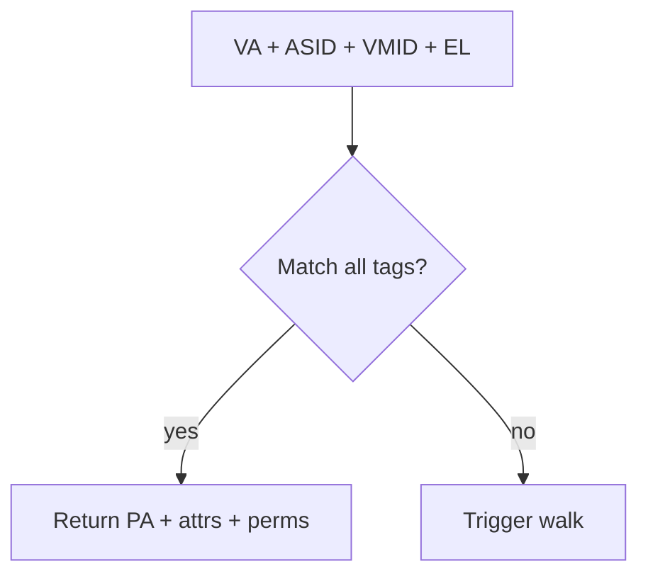

# 04.01 — TLB Architecture and Tagging

> **ARM ARM Reference**: §D5.10

---

## 1. What the TLB Caches

A TLB entry stores the *result* of a translation walk:

| Field | Source |
|---|---|
| VA (virtual) | input |
| PA (physical) | walk result |
| Attributes (type, cacheability, shareability) | resolved from MAIR + PTE |
| Permissions (AP, UXN, PXN) | PTE + APTable hierarchy |
| ASID | TTBR |
| VMID | VTTBR |
| nG (global flag) | PTE |
| Size (page or block) | walk |
| Contiguous group info | optional |

A hit returns these without walking.

---

## 2. Microarchitectural Hierarchy (typical, IMPLEMENTATION DEFINED)

```
CPU pipeline
   ├─ μTLB (L1)  — per access port (load, store, fetch); tiny (e.g. 32–64 entries), 1-cycle
   ├─ Main TLB (L1 unified or per-type) — hundreds of entries
   └─ STLB / L2 TLB — thousands, shared across pipelines
        ↓ miss
   Translation Table Walker (TTW)
        ├─ Walk caches (intermediate descriptors)
        └─ Page-table memory (via caches → DRAM)
```

ARM architecture **does not mandate** any specific structure; implementations vary widely (e.g. Cortex-A78, Neoverse N1/N2, Apple Firestorm — different TLB sizes/levels).

---

## 3. TLB Tagging Keys

A TLB entry matches if all of:
- VA upper bits match (with masking for granule/block)
- ASID matches **or** `nG=0` (global)
- VMID matches (if stage-2 enabled)
- Security state matches
- The translation regime matches



---

## 4. Combined vs Split-Stage Entries

TLB entries can be:
- **Stage-1 only** (EL2, EL3, or EL1 with no stage-2)
- **Stage-2 only** (rare, usually for SMMU or stage-2 walk caches)
- **Combined stage-1 + stage-2** ("combined-stage TLB entry") — common, caches the merged VA→PA result, tagged with {VMID, ASID, VA}

Combined entries are critical for hypervisor performance — they avoid having to traverse stage-2 on every stage-1 hit.

---

## 5. Coverage and Reach

**TLB reach** = entries × average page size. For typical L2 TLB with 2048 entries:

| Page size | Reach |
|---|---|
| 4 KB | 8 MB |
| 64 KB | 128 MB |
| 2 MB | 4 GB |
| 1 GB | 2 TB |

This is why **hugepages and the contiguous bit dramatically improve performance** on large-working-set apps.

---

## 6. Pitfalls

1. **Assuming TLB layout** — ARM doesn't specify it. Tune via PMU counters per part.
2. **Walking with `IRGN/ORGN = NC`** — every walk goes to DRAM; defeats walk caches.
3. **Not using global flag (`nG=0`) for kernel mappings** — context switch invalidates kernel TLB unnecessarily.
4. **High aliasing across ASIDs** — limited TLB capacity → thrashing.

---

## 7. Interview Q&A

**Q1. What is a TLB entry tagged with?**
{VA, ASID (unless global), VMID (if stage-2), security state, regime} → PA + attrs + perms.

**Q2. What is a combined-stage TLB entry?**
A single entry that caches the result of stage-1 + stage-2 walks together, avoiding stage-2 lookups on stage-1 TLB hits.

**Q3. What's TLB reach and how do you improve it?**
Total VA range covered by the TLB. Improved with hugepages, contiguous bit, larger granules.

**Q4. Why is `nG=0` important for kernel mappings?**
It makes the TLB entry global — survives ASID change on context switch → no re-fetch needed for kernel code/data.

**Q5. Does ARM mandate a specific TLB hierarchy?**
No, it's IMPLEMENTATION DEFINED. Architecture defines behavior, not structure.

**Q6. How does the walker reduce its own memory cost?**
"Walk caches" / "intermediate caches" hold partial walks (L0/L1/L2 entries) so subsequent walks share work.

---

## 8. Cross-refs

- [02 TLBI](02_TLB_Maintenance_Instructions.md)
- [03 TLB shootdown](03_TLB_Shootdown_and_Broadcast.md)
- [04 Hugepages](04_TLB_Performance_and_Hugepages.md)
- [02.05 ASID/VMID](../02_Virtual_Memory_VMSAv8/05_ASID_and_VMID.md)
