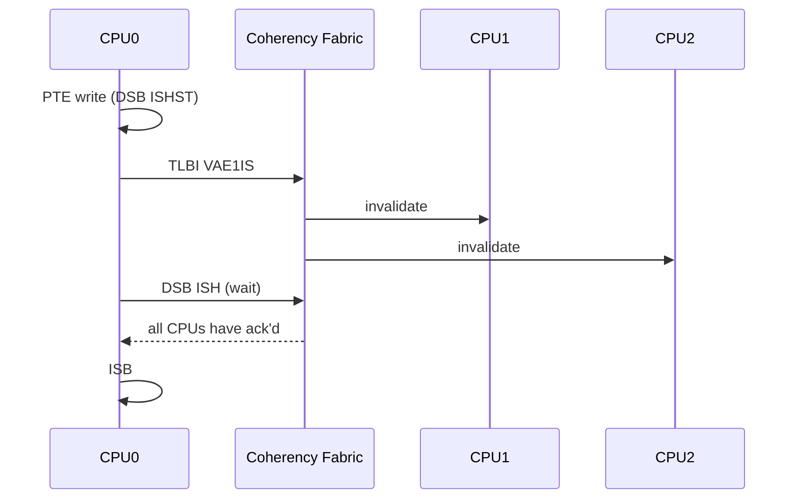

# 04.02 — TLB Maintenance Instructions (TLBI)

> **ARM ARM Reference**: §D5.10.2

---

## 1. The TLBI Family

`TLBI <op>{IS|OS}{NSH}, <Xt>` — invalidate TLB entries by various scopes.

Form: `TLBI <type><scope>[<shareability>], <operand>`

### Scope component

| Suffix | Meaning |
|---|---|
| `E1` | EL1&0 stage-1 |
| `E2` | EL2 |
| `E3` | EL3 |
| `E1OS` | EL1&0, outer shareable |
| `E1IS` | EL1&0, inner shareable (broadcast) |
| `E1NSH` | EL1&0, non-shareable (local CPU only) |

### Type component

| Op | Effect |
|---|---|
| `VMALLE1` | All EL1&0 entries for current VMID |
| `ALLE1` | All entries at EL1 (Linux: all stage-1 and combined) |
| `ALLE2` | All EL2 entries |
| `ALLE3` | All EL3 entries |
| `ASIDE1 Xt` | All entries with ASID = Xt[63:48] |
| `VAE1 Xt`   | One VA in current ASID, EL1 |
| `VAAE1 Xt`  | Same VA, **all ASIDs** |
| `VALE1 Xt`  | Last-level only (leaf entries) for a VA |
| `VAALE1 Xt` | Last-level, all ASIDs |
| `VMALLS12E1` | All stage-1+2 for current VMID |
| `IPAS2E1 Xt` | Stage-2 entries for an IPA |
| `IPAS2LE1 Xt` | Stage-2 last-level entries for an IPA |
| `RVAE1` (FEAT_TLBIRANGE) | Range invalidate |

### Operand encoding (for VAE-type ops)

```
 Xt[63:48] : ASID
 Xt[43:0]  : VA[55:12] (page-aligned VA shifted right by 12)
```

---

## 2. Required Sequence

A TLBI alone doesn't guarantee anything is complete. Standard sequence:

```asm
    dsb   ishst         ; ensure prior PTE stores are visible
    tlbi  vae1is, x0    ; broadcast to ISH domain
    dsb   ish           ; wait for TLBI completion
    isb                 ; sync this core's pipeline
```

- First DSB ensures the **PTE modification** is visible to walkers before invalidating.
- Second DSB ensures the **TLBI itself** has completed on all observers in scope.
- ISB ensures **this CPU's pipeline** sees the new state (no stale speculative use).

---

## 3. Break-Before-Make (BBM)

Required when changing certain fields (block ↔ table, attributes, OA) of a live PTE.

```asm
    ; 1. Replace with invalid
    str   xzr, [pte]
    dsb   ishst
    ; 2. TLBI the VA
    tlbi  vae1is, x_va
    dsb   ish
    ; 3. Write the new PTE
    str   x_new, [pte]
    dsb   ishst
    isb
```

Skipping BBM when changing block size is `UNPREDICTABLE` (architectural rule).

**FEAT_BBM Level 2** (v8.4) relaxes this for some block-size changes (only changes in size, not in OA, may skip BBM under specific rules — read the spec).

---

## 4. Diagram — TLBI broadcast



---

## 5. FEAT_TLBIRANGE (v8.4)

Range invalidates reduce per-page TLBI traffic on large unmaps:

```
RVAE1IS Xt
   Xt encodes: base VA, scale, number, granule shift
```

Linux uses these for bulk munmap of large regions.

---

## 6. Pitfalls

1. **Forgetting `DSB ISHST` before TLBI** — walker may still read the old PTE.
2. **Forgetting `DSB ISH` after TLBI** — other CPUs may still use stale TLB.
3. **Forgetting `ISB`** — this CPU's pipeline may have already used the stale translation speculatively.
4. **Wrong shareability scope** — `TLBI VAE1` (no IS) only invalidates local CPU; other CPUs still hold stale entries.
5. **TLBI by VA without correct ASID encoding** — encode ASID in Xt[63:48], not just VA bits.
6. **BBM omitted on block↔page transition** — guaranteed `UNPREDICTABLE` behavior.

---

## 7. Interview Q&A

**Q1. What does `TLBI VMALLE1IS` do?**
Invalidate all stage-1 EL1&0 entries for the current VMID, broadcast across the Inner Shareable domain.

**Q2. Sequence around a TLBI?**
`DSB ISHST` → `TLBI` → `DSB ISH` → `ISB`.

**Q3. Difference between TLBI VAE1 and VAAE1?**
`VAE1` invalidates one VA for the *current ASID*; `VAAE1` invalidates that VA for *all ASIDs* (useful for shared/global pages).

**Q4. What is break-before-make?**
A required sequence (invalid PTE → TLBI → new PTE) when changing PTE fields that would otherwise create an inconsistent TLB.

**Q5. Why is broadcast (IS) needed even on UP-looking workloads?**
Modern arm64 always runs SMP; speculative readers, walk caches, and IO masters in the ISH domain all need notification.

**Q6. What does FEAT_TLBIRANGE add?**
Range-based TLBI ops that invalidate many pages in one instruction — huge for large munmap.

---

## 8. Cross-refs

- [01 TLB architecture](01_TLB_Architecture_and_Tagging.md)
- [03 Shootdown](03_TLB_Shootdown_and_Broadcast.md)
- [06.01 DMB/DSB/ISB](../06_Memory_Barriers_Ordering/01_DMB_DSB_ISB.md)
