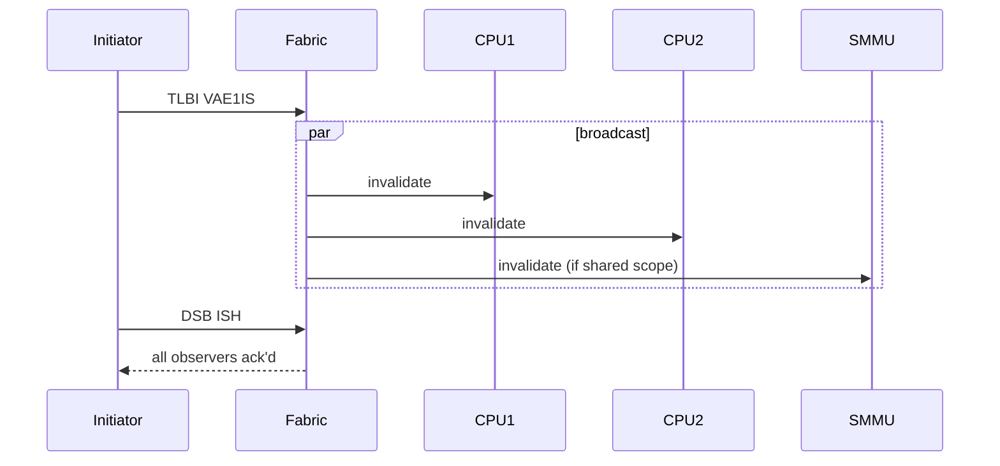

# 04.03 — TLB Shootdown and Broadcast TLBI

> **ARM ARM Reference**: §D5.10.2

---

## 1. The Problem

On SMP systems, a PTE change on one CPU must propagate to **every CPU's TLB** (and every IO master's TLB inside an SMMU, if shared). On x86, this is solved via software IPIs ("TLB shootdown"). ARM provides **hardware broadcast TLBI** — but the software model still uses sequences carefully.

---

## 2. Hardware Broadcast (TLBI ... IS / OS)

Issuing `TLBI <op>IS` causes the **coherency interconnect** to forward the invalidate to all CPUs (and certain IO masters) in the Inner Shareable domain. They invalidate matching entries.

This is fast in dedicated silicon (Neoverse, modern Cortex) — typically a few cycles plus interconnect latency.



---

## 3. Software TLB Shootdown (fallback)

Some older or specialty implementations don't broadcast; software must IPI other CPUs to issue local TLBI themselves.

Linux pseudo-code:

```
on CPU A:
    update_pte(va, new);
    DSB ISHST;
    TLBI VAE1IS, va;   # try broadcast
    if (no broadcast HW):
        for each CPU in mm_cpumask(mm):
            send_IPI(cpu, tlb_invalidate_local, va);
        wait_for_acks();
    DSB ISH;
    ISB;
```

Modern arm64 systems (all relevant interview targets) **have broadcast** in hardware, but kernel still tracks `mm_cpumask` for various optimizations.

---

## 4. Lazy TLB and ASID

Linux uses **lazy TLB** + ASID to avoid invalidation when switching to a kernel-thread (no userspace) → just continue using current ASID, no TTBR change.

Combined with ASID-tagging, context switches are essentially:
- Update `TTBR0_EL1` with new (table_base | ASID).
- `ISB`.

No TLBI needed unless ASID is being recycled (rollover).

---

## 5. Cost of Broadcast TLBI

Each TLBI in a tight loop costs hundreds of cycles per core in the ISH domain (waiting for fabric ack). Mitigations:

- **Batch** PTE changes, then issue one TLBI per range or use FEAT_TLBIRANGE.
- **Use `VALE1IS`** (last-level only) when intermediate tables haven't changed.
- **Defer** TLBI until necessary (Linux MMU gather batches).

---

## 6. SMMU TLB Coherency

If an SMMU shares ASID/VMID with CPU translation contexts (Stall Mode / ATS), CPU-issued TLBIs **may** include SMMU. Otherwise, software must issue an additional `SMMU_CMDQ_TLBI` to the SMMU command queue.

---

## 7. Pitfalls

1. **Issuing TLBI without IS suffix** on SMP — local only; other CPUs poison.
2. **Forgetting DSB ISH between TLBI and reuse** — broadcast not yet complete.
3. **Assuming SMMU invalidates implicitly** — depends on SMMU model; in Linux, dma-iommu issues explicit cmds.
4. **Recycling an ASID without full flush** — stale entries from previous owner alias new mappings.

---

## 8. Interview Q&A

**Q1. Does ARMv8 require software TLB shootdown?**
Broadcast TLBI is the architectural mechanism; software shootdown is a fallback for systems without broadcast. Modern silicon broadcasts in hardware.

**Q2. Why is `DSB ISH` needed after broadcast TLBI?**
To wait for all observers in the Inner Shareable domain to complete their invalidate.

**Q3. Lazy TLB switch — what is it?**
When switching to a kernel-only thread, don't change TTBR/ASID; reuse the current TLB context. Saves TLB rebuild on switch-back.

**Q4. Why does Linux track mm_cpumask?**
Knows which CPUs have ever loaded this mm; relevant for shootdown optimization and ASID lifetime.

**Q5. Do SMMU TLBs get invalidated by CPU TLBI?**
Sometimes — depends on whether ASID/VMID are shared. In Linux dma-iommu, drivers issue explicit SMMU command-queue TLBIs.

**Q6. How can FEAT_TLBIRANGE reduce shootdown cost?**
Single TLBI invalidates many pages (range encoded in Xt), reducing fabric chatter.

---

## 9. Cross-refs

- [02 TLBI ops](02_TLB_Maintenance_Instructions.md)
- [01 TLB architecture](01_TLB_Architecture_and_Tagging.md)
- [09.03 SMMU](../09_Virtualization_Memory/03_SMMU_IOMMU_Overview.md)
