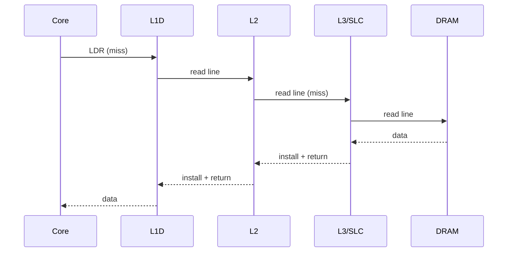

# 05.01 — Cache Hierarchy (L1 / L2 / L3 / SLC)

> **ARM ARM Reference**: §D5.11

---

## 1. Architecture Defines What, Not Where

ARM architecture **does not mandate** the number of cache levels, their sizes, or even associativities — it defines:
- The **memory type/attribute model** (Normal vs Device, cacheability domains).
- Two cache domains: **Inner** and **Outer**.
- Two "Points": **PoU** (Unification) and **PoC** (Coherency).
- Maintenance operations and coherency requirements.

Implementations choose the physical structure (Cortex-A, Neoverse, Apple, custom).

---

## 2. Typical Modern arm64 Hierarchy

```
        CPU core
   ┌───────┴───────┐
   │     L1-I       │   32–64 KB, per-core, VIPT
   ├───────────────┤
   │     L1-D       │   32–64 KB, per-core, PIPT
   ├───────────────┤
   │     L2 (private)│  256 KB – 1 MB, per-core (Neoverse, Apple) or per-cluster (older Cortex)
   ├───────────────┤
   │   L3 / SLC    │   8–256 MB, shared cluster/socket-wide
   ├───────────────┤
   │      DRAM      │
   └───────────────┘
```

- **L1-I**: instructions, typically VIPT (Virtually Indexed, Physically Tagged).
- **L1-D**: data, typically PIPT (Physically Indexed, Physically Tagged) to avoid aliasing.
- **L2**: unified, often inclusive of L1; per-core on modern designs.
- **L3 / SLC (System-Level Cache)**: shared, often non-inclusive/victim; the **PoC** typically lives here for IO-coherent transactions.

---

## 3. PoU and PoC

| Point | Definition |
|---|---|
| **PoU** (Point of Unification) | The level at which instruction and data caches of a given PE see the same copy. Usually L2 or L3. |
| **PoC** (Point of Coherency) | The level at which all observers (CPUs, GPUs, DMA, SMMU) see the same copy. Usually the system memory or coherent interconnect. |

These define the *targets* of cache maintenance ops:
- `DC CVAU` — clean by VA to **PoU** (for I-cache coherency with self-modifying code).
- `DC CVAC` — clean by VA to **PoC** (for DMA coherency on non-coherent fabrics).
- `DC CIVAC` — clean **and** invalidate to PoC.

---

## 4. Inclusivity Properties

| Property | Meaning |
|---|---|
| **Inclusive** | Outer cache holds a superset of inner cache lines. Easy snoop filtering. |
| **Exclusive** | A line lives in *exactly one* level. Best capacity use; more bookkeeping. |
| **Non-inclusive / victim** | Outer holds evicted lines from inner. Common for L3. |

ARM implementations vary; for interview purposes, know that inclusivity affects coherency cost and snooping efficiency.

---

## 5. Diagram — request flow on a load miss



If snoops are required (coherency protocol), L3 will also issue snoop requests to peer caches.

---

## 6. Cache Geometry — CCSIDR / CLIDR

Software introspects cache geometry:

| Register | Purpose |
|---|---|
| `CLIDR_EL1` | Number of cache levels, Inner shareable level, LoUU/LoUIS, LoC |
| `CCSIDR_EL1` | After selecting via `CSSELR_EL1`: NumSets, Associativity, LineSize |
| `CTR_EL0` | Cache type info: I-cache policy, D-line size, I-line size (in log2 words) |

Linux uses these at boot to build `clidr_info` and to scale cache-flush loops.

---

## 7. Pitfalls

1. **Assuming a uniform Cortex-A-shaped hierarchy** — Apple, Neoverse, custom parts vary wildly.
2. **Hand-coded set/way cache flush loops** — fragile; Linux uses VA-based ops where possible.
3. **L1-I as VIPT can alias** under certain page-color conditions — usually handled by HW or kernel coloring.
4. **Assuming inclusion** — eviction from L2 may *not* evict from L1 on non-inclusive designs.
5. **`DC ZVA` misuse** — fast zero, but block size = `DCZID_EL0.BS`; do not assume 64 B.

---

## 8. Interview Q&A

**Q1. What's the difference between PoU and PoC?**
PoU is where I and D caches see the same copy on one PE. PoC is where all observers (incl. IO) see the same copy.

**Q2. How is L1-I usually indexed?**
VIPT — virtually indexed (cheap, no translation on lookup) but physically tagged (no aliasing problems on hit).

**Q3. Why is L1-D usually PIPT?**
Avoids synonym aliasing for store-load forwarding and easier coherency.

**Q4. Are ARM caches architecturally inclusive?**
Architecture does not specify; implementation-defined.

**Q5. What does `CLIDR_EL1` give you?**
Cache topology: number of levels, LoU (Level of Unification), LoC (Level of Coherency), which level is the inner-shareability point.

**Q6. Self-modifying code — which cache op?**
`DC CVAU` (clean data to PoU) + `IC IVAU` (invalidate instruction by VA) + `DSB ISH` + `ISB`.

**Q7. What's an SLC?**
System-Level Cache — the outermost shared cache, often acting as the PoC for coherent IO masters.

---

## 9. Cross-refs

- [02 PoU/PoC](02_PoU_PoC_Inner_Outer.md)
- [03 Maintenance ops](03_Cache_Maintenance_Ops_DC_IC.md)
- [04 Coherency](04_Cache_Coherency_MESI_MOESI.md)
- [05 VIPT/PIPT](05_VIPT_PIPT_Aliasing.md)
