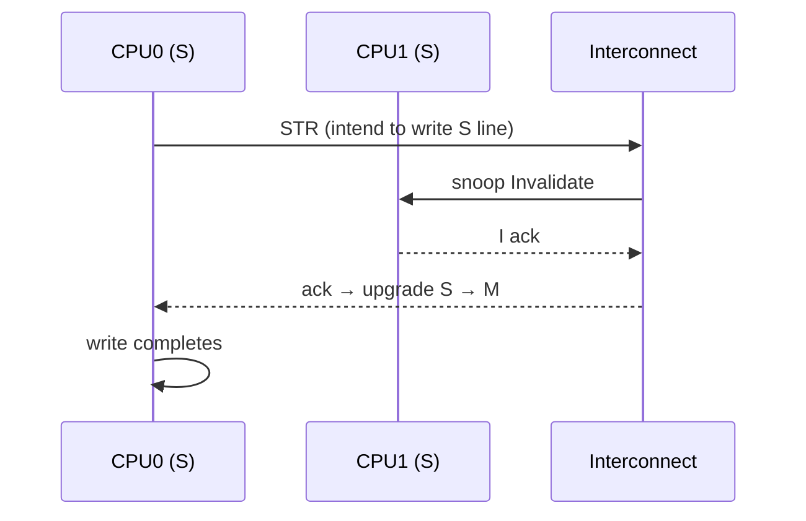

# 05.04 — Cache Coherency: MESI, MOESI, and ARM ACE/CHI

> **ARM ARM Reference**: §B2.3; *AMBA AXI Coherency Extensions (ACE) Specification*; *AMBA 5 CHI Architecture Specification*

---

## 1. Why a Coherency Protocol?

Multiple caches holding copies of the same line must agree: when one core writes, the others must either see the new value or be told to refetch. The protocol enforces this **invariant**: at most one writer at a time, or many readers with the same value.

ARM defines the *behavioral* requirement (multi-copy atomicity, ordering rules) and leaves the *protocol implementation* to the interconnect — typically MESI, MOESI, or a CHI extension.

---

## 2. MESI States

| State | Meaning | Dirty? | Can be read? | Can be written? |
|---|---|---|---|---|
| **M**odified | Only copy, dirty vs memory | yes | yes | yes |
| **E**xclusive | Only copy, clean | no | yes | yes (→ M) |
| **S**hared | One of many copies, clean | no | yes | no (must invalidate others first) |
| **I**nvalid | Not present | — | no | no |

Transitions on local actions:

| Event | I→ | S→ | E→ | M→ |
|---|---|---|---|---|
| Local read miss | E (no other copies) / S (others have it) | — | — | — |
| Local write hit | — | M (after invalidate others) | M | M |
| Local write miss | M (after Read-for-Ownership) | M (after invalidate others) | — | — |
| Snoop read | — | — | S (downgrade) | S (and writeback) |
| Snoop invalidate | — | I | I | I (after writeback) |

---

## 3. MOESI — Adds Owned

The **O**wned state lets a dirty line be **shared** (read by others) without writing back to memory immediately. The Owner is responsible for the eventual writeback.

| State | Dirty? | Shared? | Notes |
|---|---|---|---|
| M | yes | no | sole dirty owner |
| O | yes | yes | dirty + shared; one owner forwards to others |
| E | no | no | sole clean copy |
| S | no | yes | clean shared |
| I | — | — | invalid |

Benefit: cache-to-cache forwarding of dirty lines without expensive writeback to DRAM. AMD x86 historically used MOESI; modern ARM CHI implementations support similar (UD/UC/SD/SC/I + Dirty/Clean variants).

---

## 4. ARM ACE / CHI State Set

AMBA ACE / CHI use a richer state set than textbook MESI. Common labels (CHI):

| State | Mnemonic | Equivalent MESI |
|---|---|---|
| **I** | Invalid | I |
| **UC** | Unique Clean | E |
| **UD** | Unique Dirty | M |
| **SC** | Shared Clean | S |
| **SD** | Shared Dirty | O (MOESI) |

Plus a "Unique-Dirty-Partial" for partial-line writes in some designs.

---

## 5. Coherency Transactions

| Transaction | Purpose |
|---|---|
| **ReadShared / ReadClean** | Acquire a clean shared copy |
| **ReadUnique** | Acquire exclusive copy (for write — Read-For-Ownership) |
| **CleanShared** | Force any UD/SD owner to clean to memory; remain shared |
| **CleanInvalid** | Clean + invalidate (writeback if dirty, then invalidate) |
| **MakeInvalid** | Invalidate copies without writeback (use only when caller will overwrite) |
| **WriteBack / WriteClean** | Eviction-driven writebacks |

Snoop filters (in the SLC or interconnect) avoid broadcasting snoops to caches that don't hold the line — critical for scaling.

---

## 6. Diagram — Write-Invalidate Protocol Flow

---

## 7. False Sharing

When two unrelated variables live on the **same cache line** and are written by different CPUs, the line ping-pongs in M state between caches. Performance collapses.

Mitigation:
- Pad/align per-CPU data to a cache line (typically 64 B; check `CTR_EL0.CWG`).
- Use per-CPU allocation primitives.
- Tools: `perf c2c` (cache-to-cache) helps locate hotspots.

---

## 8. Multi-Copy Atomicity vs MESI

ARMv8 requires "other-multi-copy atomic" — all observers agree on the global order of writes to different locations. MESI/MOESI implementations naturally provide this when the interconnect orders snoops consistently. Pre-v8 (or other ISAs) might not.

---

## 9. Pitfalls

1. **False sharing** of frequently-written variables.
2. **Atomics on Non-cacheable memory** — `LDXR`/`STXR` semantics rely on cacheable coherency.
3. **Cache line bouncing** under contended spinlocks — prefer `WFE`/`SEV` pause patterns or queued locks (MCS).
4. **Assuming "shared" is cheap** — even read-shared lines cost coherency directory entries.
5. **Snoop filter misses** — for very large core counts, snoop filters can spill, causing pessimistic broadcasts.

---

## 10. Interview Q&A

**Q1. Difference between MESI and MOESI?**
MOESI adds **O** (Owned) — a dirty line shared with others, owner responsible for writeback. Avoids unnecessary memory writes when sharing dirty data.

**Q2. What state does a clean exclusive line live in?**
**E** (Exclusive) — only copy, clean.

**Q3. What's an RFO?**
Read-For-Ownership — a read that simultaneously invalidates all other copies in preparation for writing. Implemented as ReadUnique in ACE/CHI.

**Q4. What's false sharing?**
Distinct variables on the same cache line being written by different CPUs, causing coherency ping-pong.

**Q5. Does ARM mandate MESI?**
No. It mandates the *behavior* (coherency rules, multi-copy atomicity); the interconnect implements MESI, MOESI, or CHI-state variants.

**Q6. How does the SLC help scaling?**
Acts as a snoop filter / inclusive directory, avoiding broadcast snoops to caches that don't hold a line.

**Q7. Why is the Owned state useful?**
Lets a dirty line be shared without writing to memory; the owner serves reads cache-to-cache and writes back only on eviction.

**Q8. What's CHI vs ACE?**
ACE (AMBA AXI Coherency Extensions) — first-gen, channel-based, MESI-ish. CHI (Coherent Hub Interface) — newer, message-based, scales to many cores, richer state.

---

## 11. Cross-refs

- [01 Cache hierarchy](01_Cache_Hierarchy_L1_L2_L3.md)
- [05 VIPT/PIPT](05_VIPT_PIPT_Aliasing.md)
- [01.05 Atomicity](../01_Memory_Model/05_Atomicity_and_Single_Copy_Atomic.md)
- [06.04 Coherency vs consistency](../06_Memory_Barriers_Ordering/04_Coherency_vs_Consistency.md)
