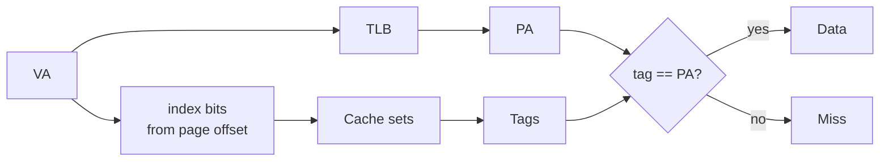

# 05.05 — VIPT vs PIPT and Aliasing

> **ARM ARM Reference**: §D5.11.2

---

## 1. Cache Indexing Schemes

| Scheme | Index | Tag |
|---|---|---|
| **VIVT** (Virtually Indexed, Virtually Tagged) | VA | VA — needs flush on context switch |
| **VIPT** (Virtually Indexed, Physically Tagged) | VA | PA — fast lookup, possible aliasing |
| **PIPT** (Physically Indexed, Physically Tagged) | PA | PA — no aliasing, but needs TLB before lookup |
| **PIVT** — unused, makes no sense |

ARMv8 effectively uses **VIPT for L1-I** and **PIPT for L1-D** (most modern implementations); L2 and beyond are PIPT.

---

## 2. Why VIPT for L1-I?

Instruction fetches are bursty and latency-critical. VIPT lets the index lookup start **in parallel with TLB translation**:

```
VA --[index bits]--> set lookup ─┐
VA --[tag bits]----> TLB ────────┼──> compare with PA tag → hit/miss
```

The lookup completes ~1 cycle faster than PIPT.

Constraint: the index bits must come from the **page offset** so they're the same in VA and PA — otherwise aliasing. This bounds the cache size:

```
index_bits + offset_bits ≤ page_offset_bits  (= log2 granule)
```

For 4 KB pages (12 offset bits, 6 cache-line bits → 6 index bits), a direct-mapped cache can be 4 KB. For higher associativity, the constraint relaxes by `log2(ways)`. e.g., 4-way set associative VIPT can be 16 KB with 4 KB granule.

To go larger, designs either:
- Use page coloring (kernel restricts VA mapping so colors agree),
- Detect aliasing in hardware (snoop),
- Use larger granules (16K/64K relaxes the constraint).

---

## 3. PIPT for L1-D

Data caches must support store-load forwarding and coherency — aliasing would be catastrophic. PIPT is universal for L1-D on modern arm64.

Cost: must complete TLB lookup before cache lookup → slightly higher latency. Mitigated by µTLB right next to the cache.

---

## 4. Aliasing: Synonyms and Homonyms

### Synonyms (multiple VAs → same PA)
- **Problem in VIPT/VIVT**: two VAs may hash to different cache sets but point to the same PA. Two valid cache copies = coherency disaster.
- **Solution**: page coloring (VA bits used for indexing must match PA bits), or HW detection.

### Homonyms (same VA → different PA across contexts)
- **Problem in VIVT only**: same VA in two ASIDs has different PA but same cache index/tag.
- **Solution**: ASID-tag the cache, or flush on context switch. VIPT eliminates homonyms because tags are physical.

---

## 5. Diagram — VIPT lookup with TLB in parallel



---

## 6. Cache Line Size and CTR_EL0

```
CTR_EL0:
  IminLine[3:0]  — log2(words) of smallest I-cache line
  DminLine[19:16] — log2(words) of smallest D-cache line
  CWG[27:24]     — cache writeback granule (alignment for write-merging)
  ERG[23:20]     — exclusive reservation granule
  IDC, DIC       — instr cache invalid by VA / data cache invalid by VA
```

Loops walking by line size must use `IminLine`/`DminLine`, not assume 64.

---

## 7. Pitfalls

1. **Two user VAs mapping same PA via VIPT** — must color or accept HW snoop cost.
2. **Driver mapping the same PA via two cacheabilities** — covered in [01.02](../01_Memory_Model/02_Cacheability_Shareability.md); UNPREDICTABLE.
3. **Hard-coding 64 B line size** — Cortex/Apple may use 64 or 128; check CTR_EL0.
4. **Forgetting that VIPT I-cache may need invalidate on alias change** — Linux handles via `flush_icache_range`.
5. **Assuming `IDC`/`DIC` features available** — modern parts have hardware I/D coherency; old parts don't.

---

## 8. Interview Q&A

**Q1. Why VIPT for I-cache and PIPT for D-cache?**
VIPT gives faster lookup (TLB in parallel) for the latency-critical instr fetch. PIPT eliminates aliasing — vital for D-cache correctness with store-forwarding and coherency.

**Q2. What's the size constraint for a VIPT cache without aliasing?**
`cache_size / associativity ≤ page_size`. e.g., 4 KB granule, 4-way → up to 16 KB.

**Q3. Synonyms vs homonyms?**
Synonyms: many VAs → one PA. Homonyms: one VA → many PAs (across contexts).

**Q4. Can PIPT have aliasing?**
No (by definition — tags and index are physical).

**Q5. What's `CTR_EL0.IDC`?**
Indicates the data cache is coherent with the instruction cache (no need to issue DC CVAU before IC IVAU). Modern Apple silicon sets this.

**Q6. Why might HW set `DIC=1`?**
DIC = Data cache Invalidation not required — implies I-cache fetches see updates without `DC CVAU`. Convenience for JIT.

**Q7. What's page coloring?**
Restricting VA→PA allocation so the cache-index bits of VA equal those of PA, eliminating synonyms in VIPT caches.

---

## 9. Cross-refs

- [01 Cache hierarchy](01_Cache_Hierarchy_L1_L2_L3.md)
- [04 Coherency](04_Cache_Coherency_MESI_MOESI.md)
- [01.02 Cacheability/shareability](../01_Memory_Model/02_Cacheability_Shareability.md)
