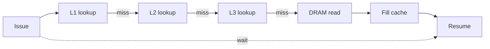

# 05.06 — Cache Performance and Prefetching

> **ARM ARM Reference**: §D5.11; *Cortex-A/Neoverse technical reference manuals*

---

## 1. Sources of Cache Cost

| Phenomenon | Cost |
|---|---|
| **Compulsory miss** | First touch of a line |
| **Capacity miss** | Working set > cache |
| **Conflict miss** | Lines map to same set (limited associativity) |
| **Coherency miss** | Snoop invalidate / RFO |
| **False sharing** | Coherency thrash on unrelated data |
| **Prefetch pollution** | Useless prefetched lines evict useful ones |
| **TLB miss with cold walk caches** | Page walk to DRAM |

---

## 2. Hardware Prefetchers

ARM cores include several prefetcher kinds (microarchitectural, IMPL DEF):

| Prefetcher | Pattern |
|---|---|
| Sequential / stream | Consecutive lines |
| Stride | Constant-stride accesses |
| Region-based | All lines in a 4 KB / 1 MB region |
| Indirect (advanced) | Pointer chasing (rare on ARM, common on Apple) |

Knobs (where exposed via IMP DEF system registers, e.g., `CPUACTLR_EL1` on Cortex parts):
- Aggressiveness levels.
- Per-stream depth.
- Disable per-application via prctl (rare).

---

## 3. Software Prefetch

`PRFM` instruction:

```
PRFM <type>, [Xn, #imm]
```

Types: `PLDL{1,2,3}KEEP`, `PLDL{1,2,3}STRM`, `PSTL{1,2,3}KEEP`, `PSTL{1,2,3}STRM`, `PLI*`.

- `PLD` — prefetch for load.
- `PST` — prefetch for store (acquires line in writable state).
- `L1/L2/L3` — target cache level.
- `KEEP` — retain on hit (regular replacement).
- `STRM` — streaming hint (don't retain).

Software prefetch is a **hint**; modern HW prefetchers are good enough that manual PRFM often hurts (cache pollution). Use only after PMU shows you're memory-stalled and HW prefetcher isn't catching the pattern.

---

## 4. Diagram — pipeline stall from miss



A DRAM round trip can be 200–500 cycles. Out-of-order execution hides some via the **reorder buffer + load queue**, but ROBs are finite (200–400 entries). High miss rate → frontend starves.

---

## 5. Replacement Policy

Architecture doesn't mandate one; common implementations: pseudo-LRU, NRU, RRIP (Re-Reference Interval Prediction). Replacement is invisible to software.

The PTE **Transient hint** in MAIR can signal "this data is short-lived" → some replacement policies bias eviction. Apple silicon makes heavy use of this.

---

## 6. Cache Partitioning (MPAM)

**FEAT_MPAM** — Memory Partitioning And Monitoring. Lets software:
- Tag transactions with a partition ID.
- Limit cache capacity per partition.
- Limit memory bandwidth per partition.

Used in cloud/server contexts to enforce QoS between tenants (analog of Intel CAT).

---

## 7. PMU Counters for Cache

| Event | Purpose |
|---|---|
| `L1D_CACHE_REFILL` | L1 D-cache misses |
| `L1D_CACHE_WB`     | L1 D-cache writebacks |
| `L2D_CACHE_REFILL` | L2 misses |
| `LL_CACHE_RD` / `LL_CACHE_MISS_RD` | Last-level cache reads & misses |
| `MEM_ACCESS`       | Memory accesses |
| `BUS_ACCESS`       | Bus / interconnect accesses |
| `STALL_BACKEND_MEM`| Cycles stalled waiting for memory |
| `L1D_TLB_REFILL`   | TLB refills (cross-checks cache study with MMU pressure) |

Use `perf stat`, `perf record -e ...`, `perf c2c` for false-sharing.

---

## 8. Optimization Patterns

1. **Tile / block algorithms** to fit L1 / L2.
2. **Structure-of-arrays** over array-of-structs when most accesses touch one field.
3. **Cache-line align** hot data; pad to avoid false sharing.
4. **Use `non-temporal` (`PSTL*STRM`)** for one-pass writes that pollute cache.
5. **DC ZVA** for fast clear_page-class operations.
6. **Hugepages** to reduce TLB-driven memory stalls (related but distinct).
7. **NUMA pinning** + first-touch allocation so data lives local to consuming socket.

---

## 9. Pitfalls

1. **Over-prefetching** with `PRFM` — pollutes L1, evicts hot data.
2. **Mismatched line size** assumption (32 vs 64 vs 128 B).
3. **Spinning on a contended cacheline** without `WFE`/MCS-lock — kills perf and power.
4. **Ignoring NUMA** — local-vs-remote latency differs hugely; arm64 servers (Neoverse-based) are NUMA-aware.
5. **Set-conflict due to power-of-two strides** — alignment + stride matching cache geometry → only a few sets used.

---

## 10. Interview Q&A

**Q1. Categories of cache misses?**
Compulsory, capacity, conflict, coherency (the "4 C's" plus coherency).

**Q2. When is `PRFM` useful?**
When the HW prefetcher can't detect the pattern (indirect, scatter/gather) and PMU shows memory-stall dominance. Profile first.

**Q3. What's MPAM?**
Memory Partitioning And Monitoring — architectural QoS for cache/bandwidth allocation across partitions.

**Q4. What's the "transient" attribute hint?**
A MAIR flag indicating short-lived data; replacement policy may bias eviction to retain longer-lived data.

**Q5. Why is set-associativity important?**
Higher associativity reduces conflict misses for power-of-two-strided access patterns.

**Q6. How would you detect false sharing in production?**
`perf c2c` (cache-to-cache) report shows lines bouncing between CPUs.

**Q7. How does NUMA affect cache?**
Remote-socket lines have higher fetch latency and snoop costs. First-touch / explicit affinity (`numactl`) keeps working sets local.

---

## 11. Cross-refs

- [01 Hierarchy](01_Cache_Hierarchy_L1_L2_L3.md)
- [04 Coherency](04_Cache_Coherency_MESI_MOESI.md)
- [10.05 PMU](../10_Advanced_and_Vendor_Context/05_Performance_Counters_PMU.md)
