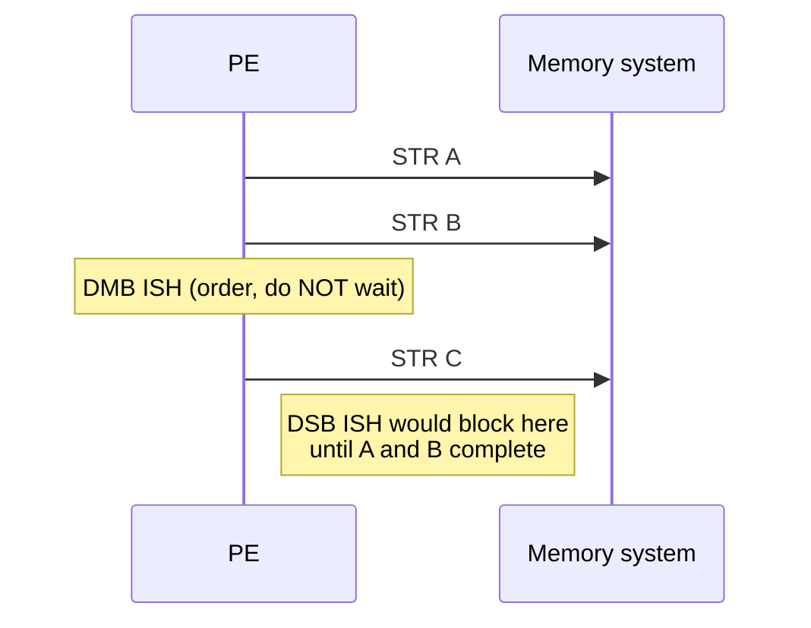

# 06.01 — DMB, DSB, ISB

> **ARM ARM Reference**: §B2.3.5, §C6.2.78 (DMB), §C6.2.79 (DSB), §C6.2.131 (ISB)

---

## 1. The Three Barriers

| Barrier | Purpose |
|---|---|
| **DMB** Data Memory Barrier | Orders memory accesses (loads/stores) relative to each other for a given **shareability domain** and **access type**. Cheap-ish — no completion required. |
| **DSB** Data Synchronization Barrier | Strongest: blocks instruction execution until all preceding memory accesses *and* cache/TLB maintenance ops have completed. |
| **ISB** Instruction Synchronization Barrier | Flushes the pipeline; all subsequent instructions are fetched after the ISB and see any preceding context-changing operation (SCTLR change, TTBR change, etc.). |

---

## 2. Mnemonic Encoding

```
DMB  <option>
DSB  <option>
ISB  [SY]      ; SY is the only option
```

The `<option>` for DMB/DSB combines **shareability domain** with **access type**:

| Option | Domain | Accesses ordered (before-after) |
|---|---|---|
| `SY`   | Full system | any-any |
| `ISH`  | Inner Shareable | any-any |
| `OSH`  | Outer Shareable | any-any |
| `NSH`  | Non-shareable (this PE) | any-any |
| `ISHST`| Inner Shareable | store-store |
| `ISHLD`| Inner Shareable | load-load + load-store |
| `OSHST`| Outer Shareable | store-store |
| `OSHLD`| Outer Shareable | load-load + load-store |
| `NSHST`| Non-shareable | store-store |
| `NSHLD`| Non-shareable | load-load + load-store |
| `SYST` | Full system | store-store |
| `SYLD` | Full system | load-load + load-store |

Choosing the **smallest scope and weakest access type** that achieves correctness minimizes performance cost. `DMB ISHST` is a common kernel pattern for "all earlier stores visible before later stores".

---

## 3. Semantics — Precise Definitions

### 3.1 DMB

> Memory accesses appearing in program order **before** the DMB are observed by every observer in the specified shareability domain **before** memory accesses appearing **after** the DMB.

DMB does **not** wait for accesses to complete; it only enforces ordering. Crucially, DMB orders only **explicit memory accesses**, not cache/TLB ops.

### 3.2 DSB

A DSB completes when:
1. All preceding explicit memory accesses **complete** for the specified domain (writes visible, reads returned).
2. All preceding cache, TLB, and branch predictor maintenance operations complete.

No instruction after the DSB executes until that completion. Heavyweight — use only where required (after TLB invalidation, before WFI/WFE in idle, after IC, etc.).

### 3.3 ISB

ISB flushes the prefetch/decode pipeline. After ISB, the PE refetches instructions, observing any context-changing operations (CCOs) that completed before the ISB:
- `SCTLR_ELx` writes (MMU enable/disable, cache enable)
- `TTBRn_ELx`, `TCR_ELx`, `MAIR_ELx` writes
- System-register writes that affect translation, debug, FP

ISB by itself does **not** order memory. Often pair: `DSB ISH; ISB`.

---

## 4. Worked Example — Publish-Subscribe (MP pattern)

```c
// Producer:
data = 42;
DMB ISHST;        // ensure 'data' visible before 'flag'
flag = 1;

// Consumer:
while (READ_ONCE(flag) == 0) ;
DMB ISHLD;        // ensure 'data' read happens after observing flag
x = data;
```

Equivalent with one-sided barriers — see [02 LDAR/STLR](02_Acquire_Release_LDAR_STLR.md).

---

## 5. Worked Example — TLB invalidation sequence

```asm
    TLBI VAE1IS, x_va     ; broadcast invalidate
    DSB  ISH              ; wait for completion
    ISB                   ; flush local pipeline (so subsequent fetches use new mapping)
```

`DSB ISH` ensures every other PE has acknowledged the TLBI before we proceed. `ISB` is needed only for the *local* PE if the change affects instructions about to execute.

---

## 6. Worked Example — Enabling MMU

```asm
    MSR  TTBR0_EL1, x_ttbr
    MSR  TCR_EL1,   x_tcr
    MSR  MAIR_EL1,  x_mair
    ISB                    ; not strictly required between MSRs but harmless
    ; turn on MMU + caches:
    MRS  x0, SCTLR_EL1
    ORR  x0, x0, #(SCTLR_EL1_M | SCTLR_EL1_C | SCTLR_EL1_I)
    MSR  SCTLR_EL1, x0
    ISB                    ; from here on, fetches use the new MMU state
```

---

## 7. Diagram — DMB vs DSB



---

## 8. Special: Load-Acquire / Store-Release alternative

`LDAR`/`STLR` provide built-in one-sided ordering, often cheaper than explicit DMB on modern cores. Prefer them for lock/flag patterns. See [02](02_Acquire_Release_LDAR_STLR.md).

---

## 9. Pitfalls

1. **Using `DMB SY` everywhere** — pessimistic; usually `ISH` is right for SMP within one socket.
2. **Forgetting ISB after SCTLR/TTBR change** — pipeline may still execute with old context.
3. **DMB after TLBI** — wrong; TLBI maintenance ops require **DSB**, not DMB.
4. **ISB without preceding DSB** for TLBI — pipeline flushes, but completion not guaranteed.
5. **Using DMB to order Device accesses** — Device-nGnRnE strictly ordered already; barrier still required across Device & Normal mixing, but check the access-type matrix.
6. **Assuming WFI implies barrier** — wrong; precede WFI with `DSB SY`.

---

## 10. Interview Q&A

**Q1. Difference between DMB and DSB?**
DMB enforces ordering only; pipeline keeps going. DSB waits for completion of preceding memory and maintenance ops, then proceeds.

**Q2. Why is ISB needed after enabling MMU?**
SCTLR write is a Context-Changing Operation; without ISB the pipeline may already hold decoded instructions fetched under old MMU state.

**Q3. What scope should I use for SMP within one CPU socket?**
`ISH` — Inner Shareable.

**Q4. Why `DSB ISH; ISB` after TLBI?**
DSB ensures all PEs have completed the TLB invalidate; ISB ensures local pipeline refetches translations.

**Q5. Cheapest barrier to order two stores to shared memory?**
`DMB ISHST` (store-store ordering, Inner Shareable).

**Q6. Does DMB order cache maintenance ops?**
No — only DSB does.

**Q7. Linux smp_wmb() lowers to what on arm64?**
`DMB ISHST`. `smp_mb()` → `DMB ISH`. `smp_rmb()` → `DMB ISHLD`.

**Q8. Difference between DSB SY and DSB ISH?**
Scope: full system vs Inner Shareable. SY waits for completion observable to all observers including outer / external; ISH is sufficient for SMP coherent CPUs.

---

## 11. Cross-refs

- [02 LDAR/STLR](02_Acquire_Release_LDAR_STLR.md)
- [03 Reordering examples](03_Load_Store_Reordering_Examples.md)
- [04 Coherency vs consistency](04_Coherency_vs_Consistency.md)
- [04.02 TLB maintenance](../04_TLB/02_TLB_Maintenance_Instructions.md)
