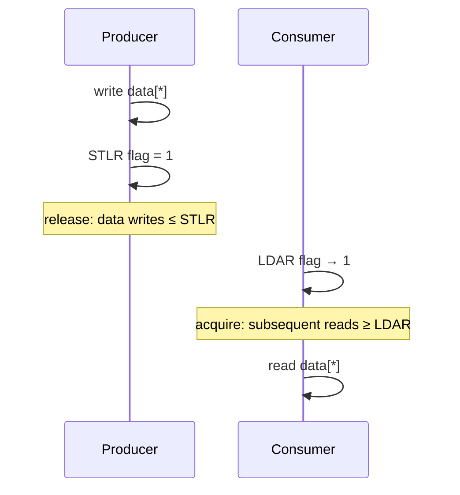

# 06.02 — Acquire / Release: LDAR, STLR, LDAPR

> **ARM ARM Reference**: §B2.3.7, §C3.2.6, §C6.2 (LDAR/STLR/LDAPR/LDAR variants)

---

## 1. The Big Idea

Full barriers (`DMB`) are symmetric — they order **everything** before vs **everything** after. **Acquire** and **Release** are *one-sided*:

- **Load-Acquire** — all later accesses are ordered after this load (one-way fence).
- **Store-Release** — all earlier accesses are ordered before this store (one-way fence).

Together they implement the **release/acquire** synchronization pattern:

```
Producer:   ... data writes ... ; STLR flag      // publish
Consumer:   LDAR flag ; ... data reads ...       // observe
```

Equivalent to publish-subscribe but typically cheaper than `DMB ISH` pairs on modern cores because hardware only needs to enforce a half-fence.

---

## 2. Instruction Set

| Instruction | Action | Semantics |
|---|---|---|
| `LDAR Wt/Xt, [Xn]`   | Load-Acquire | Acquire ordering |
| `LDAPR Wt/Xt, [Xn]`  | Load-AcquirePC (ARMv8.3 RCpc) | Weaker — "RCpc" (release consistency, processor-consistent) |
| `LDAXR Wt/Xt, [Xn]`  | Load-Acquire Exclusive | Acquire + reservation for STXR |
| `STLR Wt/Xt, [Xn]`   | Store-Release | Release ordering |
| `STLXR Ws, Wt, [Xn]` | Store-Release Exclusive | Release + exclusive completion |

Atomic ops (FEAT_LSE) come in `*A`, `*L`, `*AL` forms:
`LDADDA`, `LDADDL`, `LDADDAL`, `CASA`, `CASL`, `CASAL`, `SWPA`, `SWPL`, `SWPAL`, etc.

---

## 3. RCsc vs RCpc

ARMv8.0 `LDAR`/`STLR` implement **RCsc** (Release Consistency, sequentially consistent) — strong: STLR–LDAR pair is sequentially consistent globally.

ARMv8.3 introduced `LDAPR` (Load-AcquirePC) for **RCpc** — weaker:
- Orders later accesses w.r.t. this load locally.
- But STLR followed by LDAPR on different threads may *not* appear globally consistent.

`LDAPR` matches the C11 `memory_order_acquire` semantics more efficiently for some patterns. Linux currently uses `LDAR` (RCsc) for most acquire ops; LDAPR is used selectively.

---

## 4. Worked Example — Spinlock

### Acquire (lock):

```asm
1:  LDAXR  w1, [x_lock]       ; load-acquire-exclusive
    CBNZ   w1, 1b             ; if held, retry
    STXR   w2, w_one, [x_lock]; try to grab (no release barrier yet on STXR)
    CBNZ   w2, 1b
    ; we hold the lock; LDAXR gave us acquire semantics
```

Modern variant with LSE:

```asm
    MOV    w1, #1
    SWPA   w1, w2, [x_lock]   ; atomic swap with acquire
    CBNZ   w2, ... busy ...
```

### Release (unlock):

```asm
    STLR   wzr, [x_lock]      ; store-release zero
```

The `STLR` ensures all critical-section accesses are visible before the lock is released.

---

## 5. The Full Ordering Matrix

For two memory operations A (earlier in program order) and B (later), is A ordered-before B?

| A \ B | Plain Load | Plain Store | LDAR | STLR |
|---|---|---|---|---|
| Plain Load | no | no | **yes (acquire)** | no |
| Plain Store | no | no | **yes (acquire)** | **yes (release)** |
| LDAR | **yes (acquire)** | **yes (acquire)** | **yes** | **yes** |
| STLR | no | no | **yes (acquire)** | **yes (release)** |

(`yes` = ordering enforced; `no` = may be reordered.)

Key insight: there is **no acquire→ regular order** for plain loads/stores *after* the acquire — the acquire orders things one-way (later accesses don't pass it upward).

---

## 6. Diagram — Release/Acquire pairing



---

## 7. C / C++ Mapping

| C11/C++11 | ARMv8 ARMv8.0 | With RCpc (v8.3+) |
|---|---|---|
| `atomic_load(.., memory_order_acquire)` | LDAR | LDAPR |
| `atomic_store(.., memory_order_release)` | STLR | STLR |
| `atomic_*(.., memory_order_seq_cst)` | LDAR / STLR | LDAR / STLR |
| `atomic_*(.., memory_order_acq_rel)` | LDAR + STLR (or LDAXR/STLXR) | LDAPR + STLR |
| `atomic_*(.., memory_order_relaxed)` | LDR / STR | LDR / STR |

---

## 8. Pitfalls

1. **Mixing LDAR with plain stores expecting full fence** — acquire is one-sided.
2. **Using LDAPR where RCsc semantics needed** — subtle bug; consumer sees stale data ordering across threads.
3. **STLR without exclusive in CAS loop** — use `STLXR` (release-exclusive) for lock-free CAS.
4. **Exclusive monitor reservation lost** by intervening cache line touch (or interrupt with context switch); always loop on STXR result.
5. **Using LDAXR for plain reads** — implies exclusive monitor work; only use when paired with STXR.
6. **Assuming LDAR/STLR is cheaper than DMB always** — on some cores DMB ISH is faster for bulk fence patterns; profile.

---

## 9. Interview Q&A

**Q1. Difference between LDAR and LDAPR?**
LDAR is RCsc (sequentially-consistent acquire). LDAPR is RCpc (processor-consistent), weaker and cheaper; later accesses still ordered after it locally, but STLR-LDAPR pair on different threads not guaranteed globally sequentially consistent.

**Q2. How does STLR differ from `DMB ISH; STR`?**
STLR is a one-sided release: only earlier accesses ordered before it, later accesses not constrained. DMB ISH; STR is a full fence + store. STLR can be cheaper.

**Q3. Why doesn't STLR need a barrier after?**
Release semantics only require earlier-accesses-before-store; later accesses are unconstrained — that's the optimization.

**Q4. What's the FEAT_LSE benefit over LDXR/STXR?**
Single-instruction atomics (CAS, SWP, LDADD…) scale better under contention because they don't suffer reservation-loss livelock.

**Q5. Linux's `smp_store_release`/`smp_load_acquire` compile to?**
STLR and LDAR respectively on arm64 (without LDAPR rework).

**Q6. Can two LDARs be reordered between themselves?**
No — LDAR is multi-copy atomic and orders w.r.t. other LDAR/STLR.

**Q7. Spinlock: why STLR for unlock, not STR?**
To ensure critical-section writes are globally visible before lock release.

**Q8. What's the "ordering" matrix asymmetry?**
A plain LDR followed by a plain STR is unordered; but if either is acquire/release, the asymmetric fence comes into play.

---

## 10. Cross-refs

- [01 DMB/DSB/ISB](01_DMB_DSB_ISB.md)
- [03 Reordering examples](03_Load_Store_Reordering_Examples.md)
- [01.05 Atomicity](../01_Memory_Model/05_Atomicity_and_Single_Copy_Atomic.md)
