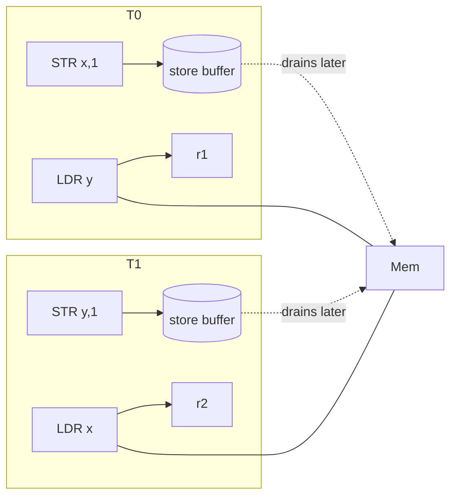

# 06.03 — Load/Store Reordering: Litmus Tests

> **ARM ARM Reference**: §B2.3 (Weakly ordered memory model); cat-models in *herdtools7*

This page walks through the canonical memory-ordering litmus tests as they manifest on ARMv8.

---

## 1. Notation

Each test has two (or more) threads; we ask "is outcome X allowed?":
- **Allowed** = the architecture lets it happen.
- **Forbidden** = architecture rules out the outcome.

Initial values: all variables 0.

---

## 2. MP — Message Passing

```
Thread 0           Thread 1
  STR x, 1            LDR r1, y
  STR y, 1            LDR r2, x

Forbidden:  r1 == 1 && r2 == 0
```

**Without barriers**: r1==1 && r2==0 is **ALLOWED** on ARMv8 — store reorder on T0 and load reorder on T1.

**Fix**:
```
T0: STR x,1 ; DMB ISHST ; STR y,1
T1: LDR r1,y ; DMB ISHLD ; LDR r2,x
```
Or one-sided:
```
T0: STR x,1 ; STLR y,1
T1: LDAR r1,y ; LDR r2,x
```

---

## 3. SB — Store Buffer (Dekker's algorithm)

```
Thread 0           Thread 1
  STR x, 1            STR y, 1
  LDR r1, y           LDR r2, x

Forbidden:  r1 == 0 && r2 == 0
```

**ALLOWED on ARM** without barriers: each thread's load can pass its own earlier store (store-buffer forwarding).

**Fix**:
```
T0: STR x,1 ; DMB ISH ; LDR r1, y
T1: STR y,1 ; DMB ISH ; LDR r2, x
```

Note: LDAR/STLR alone is **insufficient** here because STLR-LDR is unordered on T0 (release doesn't fence later loads). You need a full DMB or `LDAR-after-STLR-with-DMB`.

---

## 4. LB — Load Buffering

```
Thread 0           Thread 1
  LDR r1, x           LDR r2, y
  STR y, 1            STR x, 1

Forbidden:  r1 == 1 && r2 == 1   (per multi-copy atomicity)
```

**FORBIDDEN on ARMv8** — even without barriers — because of *no-thin-air-values* / coherence rules. Loads can't be reordered with later stores that satisfy them.

---

## 5. WRC — Write-to-Read Causality

```
Thread 0      Thread 1            Thread 2
  STR x, 1      LDR r1, x            LDR r2, y
                STR y, r1            LDR r3, x

Forbidden:  r1==1 && r2==1 && r3==0
```

**Without barriers**: ALLOWED on early ARM (RCpc-style). On ARMv8 with **multi-copy atomicity**, FORBIDDEN — all observers agree on order of writes to `x` and `y` once causally chained.

Fix to be safe across all systems:
```
T1: LDR r1,x ; DMB ISH ; STR y, r1
T2: LDR r2,y ; DMB ISHLD ; LDR r3,x
```

---

## 6. IRIW — Independent Reads of Independent Writes

```
Thread 0    Thread 1    Thread 2          Thread 3
 STR x,1     STR y,1     LDR r1,x          LDR r3,y
                         LDR r2,y          LDR r4,x

Forbidden:  r1==1 && r2==0 && r3==1 && r4==0
```

**ARMv8 (other-multi-copy-atomic)**: FORBIDDEN — all observers see writes to x and y in the same global order.

Note: pre-v8 ARM was NOT multi-copy atomic; IRIW outcome was allowed. ARMv8 strengthened this guarantee.

---

## 7. CoRR — Coherence of Reads to the Same Location

```
Thread 0           Thread 1
  STR x, 1            LDR r1, x
                      LDR r2, x

Forbidden:  r1 == 1 && r2 == 0
```

**FORBIDDEN** universally — basic coherence. Once an observer sees x=1, subsequent reads can't see the older x=0.

---

## 8. CoWW — Coherence of Writes to the Same Location

Two stores to the same location appear in the same global order to all observers. Always enforced by the coherence protocol.

---

## 9. Summary Table

| Test  | Without barriers | Needed barrier(s) |
|---|---|---|
| MP    | Allowed | release/acquire OR DMB pair |
| SB    | Allowed | full DMB ISH on both threads |
| LB    | Forbidden | — |
| WRC   | Forbidden (v8 multi-copy atomic) | — |
| IRIW  | Forbidden (v8) | — |
| CoRR  | Forbidden | — |
| CoWW  | Forbidden | — |

---

## 10. Diagram — SB pattern with store buffers



Both threads' loads observe memory before either store buffer drains → r1=0, r2=0 allowed without DMB.

---

## 11. Pitfalls

1. **Assuming x86-like TSO** on ARM — SB outcome differs; need explicit fence.
2. **Believing STLR fences later loads** — it does not (release is one-sided).
3. **Forgetting CoRR** — coherence is automatic; relying on absence of CoRR violation in algorithms is fine.
4. **Pre-v8 vs v8 IRIW confusion** — v8 strengthened; legacy ARMv7 code may have over-cautious barriers no longer needed.
5. **Mismatched scopes** — outer-shareable observer with inner barrier is undefined behavior territory.

---

## 12. Interview Q&A

**Q1. Can ARM reorder a store before an earlier load?**
Generally yes — load and a subsequent unrelated store can complete out of order. Same-address coherence is enforced.

**Q2. Why is the Dekker's algorithm broken on ARM without DMB?**
Each thread's store buffer holds its write; the load sees old memory before the store globally propagates. Need full fence between store and subsequent load on each thread.

**Q3. What does "multi-copy atomic" mean?**
All observers agree on the global order of writes to different locations. ARMv8 is "other-multi-copy atomic": each PE is atomic w.r.t. other PEs, though a PE may forward its own store to its own load locally.

**Q4. Is IRIW allowed on ARMv8?**
No — multi-copy atomicity forbids it. It was allowed on pre-v8.

**Q5. Tool to model and verify these?**
`herdtools7` (herd, litmus7) — Cambridge/INRIA. Plus Linux kernel's *Linux-Kernel Memory Model* (LKMM) cat file.

**Q6. Equivalent of x86 MFENCE on ARM?**
`DMB ISH` for SMP within socket; `DMB SY` for full system.

**Q7. Why is LB forbidden but SB allowed?**
LB would require a value to appear from thin air (no causal source); ARM forbids speculation that allows that outcome. SB is just buffer ordering.

---

## 13. Cross-refs

- [01 DMB/DSB/ISB](01_DMB_DSB_ISB.md)
- [02 LDAR/STLR](02_Acquire_Release_LDAR_STLR.md)
- [01.04 Weakly ordered memory model](../01_Memory_Model/04_Weakly_Ordered_Memory_Model.md)
