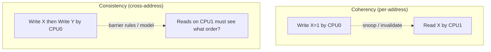

# 06.04 — Coherency vs Consistency

> **ARM ARM Reference**: §B2.3 (Memory model overview); academic background — *Adve & Gharachorloo, "Shared Memory Consistency Models: A Tutorial"*

These two terms are constantly confused in interviews. They are **orthogonal**.

---

## 1. Definitions

### Coherency
About **a single memory location**. Guarantees:
1. Writes to one location are seen by all observers in the same order (write serialization).
2. A read returns the latest value of that location (per coherence epoch).

Implementation: cache coherency protocol (MESI/MOESI/CHI). Hardware concern.

### Consistency (Memory Consistency Model)
About **multiple memory locations** and the ordering relationships between accesses to them. Guarantees:
- What orderings of operations across different addresses are observable.

Implementation: ISA semantics + barriers + (in software) memory_order tags.

---

## 2. Side-by-side

| Aspect | Coherency | Consistency |
|---|---|---|
| Scope | Single location | Multiple locations |
| Question | "What value do I read for X?" | "In what order do I see writes to X and Y?" |
| Mechanism | Cache protocol, snoop, invalidate | Pipeline ordering, barriers, store buffers |
| Configurable? | Mostly architectural | Heavily architectural — ARM weak, x86 TSO, RISC-V RVWMO |
| Software's role | Cache maintenance for non-coherent observers | Use barriers / acquire-release |

---

## 3. Why Both Matter

A coherent system can still have a relaxed consistency model. ARM is fully coherent (within the Inner-Shareable domain) yet weakly consistent: SB / MP outcomes are observable without barriers.

x86 is also coherent but more strongly consistent (TSO): only store→load reordering is allowed.

---

## 4. Common Consistency Models

| Model | Description | Example ISAs |
|---|---|---|
| **SC** Sequential Consistency | All ops appear in some total order matching program order on each PE | None mainstream by default |
| **TSO** Total Store Order | SC except store→load reorder | x86, SPARC TSO |
| **PSO** Partial Store Order | Stores can reorder among themselves | SPARC PSO (deprecated) |
| **RMO/Weak** | Most reorderings allowed; barriers needed | ARMv8, RISC-V RVWMO, POWER |
| **Release Consistency (RCsc/RCpc)** | Synchronization marked by acquire/release | ARMv8 LDAR/STLR (RCsc), LDAPR (RCpc) |

---

## 5. ARMv8 Position

ARMv8 is:
- **Multi-copy atomic** (specifically "other-multi-copy atomic"): all observers agree on the global order of writes to different locations once causally ordered.
- **Weakly ordered**: program-order pairs may be reordered unless a barrier or dependency prevents it.
- **Coherent**: Inner-Shareable domain is hardware-coherent across all CPUs in the cluster.
- **Release-consistent** when using LDAR/STLR/LDAPR.

ARMv7 was not multi-copy atomic; ARMv8 strengthened this for clearer programming model.

---

## 6. Dependencies Provide Ordering

Even without explicit barriers, ARMv8 honors:

| Dependency | Orders |
|---|---|
| **Address dependency** | Load → dependent load (via address) |
| **Data dependency** | Load → dependent store (via value) |
| **Control dependency** | Load → store guarded by it (load→store only; load→load NOT enforced — needs ISB or barrier) |

Linux's `rcu_dereference` exploits address dependency — no barrier needed for the dependent load on arm64.

---

## 7. Diagram — coherency vs consistency

---

## 8. Worked Example — Consistency without Coherency

DMA buffers on a non-coherent device:
- Coherency is broken (CPU caches do not snoop the device DMA traffic).
- Consistency model (within CPUs) is still ARMv8 weak.
- Software bridges coherency with `DC CVAC` / `DC IVAC` (covered in [05.03](../05_Caches/03_Cache_Maintenance_Ops_DC_IC.md)).

---

## 9. Pitfalls

1. **Saying "coherent → no barriers needed"** — coherency is per-address; consistency still requires barriers.
2. **Assuming x86 TSO porting** — code working on x86 may break on ARM SB/MP patterns.
3. **Conflating LDAR with coherency** — LDAR is a consistency primitive (release/acquire), the cache protocol provides coherency underneath.
4. **Believing dependencies don't matter** — control-dep load→load needs an ISB or DMB; only load→store control dep is automatic.
5. **Inner-Shareable barriers for non-coherent observers** — wrong scope; use Outer-Shareable when external masters involved.

---

## 10. Interview Q&A

**Q1. Difference between cache coherency and memory consistency?**
Coherency: per-address visibility/order. Consistency: cross-address ordering across observers.

**Q2. Can a system be coherent but not sequentially consistent?**
Yes — ARMv8 is exactly that.

**Q3. Is x86 strongly consistent?**
TSO — stronger than ARM but not full SC (store→load reorder allowed).

**Q4. What's "multi-copy atomic"?**
Property that all observers agree on the global order of writes to different locations; ARMv8 provides "other-multi-copy atomic" (own stores forwardable to own loads but consistent across other PEs).

**Q5. Why is address dependency enough for ordering on ARM?**
Hardware tracks the dependency; speculating past it would create thin-air values. ISA explicitly orders dependent loads.

**Q6. Why is control dependency NOT enough for load→load order?**
Branch prediction allows speculative execution of the second load before the first resolves. ISB or DMB needed if order matters.

**Q7. How do you implement a sequentially-consistent algorithm on ARM?**
Use LDAR for loads + STLR for stores + occasional DMB ISH (specifically to handle SB-like patterns) — this is exactly what C11 seq_cst maps to on arm64.

**Q8. Does Linux rely on multi-copy atomicity?**
Yes — many RCU and barrier elisions assume it. Pre-v8 ARM required additional `DMB SY`s that v8 eliminated.

---

## 11. Cross-refs

- [01 DMB/DSB/ISB](01_DMB_DSB_ISB.md)
- [02 LDAR/STLR](02_Acquire_Release_LDAR_STLR.md)
- [03 Reordering examples](03_Load_Store_Reordering_Examples.md)
- [01.04 Weak memory model](../01_Memory_Model/04_Weakly_Ordered_Memory_Model.md)
- [05.04 Cache coherency](../05_Caches/04_Cache_Coherency_MESI_MOESI.md)
