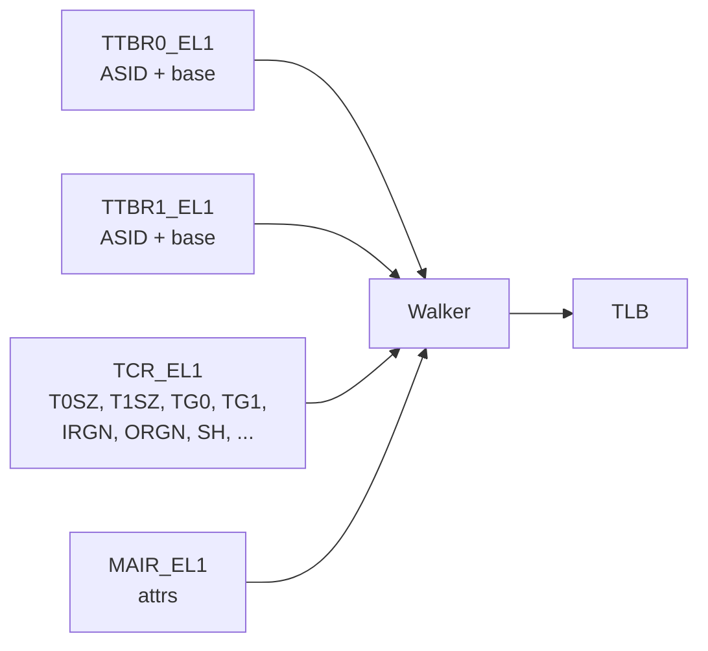

# 07.02 — TTBR0_ELx, TTBR1_ELx, TCR_ELx

> **ARM ARM Reference**: §D13.2.144 (TTBR), §D13.2.131 (TCR)

---

## 1. TTBR — Translation Table Base Register

```
 63                                48 47                                  1 0
+----------------------------------+-------------------------------------+--+
|       ASID (8 or 16 bits)        |   Translation Table Base Address    |CnP|
+----------------------------------+-------------------------------------+--+
```

| Field | Bits | Purpose |
|---|---|---|
| **ASID** | [63:48] | 8 or 16 bits (see TCR.AS); identifies the address space |
| **BADDR** | [47:1] | Base PA of the top-level translation table (granule-aligned) |
| **CnP** | [0] | "Common not Private" (FEAT_TTCNP) — share table across CPUs |

Two registers per EL1&0: `TTBR0_EL1` (low VA half) and `TTBR1_EL1` (high VA half).

ASID slot is in TTBR0 or TTBR1 depending on `TCR_EL1.A1`:
- `A1=0` → ASID from TTBR0_EL1
- `A1=1` → ASID from TTBR1_EL1

---

## 2. TCR_ELx — Translation Control Register

The big knob: configures granule, VA size, walker memory attrs, ASID width, HW AF/DBM, TBI, top-byte ignore, etc.

### Critical fields (TCR_EL1)

| Field | Bits | Purpose |
|---|---|---|
| **T0SZ** | [5:0] | VA size for TTBR0 region (`64 − T0SZ` bits) |
| **EPD0** | [7] | Disable TTBR0 walks (e.g., user-only) |
| **IRGN0** | [9:8] | Inner cacheability of walks via TTBR0 |
| **ORGN0** | [11:10] | Outer cacheability of walks via TTBR0 |
| **SH0** | [13:12] | Shareability of walks via TTBR0 |
| **TG0** | [15:14] | Granule for TTBR0 (00=4K, 01=64K, 10=16K) |
| **T1SZ** | [21:16] | Same for TTBR1 |
| **A1**   | [22]   | Select TTBR0 or TTBR1 for ASID |
| **EPD1** | [23] | Disable TTBR1 walks |
| **IRGN1, ORGN1, SH1, TG1** | [27:30] | Same for TTBR1 |
| **IPS** | [34:32] | Intermediate PA size (output limit) |
| **AS** | [36] | ASID size (0=8b, 1=16b) |
| **TBI0** | [37] | Top-Byte Ignore for TTBR0 |
| **TBI1** | [38] | Top-Byte Ignore for TTBR1 |
| **HA** | [39] | HW Access Flag update |
| **HD** | [40] | HW Dirty Bit update |
| **HPD0/HPD1** | [41/42] | Disable hierarchical permissions |
| **TBID0/TBID1** | [51/52] | TBI applies to data only (FEAT_PAuth) |

`TG0` encoding **differs** from `TG1`:

| Encoding | TG0 | TG1 |
|---|---|---|
| 00 | 4K | reserved |
| 01 | 64K | 16K |
| 10 | 16K | 4K |
| 11 | reserved | 64K |

Yes, this asymmetry is a classic gotcha.

---

## 3. Diagram — TTBR/TCR feeding the walker



---

## 4. Typical Linux Configuration (arm64, 48-bit VA, 4K granule)

```
TCR_EL1:
  T0SZ = 16, T1SZ = 16   (48-bit VA both halves)
  TG0  = 00 (4K), TG1 = 10 (4K)   ← note asymmetry!
  IRGN0 = IRGN1 = 01 (WB Cacheable)
  ORGN0 = ORGN1 = 01 (WB Cacheable)
  SH0   = SH1   = 11 (Inner Shareable)
  IPS   = matches platform PA size (e.g., 0b101 = 48b)
  AS    = 1 (16-bit ASID)
  TBI0  = 1 (for MTE / HWASAN)
  HA    = 1, HD = 1 (if HW supports)

TTBR0_EL1 = user PGD PA | (ASID << 48)
TTBR1_EL1 = swapper_pg_dir PA | (0 << 48)   ; kernel ASID typically 0/global
```

---

## 5. Changing TTBR

```asm
    msr    ttbr0_el1, x0    ; new user PGD + ASID
    isb                     ; ensure pipeline sees new context
```

If you also change ASID, `isb` is enough (TLB entries tagged by old ASID just become "not us"). If you reuse an ASID, you must TLBI first.

---

## 6. CnP — Common not Private (FEAT_TTCNP)

Setting `CnP=1` in TTBR tells the system that this table is shared (identical) across multiple CPUs, allowing the hardware to share TLB entries between cores. Used by Linux for shared kernel mappings.

Constraint: every CPU sharing the table must set CnP=1 with the same base + ASID.

---

## 7. Pitfalls

1. **Confusing TG0 and TG1 encodings** (4K is `00` on TG0 but `10` on TG1).
2. **Forgetting ISB after TTBR write** — speculative fetches use old TTBR.
3. **Setting walker attrs (IRGN/ORGN) that don't match the table memory's actual attrs** — race on cacheability.
4. **Disabling EPD0 in kernel-only contexts** — Linux uses this to disable user TTBR walks while in kernel as a Meltdown-style mitigation (KPTI on arm64).
5. **Mismatched ASID between TTBR and TCR.A1** — confused TLB tagging.
6. **CnP without identical mappings on all CPUs** — `UNPREDICTABLE`.

---

## 8. Interview Q&A

**Q1. What does TTBR hold besides the table base?**
The ASID for that regime, in bits [63:48].

**Q2. What field selects which TTBR holds the ASID?**
`TCR_EL1.A1`.

**Q3. Why are TG0 and TG1 encodings different?**
Historical artifact of ARMv8.0 spec. A common source of bugs.

**Q4. What does EPD0/EPD1 do?**
Disables walks via the corresponding TTBR. Used in KPTI to ensure kernel context doesn't walk user tables.

**Q5. What's CnP?**
"Common not Private" — TTBR bit indicating a translation table is shared across CPUs so TLB entries may be shared in hardware.

**Q6. What are walker attributes?**
`TCR.IRGN/ORGN/SH` — the cacheability and shareability that the table-walker uses for its own memory reads of table descriptors.

**Q7. How does TBI affect the VA?**
Bits [63:56] are ignored by the MMU; software can put a tag there (MTE, HWASAN, pointer tagging).

**Q8. What's the relationship between TCR.IPS and PA size?**
IPS limits the output PA size from translation; must be ≤ `ID_AA64MMFR0_EL1.PARange`.

---

## 9. Cross-refs

- [01 SCTLR](01_SCTLR_EL1_EL2_EL3.md)
- [03 MAIR](03_MAIR_and_Attribute_Indirection.md)
- [02.05 ASID/VMID](../02_Virtual_Memory_VMSAv8/05_ASID_and_VMID.md)
- [03.02 Walk](../03_Page_Tables_and_Translation/02_Multi_Level_Page_Walk.md)
