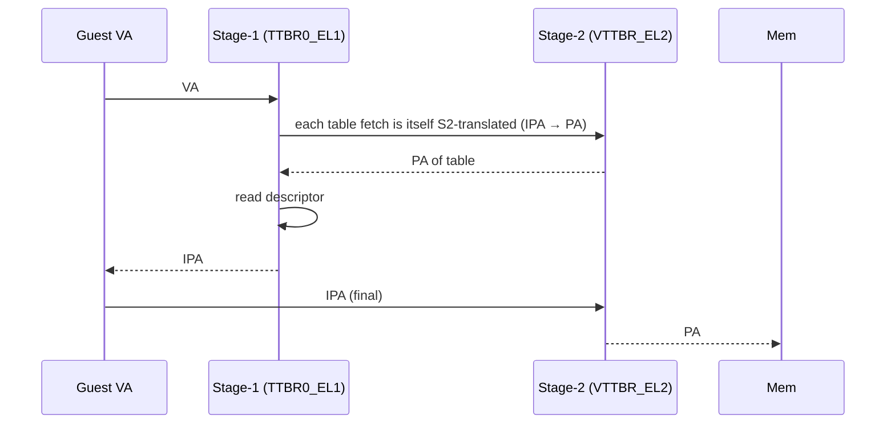

# 07.04 — VTTBR_EL2 and VTCR_EL2 (Stage-2)

> **ARM ARM Reference**: §D13.2.149 (VTTBR), §D13.2.146 (VTCR)

---

## 1. VTTBR_EL2 — Virtualization TTBR

```
 63                          48 47                              1 0
+-----------------------------+--------------------------------+--+
|     VMID (8 or 16 bits)     |  Stage-2 Table Base Address    |CnP|
+-----------------------------+--------------------------------+--+
```

| Field | Bits | Purpose |
|---|---|---|
| **VMID** | [63:48] | Tag for stage-2 TLB entries |
| **BADDR** | [47:1] | PA of stage-2 top-level table |
| **CnP** | [0] | Common-not-private |

A single TTBR for stage-2 — no "two halves," since IPA space is one contiguous region.

---

## 2. VTCR_EL2 — Virtualization TCR

The stage-2 analog of TCR. Key fields:

| Field | Bits | Purpose |
|---|---|---|
| **T0SZ** | [5:0] | IPA size (`64 − T0SZ`) for stage-2 input |
| **SL0** | [7:6] | Starting level for stage-2 walk (explicit, unlike stage-1) |
| **IRGN0** | [9:8] | Inner cacheability of stage-2 walks |
| **ORGN0** | [11:10] | Outer cacheability of stage-2 walks |
| **SH0** | [13:12] | Shareability of stage-2 walks |
| **TG0** | [15:14] | Granule for stage-2 (00=4K, 01=64K, 10=16K) |
| **PS** | [18:16] | PA size (output limit for stage-2) |
| **VS** | [19] | VMID size (0=8b, 1=16b) |
| **HA / HD** | [21/22] | HW Access flag / Dirty bit update for stage-2 |
| **NSW / NSA** | (FEAT) | Non-secure stage-2 controls |

### SL0 encoding (4K granule)

| SL0 | Start level |
|---|---|
| 00 | L2 |
| 01 | L1 |
| 10 | L0 |

(Higher SL0 = deeper start. Linux/KVM picks SL0 by IPA size.)

---

## 3. Enabling Stage-2

Set `HCR_EL2.VM=1`. Configure VTCR, VTTBR. Optionally:
- `HCR_EL2.RW` controls EL1 execution state.
- `HCR_EL2.TGE` traps general exceptions to EL2.

---

## 4. Diagram — guest access through both stages



---

## 5. VMID — Stage-2 Tagging

VMID isolates stage-2 (and combined stage-1+2) TLB entries between VMs:

| VS bit | VMID width |
|---|---|
| 0 | 8 bits |
| 1 | 16 bits |

Hypervisor assigns a VMID to each VM. Switching VMs is "write VTTBR + ISB" — no TLB flush needed.

---

## 6. Pitfalls

1. **SL0 set inconsistently with T0SZ** — walk doesn't reach expected depth; guest faults or wrong PA.
2. **Granule mismatch with guest stage-1** — guest 4K + stage-2 64K creates fragmentation/restrictions on stage-2 mappings.
3. **Forgetting `HCR_EL2.VM=1`** — stage-2 silently bypassed.
4. **VMID reuse without invalidation** — stale entries from previous owner of that VMID.
5. **Stage-2 PA bits > PS** — output truncation faults.

---

## 7. Interview Q&A

**Q1. How does VTCR differ from TCR?**
Single base (one IPA region), explicit SL0 (start level), has PS for PA limit, has VS for VMID width.

**Q2. Why explicit SL0 in stage-2?**
Stage-2 doesn't auto-derive start level from `TxSZ`; hypervisor must pick.

**Q3. What's the max VMID width?**
16 bits with `VTCR_EL2.VS=1`.

**Q4. What enables stage-2 translation?**
`HCR_EL2.VM=1`.

**Q5. Where do walker attrs for stage-2 come from?**
`VTCR_EL2.IRGN0/ORGN0/SH0`.

**Q6. What's CnP on VTTBR?**
"Common not Private" — same as TTBR: tells HW the stage-2 table is shared across CPUs running this VM, enabling TLB entry sharing.

---

## 8. Cross-refs

- [02 TTBR/TCR](02_TTBR0_TTBR1_TCR.md)
- [09.01 Two-stage translation](../09_Virtualization_Memory/01_Two_Stage_Translation_for_Hypervisor.md)
- [03.04 Stage1/2](../03_Page_Tables_and_Translation/04_Stage1_vs_Stage2_Translation.md)
