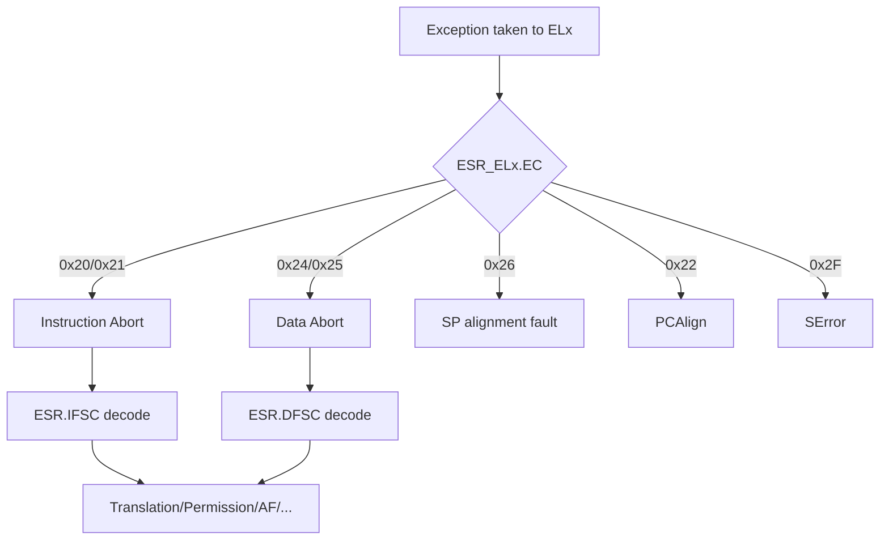

# 08.01 — Fault Types and Classification

> **ARM ARM Reference**: §D5.4, §D7 (Exception model), §D13 (System control register encodings)

---

## 1. What's a "Fault" in ARMv8?

A **fault** is an exception generated when an instruction cannot complete normally — typically due to memory access problems. Faults are reported through the **exception** mechanism and routed to one of the Exception Level handlers based on the current EL, HCR_EL2, and SCR_EL3 settings.

---

## 2. Top-level Categories

| Category | When | Examples |
|---|---|---|
| **Synchronous** | Caused by, and synchronous with, an instruction | MMU faults, alignment faults, undefined instr, SVC/HVC/SMC, breakpoint, watchpoint |
| **IRQ / FIQ** | Asynchronous external interrupt | GIC delivery |
| **SError** | Asynchronous external abort | ECC error, bus error reported late |

This section focuses on synchronous faults related to MMU/memory.

---

## 3. MMU / Memory-Access Faults

| Fault | Cause |
|---|---|
| **Translation fault** | No valid descriptor at some level of the walk |
| **Access flag fault** | PTE has `AF=0` and HW management disabled |
| **Permission fault** | Access violates AP/UXN/PXN/RW/EL permissions |
| **Address size fault** | VA/IPA exceeds the configured size (TCR/VTCR limits) |
| **Synchronous External Abort** | Bus reports error during a translation walk or access |
| **Alignment fault** | Unaligned access to Device memory, or unaligned exclusive/atomic |
| **TLB conflict abort** | Multiple TLB entries match (broken BBM sequence) |
| **Unsupported atomic update** | Atomic op to memory not supporting it |
| **TTBR0/TTBR1 region fault** | VA hits the unmapped middle region (EL1) |

Each fault has a numeric encoding placed in `ESR_ELx.IFSC` (instruction) or `DFSC` (data) — see [02 ESR decode](02_ESR_FAR_HPFAR_Decoding.md).

---

## 4. Translation Faults by Level

`DFSC = 0b0001_LL` where `LL` is the page table level (00=L0, 01=L1, 10=L2, 11=L3). Example:
- `0b000100` (0x04) → Translation fault at level 0
- `0b000101` (0x05) → Translation fault at level 1
- `0b000110` (0x06) → Translation fault at level 2
- `0b000111` (0x07) → Translation fault at level 3

Helpful in debugging: tells you exactly how deep the walker got before missing.

---

## 5. Diagram — Fault classification flow



---

## 6. Routing and EL Targeting

| Source EL | Fault routed to | Influenced by |
|---|---|---|
| EL0 | EL1 (or EL2 if HCR_EL2.TGE=1) | HCR_EL2.TGE |
| EL1 | EL1 (or EL2 if HCR_EL2 routes) | HCR_EL2.AMO/IMO/FMO |
| EL2 | EL2 (or EL3) | SCR_EL3 |
| EL3 | EL3 | — |

For a Stage 2 fault (guest OS triggers it during nested translation): routed to EL2 (the hypervisor). FAR for stage-1 VA; HPFAR for IPA.

---

## 7. Vector Table

`VBAR_ELx` points to a 2 KB vector table. Each 128-byte slot handles one exception class:

```
+0x000  Current EL with SP0  -- Sync
+0x080                       -- IRQ
+0x100                       -- FIQ
+0x180                       -- SError
+0x200  Current EL with SPx  -- Sync
... etc ...
+0x400  Lower EL using AArch64
+0x600  Lower EL using AArch32
```

The handler reads `ESR_ELx` to dispatch.

---

## 8. Recovery Semantics

- **Translation/permission faults**: usually recoverable — kernel maps the page (demand paging, COW, stack expansion, etc.), then `eret` re-executes the faulting instruction.
- **Alignment / undef**: typically SIGBUS / SIGILL to userspace.
- **External abort**: hardware error; rarely recoverable.
- **TLB conflict**: indicates kernel bug (mishandled BBM).

`ELR_ELx` points to the instruction to retry; `SPSR_ELx` holds saved PSTATE.

---

## 9. Pitfalls

1. **Confusing Stage-1 vs Stage-2 faults** — Stage-2 routes to EL2 and uses HPFAR.
2. **Missing ISB after fixing PTE** — handler returns via `eret` (implicit context sync) so generally fine; bare `MSR + RET` would need ISB.
3. **Assuming all faults imply software bug** — demand paging is normal.
4. **Not preserving x0–x18** carefully in handler stub before saving full context.
5. **TGE flips routing** for EL0 — Linux uses `HCR_EL2.TGE` when running without VHE.

---

## 10. Interview Q&A

**Q1. What's the difference between synchronous and asynchronous exception?**
Sync: tied to a specific instruction; ELR points to it. Async: external (IRQ/FIQ/SError); ELR points to next instruction.

**Q2. What encodes the fault status?**
`ESR_ELx.EC` selects the exception class; `ISS` field is class-specific. For data/instr abort, the lowest 6 bits (DFSC/IFSC) decode the precise fault.

**Q3. What's an Access Flag fault?**
Hardware took an access with `PTE.AF=0` and OS chose software AF management. Kernel sets AF and returns.

**Q4. Where does HPFAR come in?**
Stage-2 abort — gives the faulting IPA. (FAR holds the VA at which the guest's stage-1 attempted the access.)

**Q5. What's a TLB conflict abort?**
Multiple TLB entries match a VA → typically caused by skipping the Break-Before-Make protocol. Bug.

**Q6. Translation fault vs permission fault?**
Translation: PTE absent or invalid. Permission: PTE exists but access type/EL not permitted (e.g., write to RO page, EL0 access to EL1 page).

**Q7. Why is SError separate?**
It's an external asynchronous abort (memory subsystem says "an earlier op failed"). Cannot be tied to a specific instruction → separate handler slot.

**Q8. How does VBAR_EL1 work with KPTI?**
Linux maps a small trampoline page containing the vector table in the user PT (under EPD0/KPTI), then switches to full kernel PT on entry. See [04.04 TLB perf / KPTI](../04_TLB/04_TLB_Performance_and_Hugepages.md).

---

## 11. Cross-refs

- [02 ESR/FAR/HPFAR decoding](02_ESR_FAR_HPFAR_Decoding.md)
- [03 Sync vs Async / SError](03_Synchronous_Async_SError.md)
- [04 Fault handler flow](04_Fault_Handler_Flow.md)
- [03.06 Permission checks](../03_Page_Tables_and_Translation/06_Permission_Checks_AP_UXN_PXN.md)
