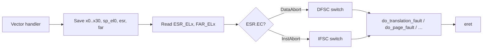

# 08.02 — ESR, FAR, HPFAR Decoding

> **ARM ARM Reference**: §D13.2.36 (ESR_EL1), §D13.2.40 (FAR_EL1), §D13.2.55 (HPFAR_EL2)

---

## 1. ESR_ELx — Exception Syndrome Register

64-bit. Two key fields:

```
[31:26]  EC   Exception Class
[25]     IL   Instruction Length (0=16b T32, 1=32b A64/A32)
[24:0]   ISS  Instruction-Specific Syndrome (interpreted per EC)
```

### Common EC values

| EC (hex) | Meaning |
|---|---|
| 0x00 | Unknown reason |
| 0x07 | Trapped FP/SIMD |
| 0x0E | Illegal Execution State |
| 0x15 | SVC from AArch64 |
| 0x16 | HVC from AArch64 |
| 0x17 | SMC from AArch64 |
| 0x18 | MSR/MRS/SystemInstr trap |
| 0x20 | Instruction Abort from lower EL |
| 0x21 | Instruction Abort from same EL |
| 0x22 | PC alignment fault |
| 0x24 | Data Abort from lower EL |
| 0x25 | Data Abort from same EL |
| 0x26 | SP alignment fault |
| 0x2F | SError |
| 0x30 | Breakpoint, lower EL |
| 0x31 | Breakpoint, same EL |
| 0x33 | SoftStep, same EL |
| 0x34 | Watchpoint, lower EL |
| 0x35 | Watchpoint, same EL |

---

## 2. ISS for Data Abort (EC = 0x24 / 0x25)

```
[24]    ISV  — instruction syndrome valid
[23:14] (valid only if ISV=1) — register encoding etc.
[13:11] SAS  — access size (00=byte..11=double)
[10]    SSE  — sign-extension hint
[9:5]   SRT  — register transferred (Xt index)
[4]     SF   — 64-bit register?
[3]     AR   — acquire/release attribute
... lower bits below
```

Lower bits (always valid):

```
[10] FnV  — FAR not valid
[9]  EA   — External abort type
[8]  CM   — Cache maintenance
[7]  S1PTW — Stage 1 walk caused stage-2 abort
[6]  WnR  — Write not Read (1 = write)
[5:0] DFSC — Data Fault Status Code
```

### DFSC encoding

| DFSC | Meaning |
|---|---|
| 0x00 | Address size, L0 |
| 0x01 | Address size, L1 |
| 0x02 | Address size, L2 |
| 0x03 | Address size, L3 |
| 0x04 | Translation fault, L0 |
| 0x05 | Translation fault, L1 |
| 0x06 | Translation fault, L2 |
| 0x07 | Translation fault, L3 |
| 0x09 | Access flag fault, L1 |
| 0x0A | Access flag fault, L2 |
| 0x0B | Access flag fault, L3 |
| 0x0D | Permission fault, L1 |
| 0x0E | Permission fault, L2 |
| 0x0F | Permission fault, L3 |
| 0x10 | Sync external abort (not on walk) |
| 0x11 | Sync Tag check fault (FEAT_MTE) |
| 0x14–0x17 | Sync external abort on translation walk, levels 0–3 |
| 0x18 | Sync parity error (not on walk) |
| 0x1C–0x1F | Sync parity error on walk |
| 0x21 | Alignment fault |
| 0x22 | Debug event |
| 0x30 | TLB conflict abort |
| 0x31 | Unsupported atomic hardware update fault |

---

## 3. ISS for Instruction Abort (EC = 0x20 / 0x21)

```
[24:13] reserved
[12]    SET — Synchronous Error Type (external aborts)
[10]    FnV
[9]     EA
[7]     S1PTW
[6]     reserved
[5:0]   IFSC — same encoding as DFSC
```

No WnR / SAS — fetches are always 4-byte reads at PC.

---

## 4. FAR_ELx

Holds the faulting **virtual** address (for Stage 1) of the access. For data abort, it's the access VA; for instruction abort, it's the fetch VA (=ELR).

Invalid when `ESR.FnV = 1` (some external aborts).

---

## 5. HPFAR_EL2 — Hypervisor IPA Fault Address

When Stage 2 reports a fault:
- `FAR_EL2` holds the guest's stage-1 VA (or 0 if unavailable).
- `HPFAR_EL2[39:4]` holds the **IPA[51:12]** that caused the stage-2 fault.

So the full IPA is reconstructed as: `(HPFAR_EL2[39:4] << 8) | FAR_EL2[11:0]`.

---

## 6. Worked Example — Decode a real fault

Suppose handler reads:
```
ESR_EL1  = 0x96000045
FAR_EL1  = 0xFFFF800012345678
```

Decode:
- `ESR[31:26] = 0x25` → Data Abort from same EL (kernel access).
- `ESR[25] = 1` → IL.
- ISS bits `0x000045`:
  - `[24] ISV = 0` → no further-instruction info.
  - `[6] WnR = 1` → write.
  - `[5:0] DFSC = 0x05` → Translation fault at L1.
- FAR = `0xFFFF800012345678` → kernel-half VA.

Diagnosis: kernel performed a write to a kernel VA whose L1 page table entry is invalid. Likely a stray pointer or unmapped vmalloc/IO region.

---

## 7. ESR Decoder Pseudocode

```c
void decode_esr(u64 esr, u64 far) {
    u32 ec = (esr >> 26) & 0x3F;
    switch (ec) {
    case 0x20: case 0x21: {
        u32 ifsc = esr & 0x3F;
        printf("Instr abort, IFSC=0x%x, FAR=0x%llx\n", ifsc, far);
        break;
    }
    case 0x24: case 0x25: {
        u32 dfsc = esr & 0x3F;
        u32 wnr  = (esr >> 6) & 1;
        u32 s1ptw= (esr >> 7) & 1;
        printf("Data abort, %s, DFSC=0x%x, S1PTW=%d, FAR=0x%llx\n",
               wnr ? "write" : "read", dfsc, s1ptw, far);
        break;
    }
    /* ... */
    }
}
```

---

## 8. Diagram — handler decode path



---

## 9. Pitfalls

1. **Forgetting FnV** — FAR may be stale on external aborts.
2. **Reading FAR before ESR** — order doesn't matter HW-wise but you must save both before any function call that might clobber.
3. **Stage-2 fault confusion** — must read HPFAR_EL2 + FAR_EL2 together.
4. **Cache-maintenance op faults** — `ESR.CM=1`; you may want to treat differently (don't crash a JIT).
5. **S1PTW=1** on a data abort — abort was on the *walk*, not on the original access. Different fix.

---

## 10. Interview Q&A

**Q1. Where do you find the fault status code?**
`ESR_ELx[5:0]` — DFSC (data abort) or IFSC (instruction abort).

**Q2. How to tell write vs read?**
`ESR_ELx[6] WnR` — 1 = write, 0 = read.

**Q3. Why might FAR be invalid?**
Some external aborts can't report a precise VA; `FnV=1` indicates this.

**Q4. Decode `ESR.DFSC = 0x0F`.**
Permission fault at translation level 3 (leaf PTE).

**Q5. What's S1PTW?**
"Stage 1 PageTable Walk caused stage-2 abort" — the abort happened while the MMU was fetching a stage-1 PTE.

**Q6. Where's the IPA on a stage-2 abort?**
`HPFAR_EL2[39:4] << 8 | FAR_EL2[11:0]`.

**Q7. What's EC = 0x18?**
Trapped MSR/MRS/system instruction — used by hypervisor to virtualize register access.

**Q8. Why distinguish 0x24 vs 0x25?**
Source — lower EL (EL0 fault entering EL1) vs same EL (EL1 fault staying in EL1). Different stack/register save strategy.

---

## 11. Cross-refs

- [01 Fault types](01_Fault_Types_and_Classification.md)
- [03 Sync/Async/SError](03_Synchronous_Async_SError.md)
- [04 Fault handler flow](04_Fault_Handler_Flow.md)
- [09.01 Two-stage translation](../09_Virtualization_and_Stage2/01_Two_Stage_Translation_Recap.md)
