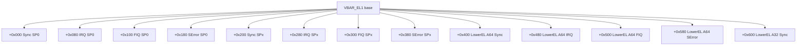

# 08.03 — Synchronous, Asynchronous, and SError

> **ARM ARM Reference**: §D1.3 (Exception types), §D1.13 (SError)

---

## 1. Three Flavors

| Type | Tied to instruction? | Source | Vector slot offset (from VBAR base) |
|---|---|---|---|
| **Synchronous** | Yes — ELR points to it | MMU fault, undef, SVC/HVC/SMC, breakpoint, watchpoint | 0x000 / 0x200 / 0x400 |
| **IRQ** | No | GIC | 0x080 / 0x280 / 0x480 |
| **FIQ** | No | GIC (fast) | 0x100 / 0x300 / 0x500 |
| **SError** | No — async external abort | Bus/memory subsystem | 0x180 / 0x380 / 0x580 |

(`+0x000` group = same EL with SP_EL0, `+0x200` = same EL with SP_ELx, `+0x400` = lower EL AArch64.)

---

## 2. Synchronous Exceptions

Triggered **by** an executing instruction and pinpointable to it:

- MMU faults (translation, permission, address-size, alignment, TLB conflict)
- Synchronous external aborts (bus error reported synchronously during the access)
- Undefined instruction / disabled feature trap
- SVC (syscall), HVC (hypervisor call), SMC (secure call)
- Software breakpoint (BRK), watchpoint, soft-step

ELR points to the offending instruction (or to it+0 for some prefetch aborts). `eret` re-executes after fix-up.

---

## 3. Asynchronous Interrupts (IRQ/FIQ)

Delivered by the GIC asynchronously. ELR points to the **next** instruction to execute (the one we'd run if we hadn't been interrupted). PSTATE.{I,F} mask them; clear on entry into appropriate handler.

Masking:
- `PSTATE.I` masks IRQ.
- `PSTATE.F` masks FIQ.
- `PSTATE.A` masks SError (synchronous external aborts technically not maskable; SError is the maskable async path).
- `PSTATE.D` masks debug.

`DAIFSet`/`DAIFClr` system instructions, or `MSR DAIF, #imm` for bulk control.

---

## 4. SError — Asynchronous External Abort

An asynchronous report from the memory system: an earlier access failed (ECC error, bus error, parity), reported after the instruction retired. Cannot be tied to any specific instruction.

Reported via ESR_ELx with EC = 0x2F. Additional fields:
- `ESR.IDS` — IMP DEF Syndrome valid flag
- `ESR.AET` — Async Error Type (UC=Uncontainable, UEU=Unrecoverable, UEO=Restartable, etc.)
- `ESR.EA` — external abort type
- `ESR.DFSC` — fault status

SError is the "couldn't tell you when, but something blew up" exception. Handler must decide: contain the damage (kill task, panic) or, if AET indicates Restartable, attempt recovery.

---

## 5. SError Masking and Pending

By default `PSTATE.A=1` masks SError. Kernel typically unmasks SError early in entry path with `msr daifclr, #4` (= clear A bit) so pending errors deliver promptly.

A **pending SError** can be checked / synchronized via:
- `ESB` (Error Synchronization Barrier, FEAT_RAS) — synchronizes any pending error to here so the handler can see it tied to a specific code region (e.g., before a context switch).

---

## 6. Diagram — vector layout

Each slot is 128 bytes — handler stub branches to common entry code.

---

## 7. Routing Controls

Asynchronous exceptions can be routed up using HCR_EL2 and SCR_EL3:

| Bit | Effect |
|---|---|
| `HCR_EL2.AMO` | SError routed to EL2 |
| `HCR_EL2.IMO` | IRQ routed to EL2 |
| `HCR_EL2.FMO` | FIQ routed to EL2 |
| `SCR_EL3.EA`  | External Abort / SError routed to EL3 |
| `SCR_EL3.IRQ` / `FIQ` | Interrupt routed to EL3 |

Linux running as guest with EL2 hypervisor uses these to take its own interrupts; KVM/Xen route to EL2.

---

## 8. FEAT_RAS — Reliability Availability Serviceability

Optional but common on server-class arm64. Provides:
- Structured error syndromes (ERR<n>STATUS, ERR<n>ADDR).
- Containable error classes (CE, UER, UEO, UC).
- `ESB` barrier instruction.
- `ERX*` registers for error record management.

Helps OS distinguish recoverable from fatal errors.

---

## 9. Pitfalls

1. **Leaving PSTATE.A=1** across long kernel paths — pending SError stalls indefinitely; on entry, unmask early.
2. **Trusting FAR on SError** — may be invalid; check FnV.
3. **Treating SError as fatal always** — RAS lets you classify; pinning to a thread + killing it may be sufficient.
4. **Missing ESB before context switch** — pending error may "follow" wrong task.
5. **Vector slot misuse** — SP0 vs SPx selection matters when entry is from same EL; mis-selection causes stack corruption.

---

## 10. Interview Q&A

**Q1. What's the difference between IRQ and SError?**
IRQ is GIC-delivered interrupt for normal devices. SError is an async report of a memory-subsystem error (ECC, bus).

**Q2. Why does SError need its own vector slot?**
It's a distinct exception type, async, not tied to an instruction; needs different handling than IRQ.

**Q3. Can SError be masked?**
Yes via `PSTATE.A`. Kernel briefly masks during critical sections.

**Q4. What's an `ESB`?**
Error Synchronization Barrier — forces any pending RAS error to be reported here, allowing precise containment.

**Q5. Which vector slot for a syscall from EL0?**
"Lower EL using AArch64, Synchronous" — offset 0x400 from VBAR_EL1. EC=0x15.

**Q6. Why is FAR invalid for some external aborts?**
The memory subsystem couldn't resolve the precise VA; ESR.FnV indicates this.

**Q7. Difference between FIQ and IRQ on arm64?**
Both are GIC-delivered; FIQ has higher priority and a separate vector slot. Linux on arm64 historically used IRQ only; some RTOS / secure firmware use FIQ.

**Q8. What's HCR_EL2.AMO=1 do?**
Routes SError to EL2 — so hypervisor handles guest's RAS events.

---

## 11. Cross-refs

- [01 Fault types](01_Fault_Types_and_Classification.md)
- [02 ESR decode](02_ESR_FAR_HPFAR_Decoding.md)
- [04 Fault handler flow](04_Fault_Handler_Flow.md)
