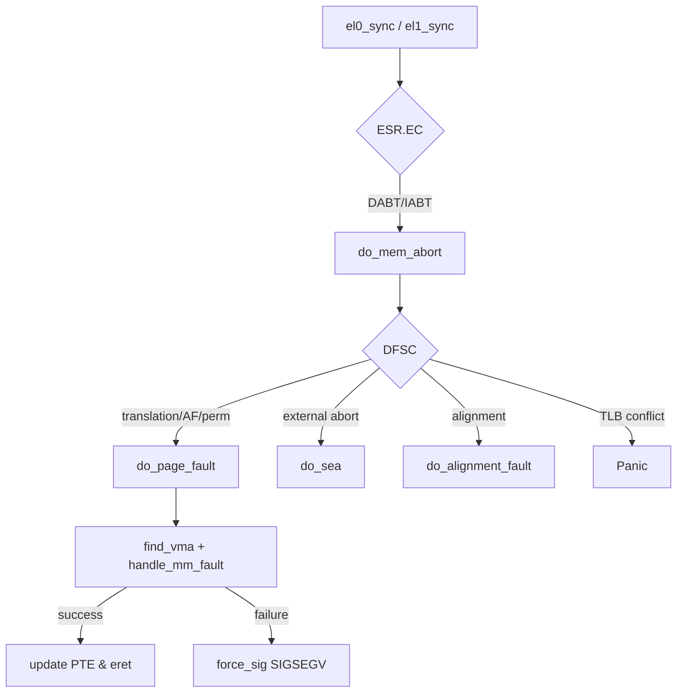

# 08.04 — Fault Handler Flow (Linux/arm64 walkthrough)

> **ARM ARM Reference**: §D1 (Exception handling); Linux: `arch/arm64/kernel/entry.S`, `arch/arm64/mm/fault.c`

---

## 1. Entry Sequence

When an exception fires:

1. PE saves PSTATE → `SPSR_ELx`.
2. PE saves return PC → `ELR_ELx`.
3. PE sets PSTATE: EL = target, SP = SP_ELx, D=A=I=F=1 (mask debug/SError/IRQ/FIQ depending on routing).
4. PC = VBAR_ELx + offset (selected by class and source).
5. Vector stub runs (handler).
6. Handler eventually `eret` → restores SPSR/ELR.

---

## 2. Vector Stub (entry.S idiom)

Each 128-byte slot does:

```asm
.macro kernel_ventry, el, label, regsize=64
    .align 7
    sub sp, sp, #S_FRAME_SIZE       ; reserve pt_regs
    .if \regsize == 64
        mrs x21, sp_el0
    .endif
    add x21, sp, #S_FRAME_SIZE
    stp x0, x1, [sp]
    stp x2, x3, [sp, #16]
    ...
    b   el\el\()_\label
.endm
```

Then the per-class branch goes to e.g. `el1_sync`, `el0_sync`, etc.

---

## 3. Common Handler Pattern (Sync from EL0)

```c
asmlinkage void el0_sync_handler(struct pt_regs *regs)
{
    u64 esr = read_sysreg(esr_el1);
    u32 ec  = ESR_ELx_EC(esr);

    switch (ec) {
    case ESR_ELx_EC_SVC64:      do_el0_svc(regs); break;
    case ESR_ELx_EC_DABT_LOW:   do_mem_abort(regs, esr); break;
    case ESR_ELx_EC_IABT_LOW:   do_mem_abort(regs, esr); break;
    case ESR_ELx_EC_SP_ALIGN:   do_sp_align(regs); break;
    case ESR_ELx_EC_FP_EXC64:   do_fpsimd_exc(regs); break;
    case ESR_ELx_EC_SYS64:      do_sysinstr(regs, esr); break;
    case ESR_ELx_EC_SVE:        do_sve_acc(regs); break;
    case ESR_ELx_EC_BRK64:      do_brk64(regs, esr); break;
    /* … */
    default: do_undefinstr(regs);
    }
}
```

`do_mem_abort` dispatches further on DFSC.

---

## 4. Page Fault Flow (do_page_fault)



`handle_mm_fault` is generic MM code: it consults VMA, allocates page, sets PTE, possibly faults in from swap, performs COW, etc. Returns flags (success / SIGSEGV / SIGBUS).

---

## 5. Kernel-mode Faults

`el1_sync` faults are more dangerous. Causes:
- Bad kernel pointer (NULL deref, freed memory).
- Vmalloc area not yet faulted into the active mm.
- Stack overflow (page below `stack_guard`).

Path: `do_kernel_fault` → if recoverable (extables for `__copy_from_user`, etc.), fixup. Otherwise `die("Oops")` and panic if in atomic context.

---

## 6. Exception Return

```asm
    /* restore regs */
    ldp x0, x1, [sp]
    ...
    add sp, sp, #S_FRAME_SIZE
    eret                 ; PE restores SPSR_ELx → PSTATE, ELR_ELx → PC
    /* implicit context-synchronization event */
```

After `eret`, the saved PSTATE is restored, including unmask of DAIF. If we fixed the PTE, the faulting instruction re-executes; the new TLB walk picks up the updated PTE (assuming we issued the right TLBI + DSB before eret if mappings changed in shared ranges).

---

## 7. Worked Example — demand-paged stack growth

1. User stack pointer wanders below current stack VMA.
2. Store instruction → MMU translation fault, level 3.
3. PE enters el0_sync (offset 0x400 from VBAR_EL1).
4. ESR.EC=0x24, DFSC=0x07.
5. Linux `do_page_fault` → `find_vma` finds the stack VMA with `VM_GROWSDOWN`.
6. `expand_stack` extends VMA → `handle_mm_fault` allocates zeroed page, sets PTE valid+AF+RW+UXN.
7. No need for TLB invalidate (PTE was Invalid; nothing cached).
8. `eret` → instruction retries → succeeds.

---

## 8. Worked Example — COW

1. Forked child writes a previously-shared RO page.
2. Permission fault (DFSC=0x0F).
3. `do_page_fault` → `handle_mm_fault` → `wp_page_copy` → allocates new page, copies, sets new PTE.
4. **Critical**: must invalidate old TLB entry on all CPUs that may have cached it (`tlb_remove_page` / `flush_tlb_page`).
5. `eret` retries.

---

## 9. Pitfalls

1. **Re-enabling DAIF too early** — saving regs before unmask is safer; otherwise nested exception clobbers things.
2. **Forgetting to handle ESR.S1PTW** — fault was on stage-1 walk during stage-2 — handler logic differs.
3. **No PTE-modification → TLB-invalidate path** — leaving stale TLB entries causes spurious continued faults or wrong data.
4. **Stack overflow detection missing** — without guard pages, kernel stack overflow corrupts adjacent thread_info.
5. **Returning to user with kernel SP** — KPTI / entry trampoline must restore SP_EL0 before eret.

---

## 10. Interview Q&A

**Q1. Walk me through a userspace page fault on Linux/arm64.**
EL0 access → translation fault → vector at VBAR_EL1+0x400 → save regs → read ESR/FAR → do_mem_abort → do_page_fault → handle_mm_fault → install PTE → eret → retry.

**Q2. How do you know if the fault came from user or kernel?**
ESR.EC distinguishes — 0x24 is from lower EL (user), 0x25 is from same EL (kernel).

**Q3. After fixing a PTE, do you need TLB invalidate?**
If the prior PTE was Invalid (translation fault), no — nothing was cached. If you changed an existing PTE (permission fault, COW), yes — invalidate the old entry, broadcast across CPUs.

**Q4. What's an exception "fix-up" / extable?**
For copy_to/from_user, kernel registers (faulting_PC, jump_PC) pairs; on fault, fixup transfers control to error-return path instead of OOPS.

**Q5. Why mask DAIF on entry?**
Avoid nested exceptions before the handler has saved enough state.

**Q6. Cost of an ARM64 syscall vs Linux x86?**
Comparable; SVC instruction + entry stub + dispatch. KPTI mitigations on both add table-switch overhead.

**Q7. What's `eret`?**
Exception Return. Atomically restores SPSR→PSTATE and ELR→PC. Acts as a context synchronization event (implicit ISB).

**Q8. How does KPTI affect the entry path?**
Vector table sits in a small user-mapped trampoline page; entry swaps TTBR1 to full kernel pgd, then jumps to common handler. Adds ~50–150 cycles.

---

## 11. Cross-refs

- [01 Fault types](01_Fault_Types_and_Classification.md)
- [02 ESR decode](02_ESR_FAR_HPFAR_Decoding.md)
- [03 Sync/Async/SError](03_Synchronous_Async_SError.md)
- [04.03 TLB shootdown](../04_TLB/03_TLB_Shootdown_and_Broadcast.md)
