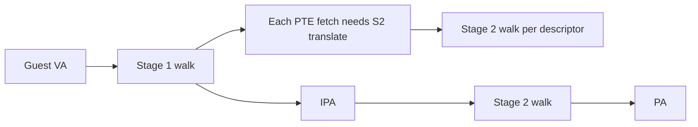

# 09.01 — Two-Stage Translation Recap

> **ARM ARM Reference**: §D5.2.3, §D5.6 (VMSAv8-64 with Stage 2)

---

## 1. The Big Picture

Without virtualization: VA → PA via one stage of translation, controlled by the OS at EL1 (and EL0).

With virtualization (EL2 present, `HCR_EL2.VM=1`): two stages.

```
Guest VA  --[Stage 1, owned by Guest OS]-->  IPA  --[Stage 2, owned by Hypervisor]-->  PA
```

The guest OS believes "IPA" is real physical memory. The hypervisor remaps it via Stage 2.

---

## 2. Who Controls What

| Stage | Translation tables base | Controlled by | Configured at |
|---|---|---|---|
| Stage 1 EL0/EL1 (guest) | `TTBR0_EL1`, `TTBR1_EL1` | Guest OS | EL1 |
| Stage 2 (guest physical → real physical) | `VTTBR_EL2` | Hypervisor | EL2 |
| Stage 1 EL2 (hypervisor itself) | `TTBR0_EL2` (+`TTBR1_EL2` with VHE) | Hypervisor | EL2 |
| Stage 1 EL3 | `TTBR0_EL3` | Secure firmware | EL3 |

`VTCR_EL2` configures Stage-2 granule, IPS size, SL0 starting level, VMID size.

---

## 3. The Walk

For a guest EL1 access:

```
Guest VA
  ├─ Stage-1 walk (using guest TTBR, may traverse L0..L3)
  │     ↳ each descriptor fetched as an IPA, must itself go through Stage 2 → PA  (nested walk)
  ├─ resulting IPA
  ├─ Stage-2 walk (using VTTBR, may traverse L0..L3)
  └─ resulting PA
```

So a single guest access can incur up to **(stage1_levels + 1) × stage2_levels** descriptor fetches in the worst case — e.g., 4×4 = 16 memory reads. Walk caches (intermediate caches inside the MMU) drastically reduce this in practice.

---

## 4. Memory Attribute Combining

Stage 1 and Stage 2 each assign type (Normal/Device) and cacheability. Architecture defines a combining rule (worst-of-both):

| S1 / S2 | → Effective |
|---|---|
| Normal Cacheable / Normal Cacheable | Normal Cacheable (combine cache attributes per S2 override) |
| Normal Cacheable / Device | Device wins |
| Device / Normal | Device |
| Device / Device | Device |
| Normal NC / anything | Non-cacheable |

`HCR_EL2.CD` and `HCR_EL2.DC` can force Non-cacheable / Default-cacheable behavior globally (used in early boot before guest sets up MAIR).

Shareability combining: most-shared wins; Stage 2 can also widen shareability.

---

## 5. Identifying Entities

| ID | Scope | Register |
|---|---|---|
| **ASID** | Stage-1 EL1 per address space | `TTBR0/1_EL1.ASID` |
| **VMID** | Stage-2 per VM | `VTTBR_EL2.VMID` |

A TLB entry generally tagged with {VMID, ASID, level, VA→IPA→PA, attrs}. Stage-2-only entries tagged with {VMID, IPA→PA}.

See [02.05 ASID/VMID](../02_Virtual_Memory_VMSAv8/05_ASID_and_VMID.md).

---

## 6. Diagram — Nested walk



---

## 7. VHE — Virtualization Host Extensions (ARMv8.1+)

Without VHE: hypervisor runs at EL2, guest at EL1; trampoline overhead when KVM/host code itself uses EL2 services.

With VHE (`HCR_EL2.E2H=1`, `HCR_EL2.TGE=1` for host EL0):
- Host kernel runs at EL2 directly (using EL1-like register aliases mapped onto EL2 registers).
- Host EL0 (userspace) runs with TGE=1 routing exceptions to EL2.
- Guests still run at EL1/EL0 under stage-2.

VHE eliminates the EL1↔EL2 trampoline for host operations. Mandatory for modern KVM-on-arm64.

---

## 8. Pitfalls

1. **Configuring Stage 2 with mismatched granule** — guest sees IPA that doesn't translate; HVC traps cascade.
2. **Forgetting to flush VMID on guest destruction** — leaks TLB entries into a future VM reusing the VMID.
3. **Stage-2 with Device, Stage-1 with Normal** — accesses become Device; passes through caches → unexpected perf cliff.
4. **Walk cache invalidation** — TLBI on Stage 1 may not invalidate intermediate walk caches; use `TLBI VMALLS12E1IS` for full Stage-1+2 flush.
5. **VHE off but Linux configured for VHE** — boot failure; HCR setup must match.

---

## 9. Interview Q&A

**Q1. What does Stage 2 translate?**
IPA (intermediate physical address, the guest's "physical" address) to real PA. Owned by the hypervisor.

**Q2. How many descriptor fetches max for a nested walk?**
With 4 levels each side: each of 4 Stage-1 PTE fetches needs up to a 4-level Stage-2 walk, plus the final IPA→PA — up to ~24 in the worst case. Walk caches mitigate.

**Q3. What's a VMID?**
A virtual-machine identifier tag for TLB entries to disambiguate guests; configured in VTTBR_EL2.

**Q4. What's VHE?**
Virtualization Host Extensions — lets the host kernel run at EL2 directly, removing trampolines. Linux uses it on arm64 when available.

**Q5. How are memory attributes combined?**
Worst-of-both: Device wins over Normal; Non-cacheable wins over Cacheable; broadest shareability wins.

**Q6. What's HCR_EL2.DC?**
Default Cacheability — forces accesses to be treated as Normal cacheable when Stage 1 is disabled. Used pre-MMU-bring-up.

**Q7. Why does Stage 2 fault report HPFAR?**
FAR holds the guest's stage-1 VA; HPFAR adds the IPA that hit the Stage-2 fault.

**Q8. Can a guest invalidate the host's TLB entries?**
No — guest TLBIs are scoped to its VMID by hardware; host/VMID=0 entries untouched.

---

## 10. Cross-refs

- [02 IPA & SMMU](02_IPA_and_SMMU_IOMMU.md)
- [03 KVM/Xen mapping](03_Hypervisor_Modes_KVM_Xen.md)
- [07.04 VTTBR/VTCR](../07_System_Registers_Quickref/04_VTTBR_VTCR_Stage2.md)
- [03.04 Stage1 vs Stage2](../03_Page_Tables_and_Translation/04_Stage1_vs_Stage2_Translation.md)
