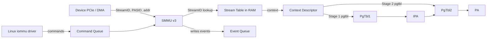

# 09.02 — IPA, IOMMU and the System MMU (SMMU)

> **ARM ARM Reference**: §D5.6 (Stage 2); *Arm SMMU v2 / v3 Architecture Specifications*

---

## 1. Why an IOMMU / SMMU?

CPUs translate VAs via the MMU. **DMA-capable devices** issue physical-address transactions directly into memory — by default unaware of any VA→PA mapping. This creates problems:

1. **Isolation** — a buggy/malicious device can DMA anywhere in memory.
2. **Virtualization** — passing a device to a guest requires the device to see *guest physical addresses* (IPA) and have hardware remap to real PA.
3. **Contiguity for scatter-gather** — let devices use virtually-contiguous buffers backed by scattered physical pages.

Solution: an **IOMMU**, called **SMMU (System MMU)** in ARM terminology, sits between devices and the memory system. It performs translation on transactions issued by devices.

---

## 2. SMMU Generations

| Version | Notes |
|---|---|
| **SMMUv1** | Initial; per-instance, programmable contexts. |
| **SMMUv2** | Improved, common on Cortex-A SoCs and Qualcomm Snapdragon. |
| **SMMUv3** | Major redesign — command queue, event queue, in-memory stream table. Targets servers (Neoverse), supports per-PASID stage-1 in-context (SVA — Shared Virtual Addressing). |

SMMUv3 is the modern target. ARM's docs and Linux's `drivers/iommu/arm/arm-smmu-v3/` are the references.

---

## 3. Stages and Contexts

SMMU also has **Stage 1** (device-VA → IPA) and **Stage 2** (IPA → PA) — same table format as the CPU MMU.

| Context | Tables programmed by |
|---|---|
| Stage 1 only | Hypervisor (or kernel) for direct device IO mapping |
| Stage 2 only | Hypervisor for passthrough — device sees guest's IPA, SMMU translates to PA |
| Stage 1 + Stage 2 (nested) | Guest sets up Stage 1 (device VA→IPA), Hypervisor sets Stage 2 |

Modern SVA / vSVA: device shares the **process's CPU page tables** so DMA addresses == process VAs (no copy, zero-copy IO). Uses **PASID** (Process Address Space ID) tagging similar to ASID. Requires PCIe ATS/PRI for page-faults on the device side.

---

## 4. Stream IDs and PASIDs

Each transaction from a device is tagged:
- **StreamID** — identifies the device (e.g., a PCIe BDF gets mapped to a StreamID).
- **SubstreamID / PASID** — identifies the address space within the device (per-process).

The SMMU **Stream Table** (in memory) maps StreamID → context (which page tables to use). Substream Table per stream provides per-PASID context for SVA.

---

## 5. Diagram — SMMUv3 architecture

---

## 6. Linux IOMMU Concepts

- **iommu_group** — set of devices that must share an address space (hardware grouping).
- **iommu_domain** — an address space; a group is attached to a domain.
- **DMA-API** translates `dma_map_*` calls into domain mappings (IOVA → PA).
- **VFIO** exposes a group to userspace (used by DPDK, SPDK, QEMU passthrough).

When KVM passes a device to a guest:
- VFIO attaches the device's iommu_group to a domain whose Stage-2 page tables == the guest's Stage-2 maps (or sets them up identically).
- Device DMA addresses == guest IPAs → SMMU Stage-2 maps to real PA.

---

## 7. Faults and PRI

SMMU faults are reported via the **Event Queue** (memory-resident ring) and trigger an interrupt to the iommu driver. Events include translation faults, permission faults, illegal commands.

**PRI** (Page Request Interface) lets a device request a missing page (page fault), the OS faults it in, then notifies the device via **PRG response**. Combined with ATS (Address Translation Services), this enables true SVA.

---

## 8. Performance Considerations

- **IOTLB** — SMMU has its own TLB (sometimes per-context). Misses → table walks in memory (cacheable; uses normal cache hierarchy).
- **Huge pages** — backing IOMMU mappings with 2 MB / 1 GB helps IOTLB hit-rate (critical for high-throughput DMA).
- **Page table sharing** (SVA) eliminates `dma_map_*` overhead but adds ATS/PRI complexity.
- **Bypass mode** can be configured per-stream — used for trusted devices when SMMU adds unwanted latency (Qualcomm SoC subsystems often use bypass for AON paths).
- **Invalidation cost** — when unmapping, must issue SMMU TLBI commands; if a context is shared between SMMU and CPU (SVA), CPU TLBI may also broadcast to SMMU (`TLBI` instructions broadcast to SMMU if DVM is enabled).

---

## 9. Pitfalls

1. **Forgetting unmap** — leaks IOMMU mappings; later DMA may corrupt memory.
2. **Sharing memory across iommu_groups** without ownership — DMA-API thinks it's safe; isn't.
3. **Bypass mode in untrusted contexts** — defeats isolation.
4. **Mis-sized stream table** — devices spuriously translated through default context.
5. **PRI / ATS not negotiated** — SVA setup fails silently; falls back to DMA-API mappings.
6. **VFIO without IOMMU** — `vfio-noiommu` mode exists for development; do not use in production.

---

## 10. Interview Q&A

**Q1. What's the difference between MMU and SMMU?**
MMU translates CPU accesses; SMMU translates device (DMA) accesses. Both share the VMSAv8 page-table format.

**Q2. What's a StreamID?**
SMMU's identifier for a master device (per-DMA-channel/per-PCIe BDF). Selects the context (page tables) to use.

**Q3. What's PASID / SVA?**
PASID tags transactions with a process ID; SVA lets the device share the CPU process's page tables — zero-copy IO with the same VAs.

**Q4. How does device passthrough to a guest VM work?**
VFIO attaches the device's iommu_group to a domain backed by the guest's Stage-2 PTs; device DMA uses guest IPAs which SMMU translates to real PA.

**Q5. What's the Event Queue?**
SMMUv3 in-memory ring for fault and event notifications; iommu driver consumes it.

**Q6. Why use hugepages for IOMMU mappings?**
Reduce IOTLB misses for large DMA buffers — critical for high-throughput devices (NICs, GPUs).

**Q7. What's IOMMU "bypass"?**
SMMU passes the transaction through untranslated (identity map). Used for trusted devices or AON paths.

**Q8. What's PRI / ATS?**
PCIe Page Request Interface and Address Translation Services — lets the device translate addresses with the SMMU cooperatively and request demand-paged pages.

---

## 11. Cross-refs

- [01 Two-stage translation](01_Two_Stage_Translation_Recap.md)
- [03 KVM/Xen mapping](03_Hypervisor_Modes_KVM_Xen.md)
- [10.02 NVIDIA UM/UVM](../10_Advanced_and_Vendor_Context/02_NVIDIA_Unified_Memory.md)
- [10.04 Qualcomm SoC](../10_Advanced_and_Vendor_Context/04_Qualcomm_SoC_Memory_Subsystem.md)
