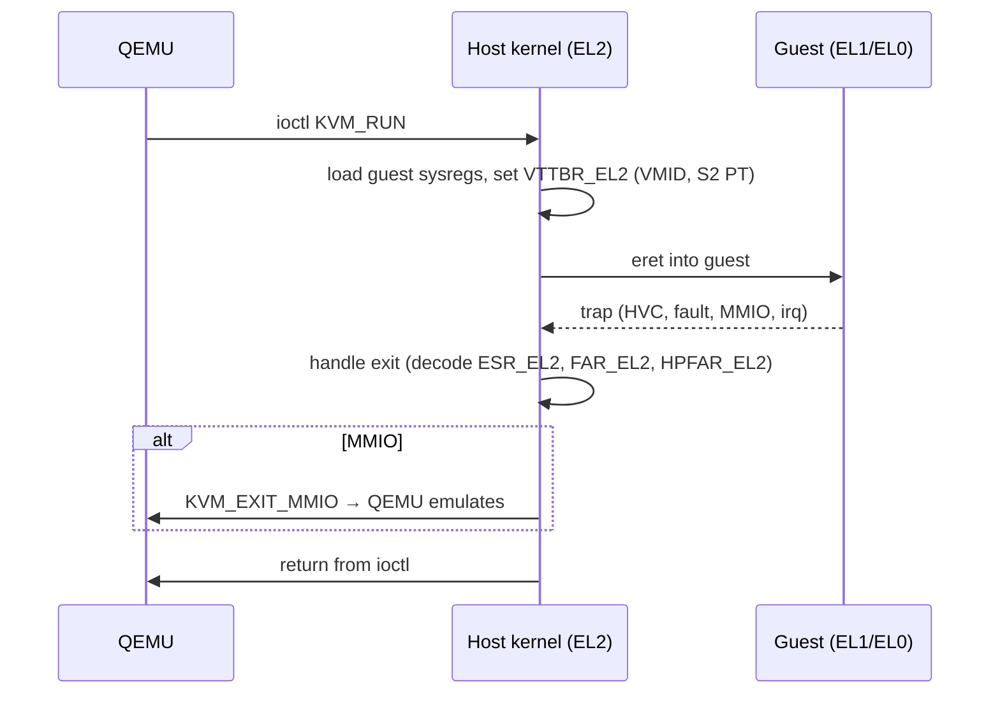

# 09.03 — Hypervisor Modes: KVM and Xen

> **ARM ARM Reference**: §D1 (EL2), §D5.6 (Stage 2); Linux: `arch/arm64/kvm/`; Xen-ARM source tree.

---

## 1. EL2 in ARMv8

EL2 is the hypervisor exception level. Originally (ARMv8.0) a separate ring above EL1; ARMv8.1 introduced **VHE** allowing the host kernel to run in EL2 directly.

Key EL2 controls:

| Register | Purpose |
|---|---|
| `HCR_EL2`  | Hypervisor configuration — virtualization on, trap controls, IRQ/FIQ/SError routing |
| `VTCR_EL2` | Stage-2 translation control (granule, IPS, SL0, VMID size) |
| `VTTBR_EL2`| Stage-2 base table address + VMID |
| `VBAR_EL2` | EL2 vector base |
| `CPTR_EL2` | Trap of FPSIMD/SVE/SME usage from lower ELs |
| `MDCR_EL2` | Debug/PMU trap controls |
| `ELR_EL2`, `SPSR_EL2` | Return state |
| `HSTR_EL2` | Trap of CP15-style accesses (AArch32 guest) |

---

## 2. Without VHE (Classic Type-1 / Split-mode)

- Host kernel at EL1, hypervisor stub at EL2.
- For Linux+KVM: most host runs at EL1; KVM has a small "EL2 hypervisor" code blob (hyp.S) that handles context switch to/from guest.
- On every guest exit, EL2 switches host context back, then `eret` to EL1 host handler.
- Trampoline cost is non-trivial — hence VHE.

Xen on ARM (without VHE) uses this model: Xen at EL2, dom0 Linux at EL1.

---

## 3. With VHE (ARMv8.1+)

- Host kernel runs at EL2 with `HCR_EL2.E2H=1`, `HCR_EL2.TGE=1` for host EL0.
- System register names like `TTBR0_EL1` automatically map to `TTBR0_EL2` (the host's own translation regime), letting the same kernel code work without modification.
- Guests still execute at EL1/EL0 under Stage-2 (`HCR_EL2.E2H` flips for guest entry/exit).
- No EL2↔EL1 trampoline for host operations.

Linux/KVM on modern arm64 (Neoverse, Apple, Snapdragon 8-series) defaults to VHE.

---

## 4. KVM/arm64 Lifecycle (VHE mode)

---

## 5. Stage-2 Setup for a Guest

1. Allocate Stage-2 page tables (typically 4 KB granule, 4 levels, IPS sized to memory).
2. Set `VTTBR_EL2` = base | (VMID << 48). VMID 0 reserved for host.
3. Set `VTCR_EL2`:
   - `TG0` granule
   - `SL0` starting level
   - `T0SZ` IPA size (e.g., 64−40 = 24 for 40-bit IPA)
   - `PS` physical size
   - `VS` VMID size (8 or 16 bits)
4. Map all guest "physical" memory regions (IPA → PA) — typically map all anonymous RAM + emulated device regions.
5. `HCR_EL2.VM = 1` to enable Stage 2.

---

## 6. Trap Configuration

`HCR_EL2` controls trapping of various guest operations:

| Bit | Effect |
|---|---|
| `VM` | Stage-2 enable |
| `TGE` | Route all EL1 exceptions to EL2 (used with VHE host EL0) |
| `IMO/FMO/AMO` | Route IRQ/FIQ/SError to EL2 |
| `TWI/TWE` | Trap WFI/WFE |
| `TSC` | Trap SMC |
| `TID3` | Trap CPUID-like ID register reads |
| `TIDCP` | Trap implementation-defined CP15 |
| `TACR` | Trap auxiliary control register accesses |
| `TPU/TPC` | Trap I-cache / D-cache maintenance to PoU/PoC |

Hypervisor uses these to interpose on operations needing emulation or accounting.

---

## 7. Interrupt Virtualization — GICv3 vLPI

ARM GICv3 supports virtualization natively: list registers (`ICH_LRn_EL2`) inject virtual interrupts into the guest. KVM doesn't need to emulate interrupt delivery — hardware does it, exposing `vICC_*_EL1` register aliases. ITS (Interrupt Translation Service) routes MSI to vLPIs efficiently for SR-IOV passthrough.

---

## 8. Type-1 vs Type-2

- **Type-1 (bare metal)**: Xen-ARM, Hyper-V on ARM. Hypervisor is a small kernel running at EL2; dom0/guest at EL1.
- **Type-2 (hosted)**: KVM. Host OS is its own kernel; KVM is a kernel module that uses EL2 for guests. VHE blurs the line (host kernel itself runs at EL2).

Both rely on the same EL2/Stage-2 architecture.

---

## 9. Pitfalls

1. **VHE detection bugs** — booting with `HCR_EL2.E2H` mis-set destroys system register aliasing.
2. **Forgetting to scrub guest sysregs on exit** — info leak.
3. **VMID reuse without TLBI** — stale TLB hits for new guest.
4. **MMIO not trapped** — accidentally mapping device PA into guest stage-2 as RAM lets guest poke real hardware.
5. **GICv2 fallback** — older SoCs need emulated GICv2 (vgic-v2); slower, more traps.
6. **Stage-2 walk faults** during huge-page splits — ensure Break-Before-Make for VTTBR-side too.

---

## 10. Interview Q&A

**Q1. Where does KVM run on arm64?**
At EL2 (with VHE the host kernel itself is at EL2; without VHE only a tiny stub is at EL2 and the rest of KVM is at EL1).

**Q2. What does VHE buy?**
Eliminates EL1↔EL2 trampoline for host code; lets the same kernel binary run as host on EL2 using register aliases.

**Q3. What's VTTBR_EL2?**
Stage-2 base translation register; holds {VMID, base address of guest's Stage-2 page tables}.

**Q4. How are guest interrupts delivered?**
GICv3 hardware list registers — KVM populates `ICH_LR*_EL2` with pending vIRQs; CPU delivers as IRQs at guest EL1.

**Q5. What traps a guest's WFI?**
`HCR_EL2.TWI=1` — exit to hypervisor, allowing scheduler to deschedule the vCPU.

**Q6. Difference between Type 1 and Type 2 on ARM?**
Type 1: hypervisor is its own OS (Xen). Type 2: hypervisor is module of host OS (KVM). Both use EL2.

**Q7. Why use a VMID instead of just per-guest Stage-2 PTs?**
Tags TLB entries — avoids needing TLBI on every VM switch.

**Q8. How to passthrough a PCIe device to a guest?**
VFIO + SMMU: attach device's iommu_group to a domain whose Stage-2 PTs match the guest's; configure GIC ITS for MSI translation.

---

## 11. Cross-refs

- [01 Two-stage](01_Two_Stage_Translation_Recap.md)
- [02 SMMU/IOMMU](02_IPA_and_SMMU_IOMMU.md)
- [07.04 VTTBR/VTCR](../07_System_Registers_Quickref/04_VTTBR_VTCR_Stage2.md)
- [02.05 ASID/VMID](../02_Virtual_Memory_VMSAv8/05_ASID_and_VMID.md)
