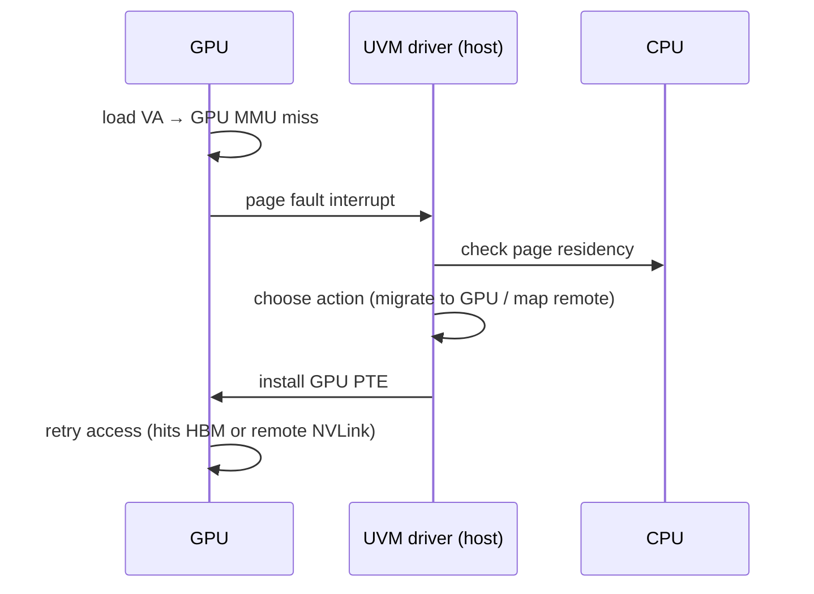

# 10.02 — NVIDIA Unified Memory (UM / UVM)

> Sources: NVIDIA public CUDA programming guide; *Volta / Hopper / Grace Hopper* architecture whitepapers; Open-source `nvidia-uvm` driver.

NVIDIA-specific knowledge an arm64 systems engineer should bring to an interview. All technical details below are from NVIDIA's published documentation.

---

## 1. The Problem

Discrete GPU and CPU traditionally had separate physical memories (HBM vs DRAM). Programmers explicitly `cudaMemcpy` between them, tracking which side owns each buffer. Painful and error-prone.

**Unified Memory** (CUDA UM, since CUDA 6 / Kepler) presents a **single virtual address space** addressable by both CPU and GPU. The driver migrates pages on demand based on access patterns.

---

## 2. Address-Space Unification

- CPU and GPU translate the **same virtual addresses** to (possibly different) physical addresses.
- A page can physically reside in CPU DRAM, GPU HBM, or both (replicated).
- The UVM driver maintains a coherency state machine per page and migrates as needed.
- Backed by IOMMU/SMMU on the host side and the GPU's own MMU on the device side.

On **Grace Hopper** (NVLink-C2C between Grace CPU and Hopper GPU), the unified address space is hardware-coherent: both sides can access memory on the other without explicit migration, at cache-line granularity, with hardware coherency over NVLink-C2C.

---

## 3. Page-Fault-Driven Migration (Pascal+)

Faults are coalesced into batches; UVM processes hundreds at a time to amortize MMIO cost.

---

## 4. Hints and Counters

CUDA exposes:

- `cudaMemAdvise(ptr, size, kind, device)` — hints like `Preferred Location`, `Read Mostly`, `Accessed By`.
- `cudaMemPrefetchAsync(ptr, size, device, stream)` — preemptive migration.
- Access counters in HW (Volta+) — driver reads to drive migration without faults.

---

## 5. Coherency Models by Architecture

| Generation | Coherency | Mechanism |
|---|---|---|
| Pre-Pascal | SW-managed (cudaMemcpy or coarse-grain UM) | Driver migration |
| Pascal/Volta/Turing/Ampere/Hopper (PCIe) | Page-fault driven, page-granular | UVM driver + GPU MMU fault |
| **Grace Hopper (NVLink-C2C)** | **HW cache coherent**, line-granular | NVLink-C2C extends coherency domain across CPU+GPU |

On Grace Hopper, the GPU appears as another coherent agent in the ARM CHI domain; ARM TLB invalidates (via DVM messages) and SMMU operations apply across.

---

## 6. NVIDIA MMU Specifics

- **Sectored TLB**: GPU MMU uses very large TLB structures with sector tags to support hugepages and high parallelism.
- **Big pages**: GPU drivers prefer 2 MB pages; UVM allocates and migrates at this granularity by default.
- **PASID/SVA via ATS+PRI**: PCIe ATS lets the GPU translate addresses with the CPU SMMU, and PRI requests pages on miss — implementing UM over standard PCIe (Open Kernel Modules path).

---

## 7. ARM-specific Aspects (Interview Angle)

- **Grace** is Neoverse-V2 based — CHI coherent fabric, MPAM, SVE2, FEAT_LSE2, MTE.
- **NVLink-C2C** between Grace and Hopper joins their coherency domains.
- ARM PCIe Root Complex + SMMUv3 handle external PCIe devices and FW-level isolation.
- DVM (Distributed Virtual Memory) messages broadcast ARM TLBIs to participating SMMUs (and GPU MMU on coherent links).

---

## 8. Pitfalls

1. **False migration thrash** — both CPU and GPU touching the same page; UVM ping-pongs. Use `cudaMemAdvise` with READ_MOSTLY or pin to one side.
2. **Small object allocation in UM** — page-granular migration of tiny structs is wasteful; batch into arenas.
3. **Stream-ordered allocator interplay** — `cudaMallocAsync` ≠ UM; use `cudaMallocManaged` for UM.
4. **HBM eviction surprises** — under HBM pressure, hot pages may evict to host; profile with `nvidia-smi` and Nsight.
5. **NVLink topology assumptions** — non-Grace systems use PCIe, much higher latency; algorithm tuning differs.

---

## 9. Interview Q&A

**Q1. What is CUDA Unified Memory?**
A single virtual address space accessible by both CPU and GPU, with the runtime migrating pages on demand or accessing remotely.

**Q2. How does Pascal+ implement UM?**
GPU MMU page-faults to the UVM driver; driver migrates the page (or installs a remote mapping) and the GPU retries.

**Q3. What changed in Grace Hopper?**
NVLink-C2C provides hardware cache coherency between Grace (ARM CPU) and Hopper (GPU). No explicit migration needed for coherency; access at cache-line granularity.

**Q4. How can you avoid migration thrash?**
`cudaMemAdvise` with READ_MOSTLY, Preferred Location, or Accessed By hints; or prefetch with `cudaMemPrefetchAsync`.

**Q5. How does UM relate to ARM's SMMU?**
On Grace systems, the GPU is a coherent agent in the CHI fabric (similar role to SMMU); on PCIe systems, the GPU uses ATS/PRI via the SMMU to translate addresses.

**Q6. What page size does UVM prefer?**
2 MB on most GPUs — better for HBM bandwidth and GPU TLB occupancy. Hopper supports 64 KB and 2 MB.

**Q7. Why is UM useful for ML workloads?**
Models exceed GPU HBM; UM lets the runtime spill cold parameter pages to host without code changes. Combined with NVLink-C2C on Grace Hopper this approaches HBM bandwidth for warm pages.

**Q8. What's "Page-fault driven" vs "Access-counter driven" migration?**
Fault: GPU traps on miss → driver migrates → retry. Access-counter (Volta+): HW counters track remote accesses; driver migrates proactively without explicit fault.

---

## 10. Cross-refs

- [09.02 SMMU/IOMMU](../09_Virtualization_and_Stage2/02_IPA_and_SMMU_IOMMU.md)
- [04.04 TLB performance](../04_TLB/04_TLB_Performance_and_Hugepages.md)
- [05.04 Cache coherency](../05_Caches/04_Cache_Coherency_MESI_MOESI.md)
