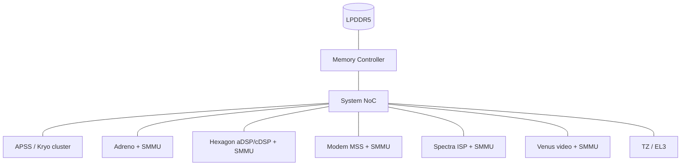

# 10.04 — Qualcomm SoC Memory Subsystem (public material)

> Sources: public Snapdragon documentation; Linux `arch/arm64/boot/dts/qcom/`; Qualcomm Hexagon SDK public manuals; CodeAurora / kernel.org Qualcomm tree.

A heterogeneous SoC (Snapdragon-class) is a microcosm of memory-subsystem design challenges. The Qualcomm interview lens is typically *systems on a SoC* — multiple subsystems sharing DRAM safely and efficiently.

---

## 1. Subsystem Landscape (typical Snapdragon)

| Subsystem | Processor | Memory role |
|---|---|---|
| APSS (Application Processor Subsystem) | Kryo (Cortex-A semi-custom) | Runs Android / Linux |
| Adreno | GPU | Heavy graphics/compute |
| Hexagon DSP | aDSP, mDSP, cDSP, sDSP | Audio / Modem / Compute / Sensors |
| Modem (MSS) | Hexagon + DSPs + HW accelerators | LTE/5G stack |
| Spectra ISP | Image-signal processor | Camera pipeline |
| Video (Venus) | Encode/decode HW | Media |
| RPM / AOSS / SLPI | Always-on micro | Power management, low-power sensing |

All share **one DRAM** (LPDDR5/5X) through a shared memory fabric.

---

## 2. The Fabric — System NoC

Qualcomm SoCs use an internal Network-on-Chip ("System NoC", "Memory NoC", "Config NoC"). Provides:

- QoS arbitration (real-time vs best-effort masters).
- Bandwidth voting (`interconnect` framework in Linux: `icc_set_bw`).
- Address remapping at certain boundaries.

Each subsystem has its own SMMU (or equivalent) for isolation; Linux `iommu/arm-smmu` driver covers most.

---

## 3. Memory Map Carve-outs

Boot loader carves DRAM into:

- APSS region (kernel/userspace).
- Modem region (firmware loaded by remoteproc).
- ADSP/CDSP regions.
- Video FW region.
- TZ (TrustZone) region (Secure World).
- Shared memory (SMEM) for inter-subsystem messaging.

Carve-outs are reserved at boot; cross-region access is policed by hardware — XPU (eXternal Protection Unit) and SMMU stage-2 enforce.

---

## 4. Hexagon DSP Memory Model

Hexagon is a VLIW architecture with its own L1/L2, MMU, and DDR access via fabric. Key concepts:

- **L2 tightly-coupled memory** — DSP-local SRAM (tens to hundreds of KB).
- **HVX (Hexagon Vector eXtensions)** — vector unit; coherent only via flushes when sharing with CPU.
- **SMMU stage-1** programmed by Linux on behalf of the DSP for buffer sharing (FastRPC, DMA-BUF).
- **DMA engines** (BAM/QUP) handle bulk transfers.

CPU↔DSP buffer sharing uses **DMA-BUF** + **FastRPC** RPC over shared memory. Linux maps the buffer into the DSP's SMMU context with the appropriate cacheability (often Non-cacheable to avoid CPU↔DSP cache coherency overhead).

---

## 5. Adreno GPU Memory

- Adreno has its own MMU, with stage-1 set up by `msm` DRM driver.
- Shares DRAM with CPU; coherency depends on generation:
  - Older: software-managed (`dma_sync_*` patterns).
  - Recent (Adreno 6xx+ on some platforms): IO-coherent via fabric.
- GPU page tables managed in kernel; per-process page tables for context isolation (similar to PASID).
- **GSL (Graphics Shadow Language)** / drm/msm uses zsmalloc / dma-buf for buffers.

---

## 6. TrustZone and Secure Memory

- TZ (EL3 + Secure EL1) owns regions inaccessible to Non-Secure world.
- DRAM access tagged with NS bit on the bus; SMMU and memory controller enforce NS vs S split via XPU/RPU (region protection units).
- Used for content protection (Widevine), key storage (QSEE / Qualcomm Trusted Execution Environment).

ARMv9 introduces RME (Realm Management Extension) — a fourth security state (Realms) alongside Secure/Non-Secure/Root; Qualcomm has signaled support in roadmap material.

---

## 7. Power-Aware Memory Management

LPDDR power states:
- **Self-refresh** when no traffic.
- **Partial array self-refresh (PASR)** — only refresh banks holding live data.
- **DSR / DDR PLL squelch** at low load.

Linux `genpd` + `interconnect` + `cpuidle` coordinate to put DRAM into self-refresh during deep idle. Critical for phone battery life.

**TLB/cache flush on power gating**: subsystems entering retention must flush dirty data; ARM `DSB SY` + `DC CISW`-class sequences for full L2 clean before power down.

---

## 8. Diagram — Snapdragon memory fabric (conceptual)

---

## 9. Pitfalls

1. **Cache aliasing across subsystems** — CPU and DSP both caching the same physical line with different attributes → data corruption. Use Normal-NC + explicit DMA-API on shared buffers.
2. **Forgetting interconnect votes** — under-voting NoC bandwidth → camera/video underruns.
3. **Carve-out collisions** — bad device-tree carve-outs can overlap; boot may seemingly succeed and corrupt later.
4. **TZ region access** from Non-Secure context — abort or silent failure depending on XPU configuration.
5. **DMA-BUF without explicit sync** — readers see stale data when producer used cached writes; require `dma_buf_begin_cpu_access`.
6. **PASR misconfiguration** — refresh skipped on bank that still holds live data → DRAM corruption.

---

## 10. Interview Q&A (Qualcomm-flavored)

**Q1. How do multiple subsystems share DRAM safely?**
Each has an SMMU/equivalent; bootloader carves DRAM into regions; XPUs enforce hardware partition; Linux iommu + dma-buf coordinates legitimate sharing.

**Q2. What does interconnect voting do?**
Each consumer requests a bandwidth quota over a path through the NoC; framework aggregates votes and configures NoC QoS & DRAM frequency.

**Q3. How is data shared between CPU and Hexagon DSP?**
DMA-BUF buffer mapped into both CPU mm and DSP SMMU context; FastRPC for control. Often Non-cacheable to avoid coherency cost.

**Q4. How does Adreno coordinate with CPU?**
On older generations, via DMA-API cache maintenance. On newer IO-coherent fabrics, hardware coherent — no software flush.

**Q5. What's a carve-out?**
A region of DRAM reserved at boot for a specific subsystem (modem FW, DSP FW, TZ); not available to Linux page allocator.

**Q6. How does PASR work?**
Partial Array Self-Refresh — only refresh banks holding valid data when entering self-refresh. Reduces idle power.

**Q7. What's TrustZone's role in memory protection?**
Tags transactions with NS bit; XPU / SMMU stage-2 enforce that secure-only regions cannot be accessed by NS world.

**Q8. Common cache pitfall on a heterogeneous SoC?**
Mixed-cacheability mapping of a shared buffer (CPU cached, DSP non-cached) — UNPREDICTABLE results, typically corruption.

---

## 11. Cross-refs

- [09.02 SMMU/IOMMU](../09_Virtualization_and_Stage2/02_IPA_and_SMMU_IOMMU.md)
- [05.03 Cache maintenance](../05_Caches/03_Cache_Maintenance_Ops_DC_IC.md)
- [01.02 Cacheability/shareability](../01_Memory_Model/02_Cacheability_Shareability.md)
- [03.04 Stage1 vs Stage2](../03_Page_Tables_and_Translation/04_Stage1_vs_Stage2_Translation.md)
