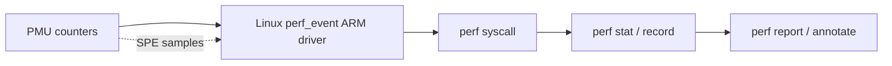

# 10.05 — Performance Counters (PMU) for Memory and MMU

> **ARM ARM Reference**: §D7 (Performance Monitors Extension); *Arm Architecture Reference Manual — PMU events table*

The PMU is the indispensable tool for diagnosing memory-subsystem and MMU performance.

---

## 1. PMU Architecture (PMUv3)

| Register | Purpose |
|---|---|
| `PMCR_EL0` | Control register — enable/reset/divider |
| `PMCNTENSET/CLR_EL0` | Enable individual counters |
| `PMOVSSET/CLR_EL0` | Overflow status |
| `PMSELR_EL0` | Selects counter for indirect access |
| `PMXEVTYPER_EL0` | Event type for selected counter |
| `PMXEVCNTR_EL0` | Counter value for selected counter |
| `PMCCNTR_EL0` | Cycle counter |
| `PMCCFILTR_EL0` | Cycle counter filter (EL0/EL1/EL2/SecOnly) |
| `PMEVTYPER<n>_EL0` / `PMEVCNTR<n>_EL0` | Direct event/counter access |
| `PMINTENSET/CLR_EL1` | Interrupt-on-overflow enable |
| `PMUSERENR_EL0` | EL0 access permission bits |

Number of programmable counters: implementation-defined (usually 4–6 on small cores, 6–8 on Neoverse). Plus the dedicated cycle counter.

---

## 2. Key Architectural Events

Standard event numbers (selection):

| Event ID | Mnemonic | Meaning |
|---|---|---|
| 0x00 | SW_INCR | Software increment |
| 0x01 | L1I_CACHE_REFILL | L1 I-cache refill |
| 0x02 | L1I_TLB_REFILL | L1 ITLB refill |
| 0x03 | L1D_CACHE_REFILL | L1 D-cache refill |
| 0x04 | L1D_CACHE | L1 D-cache access |
| 0x05 | L1D_TLB_REFILL | L1 DTLB refill |
| 0x06 | LD_RETIRED | Loads retired |
| 0x07 | ST_RETIRED | Stores retired |
| 0x08 | INST_RETIRED | Instructions retired |
| 0x10 | BR_MIS_PRED | Branch mispredicts |
| 0x11 | CPU_CYCLES | (also via dedicated counter) |
| 0x12 | BR_PRED | Branch predictions |
| 0x13 | MEM_ACCESS | Memory accesses |
| 0x15 | L1D_CACHE_WB | L1D writebacks |
| 0x16 | L2D_CACHE | L2D accesses |
| 0x17 | L2D_CACHE_REFILL | L2D refills |
| 0x18 | L2D_CACHE_WB | L2D writebacks |
| 0x19 | BUS_ACCESS | Bus accesses |
| 0x1D | BUS_CYCLES | Bus cycles |
| 0x22 | BR_MIS_PRED_RETIRED | Mispredicted retired |
| 0x24 | STALL_FRONTEND | Frontend stall cycles |
| 0x25 | STALL_BACKEND | Backend stall cycles |
| 0x2B | L3D_CACHE | L3D cache accesses (where present) |
| 0x2C | L3D_CACHE_REFILL | L3D refills |
| 0x2D | LL_CACHE_RD | Last-level cache reads |
| 0x2E | LL_CACHE_MISS_RD | Last-level cache read misses |
| 0x40+ | LSU / MMU / SVE extended (FEAT_PMUv3p4+) |

(Vendor IMPL DEF event numbers above 0x4000 provide microarchitectural events.)

---

## 3. Reading via Linux perf

```bash
# Cycles, instructions, IPC for a workload
perf stat -e cycles,instructions ./prog

# Cache & TLB analysis
perf stat -e cycles,instructions,L1-dcache-loads,L1-dcache-load-misses,\
dTLB-loads,dTLB-load-misses,LLC-loads,LLC-load-misses ./prog

# ARM-specific via raw events
perf stat -e cycles,r03,r05,r17,r1D ./prog

# Sample to identify hotspots
perf record -e r03 -- ./prog
perf report
```

`perf c2c` (cache-to-cache) — locates false-sharing hotspots on multi-CPU.

---

## 4. Derived Metrics

| Metric | Computation |
|---|---|
| IPC | `INST_RETIRED / CPU_CYCLES` |
| L1D miss rate | `L1D_CACHE_REFILL / L1D_CACHE` |
| DTLB miss rate | `L1D_TLB_REFILL / MEM_ACCESS` |
| LLC miss rate | `LL_CACHE_MISS_RD / LL_CACHE_RD` |
| Backend mem stall % | `STALL_BACKEND_MEM / CPU_CYCLES` (if available) |
| Branch mispredict % | `BR_MIS_PRED_RETIRED / BR_RETIRED` |

These let you frame: "We're spending 40% of cycles waiting on memory, with LLC miss rate 12%, dominated by random pointer chasing."

---

## 5. MMU/Memory-specific PMU Use

- **DTLB pressure** → consider hugepages, THP, or layout changes.
- **L1D refills high with bus_access low** → working set fits L2.
- **LL_CACHE_MISS dominant** → working set exceeds LLC → DRAM bottleneck.
- **STALL_BACKEND_MEM high** → memory stalls dominate; HW prefetcher not catching pattern.
- **BUS_CYCLES vs CPU_CYCLES** → fabric saturation.
- **MMU walk events** (where exposed) → page-walk latency.

---

## 6. Statistical Profiling Extension (SPE)

**FEAT_SPE** (ARMv8.2 optional) — samples individual instructions with rich metadata: addresses, latencies, source events.

- Like Intel PEBS or AMD IBS.
- Linux: `perf record -e arm_spe/...` → per-sample data for "which load missed L1 and how long it stalled".
- Critical for production profiling — counts alone tell you something is slow; SPE tells you *which instruction and why*.

---

## 7. MPAM Monitoring

FEAT_MPAM has monitors per partition:

- Cache usage per partition.
- Memory bandwidth per partition.

Used in cloud / VM hosting to enforce QoS and detect noisy neighbors.

---

## 8. EL Filtering

PMU events can be filtered by EL via `PMEVTYPER<n>.{U,P,NSK,NSU,NSH,M}` bits — count only EL0, only EL1, only EL2, etc. Lets you separate user vs kernel cycles, or hypervisor vs guest.

---

## 9. Diagram — perf flow



---

## 10. Pitfalls

1. **Counter multiplexing** — asking for more events than counters → time-multiplexing → scaled counts; verify with `perf stat -v`.
2. **Cycle counter divider** (`PMCR.D`) — old PMUv3 has a /64 divider mode; verify off.
3. **Frequency scaling** — DVFS skews cycle counts vs wall time; use `BUS_CYCLES` or fixed-freq for comparison.
4. **Big.LITTLE / DynamIQ heterogeneity** — events from different core types may not match.
5. **Event renaming across cores** — vendor-specific events use IMPL DEF numbers — always check core TRM.
6. **PMU access from EL0** disabled by default — set `PMUSERENR_EL0.EN` to allow user-mode `rdpmc`-like access.

---

## 11. Interview Q&A

**Q1. Which PMU events would you use to diagnose memory-bound code?**
`CPU_CYCLES`, `INST_RETIRED`, `STALL_BACKEND` (or `STALL_BACKEND_MEM`), `L1D_CACHE_REFILL`, `LL_CACHE_MISS_RD`, `L1D_TLB_REFILL`.

**Q2. How would you tell a workload is TLB-bound?**
High `L1D_TLB_REFILL` rate, high `MMU_WALK` cycles (if available), STALL_BACKEND high. Try THP / hugepages; if helps, confirms TLB pressure.

**Q3. What's SPE?**
Statistical Profiling Extension — hardware records per-instruction samples with addresses, latencies, source events. Used by `perf record -e arm_spe//`.

**Q4. How to find false-sharing?**
`perf c2c` — Linux tool using PMU events to find cache lines bouncing between CPUs.

**Q5. How many programmable PMU counters on Neoverse-N1?**
6 programmable + 1 dedicated cycle counter. Implementation-defined per CPU.

**Q6. What's counter multiplexing?**
When more events are requested than hardware counters; kernel time-multiplexes them and scales the reported counts.

**Q7. How does MPAM monitoring help cloud workloads?**
Per-partition cache/bandwidth usage counters reveal noisy neighbors; cloud control plane can rebalance.

**Q8. EL-filter use case?**
Measure only user-mode cycles vs kernel cycles separately to apportion overhead between application and OS.

---

## 12. Cross-refs

- [05.06 Cache performance](../05_Caches/06_Cache_Performance_Prefetch.md)
- [04.04 TLB performance](../04_TLB/04_TLB_Performance_and_Hugepages.md)
- [05.04 Cache coherency](../05_Caches/04_Cache_Coherency_MESI_MOESI.md)
